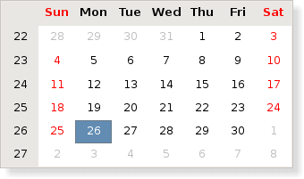
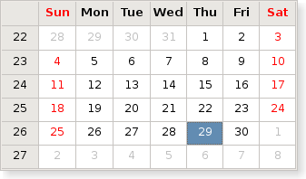

# QCalendarWidget Class Reference

## [[QtGui](index.htm) module]

该QCalendarWidget类提供了一个每月按日历组件，允许用户选择一个日期。[More...](#details)

继承[QWidget](qwidget.html)。

### Types

*   `enum HorizontalHeaderFormat { NoHorizontalHeader, SingleLetterDayNames, ShortDayNames, LongDayNames }`
*   `enum SelectionMode { NoSelection, SingleSelection }`
*   `enum VerticalHeaderFormat { NoVerticalHeader, ISOWeekNumbers }`

### Methods

*   `__init__ (self, QWidget parent = None)`
*   `int dateEditAcceptDelay (self)`
*   `dict-of-QDate-QTextCharFormat dateTextFormat (self)`
*   `QTextCharFormat dateTextFormat (self, QDate date)`
*   `bool event (self, QEvent event)`
*   `bool eventFilter (self, QObject watched, QEvent event)`
*   `Qt.DayOfWeek firstDayOfWeek (self)`
*   `QTextCharFormat headerTextFormat (self)`
*   `HorizontalHeaderFormat horizontalHeaderFormat (self)`
*   `bool isDateEditEnabled (self)`
*   `bool isGridVisible (self)`
*   `bool isHeaderVisible (self)`
*   `bool isNavigationBarVisible (self)`
*   `keyPressEvent (self, QKeyEvent event)`
*   `QDate maximumDate (self)`
*   `QDate minimumDate (self)`
*   `QSize minimumSizeHint (self)`
*   `int monthShown (self)`
*   `mousePressEvent (self, QMouseEvent event)`
*   `paintCell (self, QPainter painter, QRect rect, QDate date)`
*   `resizeEvent (self, QResizeEvent event)`
*   `QDate selectedDate (self)`
*   `SelectionMode selectionMode (self)`
*   `setCurrentPage (self, int year, int month)`
*   `setDateEditAcceptDelay (self, int delay)`
*   `setDateEditEnabled (self, bool enable)`
*   `setDateRange (self, QDate min, QDate max)`
*   `setDateTextFormat (self, QDate date, QTextCharFormat color)`
*   `setFirstDayOfWeek (self, Qt.DayOfWeek dayOfWeek)`
*   `setGridVisible (self, bool show)`
*   `setHeaderTextFormat (self, QTextCharFormat format)`
*   `setHeaderVisible (self, bool show)`
*   `setHorizontalHeaderFormat (self, HorizontalHeaderFormat format)`
*   `setMaximumDate (self, QDate date)`
*   `setMinimumDate (self, QDate date)`
*   `setNavigationBarVisible (self, bool visible)`
*   `setSelectedDate (self, QDate date)`
*   `setSelectionMode (self, SelectionMode mode)`
*   `setVerticalHeaderFormat (self, VerticalHeaderFormat format)`
*   `setWeekdayTextFormat (self, Qt.DayOfWeek dayOfWeek, QTextCharFormat format)`
*   `showNextMonth (self)`
*   `showNextYear (self)`
*   `showPreviousMonth (self)`
*   `showPreviousYear (self)`
*   `showSelectedDate (self)`
*   `showToday (self)`
*   `QSize sizeHint (self)`
*   `updateCell (self, QDate date)`
*   `updateCells (self)`
*   `VerticalHeaderFormat verticalHeaderFormat (self)`
*   `QTextCharFormat weekdayTextFormat (self, Qt.DayOfWeek dayOfWeek)`
*   `int yearShown (self)`

### Qt Signals

*   `void activated (const QDate&)`
*   `void clicked (const QDate&)`
*   `void currentPageChanged (int,int)`
*   `void selectionChanged ()`

* * *

## Detailed Description

该QCalendarWidget类提供了一个每月按日历组件，允许用户选择一个日期。



小部件是与当前的月份和年份初始化，但QCalendarWidget提供了一些公用插槽的年份和月份所显示改变。

默认情况下，今天的日期被选中，用户可以同时使用鼠标和键盘选择一个日期。当前选定的日期可以通过检索的[selectedDate](qcalendarwidget.html#selectedDate-prop)（）函数。它可以通过设置来限制用户选择一个给定的时间范围的[minimumDate](qcalendarwidget.html#minimumDate-prop)和[maximumDate](qcalendarwidget.html#maximumDate-prop)属性。另外，这两个属性可以一次过使用设置[setDateRange](qcalendarwidget.html#setDateRange)（ ）方便的插槽。设置[selectionMode](qcalendarwidget.html#selectionMode-prop)属性为[NoSelection](qcalendarwidget.html#SelectionMode-enum)从在选择禁止所有用户。请注意，日期也可以以编程方式使用被选择的[setSelectedDate](qcalendarwidget.html#selectedDate-prop)（）槽。

当前显示的月份和年份可使用检索[monthShown](qcalendarwidget.html#monthShown)（）和[yearShown](qcalendarwidget.html#yearShown)（ ）函数，分别为。

新创建的日历小部件使用缩写的日期名，以及星期六和星期日被标记为红色。日历网格是不可见的。一周数字显示，第一列日是星期天。

在天的符号可以通过设置进行修改，以一个单一的字母缩写（ “M”为“星期一” ）的[horizontalHeaderFormat](qcalendarwidget.html#horizontalHeaderFormat-prop)属性为[QCalendarWidget.SingleLetterDayNames](qcalendarwidget.html#HorizontalHeaderFormat-enum)。同样的属性设置为[QCalendarWidget.LongDayNames](qcalendarwidget.html#HorizontalHeaderFormat-enum)使头显示完整的日期名。该周数可以通过设置去除[verticalHeaderFormat](qcalendarwidget.html#verticalHeaderFormat-prop)属性为[QCalendarWidget.NoVerticalHeader](qcalendarwidget.html#VerticalHeaderFormat-enum)。日历网格可以通过设置打开了[gridVisible](qcalendarwidget.html#gridVisible-prop)使用属性为True[setGridVisible](qcalendarwidget.html#gridVisible-prop)（ ）函数：

|  |
| 

```
 QCalendarWidget *calendar;
 calendar-&gt;setGridVisible(true);

```

 |

最后，一天中的第一列可以使用被改变的[setFirstDayOfWeek](qcalendarwidget.html#firstDayOfWeek-prop)（）函数。

该QCalendarWidget类还提供了三个信号，[selectionChanged](qcalendarwidget.html#selectionChanged)（ ）[activated](qcalendarwidget.html#activated)（）和[currentPageChanged](qcalendarwidget.html#currentPageChanged)（）使得能够响应用户交互。

头，平日或单天的渲染可以在很大程度上通过自定义设置[QTextCharFormat](qtextcharformat.html)的一些特殊的工作日，特殊日期或标题的呈现。

在属性的一个子集[QTextCharFormat](qtextcharformat.html)所使用的日历组件。目前，前景，背景和字体属性可用于确定单个细胞在插件的渲染。

* * *

## Type Documentation

```
QCalendarWidget.HorizontalHeaderFormat
```

这个枚举类型定义了各种格式的水平标题可以显示。

| Constant | Value | Description |
| --- | --- | --- |
| `QCalendarWidget.SingleLetterDayNames` | `1` | 标题会显示一个字母缩写日期名（例如M星期一） 。 |
| `QCalendarWidget.ShortDayNames` | `2` | 标题会显示一个简短的缩写一天的名称（例如，星期一星期一） 。 |
| `QCalendarWidget.LongDayNames` | `3` | 头显示完整的日期名（如星期一） 。 |
| `QCalendarWidget.NoHorizontalHeader` | `0` | 头是隐藏的。 |

**See also** [horizontalHeaderFormat](qcalendarwidget.html#horizontalHeaderFormat-prop)（）和[VerticalHeaderFormat](qcalendarwidget.html#VerticalHeaderFormat-enum)。

```
QCalendarWidget.SelectionMode
```

这个枚举描述提供给用于选择日期的日历用户选择的类型。

| Constant | Value | Description |
| --- | --- | --- |
| `QCalendarWidget.NoSelection` | `0` | 日期无法选择。 |
| `QCalendarWidget.SingleSelection` | `1` | 单日期可以选择。 |

**See also** [selectionMode](qcalendarwidget.html#selectionMode-prop)。

```
QCalendarWidget.VerticalHeaderFormat
```

这个枚举类型定义了各种格式的垂直头可以显示。

| Constant | Value | Description |
| --- | --- | --- |
| `QCalendarWidget.ISOWeekNumbers` | `1` | 所描述的标题显示的ISO周数[QDate.weekNumber](qdate.html#weekNumber)（ ） 。 |
| `QCalendarWidget.NoVerticalHeader` | `0` | 头是隐藏的。 |

**See also** [verticalHeaderFormat](qcalendarwidget.html#verticalHeaderFormat-prop)（）和[HorizontalHeaderFormat](qcalendarwidget.html#HorizontalHeaderFormat-enum)。

* * *

## Method Documentation

```
QCalendarWidget.__init__ (self, QWidget parent = None)
```

该_parent_的说法，如果不是没有，原因_self_通过Qt的，而不是PyQt的拥有。

构造一个日历控件与给定_parent_。

小部件是与当前的月份和年份初始化，当前选定的日期为今日。

**See also** [setCurrentPage](qcalendarwidget.html#setCurrentPage)（ ） 。

```
int QCalendarWidget.dateEditAcceptDelay (self)
```

```
dict-of-QDate-QTextCharFormat QCalendarWidget.dateTextFormat (self)
```

返回[QMap](index.htm)从[QDate](qdate.html)至[QTextCharFormat](qtextcharformat.html)显示所有使用该改变其呈现的特殊格式的日期。

**See also** [setDateTextFormat](qcalendarwidget.html#setDateTextFormat)（ ） 。

```
QTextCharFormat QCalendarWidget.dateTextFormat (self, QDate date)
```

[](qtextcharformat.html)

[返回](qtextcharformat.html)[QTextCharFormat](qtextcharformat.html)为_date_。该字符格式可以为空，如果日期不renderd特别。

```
bool QCalendarWidget.event (self, QEvent event)
```

从重新实现[QObject.event](qobject.html#event)（ ） 。

```
bool QCalendarWidget.eventFilter (self, QObject watched, QEvent event)
```

从重新实现[QObject.eventFilter](qobject.html#eventFilter)（ ） 。

```
Qt.DayOfWeek QCalendarWidget.firstDayOfWeek (self)
```

[](qt.html#DayOfWeek-enum)

```
QTextCharFormat QCalendarWidget.headerTextFormat (self)
```

[

返回渲染的标题文本字符格式。

](qtextcharformat.html)

[**See also**](qtextcharformat.html) [setHeaderTextFormat](qcalendarwidget.html#setHeaderTextFormat)（ ） 。

```
HorizontalHeaderFormat QCalendarWidget.horizontalHeaderFormat (self)
```

[

```
bool QCalendarWidget.isDateEditEnabled (self)
```

```
bool QCalendarWidget.isGridVisible (self)
```

```
bool QCalendarWidget.isHeaderVisible (self)
```

```
bool QCalendarWidget.isNavigationBarVisible (self)
```

```
QCalendarWidget.keyPressEvent (self, QKeyEvent event)
```

](qcalendarwidget.html#HorizontalHeaderFormat-enum)

[从重新实现](qcalendarwidget.html#HorizontalHeaderFormat-enum)[QWidget.keyPressEvent](qwidget.html#keyPressEvent)（ ） 。

```
QDate QCalendarWidget.maximumDate (self)
```

[](qdate.html)

```
QDate QCalendarWidget.minimumDate (self)
```

[](qdate.html)

```
QSize QCalendarWidget.minimumSizeHint (self)
```

[](qsize.html)

[从重新实现](qsize.html)[QWidget.minimumSizeHint](qwidget.html#minimumSizeHint-prop)（ ） 。

```
int QCalendarWidget.monthShown (self)
```

返回当前显示的月份。个编号从1到12 。

**See also** [yearShown](qcalendarwidget.html#yearShown)（）和[setCurrentPage](qcalendarwidget.html#setCurrentPage)（ ） 。

```
QCalendarWidget.mousePressEvent (self, QMouseEvent event)
```

从重新实现[QWidget.mousePressEvent](qwidget.html#mousePressEvent)（ ） 。

```
QCalendarWidget.paintCell (self, QPainter painter, QRect rect, QDate date)
```

绘制由给定指定的单元格_date_，使用给定的_painter_和_rect_。

```
QCalendarWidget.resizeEvent (self, QResizeEvent event)
```

从重新实现[QWidget.resizeEvent](qwidget.html#resizeEvent)（ ） 。

```
QDate QCalendarWidget.selectedDate (self)
```

[](qdate.html)

```
SelectionMode QCalendarWidget.selectionMode (self)
```

[

```
QCalendarWidget.setCurrentPage (self, int year, int month)
```

这种方法也是一个Qt槽与C + +的签名`void setCurrentPage(int,int)`。

](qcalendarwidget.html#SelectionMode-enum)

[显示给定的_month_的给定_year_在不改变选定的日期。使用](qcalendarwidget.html#SelectionMode-enum)[setSelectedDate](qcalendarwidget.html#selectedDate-prop)（ ）函数来改变所选的日期。

当前显示的月份和年份可使用检索[monthShown](qcalendarwidget.html#monthShown)（）和[yearShown](qcalendarwidget.html#yearShown)（ ）分别为功能。

**See also** [yearShown](qcalendarwidget.html#yearShown)（ ）[monthShown](qcalendarwidget.html#monthShown)（ ）[showPreviousMonth](qcalendarwidget.html#showPreviousMonth)（ ）[showNextMonth](qcalendarwidget.html#showNextMonth)（ ）[showPreviousYear](qcalendarwidget.html#showPreviousYear)（）和[showNextYear](qcalendarwidget.html#showNextYear)（ ） 。

```
QCalendarWidget.setDateEditAcceptDelay (self, int delay)
```

```
QCalendarWidget.setDateEditEnabled (self, bool enable)
```

```
QCalendarWidget.setDateRange (self, QDate min, QDate max)
```

这种方法也是一个Qt槽与C + +的签名`void setDateRange(const QDate&,const QDate&)`。

通过设置定义一个日期范围[minimumDate](qcalendarwidget.html#minimumDate-prop)和[maximumDate](qcalendarwidget.html#maximumDate-prop)属性。

日期范围限制了用户的选择，即用户只能选择指定日期范围内的日期。需要注意的是

```
 [QCalendarWidget](qcalendarwidget.html) *calendar;

 calendar->setDateRange(min, max);

```

类似于

```
 [QCalendarWidget](qcalendarwidget.html) *calendar;

 calendar->setMinimumDate(min);
 calendar->setMaximumDate(max);

```

如果任何一个_min_ or _max_参数无效[QDate](qdate.html)对象，这个函数不执行任何操作。

**See also** [setMinimumDate](qcalendarwidget.html#minimumDate-prop)（）和[setMaximumDate](qcalendarwidget.html#maximumDate-prop)（ ） 。

```
QCalendarWidget.setDateTextFormat (self, QDate date, QTextCharFormat color)
```

设置用于呈现给定的格式_date_到由指定的_format_。

If _date_为空，所有的日期格式将被清除。

**See also** [dateTextFormat](qcalendarwidget.html#dateTextFormat)（ ） 。

```
QCalendarWidget.setFirstDayOfWeek (self, Qt.DayOfWeek dayOfWeek)
```

```
QCalendarWidget.setGridVisible (self, bool show)
```

```
QCalendarWidget.setHeaderTextFormat (self, QTextCharFormat format)
```

设置用于呈现头文字字符格式_format_。如果还设置了平日的文本格式，这种格式的前景色和背景色将优先于头的格式。其他格式的信息将仍然由标题的格式来决定。

**See also** [headerTextFormat](qcalendarwidget.html#headerTextFormat)（ ） 。

```
QCalendarWidget.setHeaderVisible (self, bool show)
```

```
QCalendarWidget.setHorizontalHeaderFormat (self, HorizontalHeaderFormat format)
```

```
QCalendarWidget.setMaximumDate (self, QDate date)
```

```
QCalendarWidget.setMinimumDate (self, QDate date)
```

```
QCalendarWidget.setNavigationBarVisible (self, bool visible)
```

这种方法也是一个Qt槽与C + +的签名`void setNavigationBarVisible(bool)`。

```
QCalendarWidget.setSelectedDate (self, QDate date)
```

这种方法也是一个Qt槽与C + +的签名`void setSelectedDate(const QDate&)`。

```
QCalendarWidget.setSelectionMode (self, SelectionMode mode)
```

```
QCalendarWidget.setVerticalHeaderFormat (self, VerticalHeaderFormat format)
```

```
QCalendarWidget.setWeekdayTextFormat (self, Qt.DayOfWeek dayOfWeek, QTextCharFormat format)
```

设置为一天的渲染文本字符格式的一周_dayOfWeek_至_format_。该格式将优先于案件前景色和背景色的报头格式。其他文本格式的信息是从标题的格式。

**See also** [weekdayTextFormat](qcalendarwidget.html#weekdayTextFormat)（）和[setHeaderTextFormat](qcalendarwidget.html#setHeaderTextFormat)（ ） 。

```
QCalendarWidget.showNextMonth (self)
```

这种方法也是一个Qt槽与C + +的签名`void showNextMonth()`。

表明相对于当前显示的月份的下一个月份。注意，所选择的日期没有改变。

**See also** [showPreviousMonth](qcalendarwidget.html#showPreviousMonth)（ ）[setCurrentPage](qcalendarwidget.html#setCurrentPage)（）和[setSelectedDate](qcalendarwidget.html#selectedDate-prop)（ ） 。

```
QCalendarWidget.showNextYear (self)
```

这种方法也是一个Qt槽与C + +的签名`void showNextYear()`。

显示当前显示的月份_next_相对于当前显示的一年年。注意，所选择的日期没有改变。

**See also** [showPreviousYear](qcalendarwidget.html#showPreviousYear)（ ）[setCurrentPage](qcalendarwidget.html#setCurrentPage)（）和[setSelectedDate](qcalendarwidget.html#selectedDate-prop)（ ） 。

```
QCalendarWidget.showPreviousMonth (self)
```

这种方法也是一个Qt槽与C + +的签名`void showPreviousMonth()`。

显示上月相对于当前显示的月份。注意，所选择的日期没有改变。

**See also** [showNextMonth](qcalendarwidget.html#showNextMonth)（ ）[setCurrentPage](qcalendarwidget.html#setCurrentPage)（）和[setSelectedDate](qcalendarwidget.html#selectedDate-prop)（ ） 。

```
QCalendarWidget.showPreviousYear (self)
```

这种方法也是一个Qt槽与C + +的签名`void showPreviousYear()`。

显示当前显示的月份_previous_相对于当前显示的一年年。注意，所选择的日期没有改变。

**See also** [showNextYear](qcalendarwidget.html#showNextYear)（ ）[setCurrentPage](qcalendarwidget.html#setCurrentPage)（）和[setSelectedDate](qcalendarwidget.html#selectedDate-prop)（ ） 。

```
QCalendarWidget.showSelectedDate (self)
```

这种方法也是一个Qt槽与C + +的签名`void showSelectedDate()`。

显示所选日期的月份。

**See also** [selectedDate](qcalendarwidget.html#selectedDate-prop)（）和[setCurrentPage](qcalendarwidget.html#setCurrentPage)（ ） 。

```
QCalendarWidget.showToday (self)
```

这种方法也是一个Qt槽与C + +的签名`void showToday()`。

显示今天的日期的月份。

**See also** [selectedDate](qcalendarwidget.html#selectedDate-prop)（）和[setCurrentPage](qcalendarwidget.html#setCurrentPage)（ ） 。

```
QSize QCalendarWidget.sizeHint (self)
```

[](qsize.html)

[从重新实现](qsize.html)[QWidget.sizeHint](qwidget.html#sizeHint-prop)（ ） 。

```
QCalendarWidget.updateCell (self, QDate date)
```

更新由给定的指定的单元_date_除非更新被禁用或细胞是隐藏的。

此功能被引入Qt的4.4 。

**See also** [updateCells](qcalendarwidget.html#updateCells)（ ）[yearShown](qcalendarwidget.html#yearShown)（）和[monthShown](qcalendarwidget.html#monthShown)（ ） 。

```
QCalendarWidget.updateCells (self)
```

更新所有可见的单元格，除非更新被禁用。

此功能被引入Qt的4.4 。

**See also** [updateCell](qcalendarwidget.html#updateCell)（ ） 。

```
VerticalHeaderFormat QCalendarWidget.verticalHeaderFormat (self)
```

[](qcalendarwidget.html#VerticalHeaderFormat-enum)

```
QTextCharFormat QCalendarWidget.weekdayTextFormat (self, Qt.DayOfWeek dayOfWeek)
```

[

返回天的渲染文本字符格式的一周_dayOfWeek_。

](qtextcharformat.html)

[**See also**](qtextcharformat.html) [setWeekdayTextFormat](qcalendarwidget.html#setWeekdayTextFormat)（）和[headerTextFormat](qcalendarwidget.html#headerTextFormat)（ ） 。

```
int QCalendarWidget.yearShown (self)
```

返回当前显示的月份的一年。个编号从1到12 。

**See also** [monthShown](qcalendarwidget.html#monthShown)（）和[setCurrentPage](qcalendarwidget.html#setCurrentPage)（ ） 。

* * *

## Qt Signal Documentation

```
void activated (const QDate&)
```

这是该信号的默认超载。

当用户按下回车键或双击这个信号被发射一个_date_在日历窗口小部件。

```
void clicked (const QDate&)
```

这是该信号的默认超载。

单击鼠标按钮时，这个信号被发射。鼠标点击的日期是由指定的_date_。在有效日期点击时，信号才发出，例如，日期是不是在外面[minimumDate](qcalendarwidget.html#minimumDate-prop)（）和[maximumDate](qcalendarwidget.html#maximumDate-prop)（ ） 。如果选择模式是[NoSelection](qcalendarwidget.html#SelectionMode-enum)时，该信号将不会被发射。

```
void currentPageChanged (int,int)
```

这是该信号的默认超载。

当前显示的月份被改变时，这个信号被发射。新_year_和_month_作为参数传递。

**See also** [setCurrentPage](qcalendarwidget.html#setCurrentPage)（ ） 。

```
void selectionChanged ()
```

这是该信号的默认超载。

当目前选择的日期将被改变，这个信号被发射。

当前选择的日期可以由用户使用鼠标或键盘来改变，或通过使用编程[setSelectedDate](qcalendarwidget.html#selectedDate-prop)（ ） 。

**See also** [selectedDate](qcalendarwidget.html#selectedDate-prop)（ ） 。