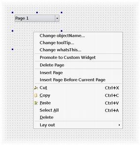

# QDesignerContainerExtension Class Reference

## [[QtDesigner](index.htm) module]

该QDesignerContainerExtension类可以让你的网页添加到Qt Designer中的工作区中的自定义多页的容器。[More...](#details)

通过继承[QPyDesignerContainerExtension](qpydesignercontainerextension.html)。

### Methods

*   `__init__ (self)`
*   `__init__ (self, QDesignerContainerExtension)`
*   `addWidget (self, QWidget widget)`
*   `int count (self)`
*   `int currentIndex (self)`
*   `insertWidget (self, int index, QWidget widget)`
*   `remove (self, int index)`
*   `setCurrentIndex (self, int index)`
*   `QWidget widget (self, int index)`

### Special Methods

*   `__len__ (self)`

* * *

## Detailed Description

该QDesignerContainerExtension类可以让你的网页添加到Qt Designer中的工作区中的自定义多页的容器。

QDesignerContainerExtension用于创建自定义容器扩展提供了一个接口。容器扩展包括函数的集合的那个_Qt Designer_需要管理一个多页容器插件，且在容器的页的列表。



**Warning:**这是_not_在一般情况下，只有自定义容器的插件扩展_multi-page_容器。

要创建一个容器扩展，你的扩展类必须继承自两个[QObject](qobject.html)和QDesignerContainerExtension 。例如：

```
 class MyContainerExtension : public [QObject](qobject.html),
        public QDesignerContainerExtension
 {
     Q_OBJECT
     Q_INTERFACES(QDesignerContainerExtension)

 public:
     MyContainerExtension(MyCustomWidget *widget,
                          [QObject](qobject.html) *parent = 0);
     int count() const;
     [QWidget](qwidget.html) *widget(int index) const;
     int currentIndex() const;
     void setCurrentIndex(int index);
     void addWidget([QWidget](qwidget.html) *widget);
     void insertWidget(int index, [QWidget](qwidget.html) *widget);
     void remove(int index);

 private:
     MyCustomWidget *myWidget;
 };

```

由于我们正在实现一个接口，我们必须确保它是由已知的元对象系统中使用[Q_INTERFACES](qobject.html#Q_INTERFACES)（）宏。这使_Qt Designer_使用[qobject_cast](qobject.html#qobject_cast)（ ）函数用什么来查询所支持的接口，但一[QObject](qobject.html)指针。

你必须重新实现几个功能，使_Qt Designer_管理自定义多页的容器控件：_Qt Designer_ uses [count](qdesignercontainerextension.html#count)（ ）来跟踪的页数在你的容器中，[widget](qdesignercontainerextension.html#widget)（ ）给定的索引在容器的页面列表在返回的页面，[currentIndex](qdesignercontainerextension.html#currentIndex)（ ）返回选定的页面的列表索引。_Qt Designer_使用[addWidget](qdesignercontainerextension.html#addWidget)（ ）函数在给定页面添加到容器中，期待它附加到页面列表，而它预计[insertWidget](qdesignercontainerextension.html#insertWidget)（ ）函数通过给定的索引处插入了一个给定页面添加到容器中。

In _Qt Designer_未创建的扩展，直到你需要它们。出于这个原因，你必须同时创建一个[QExtensionFactory](qextensionfactory.html)，即一个类，它能够让你的扩展的一个实例，并使用它注册_Qt Designer_的[extension manager](qextensionmanager.html)。

当一个容器扩展是必需的，_Qt Designer_的[extension manager](qextensionmanager.html)将通过其所有已注册的工厂运行要求[QExtensionFactory.createExtension](qextensionfactory.html#createExtension)（ ）对每一直到第一个即能创建一个容器延伸，被找到。这家工厂将创建的扩展插件。

有扩展的四个可用的类型_Qt Designer_： QDesignerContainerExtension ，[QDesignerMemberSheetExtension](qdesignermembersheetextension.html)，[QDesignerPropertySheetExtension](qdesignerpropertysheetextension.html)和[QDesignerTaskMenuExtension](qdesignertaskmenuextension.html)。_Qt Designer_的行为是一样的具有多页的容器，一个成员表，属性表或任务菜单中的延期申请是否相关。

该[QExtensionFactory](qextensionfactory.html)类提供了一个标准的扩展工厂，并且也可以用作用于定义扩展工厂的接口。您可以创建一个新的[QExtensionFactory](qextensionfactory.html)并重新实现[QExtensionFactory.createExtension](qextensionfactory.html#createExtension)（）函数。例如：

```
 [QObject](qobject.html) *ANewExtensionFactory.createExtension([QObject](qobject.html) *object,
         const [QString](qstring.html) &iid, [QObject](qobject.html) *parent) const
 {
     if (iid != Q_TYPEID(QDesignerContainerExtension))
         return 0;

     if (MyCustomWidget *widget = qobject_cast<MyCustomWidget*>
            (object))
         return new MyContainerExtension(widget, parent);

     return 0;
 }

```

或者您可以使用现有的工厂，扩大[QExtensionFactory.createExtension](qextensionfactory.html#createExtension)（ ）函数，使工厂能够创建一个容器扩展为好。例如：

```
 [QObject](qobject.html) *AGeneralExtensionFactory.createExtension([QObject](qobject.html) *object,
         const [QString](qstring.html) &iid, [QObject](qobject.html) *parent) const
 {
     MyCustomWidget *widget = qobject_cast<MyCustomWidget*>(object);

     if (widget && (iid == Q_TYPEID([QDesignerTaskMenuExtension](qdesignertaskmenuextension.html)))) {
         return new MyTaskMenuExtension(widget, parent);

     } else if (widget && (iid == Q_TYPEID(QDesignerContainerExtension))) {
         return new MyContainerExtension(widget, parent);

     } else {
         return 0;
     }
 }

```

对于使用QDesignerContainerExtension类的完整示例，请参见[Container Extension example](index.htm)。该示例显示了如何创建一个自定义多页插件_Qt Designer_。

* * *

## Method Documentation

```
QDesignerContainerExtension.__init__ (self)
```

```
QDesignerContainerExtension.__init__ (self, QDesignerContainerExtension)
```

```
QDesignerContainerExtension.addWidget (self, QWidget widget)
```

这种方法是抽象的，应在任何子类中重新实现。

将给定_page_到容器将其附加到页面的扩展名的列表。

**See also** [insertWidget](qdesignercontainerextension.html#insertWidget)（ ）[remove](qdesignercontainerextension.html#remove)（）和[widget](qdesignercontainerextension.html#widget)（ ） 。

```
int QDesignerContainerExtension.count (self)
```

这种方法是抽象的，应在任何子类中重新实现。

返回容器中的页数。

```
int QDesignerContainerExtension.currentIndex (self)
```

这种方法是抽象的，应在任何子类中重新实现。

返回容器中的当前选择的页的索引。

**See also** [setCurrentIndex](qdesignercontainerextension.html#setCurrentIndex)（ ） 。

```
QDesignerContainerExtension.insertWidget (self, int index, QWidget widget)
```

这种方法是抽象的，应在任何子类中重新实现。

将给定_page_到容器通过在给定的插入它_index_在页面的扩展名的列表。

**See also** [addWidget](qdesignercontainerextension.html#addWidget)（ ）[remove](qdesignercontainerextension.html#remove)（）和[widget](qdesignercontainerextension.html#widget)（ ） 。

```
QDesignerContainerExtension.remove (self, int index)
```

这种方法是抽象的，应在任何子类中重新实现。

移除网页在给定的_index_从页面的扩展名的列表。

**See also** [addWidget](qdesignercontainerextension.html#addWidget)（）和[insertWidget](qdesignercontainerextension.html#insertWidget)（ ） 。

```
QDesignerContainerExtension.setCurrentIndex (self, int index)
```

这种方法是抽象的，应在任何子类中重新实现。

设置当前所选页面中的容器是网页在给定的_index_在页面的扩展名的列表。

**See also** [currentIndex](qdesignercontainerextension.html#currentIndex)（ ） 。

```
QWidget QDesignerContainerExtension.widget (self, int index)
```

[

这种方法是抽象的，应在任何子类中重新实现。

返回页面在给定的_index_在页面的扩展名的列表。

](qwidget.html)

[**See also**](qwidget.html) [addWidget](qdesignercontainerextension.html#addWidget)（）和[insertWidget](qdesignercontainerextension.html#insertWidget)（ ） 。

```
 QDesignerContainerExtension.__len__ (self)
```