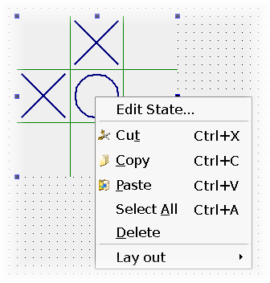

# QDesignerTaskMenuExtension Class Reference

## [[QtDesigner](index.htm) module]

该QDesignerTaskMenuExtension类允许您自定义菜单项添加到Qt Designer中的任务菜单。[More...](#details)

通过继承[QPyDesignerTaskMenuExtension](qpydesignertaskmenuextension.html)。

### Methods

*   `__init__ (self)`
*   `__init__ (self, QDesignerTaskMenuExtension)`
*   `QAction preferredEditAction (self)`
*   `list-of-QAction taskActions (self)`

* * *

## Detailed Description

该QDesignerTaskMenuExtension类允许您自定义菜单项添加到Qt Designer中的任务菜单。

QDesignerTaskMenuExtension提供了用于创建自定义任务菜单扩展的接口。它通常用于创建特定于一个插件中任务的菜单项_Qt Designer_。

_Qt Designer_使用QDesignerTaskMenuExtension养活它的任务菜单。当被要求的任务菜单，_Qt Designer_将查询所选部件的任务菜单扩展。



任务菜单扩展是QActions的集合。当选择该插件具有指定扩展名的动作出现在任务菜单中的条目。上图显示自定义**Edit State...**这似乎除了动作_Qt Designer_的默认任务菜单项：**Cut**，**Copy**，**Paste**等等

要创建一个自定义任务菜单扩展，你的扩展类必须继承自两个[QObject](qobject.html)和QDesignerTaskMenuExtension 。例如：

```
 class MyTaskMenuExtension : public [QObject](qobject.html),
         public QDesignerTaskMenuExtension
 {
     Q_OBJECT
     Q_INTERFACES(QDesignerTaskMenuExtension)

 public:
     MyTaskMenuExtension(MyCustomWidget *widget, [QObject](qobject.html) *parent);

     [QAction](qaction.html) *preferredEditAction() const;
     [QList](index.htm)<[QAction](qaction.html) *> taskActions() const;

 private slots:
     void mySlot();

 private:
     MyCustomWidget *widget;
     [QAction](qaction.html) *myAction;
 };

```

由于我们正在实现一个接口，我们必须确保它是使用由已知的元对象系统的[Q_INTERFACES](qobject.html#Q_INTERFACES)（）宏。这使_Qt Designer_使用[qobject_cast](qobject.html#qobject_cast)（ ）函数用什么来查询所支持的接口，但一[QObject](qobject.html)指针。

你必须重新实现[taskActions](qdesignertaskmenuextension.html#taskActions)（ ）函数返回的行动，将被列入名单_Qt Designer_任务菜单。或者，您可以重新实现[preferredEditAction](qdesignertaskmenuextension.html#preferredEditAction)（ ）函数选择你的插件，并按下时设置被调用的行动**F2**。优选的编辑动作一定要返回的动作之一[taskActions](qdesignertaskmenuextension.html#taskActions)（ ），并且如果它没有被定义时，按**F2**键将简单地被忽略。

In _Qt Designer_，则不会创建扩展，直到你需要它们。任务菜单扩展名，例如，当您单击鼠标右键，在一个小部件创建_Qt Designer_的工作空间。出于这个原因，你还必须构建一个扩展的工厂，无论是使用[QExtensionFactory](qextensionfactory.html)或者一个子类，并用它注册_Qt Designer_的[extension manager](qextensionmanager.html)。

当一个任务菜单扩展是必需的，_Qt Designer_的[extension manager](qextensionmanager.html)将通过其所有已注册的工厂运行要求[QExtensionFactory.createExtension](qextensionfactory.html#createExtension)（）对每个直到找到一个能够创建一个任务菜单扩展所选部件。这家工厂将使这个扩展的实例。

有扩展的四个可用的类型_Qt Designer_：[QDesignerContainerExtension](qdesignercontainerextension.html)，[QDesignerMemberSheetExtension](qdesignermembersheetextension.html)，[QDesignerPropertySheetExtension](qdesignerpropertysheetextension.html)和QDesignerTaskMenuExtension 。_Qt Designer_的行为是相同的同一个容器中，构件表，属性表或任务菜单所需的分机是否相关联。

该[QExtensionFactory](qextensionfactory.html)类提供了一个标准的扩展工厂，并且也可以用作用于定义扩展工厂的接口。您可以创建一个新的[QExtensionFactory](qextensionfactory.html)并重新实现[QExtensionFactory.createExtension](qextensionfactory.html#createExtension)（）函数。例如：

```
 [QObject](qobject.html) *ANewExtensionFactory.createExtension([QObject](qobject.html) *object,
         const [QString](qstring.html) &iid, [QObject](qobject.html) *parent) const
 {
     if (iid != Q_TYPEID(QDesignerTaskMenuExtension))
         return 0;

     if (MyCustomWidget *widget = qobject_cast<MyCustomWidget*>(object))
         return new MyTaskMenuExtension(widget, parent);

     return 0;
 }

```

或者您可以使用现有的工厂，扩大[QExtensionFactory.createExtension](qextensionfactory.html#createExtension)（ ）函数，使工厂能够创建一个任务菜单扩展为好。例如：

```
 [QObject](qobject.html) *AGeneralExtensionFactory.createExtension([QObject](qobject.html) *object,
         const [QString](qstring.html) &iid, [QObject](qobject.html) *parent) const
 {
     MyCustomWidget *widget = qobject_cast<MyCustomWidget*>(object);

     if (widget && (iid == Q_TYPEID([QDesignerContainerExtension](qdesignercontainerextension.html)))) {
         return new MyContainerExtension(widget, parent);

     } else if (widget && (iid == Q_TYPEID(QDesignerTaskMenuExtension))) {
         return new MyTaskMenuExtension(widget, parent);

     } else {
         return 0;
     }
 }

```

对于使用QDesignerTaskMenuExtension类的完整示例，请参见[Task Menu Extension example](index.htm)。该示例显示了如何创建一个自定义的widget插件_Qt Designer_，以及如何使用QDesignerTaskMenuExtension类的自定义项添加到_Qt Designer_的任务菜单。

* * *

## Method Documentation

```
QDesignerTaskMenuExtension.__init__ (self)
```

```
QDesignerTaskMenuExtension.__init__ (self, QDesignerTaskMenuExtension)
```

```
QAction QDesignerTaskMenuExtension.preferredEditAction (self)
```

[

返回具有指定扩展名选择一个插件并按下时调用的动作**F2**。

](qaction.html)

[动作一定要返回的动作之一](qaction.html)[taskActions](qdesignertaskmenuextension.html#taskActions)（ ） 。

```
list-of-QAction QDesignerTaskMenuExtension.taskActions (self)
```

这种方法是抽象的，应在任何子类中重新实现。

返回任务菜单扩展为一个动作列表将包含在_Qt Designer_的任务菜单当选择具有指定扩展名的插件。

此功能必须重新实现将动作添加到列表中。