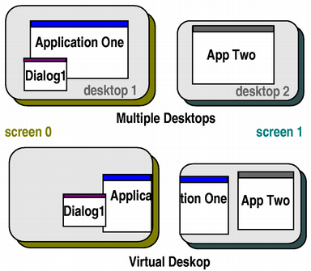

# QDesktopWidget Class Reference

## [[QtGui](index.htm) module]

该QDesktopWidget类提供了访问多头系统屏幕信息。[More...](#details)

继承[QWidget](qwidget.html)。

### Methods

*   `__init__ (self)`
*   `QRect availableGeometry (self, int screen = -1)`
*   `QRect availableGeometry (self, QWidget widget)`
*   `QRect availableGeometry (self, QPoint point)`
*   `bool isVirtualDesktop (self)`
*   `int numScreens (self)`
*   `int primaryScreen (self)`
*   `resizeEvent (self, QResizeEvent e)`
*   `QWidget screen (self, int screen = -1)`
*   `int screenCount (self)`
*   `QRect screenGeometry (self, int screen = -1)`
*   `QRect screenGeometry (self, QWidget widget)`
*   `QRect screenGeometry (self, QPoint point)`
*   `int screenNumber (self, QWidget widget = None)`
*   `int screenNumber (self, QPoint)`

### Qt Signals

*   `void resized (int)`
*   `void screenCountChanged (int)`
*   `void workAreaResized (int)`

* * *

## Detailed Description

该QDesktopWidget类提供了访问多头系统屏幕信息。

与一个以上的显卡和显示器系统可以管理可用无论是作为多个桌面，或作为一个大的虚拟桌面的物理屏幕空间。

这个类提供有关用户的桌面的信息，如它的总大小，屏幕的数目，每个屏幕的几何形状，以及它们是否被配置为独立的台式机或单一的虚拟桌面。

Qt提供的Widget使用这个类来放置工具提示，菜单和对话框正确的屏幕为他们的父母或应用程序部件上。应用程序可以使用这个类来获得，可以用来保存窗口位置信息，或将子控件和对话框上的一个特定的屏幕。

### Obtaining a Desktop Widget

该[QApplication.desktop](qapplication.html#desktop)（ ）函数用于获取QDesktopWidget的一个实例。

widget的[screenGeometry](qdesktopwidget.html#screenGeometry)（ ）函数提供了有关与可用的屏幕的几何信息。可用的屏幕的数目是由返回[screenCount](qdesktopwidget.html#screenCount-prop)和[screenCountChanged](qdesktopwidget.html#screenCountChanged)当屏幕被添加或删除（）信号被发射。一个特定的点或小部件是位于屏幕数由返回[screenNumber](qdesktopwidget.html#screenNumber)（ ） 。

### Screen Geometry

要获取特定屏幕的尺寸，请致电[screenGeometry](qdesktopwidget.html#screenGeometry)（）函数。在一些桌面环境，并不是所有的屏幕可供应用程序使用，例如，一个应用程序停靠栏或菜单栏可能会佔用一些空间。使用[availableGeometry](qdesktopwidget.html#availableGeometry)（）函数来获得用于应用程序的可用面积。

QDesktopWidget也继承了[QWidget](qwidget.html)性能，[width](qwidget.html#width-prop)（）和[height](qwidget.html#height-prop)（），它指定了桌面的尺寸。然而，对于具有多个屏幕桌面，桌面的大小是所有屏幕尺寸的工会，所以[width](qwidget.html#width-prop)（）和[height](qwidget.html#height-prop)（ ）应_not_用于计算一个窗口部件的被放置在屏幕上的一个尺寸。

在配置为使用可用的屏幕作为一个单一的，大型的虚拟桌面系统[virtualDesktop](qdesktopwidget.html#virtualDesktop-prop)属性将被设置为True。在这种情况下，小部件的大小通常是所有屏幕的边框的大小。

### Use of the Primary Screen

对于应用程序，主要部件所在的屏幕是主屏幕。这被存储在[primaryScreen](qdesktopwidget.html#primaryScreen-prop)属性。在应用的上下文中打开的所有窗口应受限制到主屏幕的界限，例如，它会带来不便，如果一个对话框弹出一个不同的屏幕上，或在分割两个屏幕。



在上面的图中，一个应用程序的主屏幕是屏幕0 ，和App两种的主要屏幕是屏幕1 。

* * *

## Method Documentation

```
QDesktopWidget.__init__ (self)
```

```
QRect QDesktopWidget.availableGeometry (self, int screen = -1)
```

[](qrect.html)

[返回屏幕的索引可用几何_screen_。什么是可将subrect的](qrect.html)[screenGeometry](qdesktopwidget.html#screenGeometry)（ ）基于什么平台的决定是可用的（例如不包括基座和菜单栏上的Mac OS X ，或任务栏上的Windows ） 。默认的屏幕如果使用_screen_是-1。

**Note:**在Symbian设备所报告的可用几何[QDesktopWidget](qdesktopwidget.html)不能保证是正确的几何形状变化resize事件被传递给窗口部件的时间。听可用几何变化的正确方法是连接到[workAreaResized](qdesktopwidget.html#workAreaResized)（）的信号[QDesktopWidget](qdesktopwidget.html)。

**See also** [screenNumber](qdesktopwidget.html#screenNumber)（）和[screenGeometry](qdesktopwidget.html#screenGeometry)（ ） 。

```
QRect QDesktopWidget.availableGeometry (self, QWidget widget)
```

[

这是一个重载函数。

返回一个包含屏幕的可用几何_widget_。

](qrect.html)

[**See also**](qrect.html) [screenGeometry](qdesktopwidget.html#screenGeometry)（ ） 。

```
QRect QDesktopWidget.availableGeometry (self, QPoint point)
```

[

这是一个重载函数。

返回一个包含屏幕的可用几何_p_。

](qrect.html)

[**See also**](qrect.html) [screenGeometry](qdesktopwidget.html#screenGeometry)（ ） 。

```
bool QDesktopWidget.isVirtualDesktop (self)
```

```
int QDesktopWidget.numScreens (self)
```

```
int QDesktopWidget.primaryScreen (self)
```

```
QDesktopWidget.resizeEvent (self, QResizeEvent e)
```

从重新实现[QWidget.resizeEvent](qwidget.html#resizeEvent)（ ） 。

```
QWidget QDesktopWidget.screen (self, int screen = -1)
```

[

返回表示索引屏幕小部件_screen_（值为-1表示默认屏幕） 。

如果系统使用虚拟桌面，返回的部件将拥有整个虚拟桌面的几何形状，也就是说，每一个边界_screen_。

](qwidget.html)

[**See also**](qwidget.html) [primaryScreen](qdesktopwidget.html#primaryScreen-prop)，[screenCount](qdesktopwidget.html#screenCount-prop)和[virtualDesktop](qdesktopwidget.html#virtualDesktop-prop)。

```
int QDesktopWidget.screenCount (self)
```

```
QRect QDesktopWidget.screenGeometry (self, int screen = -1)
```

[

返回屏幕的索引几何_screen_。默认的屏幕如果使用_screen_是-1。

](qrect.html)

[**Note:**在Symbian设备上的屏幕几何报导](qrect.html)[QDesktopWidget](qdesktopwidget.html)不能保证是正确的几何形状变化resize事件被传递给窗口部件的时间。监听屏幕几何变化的正确方法是连接到[resized](qdesktopwidget.html#resized)（）的信号[QDesktopWidget](qdesktopwidget.html)。

**See also** [screenNumber](qdesktopwidget.html#screenNumber)（ ） 。

```
QRect QDesktopWidget.screenGeometry (self, QWidget widget)
```

[

这是一个重载函数。

返回一个包含屏幕的几何_widget_。

](qrect.html)

```
QRect QDesktopWidget.screenGeometry (self, QPoint point)
```

[

这是一个重载函数。

返回一个包含屏幕的几何_p_。

```
int QDesktopWidget.screenNumber (self, QWidget widget = None)
```

返回屏幕包含的最大部分索引_widget_，或-1，如果部件不是在屏幕上。

](qrect.html)

[**See also**](qrect.html) [primaryScreen](qdesktopwidget.html#primaryScreen-prop)。

```
int QDesktopWidget.screenNumber (self, QPoint)
```

这是一个重载函数。

把屏幕返回的包含该索引的_point_，或者是从以最短距离屏幕_point_。

**See also** [primaryScreen](qdesktopwidget.html#primaryScreen-prop)。

* * *

## Qt Signal Documentation

```
void resized (int)
```

这是该信号的默认超载。

这个信号被发射时的尺寸_screen_变化。

```
void screenCountChanged (int)
```

这是该信号的默认超载。

这个信号被发射时，屏幕上的数字变成_newCount_。

此功能被引入Qt的4.6 。

**See also** [screenCount](qdesktopwidget.html#screenCount-prop)。

```
void workAreaResized (int)
```

这是该信号的默认超载。

这个信号被发射时的可用的工作区_screen_变化。