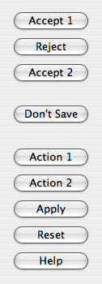

# QDialogButtonBox Class Reference

## [[QtGui](index.htm) module]

该QDialogButtonBox类是一个小部件，呈现在布局是适合当前控件样式按钮。[More...](#details)

继承[QWidget](qwidget.html)。

### Types

*   `enum ButtonLayout { WinLayout, MacLayout, KdeLayout, GnomeLayout }`
*   `enum ButtonRole { InvalidRole, AcceptRole, RejectRole, DestructiveRole, ..., ApplyRole }`
*   `enum StandardButton { NoButton, Ok, Save, SaveAll, ..., RestoreDefaults }`
*   `class **[StandardButtons](index.htm)**`

### Methods

*   `__init__ (self, QWidget parent = None)`
*   `__init__ (self, Qt.Orientation orientation, QWidget parent = None)`
*   `__init__ (self, StandardButtons buttons, Qt.Orientation orientation = Qt.Horizontal, QWidget parent = None)`
*   `addButton (self, QAbstractButton button, ButtonRole role)`
*   `QPushButton addButton (self, QString text, ButtonRole role)`
*   `QPushButton addButton (self, StandardButton button)`
*   `QPushButton button (self, StandardButton which)`
*   `ButtonRole buttonRole (self, QAbstractButton button)`
*   `list-of-QAbstractButton buttons (self)`
*   `bool centerButtons (self)`
*   `changeEvent (self, QEvent event)`
*   `clear (self)`
*   `bool event (self, QEvent event)`
*   `Qt.Orientation orientation (self)`
*   `removeButton (self, QAbstractButton button)`
*   `setCenterButtons (self, bool center)`
*   `setOrientation (self, Qt.Orientation orientation)`
*   `setStandardButtons (self, StandardButtons buttons)`
*   `StandardButton standardButton (self, QAbstractButton button)`
*   `StandardButtons standardButtons (self)`

### Qt Signals

*   `void accepted ()`
*   `void clicked (QAbstractButton *)`
*   `void helpRequested ()`
*   `void rejected ()`

* * *

## Detailed Description

该QDialogButtonBox类是一个小部件，呈现在布局是适合当前控件样式按钮。

在布局符合该平台的界面指南对话框和消息框通常存在按钮。不变的是，不同的平台有不同的布局他们的对话。 QDialogButtonBox允许开发人员添加按钮，并会自动使用适当的布局，为用户的桌面环境。

大多数按钮的对话框遵循一定的角色。这样的角色包括：

*   Accepting or rejecting the dialog.
*   Asking for help.
*   Performing actions on the dialog itself (such as resetting fields or applying changes).

此外，还可以解僱这可能会导致破坏性的结果的对话框的替代方式。

大多数对话框有一个几乎可以被认为是标准的（比如按钮**OK**和**Cancel**按钮）。它有时是方便的，以一种标准的方式创建这些按钮。

有使用QDialogButtonBox的几种方法。其中一个方法是创建按钮（或按钮文本）自己并把它们添加到按钮盒，指定他们的角色。

```
     findButton = new [QPushButton](qpushbutton.html)(tr("&Find"));
     findButton->setDefault(true);

     moreButton = new [QPushButton](qpushbutton.html)(tr("&More"));
     moreButton->setCheckable(true);
     moreButton->setAutoDefault(false);

     buttonBox = new QDialogButtonBox([Qt](qt.html).Vertical);
     buttonBox->addButton(findButton, QDialogButtonBox.ActionRole);
     buttonBox->addButton(moreButton, QDialogButtonBox.ActionRole);

```

另外， QDialogButtonBox提供了几个标准按钮（例如确定，取消，保存），您可以使用。他们共同存在的标志使你可以或它们的构造函数。

```
     buttonBox = new QDialogButtonBox(QDialogButtonBox.Ok
                                      | QDialogButtonBox.Cancel);

     connect(buttonBox, SIGNAL(accepted()), this, SLOT(accept()));
     connect(buttonBox, SIGNAL(rejected()), this, SLOT(reject()));

```

你可以混合和匹配正常的按钮和标准按钮。

目前的按钮被布置在下面的方式，如果该按钮框是水平的：

|  | Button box laid out in horizontal [GnomeLayout](qdialogbuttonbox.html#ButtonLayout-enum) |
|  | Button box laid out in horizontal [KdeLayout](qdialogbuttonbox.html#ButtonLayout-enum) |
|  | Button box laid out in horizontal [MacLayout](qdialogbuttonbox.html#ButtonLayout-enum) |
|  | Button box laid out in horizontal [WinLayout](qdialogbuttonbox.html#ButtonLayout-enum) |

这些按钮的布局方式如下，如果按钮盒是垂直的：

| [GnomeLayout](qdialogbuttonbox.html#ButtonLayout-enum) | [KdeLayout](qdialogbuttonbox.html#ButtonLayout-enum) | [MacLayout](qdialogbuttonbox.html#ButtonLayout-enum) | [WinLayout](qdialogbuttonbox.html#ButtonLayout-enum) |
|  |  |  |  |

此外，按钮盒仅包含有按钮[ActionRole](qdialogbuttonbox.html#ButtonRole-enum) or [HelpRole](qdialogbuttonbox.html#ButtonRole-enum)可以考虑无模式，并有备用看看Mac OS X上：

| modeless horizontal [MacLayout](qdialogbuttonbox.html#ButtonLayout-enum) |  |

当单击该按钮中的按钮时，[clicked](qdialogbuttonbox.html#clicked)（）信号被发射的实际按钮被按下。为方便起见，如果按钮有[AcceptRole](qdialogbuttonbox.html#ButtonRole-enum)，[RejectRole](qdialogbuttonbox.html#ButtonRole-enum)或[HelpRole](qdialogbuttonbox.html#ButtonRole-enum)时，[accepted](qdialogbuttonbox.html#accepted)（ ）[rejected](qdialogbuttonbox.html#rejected)（） ，或[helpRequested](qdialogbuttonbox.html#helpRequested)（）信号被分别发射。

如果你想要一个特定的按钮被默认你需要调用[QPushButton.setDefault](qpushbutton.html#default-prop)（ ）就可以了你自己。但是，如果没有默认按钮设置，并保存在使用哪个按钮是默认按钮跨平台的[QPushButton.autoDefault](qpushbutton.html#autoDefault-prop)物业，第一按钮与接受角色成为默认按钮QDialogButtonBox显示时，

* * *

## Type Documentation

```
QDialogButtonBox.ButtonLayout
```

该枚举描述配置中包含的按钮中的按钮时所要使用的布局策略。

| Constant | Value | Description |
| --- | --- | --- |
| `QDialogButtonBox.WinLayout` | `0` | 使用原则适用于在Windows应用程序。 |
| `QDialogButtonBox.MacLayout` | `1` | 使用策略适用于Mac OS X上的应用 |
| `QDialogButtonBox.KdeLayout` | `2` | 使用策略适合在KDE应用程序。 |
| `QDialogButtonBox.GnomeLayout` | `3` | 使用策略适合在GNOME应用程序。 |

按键布局由指定的[current style](qwidget.html#style)。然而， X11的平台上，也可以通过在桌面环境的影响。

```
QDialogButtonBox.ButtonRole
```

该枚举描述了可用于描述按键在按钮框的作用。这些角色的组合作为标志用来形容他们的行为的不同方面。

| Constant | Value | Description |
| --- | --- | --- |
| `QDialogButtonBox.InvalidRole` | `-1` | 该按钮是无效的。 |
| `QDialogButtonBox.AcceptRole` | `0` | 单击该按钮被接受的对话框（如确定）。 |
| `QDialogButtonBox.RejectRole` | `1` | 单击该按钮会导致被拒绝的对话框（例如取消） 。 |
| `QDialogButtonBox.DestructiveRole` | `2` | 单击该按钮会导致破坏性的变化（例如，用于舍弃变更） ，然后关闭对话框。 |
| `QDialogButtonBox.ActionRole` | `3` | 单击该按钮使更改对话框中的元素。 |
| `QDialogButtonBox.HelpRole` | `4` | 该按钮可点击，请求帮助。 |
| `QDialogButtonBox.YesRole` | `5` | 该按钮是一个“是”形按钮。 |
| `QDialogButtonBox.NoRole` | `6` | 该按钮是一个“无”形按钮。 |
| `QDialogButtonBox.ApplyRole` | `8` | 按钮适用电流的变化。 |
| `QDialogButtonBox.ResetRole` | `7` | 按钮重置对话框的字段默认值。 |

**See also** [StandardButton](qdialogbuttonbox.html#StandardButton-enum)。

```
QDialogButtonBox.StandardButton
```

这些枚举描述了标准按钮标志。每个按钮都有一个定义[ButtonRole](qdialogbuttonbox.html#ButtonRole-enum)。

| Constant | Value | Description |
| --- | --- | --- |
| `QDialogButtonBox.Ok` | `0x00000400` | 与定义的一个“OK”按钮[AcceptRole](qdialogbuttonbox.html#ButtonRole-enum)。 |
| `QDialogButtonBox.Open` | `0x00002000` | 与定义的“打开”按钮[AcceptRole](qdialogbuttonbox.html#ButtonRole-enum)。 |
| `QDialogButtonBox.Save` | `0x00000800` | 与定义的“保存”按钮[AcceptRole](qdialogbuttonbox.html#ButtonRole-enum)。 |
| `QDialogButtonBox.Cancel` | `0x00400000` | “取消”的按钮定义[RejectRole](qdialogbuttonbox.html#ButtonRole-enum)。 |
| `QDialogButtonBox.Close` | `0x00200000` | 与定义的“关闭”按钮[RejectRole](qdialogbuttonbox.html#ButtonRole-enum)。 |
| `QDialogButtonBox.Discard` | `0x00800000` | A“放弃”或“不保存”按钮，根据不同的平台上，与定义[DestructiveRole](qdialogbuttonbox.html#ButtonRole-enum)。 |
| `QDialogButtonBox.Apply` | `0x02000000` | 一个“应用”的定义的按钮[ApplyRole](qdialogbuttonbox.html#ButtonRole-enum)。 |
| `QDialogButtonBox.Reset` | `0x04000000` | “复位”的定义的按钮[ResetRole](qdialogbuttonbox.html#ButtonRole-enum)。 |
| `QDialogButtonBox.RestoreDefaults` | `0x08000000` | A“还原为默认值”的定义的按钮[ResetRole](qdialogbuttonbox.html#ButtonRole-enum)。 |
| `QDialogButtonBox.Help` | `0x01000000` | 与定义的“帮助”按钮[HelpRole](qdialogbuttonbox.html#ButtonRole-enum)。 |
| `QDialogButtonBox.SaveAll` | `0x00001000` | 与定义的“全部保存”按钮[AcceptRole](qdialogbuttonbox.html#ButtonRole-enum)。 |
| `QDialogButtonBox.Yes` | `0x00004000` | 与定义的“Yes”按钮[YesRole](qdialogbuttonbox.html#ButtonRole-enum)。 |
| `QDialogButtonBox.YesToAll` | `0x00008000` | 与定义的“全是”按钮[YesRole](qdialogbuttonbox.html#ButtonRole-enum)。 |
| `QDialogButtonBox.No` | `0x00010000` | 与定义的“否”按钮[NoRole](qdialogbuttonbox.html#ButtonRole-enum)。 |
| `QDialogButtonBox.NoToAll` | `0x00020000` | 与定义的“全否”按钮[NoRole](qdialogbuttonbox.html#ButtonRole-enum)。 |
| `QDialogButtonBox.Abort` | `0x00040000` | 与定义的“中止”按钮[RejectRole](qdialogbuttonbox.html#ButtonRole-enum)。 |
| `QDialogButtonBox.Retry` | `0x00080000` | 与定义的“重试”按钮[AcceptRole](qdialogbuttonbox.html#ButtonRole-enum)。 |
| `QDialogButtonBox.Ignore` | `0x00100000` | 一个“忽略”的定义的按钮[AcceptRole](qdialogbuttonbox.html#ButtonRole-enum)。 |
| `QDialogButtonBox.NoButton` | `0x00000000` | 无效的按钮。 |

该StandardButtons类型是一个typedef为[QFlags](index.htm)\u003cStandardButton\u003e 。它存储StandardButton值的或组合。

**See also** [ButtonRole](qdialogbuttonbox.html#ButtonRole-enum)和[standardButtons](qdialogbuttonbox.html#standardButtons-prop)。

* * *

## Method Documentation

```
QDialogButtonBox.__init__ (self, QWidget parent = None)
```

该_parent_的说法，如果不是没有，原因_self_通过Qt的，而不是PyQt的拥有。

构造一个空，水平按钮盒给定的_parent_。

**See also** [orientation](qdialogbuttonbox.html#orientation-prop)和[addButton](qdialogbuttonbox.html#addButton)（ ） 。

```
QDialogButtonBox.__init__ (self, Qt.Orientation orientation, QWidget parent = None)
```

该_parent_的说法，如果不是没有，原因_self_通过Qt的，而不是PyQt的拥有。

构造一个空按钮盒给定的_orientation_和_parent_。

**See also** [orientation](qdialogbuttonbox.html#orientation-prop)和[addButton](qdialogbuttonbox.html#addButton)（ ） 。

```
QDialogButtonBox.__init__ (self, StandardButtons buttons, Qt.Orientation orientation = Qt.Horizontal, QWidget parent = None)
```

该_parent_的说法，如果不是没有，原因_self_通过Qt的，而不是PyQt的拥有。

构造一个按钮盒给定的_orientation_和_parent_，包含由指定的标准按钮_buttons_。

**See also** [orientation](qdialogbuttonbox.html#orientation-prop)和[addButton](qdialogbuttonbox.html#addButton)（ ） 。

```
QDialogButtonBox.addButton (self, QAbstractButton button, ButtonRole role)
```

该_button_说法有它的所有权转移给Qt的。

将给定_button_与指定的按钮盒_role_。如果该角色是无效的，不添加该按钮。

如果按钮已经被添加，它被删除，并以新的角色再次添加。

**Note:**按钮盒采用按钮的所有权。

**See also** [removeButton](qdialogbuttonbox.html#removeButton)（）和[clear](qdialogbuttonbox.html#clear)（ ） 。

```
QPushButton QDialogButtonBox.addButton (self, QString text, ButtonRole role)
```

[

创建一个按钮与给定的_text_，将其添加到该按钮框对指定_role_，并返回相应的按钮。如果_role_是无效的，则不会创建按钮，则返回0。

](qpushbutton.html)

[**See also**](qpushbutton.html) [removeButton](qdialogbuttonbox.html#removeButton)（）和[clear](qdialogbuttonbox.html#clear)（ ） 。

```
QPushButton QDialogButtonBox.addButton (self, StandardButton button)
```

[

增加了一个标准_button_在按钮框，如果它是有效的话，并返回一个按钮。如果_button_是无效的，它不被添加到该按钮的框，并返回0。

](qpushbutton.html)

[**See also**](qpushbutton.html) [removeButton](qdialogbuttonbox.html#removeButton)（）和[clear](qdialogbuttonbox.html#clear)（ ） 。

```
QPushButton QDialogButtonBox.button (self, StandardButton which)
```

[](qpushbutton.html)

[返回](qpushbutton.html)[QPushButton](qpushbutton.html)对应于标准按钮_which_，或者0，如果标准按钮不能在这个按钮盒存在。

**See also** [standardButton](qdialogbuttonbox.html#standardButton)（ ）[standardButtons](qdialogbuttonbox.html#standardButtons-prop)（）和[buttons](qdialogbuttonbox.html#buttons)（ ） 。

```
ButtonRole QDialogButtonBox.buttonRole (self, QAbstractButton button)
```

[](qdialogbuttonbox.html#ButtonRole-enum)

[返回指定按钮的作用_button_。这个函数返回](qdialogbuttonbox.html#ButtonRole-enum)[InvalidRole](qdialogbuttonbox.html#ButtonRole-enum)如果_button_是0或未被添加到按钮框。

**See also** [buttons](qdialogbuttonbox.html#buttons)（）和[addButton](qdialogbuttonbox.html#addButton)（ ） 。

```
list-of-QAbstractButton QDialogButtonBox.buttons (self)
```

返回所有已被添加到按钮中的按钮的列表。

**See also** [buttonRole](qdialogbuttonbox.html#buttonRole)（ ）[addButton](qdialogbuttonbox.html#addButton)（）和[removeButton](qdialogbuttonbox.html#removeButton)（ ） 。

```
bool QDialogButtonBox.centerButtons (self)
```

```
QDialogButtonBox.changeEvent (self, QEvent event)
```

从重新实现[QWidget.changeEvent](qwidget.html#changeEvent)（ ） 。

```
QDialogButtonBox.clear (self)
```

清除按钮盒，删除其中的所有按钮。

**See also** [removeButton](qdialogbuttonbox.html#removeButton)（）和[addButton](qdialogbuttonbox.html#addButton)（ ） 。

```
bool QDialogButtonBox.event (self, QEvent event)
```

从重新实现[QObject.event](qobject.html#event)（ ） 。

```
Qt.Orientation QDialogButtonBox.orientation (self)
```

[

```
QDialogButtonBox.removeButton (self, QAbstractButton button)
```

该_button_争论

移除_button_从而不删除它，并设置其父零按钮盒。

](qt.html#Orientation-enum)

[**See also**](qt.html#Orientation-enum) [clear](qdialogbuttonbox.html#clear)（ ）[buttons](qdialogbuttonbox.html#buttons)（）和[addButton](qdialogbuttonbox.html#addButton)（ ） 。

```
QDialogButtonBox.setCenterButtons (self, bool center)
```

```
QDialogButtonBox.setOrientation (self, Qt.Orientation orientation)
```

```
QDialogButtonBox.setStandardButtons (self, StandardButtons buttons)
```

```
StandardButton QDialogButtonBox.standardButton (self, QAbstractButton button)
```

[](qdialogbuttonbox.html#StandardButton-enum)

[返回对应于给定的标准按钮枚举值_button_或](qdialogbuttonbox.html#StandardButton-enum)[NoButton](qdialogbuttonbox.html#StandardButton-enum)如果给定的_button_不是一个标准的按钮。

**See also** [button](qdialogbuttonbox.html#button)（ ）[buttons](qdialogbuttonbox.html#buttons)（）和[standardButtons](qdialogbuttonbox.html#standardButtons-prop)（ ） 。

```
StandardButtons QDialogButtonBox.standardButtons (self)
```

[

* * *

## Qt Signal Documentation

```
void accepted ()
```

这是该信号的默认超载。

](index.htm)

[按钮盒内部的按钮被点击时，只要它被定义与这个信号被发射](index.htm)[AcceptRole](qdialogbuttonbox.html#ButtonRole-enum) or [YesRole](qdialogbuttonbox.html#ButtonRole-enum)。

**See also** [rejected](qdialogbuttonbox.html#rejected)（ ）[clicked](qdialogbuttonbox.html#clicked)（）和[helpRequested](qdialogbuttonbox.html#helpRequested)（ ） 。

```
void clicked (QAbstractButton *)
```

这是该信号的默认超载。

单击该按钮盒内的按钮时，这个信号被发射。被指定的被按下的特定键_button_。

**See also** [accepted](qdialogbuttonbox.html#accepted)（ ）[rejected](qdialogbuttonbox.html#rejected)（）和[helpRequested](qdialogbuttonbox.html#helpRequested)（ ） 。

```
void helpRequested ()
```

这是该信号的默认超载。

按钮盒内部的按钮被点击时，只要它被定义与这个信号被发射[HelpRole](qdialogbuttonbox.html#ButtonRole-enum)。

**See also** [accepted](qdialogbuttonbox.html#accepted)（ ）[rejected](qdialogbuttonbox.html#rejected)（）和[clicked](qdialogbuttonbox.html#clicked)（ ） 。

```
void rejected ()
```

这是该信号的默认超载。

按钮盒内部的按钮被点击时，只要它被定义与这个信号被发射[RejectRole](qdialogbuttonbox.html#ButtonRole-enum) or [NoRole](qdialogbuttonbox.html#ButtonRole-enum)。

**See also** [accepted](qdialogbuttonbox.html#accepted)（ ）[helpRequested](qdialogbuttonbox.html#helpRequested)（）和[clicked](qdialogbuttonbox.html#clicked)（ ） 。