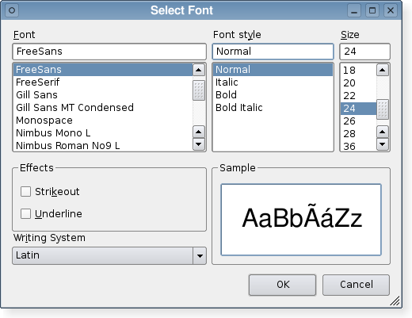

# QFontDialog Class Reference

## [[QtGui](index.htm) module]

该QFontDialog类提供了一个对话框控件用于选择字体。[More...](#details)

继承[QDialog](qdialog.html)。

### Types

*   `enum FontDialogOption { NoButtons, DontUseNativeDialog }`
*   `class **[FontDialogOptions](index.htm)**`

### Methods

*   `__init__ (self, QWidget parent = None)`
*   `__init__ (self, QFont initial, QWidget parent = None)`
*   `changeEvent (self, QEvent e)`
*   `QFont currentFont (self)`
*   `done (self, int result)`
*   `open (self)`
*   `open (self, QObject receiver, SLOT()SLOT() member)`
*   `open (self, callable receiver)`
*   `FontDialogOptions options (self)`
*   `QFont selectedFont (self)`
*   `setCurrentFont (self, QFont font)`
*   `setOption (self, FontDialogOption option, bool on = True)`
*   `setOptions (self, FontDialogOptions options)`
*   `setVisible (self, bool visible)`
*   `bool testOption (self, FontDialogOption option)`

### Static Methods

*   `(QFont, bool ok) getFont (QFont initial, QWidget parent, QString title, FontDialogOptions options)`
*   `(QFont, bool ok) getFont (QFont def, QWidget parent, QString caption)`
*   `(QFont, bool ok) getFont (QFont initial, QWidget parent = None)`
*   `(QFont, bool ok) getFont (QWidget parent = None)`

### Qt Signals

*   `void currentFontChanged (const QFont&)`
*   `void fontSelected (const QFont&)`

* * *

## Detailed Description

该QFontDialog类提供了一个对话框控件用于选择字体。

通过静态之一创建一个字体对话框[getFont](qfontdialog.html#getFont)（）函数。

示例：

```
 bool ok;
 [QFont](qfont.html) font = QFontDialog.getFont(
                 &ok, [QFont](qfont.html)("Helvetica [Cronyx]", 10), this);
 if (ok) {
     // the user clicked OK and font is set to the font the user selected
 } else {
     // the user canceled the dialog; font is set to the initial
     // value, in this case Helvetica [Cronyx], 10
 }

```

也可以用该对话框直接设置控件的字体：

```
 myWidget.setFont(QFontDialog.getFont(0, myWidget.font()));

```

如果用户单击OK（确定） ，他们选择的字体将用于进myWidget ，如果他们单击取消原来的字体。



* * *

## Type Documentation

```
QFontDialog.FontDialogOption
```

此枚举指定影响的字体对话框的外观和感觉的各种选项。

| Constant | Value | Description |
| --- | --- | --- |
| `QFontDialog.NoButtons` | `0x00000001` | 不显示**OK**和**Cancel**按钮。 （有用的“现场对话” 。 ） |
| `QFontDialog.DontUseNativeDialog` | `0x00000002` | 使用Qt的Mac上的标准字体对话框，而不是苹果的本地字体面板。 （目前，本土对话框是从未使用过，但是这是有可能在未来的Qt版本中更改。 ） |

这个枚举被引入或修改的Qt 4.5 。

该FontDialogOptions类型是一个typedef为[QFlags](index.htm)\u003cFontDialogOption\u003e 。它存储FontDialogOption值的或组合。

**See also** [options](qfontdialog.html#options-prop)，[setOption](qfontdialog.html#setOption)（）和[testOption](qfontdialog.html#testOption)（ ） 。

* * *

## Method Documentation

```
QFontDialog.__init__ (self, QWidget parent = None)
```

该_parent_的说法，如果不是没有，原因_self_通过Qt的，而不是PyQt的拥有。

构造一个标准的字体对话框。

使用[setCurrentFont](qfontdialog.html#currentFont-prop)（）来设置初始字体属性。

该_parent_参数被传递给[QDialog](qdialog.html)构造函数。

此功能被引入Qt的4.5 。

**See also** [getFont](qfontdialog.html#getFont)（ ） 。

```
QFontDialog.__init__ (self, QFont initial, QWidget parent = None)
```

该_parent_的说法，如果不是没有，原因_self_通过Qt的，而不是PyQt的拥有。

构造一个标准字体对话框，给定_parent_并指定_initial_字体。

此功能被引入Qt的4.5 。

```
QFontDialog.changeEvent (self, QEvent e)
```

从重新实现[QWidget.changeEvent](qwidget.html#changeEvent)（ ） 。

```
QFont QFontDialog.currentFont (self)
```

[

```
QFontDialog.done (self, int result)
```

](qfont.html)

[从重新实现](qfont.html)[QDialog.done](qdialog.html#done)（ ） 。

关闭对话框，并将其结果代码_result_。如果显示此对话框[exec_](qdialog.html#exec)（ ） ， （）完成将导致本地事件循环来完成，并[exec_](qdialog.html#exec)（ ）返回_result_。

**See also** [QDialog.done](qdialog.html#done)（ ） 。

```
(QFont, bool ok) QFontDialog.getFont (QFont initial, QWidget parent, QString title, FontDialogOptions options)
```

执行一个模式字体对话框并返回一个字体。

如果用户点击**OK**，则返回所选字体。如果用户点击**Cancel**时，_initial_字体返回。

该对话框与给定的构造_parent_并在指定的选项_options_。_title_显示为对话框的窗口标题和_initial_是最初选定的字体。如果_ok_参数不为空，它指的是该值设置为True，如果用户点击**OK**，并设置为False，如果用户点击**Cancel**。

示例：

```
 bool ok;
 [QFont](qfont.html) font = [QFontDialog](qfontdialog.html).getFont(&ok, [QFont](qfont.html)("Times", 12), this);
 if (ok) {
     // font is set to the font the user selected
 } else {
     // the user canceled the dialog; font is set to the initial
     // value, in this case Times, 12.
 }

```

也可以用该对话框直接设置控件的字体：

```
 myWidget.setFont([QFontDialog](qfontdialog.html).getFont(0, myWidget.font()));

```

在这个例子中，如果用户单击OK（确定） ，他们选择的字体将被使用，如果他们单击取消原来的字体。

**Warning:**不要删除_parent_在该对话框的执行。如果你想这样做，你应该用一个自己创建的对话框[QFontDialog](qfontdialog.html)构造函数。

```
(QFont, bool ok) QFontDialog.getFont (QFont def, QWidget parent, QString caption)
```

调用的getFont （_ok_，_initial_，_parent_）代替。

**Warning:**不要删除_parent_在该对话框的执行。如果你想这样做，你应该用一个自己创建的对话框[QFontDialog](qfontdialog.html)构造函数。

该_name_参数被忽略。

此功能被引入Qt的4.5 。

```
(QFont, bool ok) QFontDialog.getFont (QFont initial, QWidget parent = None)
```

调用的getFont （_ok_，_parent_）代替。

**Warning:**不要删除_parent_在该对话框的执行。如果你想这样做，你应该用一个自己创建的对话框[QFontDialog](qfontdialog.html)构造函数。

该_name_参数被忽略。

```
(QFont, bool ok) QFontDialog.getFont (QWidget parent = None)
```

这是一个重载函数。

此功能被引入Qt的4.5 。

```
QFontDialog.open (self)
```

这是一个重载函数。

在打开的对话框并连接其[fontSelected](qfontdialog.html#fontSelected)（）信号到由指定的槽_receiver_和_member_。

该信号会从插槽中断开时，关闭对话框。

此功能被引入Qt的4.5 。

```
QFontDialog.open (self, QObject receiver, SLOT()SLOT() member)
```

```
QFontDialog.open (self, callable receiver)
```

```
FontDialogOptions QFontDialog.options (self)
```

[](index.htm)

```
QFont QFontDialog.selectedFont (self)
```

[

返回用户选择通过单击字体**OK**或等效按钮。

](qfont.html)

[**Note:**此字体并不总是一样的举行的字体](qfont.html)[currentFont](qfontdialog.html#currentFont-prop)因为用户属性终于可以选择一个使用之前选择不同的字体。

```
QFontDialog.setCurrentFont (self, QFont font)
```

```
QFontDialog.setOption (self, FontDialogOption option, bool on = True)
```

设置给定_option_被启用，如果_on_是真的，否则，清除给定的_option_。

**See also** [options](qfontdialog.html#options-prop)和[testOption](qfontdialog.html#testOption)（ ） 。

```
QFontDialog.setOptions (self, FontDialogOptions options)
```

```
QFontDialog.setVisible (self, bool visible)
```

从重新实现[QWidget.setVisible](qwidget.html#visible-prop)（ ） 。

```
bool QFontDialog.testOption (self, FontDialogOption option)
```

返回True如果给定的_option_被启用，否则返回False 。

**See also** [options](qfontdialog.html#options-prop)和[setOption](qfontdialog.html#setOption)（ ） 。

* * *

## Qt Signal Documentation

```
void currentFontChanged (const QFont&)
```

这是该信号的默认超载。

当当前字体改变这个信号被发射。新字体中指定_font_。

当用户在选择字体的信号被发射。最终，所选择的字体可能不同于当前选择的字体。

此功能被引入Qt的4.5 。

**See also** [currentFont](qfontdialog.html#currentFont-prop)，[fontSelected](qfontdialog.html#fontSelected)（）和[selectedFont](qfontdialog.html#selectedFont)（ ） 。

```
void fontSelected (const QFont&)
```

这是该信号的默认超载。

当字体已被选定，这个信号被发射。选择的字体在指定_font_。

当用户已经选择了最后的字体要使用的信号只发射。当用户改变当前字体的字体对话框它不发射。

此功能被引入Qt的4.5 。

**See also** [selectedFont](qfontdialog.html#selectedFont)（ ）[currentFontChanged](qfontdialog.html#currentFontChanged)（）和[currentFont](qfontdialog.html#currentFont-prop)。