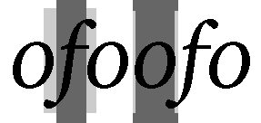

# QFontMetricsF Class Reference

## [[QtGui](index.htm) module]

该QFontMetricsF类提供的字体度量信息。[More...](#details)

### Methods

*   `__init__ (self, QFont)`
*   `__init__ (self, QFont, QPaintDevice pd)`
*   `__init__ (self, QFontMetrics)`
*   `__init__ (self, QFontMetricsF)`
*   `float ascent (self)`
*   `float averageCharWidth (self)`
*   `QRectF boundingRect (self, QChar)`
*   `QRectF boundingRect (self, QString string)`
*   `QRectF boundingRect (self, QRectF rect, int flags, QString text, int tabStops = 0, list-of-int tabArray = 0)`
*   `QRectF boundingRectChar (self, QChar)`
*   `float descent (self)`
*   `QString elidedText (self, QString text, Qt.TextElideMode mode, float width, int flags = 0)`
*   `float height (self)`
*   `bool inFont (self, QChar)`
*   `bool inFontUcs4 (self, int character)`
*   `float leading (self)`
*   `float leftBearing (self, QChar)`
*   `float lineSpacing (self)`
*   `float lineWidth (self)`
*   `float maxWidth (self)`
*   `float minLeftBearing (self)`
*   `float minRightBearing (self)`
*   `float overlinePos (self)`
*   `float rightBearing (self, QChar)`
*   `QSizeF size (self, int flags, QString text, int tabStops = 0, list-of-int tabArray = 0)`
*   `float strikeOutPos (self)`
*   `QRectF tightBoundingRect (self, QString text)`
*   `float underlinePos (self)`
*   `float width (self, QChar)`
*   `float width (self, QString string)`
*   `float widthChar (self, QChar)`
*   `float xHeight (self)`

### Special Methods

*   `bool __eq__ (self, QFontMetricsF other)`
*   `bool __ne__ (self, QFontMetricsF other)`

* * *

## Detailed Description

该QFontMetricsF类提供的字体度量信息。

QFontMetricsF函数计算字符和字符串给定字体的大小。你可以构造一个QFontMetricsF对象与现有[QFont](qfont.html)获得指标的字体。如果字体是后来改，字体规格对象_not_更新。

一旦创建，该对象提供了访问字体，它的字符，并在字体渲染字符串的各个指标。

有迹象表明，在字体上运行几个功能：[ascent](qfontmetricsf.html#ascent)（ ）[descent](qfontmetricsf.html#descent)（ ）[height](qfontmetricsf.html#height)（ ）[leading](qfontmetricsf.html#leading)（）和[lineSpacing](qfontmetricsf.html#lineSpacing)（ ）返回字体的基本大小属性。该[underlinePos](qfontmetricsf.html#underlinePos)（ ）[overlinePos](qfontmetricsf.html#overlinePos)（ ）[strikeOutPos](qfontmetricsf.html#strikeOutPos)（）和[lineWidth](qfontmetricsf.html#lineWidth)（ ）函数，返回强调， overlines或撞击出的字符的行的属性。这些功能都是快。

也有一些对集合中的字体字形的操作一些功能：[minLeftBearing](qfontmetricsf.html#minLeftBearing)（ ）[minRightBearing](qfontmetricsf.html#minRightBearing)（）和[maxWidth](qfontmetricsf.html#maxWidth)（ ） 。这些都是必然缓慢，我们建议避免他们，如果可能的。

对于每一个字符，就可以得到其[width](qfontmetricsf.html#width)（ ）[leftBearing](qfontmetricsf.html#leftBearing)（）和[rightBearing](qfontmetricsf.html#rightBearing)（ ），并找出是否是在使用字体[inFont](qfontmetricsf.html#inFont)（ ） 。您也可以把字符作为字符串，并使用字符串函数就可以了。

字符串函数包括：[width](qfontmetricsf.html#width)（） ，返回字符串的宽度以像素为单位（或点，用于打印机）[boundingRect](qfontmetricsf.html#boundingRect)（ ）返回一个矩形足够大，以包含所呈现的串，并[size](qfontmetricsf.html#size)（） ，以返回该矩形的大小。

例如：

```
 [QFont](qfont.html) font("times", 24);
 QFontMetricsF fm(font);
 [qreal](index.htm#qreal-typedef) pixelsWide = fm.width("What's the width of this text?");
 [qreal](index.htm#qreal-typedef) pixelsHigh = fm.height();

```

* * *

## Method Documentation

```
QFontMetricsF.__init__ (self, QFont)
```

构造一个字体规格对象为_font_。

字体规格将与用于创建paintdevice兼容_font_。

字体规格对象持有，在它被创建的时候被传递在构造函数中的字体的信息，并且不更新，如果字体的属性后来改。

使用[QFontMetricsF](qfontmetricsf.html)（常量[QFont](qfont.html)＆ ，[QPaintDevice](qpaintdevice.html)*）来获取字体度量标准，具有一定的绘图设备兼容。

```
QFontMetricsF.__init__ (self, QFont, QPaintDevice pd)
```

构造一个字体规格对象为_font_和_paintdevice_。

字体规格将与通过paintdevice兼容。如果_paintdevice_为0时，度量将屏幕兼容的，即得。你得到，如果你使用的字体在绘制文本的指标[widgets](qwidget.html) or [pixmaps](qpixmap.html)，而不是在[QPicture](qpicture.html) or [QPrinter](qprinter.html)。

字体规格对象持有，在它被创建的时候被传递在构造函数中的字体的信息，并且不更新，如果字体的属性后来改。

```
QFontMetricsF.__init__ (self, QFontMetrics)
```

构造一个字体规格与从给定的浮点精度反对_fontMetrics_对象。

这个函数中引入了Qt 4.2中。

```
QFontMetricsF.__init__ (self, QFontMetricsF)
```

构造的副本_fm_。

```
float QFontMetricsF.ascent (self)
```

返回字体的上升。

字体的上升是从基线到最高位置的字符延伸到距离。在实践中，有些字体设计师打破了这个规则，如当他们把一个以上的口音就一个字之上，或者以适应异国的语言不同寻常的性格，所以它是可能的（虽然很少） ，这个值将是太小了。

**See also** [descent](qfontmetricsf.html#descent)（ ） 。

```
float QFontMetricsF.averageCharWidth (self)
```

返回字形在字体的平均宽度。

这个函数中引入了Qt 4.2中。

```
QRectF QFontMetricsF.boundingRect (self, QChar)
```

[

返回字符的边框由指定的字符串中_text_。边界矩形总是至少复盖的像素集合的文本将涵盖如果画在（ 0 ， 0 ） 。

](qrectf.html)

[注意，边框可以延伸到的（0，0 ），例如左斜体字体，返回的矩形的宽度可能比什么不同](qrectf.html)[width](qfontmetricsf.html#width)（ ）方法返回。

如果你想知道字符串的超前宽度（布局彼此相邻一组字符串） ，使用[width](qfontmetricsf.html#width)（ ）来代替。

换行符的处理方法与普通字符，_not_作为换行符。

的边界矩形的高度至少一样大的返回值[height](qfontmetricsf.html#height)（ ） 。

**See also** [width](qfontmetricsf.html#width)（ ）[height](qfontmetricsf.html#height)（）和[QPainter.boundingRect](qpainter.html#boundingRect)（ ） 。

```
QRectF QFontMetricsF.boundingRect (self, QString string)
```

[

返回字符的边框_ch_相对于在基准线的最左边的点。

注意，边框可以延伸到的（0，0 ），例如左斜体字体和文本输出可以复盖_all_像素的边界矩形。

请注意，矩形通常既基线的上方和下方延伸。

](qrectf.html)

[**See also**](qrectf.html) [width](qfontmetricsf.html#width)（ ） 。

```
QRectF QFontMetricsF.boundingRect (self, QRectF rect, int flags, QString text, int tabStops = 0, list-of-int tabArray = 0)
```

[

该_tabArray_参数也可能没有。

这是一个重载函数。

返回字符的边框在给定的_text_。这是一组像素的限制时，由指定的矩形边界的文本将涵盖若拉_rect_。

该_flags_参数是下列标志的按位或：

](qrectf.html)

[](qrectf.html)
*   [](qrectf.html)[Qt.AlignLeft](qt.html#AlignmentFlag-enum) aligns to the left border, except for Arabic and Hebrew where it aligns to the right.
*   [Qt.AlignRight](qt.html#AlignmentFlag-enum) aligns to the right border, except for Arabic and Hebrew where it aligns to the left.
*   [Qt.AlignJustify](qt.html#AlignmentFlag-enum) produces justified text.
*   [Qt.AlignHCenter](qt.html#AlignmentFlag-enum) aligns horizontally centered.
*   [Qt.AlignTop](qt.html#AlignmentFlag-enum) aligns to the top border.
*   [Qt.AlignBottom](qt.html#AlignmentFlag-enum) aligns to the bottom border.
*   [Qt.AlignVCenter](qt.html#AlignmentFlag-enum) aligns vertically centered
*   [Qt.AlignCenter](qt.html#AlignmentFlag-enum) (== `Qt.AlignHCenter | Qt.AlignVCenter`)
*   [Qt.TextSingleLine](qt.html#TextFlag-enum) ignores newline characters in the text.
*   [Qt.TextExpandTabs](qt.html#TextFlag-enum) expands tabs (see below)
*   [Qt.TextShowMnemonic](qt.html#TextFlag-enum) interprets "&x" as &lt;u&gt;x&lt;/u&gt;; i.e., underlined.
*   [Qt.TextWordWrap](qt.html#TextFlag-enum) breaks the text to fit the rectangle.

[Qt.Horizontal](qt.html#Orientation-enum)对齐默认为[Qt.AlignLeft](qt.html#AlignmentFlag-enum)和垂直对齐方式默认为[Qt.AlignTop](qt.html#AlignmentFlag-enum)。

如果多个水平或几个的垂直对齐的标志被设置，所产生的取向是不确定的。

这些标记被定义[Qt.AlignmentFlag](qt.html#AlignmentFlag-enum)。

If [Qt.TextExpandTabs](qt.html#TextFlag-enum)在设置_flags_，以下行为被用来解释制表符中的文本：

*   If _tabArray_ is non-null, it specifies a 0-terminated sequence of pixel-positions for tabs in the text.
*   If _tabStops_ is non-zero, it is used as the tab spacing (in pixels).

注意，边框可以延伸到的（0，0 ），例如左斜体字体。

换行字符处理为换行符。

尽管在不同的实际字符的高度，的边界矩形的高度“是”， “是”是相同的。

这个函数返回的边界矩形是有点比由简单的计算较大[boundingRect](qfontmetricsf.html#boundingRect)（）函数。该函数使用[maximum left](qfontmetricsf.html#minLeftBearing)和[right](qfontmetricsf.html#minRightBearing)字体轴承作为是必要的多行文本正确对齐。此外， fontHeight （）和[lineSpacing](qfontmetricsf.html#lineSpacing)（）被用于计算的高度，而不是单个字符的高度。

**See also** [width](qfontmetricsf.html#width)（ ）[QPainter.boundingRect](qpainter.html#boundingRect)（）和[Qt.Alignment](qt.html#AlignmentFlag-enum)。

```
QRectF QFontMetricsF.boundingRectChar (self, QChar)
```

[

```
float QFontMetricsF.descent (self)
```

返回字体的血统。

的下降是从基准线到最低点的字符延伸到距离。 （请注意，这是从X不同，它增加了1个像素。 ）在实践中，有些字体设计师打破了这个规则，如以容纳在一个异乎寻常的语言不寻常的字符，所以它是可能的（虽然很少） ，该值将是太小。

](qrectf.html)

[**See also**](qrectf.html) [ascent](qfontmetricsf.html#ascent)（ ） 。

```
QString QFontMetricsF.elidedText (self, QString text, Qt.TextElideMode mode, float width, int flags = 0)
```

如果字符串_text_比更宽_width_，返回字符串的省略版本（即，在用“ ...... ”一个字符串） 。否则，返回原始字符串。

该_mode_参数指定的文本是省略左侧（如“ ......技术” ） ，中间（例如，“风帆... CH” ） ，或在右边（例如，“ TROL ...” ） 。

该_width_指定以像素为单位，而不是以字符。

该_flags_参数是可选的，并且目前只支持[Qt.TextShowMnemonic](qt.html#TextFlag-enum)作为值。

这个函数中引入了Qt 4.2中。

```
float QFontMetricsF.height (self)
```

返回字体的高度。

这总是等于[ascent](qfontmetricsf.html#ascent)（）+[descent](qfontmetricsf.html#descent)（） 1 （ 1是基准线） 。

**See also** [leading](qfontmetricsf.html#leading)（）和[lineSpacing](qfontmetricsf.html#lineSpacing)（ ） 。

```
bool QFontMetricsF.inFont (self, QChar)
```

返回True如果字符_ch_在字体中的有效字符，否则返回False 。

```
bool QFontMetricsF.inFontUcs4 (self, int character)
```

返回True如果给定的字符_ch_，编码UCS-4/UTF-32 ，是在字体中的有效字符，否则返回False 。

此功能被引入Qt的4.8 。

```
float QFontMetricsF.leading (self)
```

返回字体的领先。

这是自然的线间间距。

**See also** [height](qfontmetricsf.html#height)（）和[lineSpacing](qfontmetricsf.html#lineSpacing)（ ） 。

```
float QFontMetricsF.leftBearing (self, QChar)
```

返回字符的左轴承_ch_在字体。

左边的轴承是从字符的逻辑原点的字符的最左边的像素的右支距离。这个值是负的，如果该字符的像素延伸到逻辑原点的左边。

见宽（[QChar](qchar.html)）这个度量的图形化描述。

**See also** [rightBearing](qfontmetricsf.html#rightBearing)（ ）[minLeftBearing](qfontmetricsf.html#minLeftBearing)（）和[width](qfontmetricsf.html#width)（ ） 。

```
float QFontMetricsF.lineSpacing (self)
```

返回从一个基线的距离下。

该值始终等于[leading](qfontmetricsf.html#leading)（）+[height](qfontmetricsf.html#height)（ ） 。

**See also** [height](qfontmetricsf.html#height)（）和[leading](qfontmetricsf.html#leading)（ ） 。

```
float QFontMetricsF.lineWidth (self)
```

返回下划线和删除线，调整字体的点大小的宽度。

**See also** [underlinePos](qfontmetricsf.html#underlinePos)（ ）[overlinePos](qfontmetricsf.html#overlinePos)（）和[strikeOutPos](qfontmetricsf.html#strikeOutPos)（ ） 。

```
float QFontMetricsF.maxWidth (self)
```

返回最宽的字符的字体的宽度。

```
float QFontMetricsF.minLeftBearing (self)
```

返回字体的最小左轴承。

这是字体中的所有字符的最小leftBearing （字符） 。

请注意，此功能可能会非常缓慢，如果字体很大。

**See also** [minRightBearing](qfontmetricsf.html#minRightBearing)（）和[leftBearing](qfontmetricsf.html#leftBearing)（ ） 。

```
float QFontMetricsF.minRightBearing (self)
```

返回字体的最低右侧轴承。

这是字体中的所有字符的最小rightBearing （字符） 。

请注意，此功能可能会非常缓慢，如果字体很大。

**See also** [minLeftBearing](qfontmetricsf.html#minLeftBearing)（）和[rightBearing](qfontmetricsf.html#rightBearing)（ ） 。

```
float QFontMetricsF.overlinePos (self)
```

返回从基线的距离，其中一个上划线应绘制。

**See also** [underlinePos](qfontmetricsf.html#underlinePos)（ ）[strikeOutPos](qfontmetricsf.html#strikeOutPos)（）和[lineWidth](qfontmetricsf.html#lineWidth)（ ） 。

```
float QFontMetricsF.rightBearing (self, QChar)
```

返回字符的右侧轴承_ch_在字体。

右轴承是由一个后续字符的逻辑原点的最右边的像素的字符的左病房距离。这个值是负的，如果该字符的像素延伸到的权[width](qfontmetricsf.html#width)的字符（） 。

See [width](qfontmetricsf.html#width)（ ）这个指标的图形化描述。

**See also** [leftBearing](qfontmetricsf.html#leftBearing)（ ）[minRightBearing](qfontmetricsf.html#minRightBearing)（）和[width](qfontmetricsf.html#width)（ ） 。

```
QSizeF QFontMetricsF.size (self, int flags, QString text, int tabStops = 0, list-of-int tabArray = 0)
```

[

该_tabArray_参数也可能没有。

返回大小的字符的像素在给定的_text_。

该_flags_参数是下列标志的按位或：

](qsizef.html)

[](qsizef.html)
*   [](qsizef.html)[Qt.TextSingleLine](qt.html#TextFlag-enum) ignores newline characters.
*   [Qt.TextExpandTabs](qt.html#TextFlag-enum) expands tabs (see below)
*   [Qt.TextShowMnemonic](qt.html#TextFlag-enum) interprets "&x" as &lt;u&gt;x&lt;/u&gt;; i.e., underlined.
*   Qt.TextWordBreak breaks the text to fit the rectangle.

这些标记被定义[Qt.TextFlags](index.htm#TextFlags-typedef)。

If [Qt.TextExpandTabs](qt.html#TextFlag-enum)在设置_flags_，以下行为被用来解释制表符中的文本：

*   If _tabArray_ is non-null, it specifies a 0-terminated sequence of pixel-positions for tabs in the text.
*   If _tabStops_ is non-zero, it is used as the tab spacing (in pixels).

换行字符处理为换行符。

注意：尽管在不同的实际字符的高度，的边界矩形的高度“是”， “是”是相同的。

**See also** [boundingRect](qfontmetricsf.html#boundingRect)（ ） 。

```
float QFontMetricsF.strikeOutPos (self)
```

返回从基准线的距离，其中应绘制的三振线。

**See also** [underlinePos](qfontmetricsf.html#underlinePos)（ ）[overlinePos](qfontmetricsf.html#overlinePos)（）和[lineWidth](qfontmetricsf.html#lineWidth)（ ） 。

```
QRectF QFontMetricsF.tightBoundingRect (self, QString text)
```

[

返回字符周围紧张的边界矩形被指定的字符串中_text_。边界矩形总是至少复盖的像素集合的文本将涵盖如果画在（ 0 ， 0 ） 。

](qrectf.html)

[注意，边框可以延伸到的（0，0 ），例如左斜体字体，返回的矩形的宽度可能比什么不同](qrectf.html)[width](qfontmetricsf.html#width)（ ）方法返回。

如果你想知道字符串的超前宽度（布局彼此相邻一组字符串） ，使用[width](qfontmetricsf.html#width)（ ）来代替。

换行符的处理方法与普通字符，_not_作为换行符。

**Warning:**调用此方法将是非常缓慢的Windows 。

此功能被引入Qt的4.3 。

**See also** [width](qfontmetricsf.html#width)（ ）[height](qfontmetricsf.html#height)（）和[boundingRect](qfontmetricsf.html#boundingRect)（ ） 。

```
float QFontMetricsF.underlinePos (self)
```

返回从基线的距离，其中一个底线应绘制。

**See also** [overlinePos](qfontmetricsf.html#overlinePos)（ ）[strikeOutPos](qfontmetricsf.html#strikeOutPos)（）和[lineWidth](qfontmetricsf.html#lineWidth)（ ） 。

```
float QFontMetricsF.width (self, QChar)
```

返回的宽度中的字符的像素在给定的_text_。

注意，该值是_not_等于返回的宽度[boundingRect](qfontmetricsf.html#boundingRect)（ ） ，宽（ ），因为[boundingRect](qfontmetricsf.html#boundingRect)（ ）返回一个描述像素的矩形这个字符串将复盖而宽度（ ）返回的距离应在其中绘制的下一个字符串。

**See also** [boundingRect](qfontmetricsf.html#boundingRect)（ ） 。

```
float QFontMetricsF.width (self, QString string)
```

这是一个重载函数。



返回字符的逻辑宽度_ch_以像素为单位。这是一个距离合适后拉随后的字符_ch_。

一些度量中的所述图像中所描述的权利。中央暗矩形复盖的逻辑[width](qfontmetricsf.html#width)每个字符的（ ） 。外苍白的矩形复盖[leftBearing](qfontmetricsf.html#leftBearing)（）和[rightBearing](qfontmetricsf.html#rightBearing)每个字符的（ ） 。注意，在这个特定的字体的“f”的轴承都是负的，而轴承的“o”都是正的。

**Warning:**此功能会产生不正确的结果在一个字符串的中间阿拉伯文字符或无空格标记，作为字形整形和标记的定位是处理字符串时，会发生不能考虑。当实现一个互动的文本控件，使用[QTextLayout](qtextlayout.html)代替。

**See also** [boundingRect](qfontmetricsf.html#boundingRect)（ ） 。

```
float QFontMetricsF.widthChar (self, QChar)
```

```
float QFontMetricsF.xHeight (self)
```

返回字体的'X'的高度。这是常常但不总是相同的字符“X”的高度。

```
bool QFontMetricsF.__eq__ (self, QFontMetricsF other)
```

```
bool QFontMetricsF.__ne__ (self, QFontMetricsF other)
```