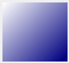
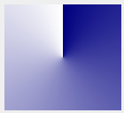
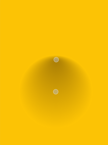
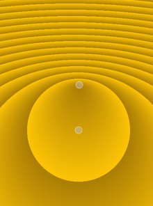
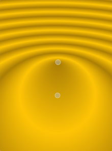

# QGradient Class Reference

## [[QtGui](index.htm) module]

该QGradient类是用来与组合[QBrush](qbrush.html)指定渐变填充。[More...](#details)

通过继承[QConicalGradient](qconicalgradient.html)，[QLinearGradient](qlineargradient.html)和[QRadialGradient](qradialgradient.html)。

### Types

*   `enum CoordinateMode { LogicalMode, StretchToDeviceMode, ObjectBoundingMode }`
*   `enum Spread { PadSpread, ReflectSpread, RepeatSpread }`
*   `enum Type { LinearGradient, RadialGradient, ConicalGradient, NoGradient }`

### Methods

*   `__init__ (self)`
*   `__init__ (self, QGradient)`
*   `CoordinateMode coordinateMode (self)`
*   `setColorAt (self, float pos, QColor color)`
*   `setCoordinateMode (self, CoordinateMode mode)`
*   `setSpread (self, Spread aspread)`
*   `setStops (self, list-of-tuple-of-float-QColor stops)`
*   `Spread spread (self)`
*   `list-of-tuple-of-float-QColor stops (self)`
*   `Type type (self)`

### Special Methods

*   `bool __eq__ (self, QGradient gradient)`
*   `bool __ne__ (self, QGradient other)`

* * *

## Detailed Description

该QGradient类是用来与组合[QBrush](qbrush.html)指定渐变填充。

目前的Qt支持三种类型的渐变填充的：

*   _Linear_ gradients interpolate colors between start and end points.
*   _Simple_ radial gradients interpolate colors between a focal point and end points on a circle surrounding it.
*   _Extended_ radial gradients interpolate colors between a center and a focal circle.
*   _Conical_ gradients interpolate colors around a center point.

渐变的类型可以使用被检索[type](qgradient.html#type)（）函数。每个类型的被QGradient的子类表示：

| [QLinearGradient](qlineargradient.html) | [QRadialGradient](qradialgradient.html) | [QConicalGradient](qconicalgradient.html) |
| --- | --- | --- |
|  |  |  |

在渐变中的颜色所使用的停止点定义[QGradientStop](qgradient.html#QGradientStop-typedef)型，即，位置和颜色。使用[setColorAt](qgradient.html#setColorAt)（ ）函数来定义一个停止点。或者，使用[setStops](qgradient.html#setStops)（ ）函数来一气呵成定义几个止损点。需要注意的是，后者的功能_replaces_当前设定的止损点。

它是渐变的一整套停止点（可通过[stops](qgradient.html#stops)（ ）函数） ，描述如何渐变区域应填补。如果已指定没有停止点，黑色在0到白在1梯度使用。

从黑对角线线性梯度（ 100 ， 100） ，以白色为（ 200 ， 200 ）可以这样指定：

```
     [QLinearGradient](qlineargradient.html) linearGrad([QPointF](qpointf.html)(100, 100), [QPointF](qpointf.html)(200, 200));
     linearGrad.setColorAt(0, [Qt](qt.html).black);
     linearGrad.setColorAt(1, [Qt](qt.html).white);

```

渐变可以有止损点的一个任意数字。下面将创建开始，红色在中心，蓝色和绿色，然后在边缘的径向渐变：

```
     [QRadialGradient](qradialgradient.html) radialGrad([QPointF](qpointf.html)(100, 100), 100);
     radialGrad.setColorAt(0, [Qt](qt.html).red);
     radialGrad.setColorAt(0.5, [Qt](qt.html).blue);
     radialGrad.setColorAt(1, [Qt](qt.html).green);

```

它可以借由指定其区域之外的重复或反映该梯度的[spread method](qgradient.html#Spread-enum)使用[setSpread](qgradient.html#setSpread)（）函数。缺省值是垫在最近停止点的颜色外区域。当前设置[spread method](qgradient.html#Spread-enum)可使用检索到的[spread](qgradient.html#spread)（）函数。该[QGradient.Spread](qgradient.html#Spread-enum)枚举定义了三种不同的方法：

|  |  |  |
| [PadSpread](qgradient.html#Spread-enum) | [RepeatSpread](qgradient.html#Spread-enum) | [ReflectSpread](qgradient.html#Spread-enum) |

注意，这个[setSpread](qgradient.html#setSpread)（）函数只具有线性和径向渐变效果。其原因是，在锥形梯度通过定义封闭的，即_conical_渐变填充从0整个圆 - 360度，而径向或线性梯度的边界可以通过它的半径或最终停止点，分别被指定。

梯度坐标可以在逻辑坐标，相对于设备坐标，或者相对于对象的边界框的坐标来指定。该[coordinate mode](qgradient.html#CoordinateMode-enum)可使用设置[setCoordinateMode](qgradient.html#setCoordinateMode)（）函数。默认值是[LogicalMode](qgradient.html#CoordinateMode-enum)，其中所述梯度的坐标以相同的方式作为对象坐标指定。要检索当前设置的[coordinate mode](qgradient.html#CoordinateMode-enum)使用[coordinateMode](qgradient.html#coordinateMode)（ ） 。

* * *

## Type Documentation

```
QGradient.CoordinateMode
```

此枚举指定如何渐变的坐标映射到其上的梯度可用于油漆设备。

| Constant | Value | Description |
| --- | --- | --- |
| `QGradient.LogicalMode` | `0` | 这是默认模式。渐变坐标指定的逻辑空间只是该对象的坐标等。 |
| `QGradient.StretchToDeviceMode` | `1` | 在这种模式下，渐变的坐标是相对于漆设备的边界矩形，与（ 0,0 ）在左上角，（1,1 ）中的绘图设备的右下角。 |
| `QGradient.ObjectBoundingMode` | `2` | 在这种模式下，梯度坐标是相对于被绘制的对象，用（ 0,0 ）在左上角，（1,1 ），在对象的边界矩形的右下角的边框。 |

这个枚举被引入或修改的Qt 4.4 。

```
QGradient.Spread
```

指定如何梯度范围之外的区域应该充满。

| Constant | Value | Description |
| --- | --- | --- |
| `QGradient.PadSpread` | `0` | 该地区充满了最近的车站颜色。这是默认的。 |
| `QGradient.RepeatSpread` | `2` | 梯度是重复的梯度区域之外。 |
| `QGradient.ReflectSpread` | `1` | 该梯度的梯度范围之外的反映。 |

**See also** [spread](qgradient.html#spread)（）和[setSpread](qgradient.html#setSpread)（ ） 。

```
QGradient.Type
```

指定渐变的类型。

| Constant | Value | Description |
| --- | --- | --- |
| `QGradient.LinearGradient` | `0` | 开始和结束点之间进行内插的色彩（[QLinearGradient](qlineargradient.html)） 。 |
| `QGradient.RadialGradient` | `1` | 插色焦点之间和结束它周围一圈点（[QRadialGradient](qradialgradient.html)） 。 |
| `QGradient.ConicalGradient` | `2` | 插围绕中心点的颜色（[QConicalGradient](qconicalgradient.html)） 。 |
| `QGradient.NoGradient` | `3` | 无梯度被使用。 |

**See also** [type](qgradient.html#type)（ ） 。

* * *

## Method Documentation

```
QGradient.__init__ (self)
```

```
QGradient.__init__ (self, QGradient)
```

```
CoordinateMode QGradient.coordinateMode (self)
```

[](qgradient.html#CoordinateMode-enum)

[返回此渐变的坐标模式。默认模式是](qgradient.html#CoordinateMode-enum)[LogicalMode](qgradient.html#CoordinateMode-enum)。

此功能被引入Qt的4.4 。

**See also** [setCoordinateMode](qgradient.html#setCoordinateMode)（ ） 。

```
QGradient.setColorAt (self, float pos, QColor color)
```

创建一个停止点在给定的_position_用给定的_color_。给定_position_必须是范围为0到1。

**See also** [setStops](qgradient.html#setStops)（）和[stops](qgradient.html#stops)（ ） 。

```
QGradient.setCoordinateMode (self, CoordinateMode mode)
```

这个渐变的坐标模式设置为_mode_。默认模式是[LogicalMode](qgradient.html#CoordinateMode-enum)。

此功能被引入Qt的4.4 。

**See also** [coordinateMode](qgradient.html#coordinateMode)（ ） 。

```
QGradient.setSpread (self, Spread aspread)
```

指定的蔓延_method_应该用于该梯度。

注意，该函数只具有线性和径向渐变效果。

**See also** [spread](qgradient.html#spread)（ ） 。

```
QGradient.setStops (self, list-of-tuple-of-float-QColor stops)
```

替换当前设置的止损点与给定_stopPoints_。该点的位置必须在0到1范围，并与最低点首先必须进行排序。

**See also** [setColorAt](qgradient.html#setColorAt)（）和[stops](qgradient.html#stops)（ ） 。

```
Spread QGradient.spread (self)
```

[](qgradient.html#Spread-enum)

[返回此梯度扩散方法的使用。默认值是](qgradient.html#Spread-enum)[PadSpread](qgradient.html#Spread-enum)。

**See also** [setSpread](qgradient.html#setSpread)（ ） 。

```
list-of-tuple-of-float-QColor QGradient.stops (self)
```

返回止损点，这个梯度。

如果已指定没有停止点，黑色在0到白在1梯度使用。

**See also** [setStops](qgradient.html#setStops)（）和[setColorAt](qgradient.html#setColorAt)（ ） 。

```
Type QGradient.type (self)
```

[

返回渐变的类型。

```
bool QGradient.__eq__ (self, QGradient gradient)
```

```
bool QGradient.__ne__ (self, QGradient other)
```

](qgradient.html#Type-enum)