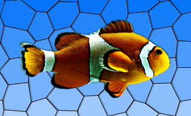
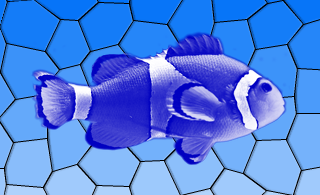
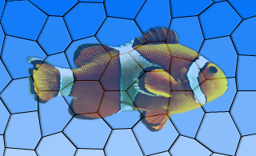
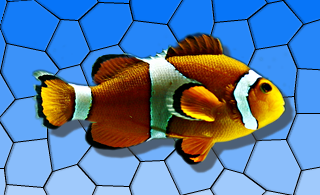
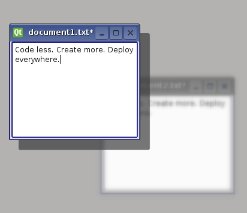

# QGraphicsEffect Class Reference

## [[QtGui](index.htm) module]

该QGraphicsEffect类是所有图形效果的基类。[More...](#details)

继承[QObject](qobject.html)。

通过继承[QGraphicsBlurEffect](qgraphicsblureffect.html)，[QGraphicsColorizeEffect](qgraphicscolorizeeffect.html)，[QGraphicsDropShadowEffect](qgraphicsdropshadoweffect.html)和[QGraphicsOpacityEffect](qgraphicsopacityeffect.html)。

### Types

*   `enum ChangeFlag { SourceAttached, SourceDetached, SourceBoundingRectChanged, SourceInvalidated }`
*   `class **[ChangeFlags](index.htm)**`
*   `enum PixmapPadMode { NoPad, PadToTransparentBorder, PadToEffectiveBoundingRect }`

### Methods

*   `__init__ (self, QObject parent = None)`
*   `QRectF boundingRect (self)`
*   `QRectF boundingRectFor (self, QRectF sourceRect)`
*   `draw (self, QPainter painter)`
*   `drawSource (self, QPainter painter)`
*   `bool isEnabled (self)`
*   `setEnabled (self, bool enable)`
*   `QRectF sourceBoundingRect (self, Qt.CoordinateSystem system = Qt.LogicalCoordinates)`
*   `sourceChanged (self, ChangeFlags flags)`
*   `bool sourceIsPixmap (self)`
*   `(QPixmap, QPoint offset) sourcePixmap (self, Qt.CoordinateSystem system = Qt.LogicalCoordinates, PixmapPadMode mode = QGraphicsEffect.PadToEffectiveBoundingRect)`
*   `update (self)`
*   `updateBoundingRect (self)`

### Qt Signals

*   `void enabledChanged (bool)`

* * *

## Detailed Description

该QGraphicsEffect类是所有图形效果的基类。

效果改变元素挂接到渲染管线和源（例如，一个操作之间的外观[QGraphicsPixmapItem](qgraphicspixmapitem.html)）和目标设备（例如，[QGraphicsView](qgraphicsview.html)的视口） 。效果可以通过调用setEnabled （​​假）被禁用。如果效果被禁用，源直接呈现。

要添加一个视觉效果的[QGraphicsItem](qgraphicsitem.html)例如，您可以使用一个标准的影响，或交替，通过创建QGraphicsEffect的子类创建自己的效果。关于该项目的使用效果可以被安装[QGraphicsItem.setGraphicsEffect](qgraphicsitem.html#setGraphicsEffect)（ ） 。

Qt提供了以下标准的影响：

*   [QGraphicsBlurEffect](qgraphicsblureffect.html) - blurs the item by a given radius
*   [QGraphicsDropShadowEffect](qgraphicsdropshadoweffect.html) - renders a dropshadow behind the item
*   [QGraphicsColorizeEffect](qgraphicscolorizeeffect.html) - renders the item in shades of any given color
*   [QGraphicsOpacityEffect](qgraphicsopacityeffect.html) - renders the item with an opacity

|  |
|  |  |
|  |  |



有关如何使用每种效果的更多信息，请参见具体效果的文档。

要创建自己的自定义效果，创造QGraphicsEffect （或任何其他现有效果）的一个子类，并重新实现虚函数[draw](qgraphicseffect.html#draw)（ ） 。这个函数被调用时的效果需要重绘。该[draw](qgraphicseffect.html#draw)（ ）函数将画家与画作为参数。欲了解更多信息，请参阅documenation的[draw](qgraphicseffect.html#draw)（ ） 。在[draw](qgraphicseffect.html#draw)（ ）函数可以调用[sourcePixmap](qgraphicseffect.html#sourcePixmap)（ ）来获得图形效果的源，然后可以处理的像素图。

如果你的效果变化，使用[update](qgraphicseffect.html#update)（）来请求重绘。如果您的自定义效果改变源的边界矩形，例如，径向发光效果可能需要申请额外的保证金，您可以重新实现虚[boundingRectFor](qgraphicseffect.html#boundingRectFor)（ ）函数，并调用[updateBoundingRect](qgraphicseffect.html#updateBoundingRect)（ ）通知框架每当这个矩形的变化。虚拟[sourceChanged](qgraphicseffect.html#sourceChanged)（ ）函数被调用以通知的影响，源已经以某种方式改变 - 例如，如果源是一个[QGraphicsRectItem](qgraphicsrectitem.html)其矩形的参数发生了变化。

* * *

## Type Documentation

```
QGraphicsEffect.ChangeFlag
```

这个枚举变量描述了在QGraphicsEffectSource发生了变化。

| Constant | Value | Description |
| --- | --- | --- |
| `QGraphicsEffect.SourceAttached` | `0x1` | 效果是安装在一个源。 |
| `QGraphicsEffect.SourceDetached` | `0x2` | 效果被卸载的来源。 |
| `QGraphicsEffect.SourceBoundingRectChanged` | `0x4` | 源的边界矩形已经改变。 |
| `QGraphicsEffect.SourceInvalidated` | `0x8` | 源的视觉外观已经改变。 |

该ChangeFlags类型是一个typedef为[QFlags](index.htm)\u003cChangeFlag\u003e 。它存储ChangeFlag值的或组合。

```
QGraphicsEffect.PixmapPadMode
```

这个枚举变量描述了如何从sourcePixmap返回的像素图会被填充。

| Constant | Value | Description |
| --- | --- | --- |
| `QGraphicsEffect.NoPad` | `0` | 像素图不应该接受任何额外的填充。 |
| `QGraphicsEffect.PadToTransparentBorder` | `1` | 像素图会被填充，以确保它有一个完全透明的边框。 |
| `QGraphicsEffect.PadToEffectiveBoundingRect` | `2` | 像素图会被填充，以配合效果的有效边界矩形。 |

* * *

## Method Documentation

```
QGraphicsEffect.__init__ (self, QObject parent = None)
```

该_parent_的说法，如果不是没有，原因_self_通过Qt的，而不是PyQt的拥有。

构造一个新的[QGraphicsEffect](qgraphicseffect.html)经指定的实例_parent_。

```
QRectF QGraphicsEffect.boundingRect (self)
```

[

返回的有效边界矩形这种效果，即在设备坐标源的边界矩形，由效果本身应用的任何利润调整。

](qrectf.html)

[**See also**](qrectf.html) [boundingRectFor](qgraphicseffect.html#boundingRectFor)（）和[updateBoundingRect](qgraphicseffect.html#updateBoundingRect)（ ） 。

```
QRectF QGraphicsEffect.boundingRectFor (self, QRectF sourceRect)
```

[](qrectf.html)

[返回有效边界矩形这样的效果，给出了提供_rect_在设备的坐标。当你编写自己的自定义效果，你必须调用](qrectf.html)[updateBoundingRect](qgraphicseffect.html#updateBoundingRect)（ ）每当任何参数发生改变，可能会导致这个这个函数返回一个不同的值。

**See also** [sourceBoundingRect](qgraphicseffect.html#sourceBoundingRect)（ ） 。

```
QGraphicsEffect.draw (self, QPainter painter)
```

这种方法是抽象的，应在任何子类中重新实现。

这个纯虚函数绘制的效果，被称为每当源需要被绘制。

在重新实现这个函数[QGraphicsEffect](qgraphicseffect.html)子类提供的效果的绘图实现，用_painter_。

例如：

```
 MyGraphicsEffect.draw([QPainter](qpainter.html) *painter)
 {
     ...
     [QPoint](qpoint.html) offset;
     if (sourceIsPixmap()) {
         // No point in drawing in device coordinates (pixmap will be scaled anyways).
         const [QPixmap](qpixmap.html) pixmap = sourcePixmap([Qt](qt.html).LogicalCoordinates, &offset);
         ...
         painter->drawPixmap(offset, pixmap);
     } else {
         // Draw pixmap in device coordinates to avoid pixmap scaling;
         const [QPixmap](qpixmap.html) pixmap = sourcePixmap([Qt](qt.html).DeviceCoordinates, &offset);
         painter->setWorldTransform([QTransform](qtransform.html)());
         ...
         painter->drawPixmap(offset, pixmap);
     }
     ...
 }

```

这个函数不应该显式调用的用户，因为它的意思是只重新实现的目的。

```
QGraphicsEffect.drawSource (self, QPainter painter)
```

绘制源直接使用给定的_painter_。

此功能只能由被称为[QGraphicsEffect.draw](qgraphicseffect.html#draw)（ ） 。

例如：

```
 MyGraphicsOpacityEffect.draw([QPainter](qpainter.html) *painter)
 {
     // Fully opaque; draw directly without going through a pixmap.
     if (qFuzzyCompare(m_opacity, 1)) {
         drawSource(painter);
         return;
     }
     ...
 }

```

**See also** [QGraphicsEffect.draw](qgraphicseffect.html#draw)（ ） 。

```
bool QGraphicsEffect.isEnabled (self)
```

```
QGraphicsEffect.setEnabled (self, bool enable)
```

这种方法也是一个Qt槽与C + +的签名`void setEnabled(bool)`。

```
QRectF QGraphicsEffect.sourceBoundingRect (self, Qt.CoordinateSystem system = Qt.LogicalCoordinates)
```

[

返回源映射到给定的边界矩形_system_。

](qrectf.html)

[调用此函数](qrectf.html)[Qt.DeviceCoordinates](qt.html#CoordinateSystem-enum)外[QGraphicsEffect.draw](qgraphicseffect.html#draw)（ ）将给不确定的结果，因为没有可用的设备上下文。

**See also** [draw](qgraphicseffect.html#draw)（ ） 。

```
QGraphicsEffect.sourceChanged (self, ChangeFlags flags)
```

这个虚函数被调用[QGraphicsEffect](qgraphicseffect.html)以通知源发生了变化的影响。如果效果适用于任何高速缓存，那么该缓存必须以反映源的全新亮相清除。

该_flags_描述发生了什么变化。

```
bool QGraphicsEffect.sourceIsPixmap (self)
```

返回True如果源有效地为一个像素映射，例如，一个[QGraphicsPixmapItem](qgraphicspixmapitem.html)。

此功能可用于优化目的。举例来说，有没有点绘制在设备中的源坐标，以避免像素图的缩放，如果这个函数返回True - 源像素图将反正缩放。

```
(QPixmap, QPoint offset) QGraphicsEffect.sourcePixmap (self, Qt.CoordinateSystem system = Qt.LogicalCoordinates, PixmapPadMode mode = QGraphicsEffect.PadToEffectiveBoundingRect)
```

返回一个像素图，画到它的来源。

该_system_指定了坐标系也可以用于源。可选的_offset_返回参数的偏移，其中像素图应使用当前的画家来画。有关如何在像素图是填充用的控制_mode_参数。

返回的像素图剪切到当前画家的设备时，矩形_system_ is [Qt.DeviceCoordinates](qt.html#CoordinateSystem-enum)。

调用此函数[Qt.DeviceCoordinates](qt.html#CoordinateSystem-enum)外[QGraphicsEffect.draw](qgraphicseffect.html#draw)（ ）将给不确定的结果，因为没有可用的设备上下文。

**See also** [draw](qgraphicseffect.html#draw)（）和[boundingRect](qgraphicseffect.html#boundingRect)（ ） 。

```
QGraphicsEffect.update (self)
```

这种方法也是一个Qt槽与C + +的签名`void update()`。

附表的效果重绘。调用此函数时的效果需要重新绘制。该功能不会触发源的重绘。

**See also** [updateBoundingRect](qgraphicseffect.html#updateBoundingRect)（ ） 。

```
QGraphicsEffect.updateBoundingRect (self)
```

该函数通知影响的框架时，效果的边界矩形已经改变。作为一个自定义效果的作者，你必须调用这个函数，每当您更改任何参数，将导致虚拟[boundingRectFor](qgraphicseffect.html#boundingRectFor)（ ）函数返回一个不同的值。

这个函数会调用[update](qgraphicseffect.html#update)（ ）如果这是必要的。

**See also** [boundingRectFor](qgraphicseffect.html#boundingRectFor)（ ）[boundingRect](qgraphicseffect.html#boundingRect)（）和[sourceBoundingRect](qgraphicseffect.html#sourceBoundingRect)（ ） 。

* * *

## Qt Signal Documentation

```
void enabledChanged (bool)
```

这是该信号的默认超载。

每当效果是启用或禁用该信号被发射。该_enabled_参数保存效果的新启用的状态。

**See also** [isEnabled](qgraphicseffect.html#enabled-prop)（ ） 。