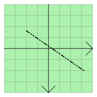

# QGraphicsLineItem Class Reference

## [[QtGui](index.htm) module]

该QGraphicsLineItem类提供了一个行项目，你可以添加到[QGraphicsScene](qgraphicsscene.html)。[More...](#details)

继承[QGraphicsItem](qgraphicsitem.html)。

### Methods

*   `__init__ (self, QGraphicsItem parent = None, QGraphicsScene scene = None)`
*   `__init__ (self, QLineF line, QGraphicsItem parent = None, QGraphicsScene scene = None)`
*   `__init__ (self, float x1, float y1, float x2, float y2, QGraphicsItem parent = None, QGraphicsScene scene = None)`
*   `QRectF boundingRect (self)`
*   `bool contains (self, QPointF point)`
*   `bool isObscuredBy (self, QGraphicsItem item)`
*   `QLineF line (self)`
*   `QPainterPath opaqueArea (self)`
*   `paint (self, QPainter painter, QStyleOptionGraphicsItem option, QWidget widget = None)`
*   `QPen pen (self)`
*   `setLine (self, QLineF line)`
*   `setLine (self, float x1, float y1, float x2, float y2)`
*   `setPen (self, QPen pen)`
*   `QPainterPath shape (self)`
*   `int type (self)`

* * *

## Detailed Description

该QGraphicsLineItem类提供了一个行项目，你可以添加到[QGraphicsScene](qgraphicsscene.html)。

要设置项目的路线，通过一个[QLineF](qlinef.html)到QGraphicsLineItem的构造函数，或致电[setLine](qgraphicslineitem.html#setLine)（）函数。该[line](qgraphicslineitem.html#line)（ ）函数返回当前行。默认情况下，该线是黑色的宽度为0 ，但可以通过调用改变这个[setPen](qgraphicslineitem.html#setPen)（ ） 。



QGraphicsLineItem使用线路和钢笔的宽度，以提供合理的实施[boundingRect](qgraphicslineitem.html#boundingRect)（ ）[shape](qgraphicslineitem.html#shape)（）和[contains](qgraphicslineitem.html#contains)（ ） 。该[paint](qgraphicslineitem.html#paint)（ ）函数绘制使用该项目的相关钢笔线。

* * *

## Method Documentation

```
QGraphicsLineItem.__init__ (self, QGraphicsItem parent = None, QGraphicsScene scene = None)
```

该_parent_的说法，如果不是没有，原因_self_通过Qt的，而不是PyQt的拥有。

该_scene_的说法，如果不是没有，原因_self_通过Qt的，而不是PyQt的拥有。

构造一个[QGraphicsLineItem](qgraphicslineitem.html)。_parent_被传递给[QGraphicsItem](qgraphicsitem.html)的构造。

**See also** [QGraphicsScene.addItem](qgraphicsscene.html#addItem)（ ） 。

```
QGraphicsLineItem.__init__ (self, QLineF line, QGraphicsItem parent = None, QGraphicsScene scene = None)
```

该_parent_的说法，如果不是没有，原因_self_通过Qt的，而不是PyQt的拥有。

该_scene_的说法，如果不是没有，原因_self_通过Qt的，而不是PyQt的拥有。

构造一个[QGraphicsLineItem](qgraphicslineitem.html)，使用_line_作为默认的行。_parent_被传递给[QGraphicsItem](qgraphicsitem.html)的构造。

**See also** [QGraphicsScene.addItem](qgraphicsscene.html#addItem)（ ） 。

```
QGraphicsLineItem.__init__ (self, float x1, float y1, float x2, float y2, QGraphicsItem parent = None, QGraphicsScene scene = None)
```

该_parent_的说法，如果不是没有，原因_self_通过Qt的，而不是PyQt的拥有。

该_scene_的说法，如果不是没有，原因_self_通过Qt的，而不是PyQt的拥有。

构造一个[QGraphicsLineItem](qgraphicslineitem.html)，使用之间（线_x1_，_y1_）和（_x2_，_y2_）作为默认的行。_parent_被传递给[QGraphicsItem](qgraphicsitem.html)的构造。

**See also** [QGraphicsScene.addItem](qgraphicsscene.html#addItem)（ ） 。

```
QRectF QGraphicsLineItem.boundingRect (self)
```

[](qrectf.html)

[从重新实现](qrectf.html)[QGraphicsItem.boundingRect](qgraphicsitem.html#boundingRect)（ ） 。

```
bool QGraphicsLineItem.contains (self, QPointF point)
```

从重新实现[QGraphicsItem.contains](qgraphicsitem.html#contains)（ ） 。

```
bool QGraphicsLineItem.isObscuredBy (self, QGraphicsItem item)
```

从重新实现[QGraphicsItem.isObscuredBy](qgraphicsitem.html#isObscuredBy)（ ） 。

```
QLineF QGraphicsLineItem.line (self)
```

[

返回该项目的路线，或者如果没有行被设置一个空行。

](qlinef.html)

[**See also**](qlinef.html) [setLine](qgraphicslineitem.html#setLine)（ ） 。

```
QPainterPath QGraphicsLineItem.opaqueArea (self)
```

[](qpainterpath.html)

[从重新实现](qpainterpath.html)[QGraphicsItem.opaqueArea](qgraphicsitem.html#opaqueArea)（ ） 。

```
QGraphicsLineItem.paint (self, QPainter painter, QStyleOptionGraphicsItem option, QWidget widget = None)
```

从重新实现[QGraphicsItem.paint](qgraphicsitem.html#paint)（ ） 。

```
QPen QGraphicsLineItem.pen (self)
```

[

返回该项目的钢笔或黑色固体0宽度的笔，如果没有笔已定。

](qpen.html)

[**See also**](qpen.html) [setPen](qgraphicslineitem.html#setPen)（ ） 。

```
QGraphicsLineItem.setLine (self, QLineF line)
```

设置项的行被定_line_。

**See also** [line](qgraphicslineitem.html#line)（ ） 。

```
QGraphicsLineItem.setLine (self, float x1, float y1, float x2, float y2)
```

这是一个重载函数。

设置项的路线是之间的界线（_x1_，_y1_）和（_x2_，_y2_） 。

这是一样的调用`setLine(QLineF(x1, y1, x2, y2))`。

```
QGraphicsLineItem.setPen (self, QPen pen)
```

设置项的笔_pen_。如果没有笔设置，线路将采用黑色固体0宽度的钢笔画。

**See also** [pen](qgraphicslineitem.html#pen)（ ） 。

```
QPainterPath QGraphicsLineItem.shape (self)
```

[](qpainterpath.html)

[从重新实现](qpainterpath.html)[QGraphicsItem.shape](qgraphicsitem.html#shape)（ ） 。

```
int QGraphicsLineItem.type (self)
```

从重新实现[QGraphicsItem.type](qgraphicsitem.html#type)（ ） 。