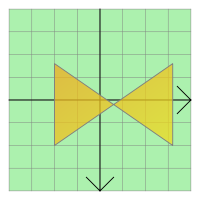

# QGraphicsPolygonItem Class Reference

## [[QtGui](index.htm) module]

该QGraphicsPolygonItem类提供了一个多边形的项目，你可以添加到[QGraphicsScene](qgraphicsscene.html)。[More...](#details)

继承[QAbstractGraphicsShapeItem](qabstractgraphicsshapeitem.html)。

### Methods

*   `__init__ (self, QGraphicsItem parent = None, QGraphicsScene scene = None)`
*   `__init__ (self, QPolygonF polygon, QGraphicsItem parent = None, QGraphicsScene scene = None)`
*   `QRectF boundingRect (self)`
*   `bool contains (self, QPointF point)`
*   `Qt.FillRule fillRule (self)`
*   `bool isObscuredBy (self, QGraphicsItem item)`
*   `QPainterPath opaqueArea (self)`
*   `paint (self, QPainter painter, QStyleOptionGraphicsItem option, QWidget widget = None)`
*   `QPolygonF polygon (self)`
*   `setFillRule (self, Qt.FillRule rule)`
*   `setPolygon (self, QPolygonF polygon)`
*   `QPainterPath shape (self)`
*   `int type (self)`

* * *

## Detailed Description

该QGraphicsPolygonItem类提供了一个多边形的项目，你可以添加到[QGraphicsScene](qgraphicsscene.html)。

要设置项目的多边形，通过一个[QPolygonF](qpolygonf.html)到QGraphicsPolygonItem的构造函数，或致电[setPolygon](qgraphicspolygonitem.html#setPolygon)（）函数。该[polygon](qgraphicspolygonitem.html#polygon)（ ）函数返回当前的多边形。



QGraphicsPolygonItem使用多边形和笔宽，以提供合理的实施[boundingRect](qgraphicspolygonitem.html#boundingRect)（ ）[shape](qgraphicspolygonitem.html#shape)（）和[contains](qgraphicspolygonitem.html#contains)（ ） 。该[paint](qgraphicspolygonitem.html#paint)（ ）函数绘制使用该项目的相关的画笔和画刷多边形，你可以通过调用设置[setPen](qabstractgraphicsshapeitem.html#setPen)（）和[setBrush](qabstractgraphicsshapeitem.html#setBrush)（）函数。

* * *

## Method Documentation

```
QGraphicsPolygonItem.__init__ (self, QGraphicsItem parent = None, QGraphicsScene scene = None)
```

该_parent_的说法，如果不是没有，原因_self_通过Qt的，而不是PyQt的拥有。

该_scene_的说法，如果不是没有，原因_self_通过Qt的，而不是PyQt的拥有。

构造一个[QGraphicsPolygonItem](qgraphicspolygonitem.html)。_parent_被传递给[QAbstractGraphicsShapeItem](qabstractgraphicsshapeitem.html)的构造。

**See also** [QGraphicsScene.addItem](qgraphicsscene.html#addItem)（ ） 。

```
QGraphicsPolygonItem.__init__ (self, QPolygonF polygon, QGraphicsItem parent = None, QGraphicsScene scene = None)
```

该_parent_的说法，如果不是没有，原因_self_通过Qt的，而不是PyQt的拥有。

该_scene_的说法，如果不是没有，原因_self_通过Qt的，而不是PyQt的拥有。

构造一个[QGraphicsPolygonItem](qgraphicspolygonitem.html)同_polygon_作为默认的多边形。_parent_被传递给[QAbstractGraphicsShapeItem](qabstractgraphicsshapeitem.html)的构造。

**See also** [QGraphicsScene.addItem](qgraphicsscene.html#addItem)（ ） 。

```
QRectF QGraphicsPolygonItem.boundingRect (self)
```

[](qrectf.html)

[从重新实现](qrectf.html)[QGraphicsItem.boundingRect](qgraphicsitem.html#boundingRect)（ ） 。

```
bool QGraphicsPolygonItem.contains (self, QPointF point)
```

从重新实现[QGraphicsItem.contains](qgraphicsitem.html#contains)（ ） 。

```
Qt.FillRule QGraphicsPolygonItem.fillRule (self)
```

[](qt.html#FillRule-enum)

[返回多边形的填充规则。默认的填充规则是](qt.html#FillRule-enum)[Qt.OddEvenFill](qt.html#FillRule-enum)。

**See also** [setFillRule](qgraphicspolygonitem.html#setFillRule)（ ）[QPainterPath.fillRule](qpainterpath.html#fillRule)（）和[QPainter.drawPolygon](qpainter.html#drawPolygon)（ ） 。

```
bool QGraphicsPolygonItem.isObscuredBy (self, QGraphicsItem item)
```

从重新实现[QGraphicsItem.isObscuredBy](qgraphicsitem.html#isObscuredBy)（ ） 。

```
QPainterPath QGraphicsPolygonItem.opaqueArea (self)
```

[](qpainterpath.html)

[从重新实现](qpainterpath.html)[QGraphicsItem.opaqueArea](qgraphicsitem.html#opaqueArea)（ ） 。

```
QGraphicsPolygonItem.paint (self, QPainter painter, QStyleOptionGraphicsItem option, QWidget widget = None)
```

从重新实现[QGraphicsItem.paint](qgraphicsitem.html#paint)（ ） 。

```
QPolygonF QGraphicsPolygonItem.polygon (self)
```

[

返回该项目的多边形，或者一个空的多边形，如果多边形没有被设置。

](qpolygonf.html)

[**See also**](qpolygonf.html) [setPolygon](qgraphicspolygonitem.html#setPolygon)（ ） 。

```
QGraphicsPolygonItem.setFillRule (self, Qt.FillRule rule)
```

设置多边形的填充规则_rule_。默认的填充规则是[Qt.OddEvenFill](qt.html#FillRule-enum)。

**See also** [fillRule](qgraphicspolygonitem.html#fillRule)（ ）[QPainterPath.fillRule](qpainterpath.html#fillRule)（）和[QPainter.drawPolygon](qpainter.html#drawPolygon)（ ） 。

```
QGraphicsPolygonItem.setPolygon (self, QPolygonF polygon)
```

设置项的多边形也可以在给定_polygon_。

**See also** [polygon](qgraphicspolygonitem.html#polygon)（ ） 。

```
QPainterPath QGraphicsPolygonItem.shape (self)
```

[](qpainterpath.html)

[从重新实现](qpainterpath.html)[QGraphicsItem.shape](qgraphicsitem.html#shape)（ ） 。

```
int QGraphicsPolygonItem.type (self)
```

从重新实现[QGraphicsItem.type](qgraphicsitem.html#type)（ ） 。