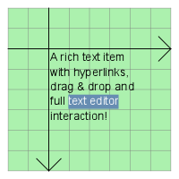

# QGraphicsTextItem Class Reference

## [[QtGui](index.htm) module]

该QGraphicsTextItem类提供了一个文本项，您可以添加到[QGraphicsScene](qgraphicsscene.html)显示格式化文本。[More...](#details)

继承[QGraphicsObject](qgraphicsobject.html)。

### Methods

*   `__init__ (self, QGraphicsItem parent = None, QGraphicsScene scene = None)`
*   `__init__ (self, QString text, QGraphicsItem parent = None, QGraphicsScene scene = None)`
*   `adjustSize (self)`
*   `QRectF boundingRect (self)`
*   `bool contains (self, QPointF point)`
*   `contextMenuEvent (self, QGraphicsSceneContextMenuEvent event)`
*   `QColor defaultTextColor (self)`
*   `QTextDocument document (self)`
*   `dragEnterEvent (self, QGraphicsSceneDragDropEvent event)`
*   `dragLeaveEvent (self, QGraphicsSceneDragDropEvent event)`
*   `dragMoveEvent (self, QGraphicsSceneDragDropEvent event)`
*   `dropEvent (self, QGraphicsSceneDragDropEvent event)`
*   `focusInEvent (self, QFocusEvent event)`
*   `focusOutEvent (self, QFocusEvent event)`
*   `QFont font (self)`
*   `hoverEnterEvent (self, QGraphicsSceneHoverEvent event)`
*   `hoverLeaveEvent (self, QGraphicsSceneHoverEvent event)`
*   `hoverMoveEvent (self, QGraphicsSceneHoverEvent event)`
*   `inputMethodEvent (self, QInputMethodEvent event)`
*   `QVariant inputMethodQuery (self, Qt.InputMethodQuery query)`
*   `bool isObscuredBy (self, QGraphicsItem item)`
*   `keyPressEvent (self, QKeyEvent event)`
*   `keyReleaseEvent (self, QKeyEvent event)`
*   `mouseDoubleClickEvent (self, QGraphicsSceneMouseEvent event)`
*   `mouseMoveEvent (self, QGraphicsSceneMouseEvent event)`
*   `mousePressEvent (self, QGraphicsSceneMouseEvent event)`
*   `mouseReleaseEvent (self, QGraphicsSceneMouseEvent event)`
*   `QPainterPath opaqueArea (self)`
*   `bool openExternalLinks (self)`
*   `paint (self, QPainter painter, QStyleOptionGraphicsItem option, QWidget widget)`
*   `bool sceneEvent (self, QEvent event)`
*   `setDefaultTextColor (self, QColor c)`
*   `setDocument (self, QTextDocument document)`
*   `setFont (self, QFont font)`
*   `setHtml (self, QString html)`
*   `setOpenExternalLinks (self, bool open)`
*   `setPlainText (self, QString text)`
*   `setTabChangesFocus (self, bool b)`
*   `setTextCursor (self, QTextCursor cursor)`
*   `setTextInteractionFlags (self, Qt.TextInteractionFlags flags)`
*   `setTextWidth (self, float width)`
*   `QPainterPath shape (self)`
*   `bool tabChangesFocus (self)`
*   `QTextCursor textCursor (self)`
*   `Qt.TextInteractionFlags textInteractionFlags (self)`
*   `float textWidth (self)`
*   `QString toHtml (self)`
*   `QString toPlainText (self)`
*   `int type (self)`

### Qt Signals

*   `void linkActivated (const QString&)`
*   `void linkHovered (const QString&)`

* * *

## Detailed Description

该QGraphicsTextItem类提供了一个文本项，您可以添加到[QGraphicsScene](qgraphicsscene.html)显示格式化文本。

如果只需要显示在一个项目纯文本，可以考虑使用[QGraphicsSimpleTextItem](qgraphicssimpletextitem.html)代替。

要设置项的文本，一个传递[QString](qstring.html)到QGraphicsTextItem的构造函数，或调用[setHtml](qgraphicstextitem.html#setHtml)（）/[setPlainText](qgraphicstextitem.html#setPlainText)（ ） 。

QGraphicsTextItem使用文本的格式大小和相关的字体提供合理的实施[boundingRect](qgraphicstextitem.html#boundingRect)（ ）[shape](qgraphicstextitem.html#shape)（）和[contains](qgraphicstextitem.html#contains)（ ） 。你可以通过调用设置字体[setFont](qgraphicstextitem.html#setFont)（ ） 。

它有可能使该项目可编辑通过设置[Qt.TextEditorInteraction](qt.html#TextInteractionFlag-enum)使用标志[setTextInteractionFlags](qgraphicstextitem.html#setTextInteractionFlags)（ ） 。

该项目的首选文本的宽度可以使用设置[setTextWidth](qgraphicstextitem.html#setTextWidth)（ ），并使用获得的[textWidth](qgraphicstextitem.html#textWidth)（ ） 。

**Note:**为了使在中心的HTML文本，该项目的文本宽度必须设置。



**Note:**QGraphicsTextItem接受[hover events](qgraphicsitem.html#acceptHoverEvents)在默认情况下。您可以更改此[setAcceptHoverEvents()](qgraphicsitem.html#setAcceptHoverEvents)。

* * *

## Method Documentation

```
QGraphicsTextItem.__init__ (self, QGraphicsItem parent = None, QGraphicsScene scene = None)
```

该_parent_的说法，如果不是没有，原因_self_通过Qt的，而不是PyQt的拥有。

该_scene_的说法，如果不是没有，原因_self_通过Qt的，而不是PyQt的拥有。

构造一个[QGraphicsTextItem](qgraphicstextitem.html)。_parent_被传递给[QGraphicsItem](qgraphicsitem.html)的构造。

**See also** [QGraphicsScene.addItem](qgraphicsscene.html#addItem)（ ） 。

```
QGraphicsTextItem.__init__ (self, QString text, QGraphicsItem parent = None, QGraphicsScene scene = None)
```

该_parent_的说法，如果不是没有，原因_self_通过Qt的，而不是PyQt的拥有。

该_scene_的说法，如果不是没有，原因_self_通过Qt的，而不是PyQt的拥有。

构造一个[QGraphicsTextItem](qgraphicstextitem.html)，使用_text_作为默认的纯文本。_parent_被传递给[QGraphicsItem](qgraphicsitem.html)的构造。

**See also** [QGraphicsScene.addItem](qgraphicsscene.html#addItem)（ ） 。

```
QGraphicsTextItem.adjustSize (self)
```

调整文本项到一个合理的规模。

```
QRectF QGraphicsTextItem.boundingRect (self)
```

[](qrectf.html)

[从重新实现](qrectf.html)[QGraphicsItem.boundingRect](qgraphicsitem.html#boundingRect)（ ） 。

```
bool QGraphicsTextItem.contains (self, QPointF point)
```

从重新实现[QGraphicsItem.contains](qgraphicsitem.html#contains)（ ） 。

```
QGraphicsTextItem.contextMenuEvent (self, QGraphicsSceneContextMenuEvent event)
```

从重新实现[QGraphicsItem.contextMenuEvent](qgraphicsitem.html#contextMenuEvent)（ ） 。

```
QColor QGraphicsTextItem.defaultTextColor (self)
```

[

返回用于为无格式文本的默认文本颜色。

](qcolor.html)

[**See also**](qcolor.html) [setDefaultTextColor](qgraphicstextitem.html#setDefaultTextColor)（ ） 。

```
QTextDocument QGraphicsTextItem.document (self)
```

[

返回该项目的文本文档。

](qtextdocument.html)

[**See also**](qtextdocument.html) [setDocument](qgraphicstextitem.html#setDocument)（ ） 。

```
QGraphicsTextItem.dragEnterEvent (self, QGraphicsSceneDragDropEvent event)
```

从重新实现[QGraphicsItem.dragEnterEvent](qgraphicsitem.html#dragEnterEvent)（ ） 。

```
QGraphicsTextItem.dragLeaveEvent (self, QGraphicsSceneDragDropEvent event)
```

从重新实现[QGraphicsItem.dragLeaveEvent](qgraphicsitem.html#dragLeaveEvent)（ ） 。

```
QGraphicsTextItem.dragMoveEvent (self, QGraphicsSceneDragDropEvent event)
```

从重新实现[QGraphicsItem.dragMoveEvent](qgraphicsitem.html#dragMoveEvent)（ ） 。

```
QGraphicsTextItem.dropEvent (self, QGraphicsSceneDragDropEvent event)
```

从重新实现[QGraphicsItem.dropEvent](qgraphicsitem.html#dropEvent)（ ） 。

```
QGraphicsTextItem.focusInEvent (self, QFocusEvent event)
```

从重新实现[QGraphicsItem.focusInEvent](qgraphicsitem.html#focusInEvent)（ ） 。

```
QGraphicsTextItem.focusOutEvent (self, QFocusEvent event)
```

从重新实现[QGraphicsItem.focusOutEvent](qgraphicsitem.html#focusOutEvent)（ ） 。

```
QFont QGraphicsTextItem.font (self)
```

[

返回项的字体，这是用来呈现的文本。

](qfont.html)

[**See also**](qfont.html) [setFont](qgraphicstextitem.html#setFont)（ ） 。

```
QGraphicsTextItem.hoverEnterEvent (self, QGraphicsSceneHoverEvent event)
```

从重新实现[QGraphicsItem.hoverEnterEvent](qgraphicsitem.html#hoverEnterEvent)（ ） 。

```
QGraphicsTextItem.hoverLeaveEvent (self, QGraphicsSceneHoverEvent event)
```

从重新实现[QGraphicsItem.hoverLeaveEvent](qgraphicsitem.html#hoverLeaveEvent)（ ） 。

```
QGraphicsTextItem.hoverMoveEvent (self, QGraphicsSceneHoverEvent event)
```

从重新实现[QGraphicsItem.hoverMoveEvent](qgraphicsitem.html#hoverMoveEvent)（ ） 。

```
QGraphicsTextItem.inputMethodEvent (self, QInputMethodEvent event)
```

从重新实现[QGraphicsItem.inputMethodEvent](qgraphicsitem.html#inputMethodEvent)（ ） 。

```
QVariant QGraphicsTextItem.inputMethodQuery (self, Qt.InputMethodQuery query)
```

从重新实现[QGraphicsItem.inputMethodQuery](qgraphicsitem.html#inputMethodQuery)（ ） 。

```
bool QGraphicsTextItem.isObscuredBy (self, QGraphicsItem item)
```

从重新实现[QGraphicsItem.isObscuredBy](qgraphicsitem.html#isObscuredBy)（ ） 。

```
QGraphicsTextItem.keyPressEvent (self, QKeyEvent event)
```

从重新实现[QGraphicsItem.keyPressEvent](qgraphicsitem.html#keyPressEvent)（ ） 。

```
QGraphicsTextItem.keyReleaseEvent (self, QKeyEvent event)
```

从重新实现[QGraphicsItem.keyReleaseEvent](qgraphicsitem.html#keyReleaseEvent)（ ） 。

```
QGraphicsTextItem.mouseDoubleClickEvent (self, QGraphicsSceneMouseEvent event)
```

从重新实现[QGraphicsItem.mouseDoubleClickEvent](qgraphicsitem.html#mouseDoubleClickEvent)（ ） 。

```
QGraphicsTextItem.mouseMoveEvent (self, QGraphicsSceneMouseEvent event)
```

从重新实现[QGraphicsItem.mouseMoveEvent](qgraphicsitem.html#mouseMoveEvent)（ ） 。

```
QGraphicsTextItem.mousePressEvent (self, QGraphicsSceneMouseEvent event)
```

从重新实现[QGraphicsItem.mousePressEvent](qgraphicsitem.html#mousePressEvent)（ ） 。

```
QGraphicsTextItem.mouseReleaseEvent (self, QGraphicsSceneMouseEvent event)
```

从重新实现[QGraphicsItem.mouseReleaseEvent](qgraphicsitem.html#mouseReleaseEvent)（ ） 。

```
QPainterPath QGraphicsTextItem.opaqueArea (self)
```

[](qpainterpath.html)

[从重新实现](qpainterpath.html)[QGraphicsItem.opaqueArea](qgraphicsitem.html#opaqueArea)（ ） 。

```
bool QGraphicsTextItem.openExternalLinks (self)
```

```
QGraphicsTextItem.paint (self, QPainter painter, QStyleOptionGraphicsItem option, QWidget widget)
```

从重新实现[QGraphicsItem.paint](qgraphicsitem.html#paint)（ ） 。

```
bool QGraphicsTextItem.sceneEvent (self, QEvent event)
```

从重新实现[QGraphicsItem.sceneEvent](qgraphicsitem.html#sceneEvent)（ ） 。

```
QGraphicsTextItem.setDefaultTextColor (self, QColor c)
```

设置为无格式文本的颜色_col_。

**See also** [defaultTextColor](qgraphicstextitem.html#defaultTextColor)（ ） 。

```
QGraphicsTextItem.setDocument (self, QTextDocument document)
```

设置文本文件_document_该项目。

**See also** [document](qgraphicstextitem.html#document)（ ） 。

```
QGraphicsTextItem.setFont (self, QFont font)
```

设置用于文本渲染项目的字体_font_。

**See also** [font](qgraphicstextitem.html#font)（ ） 。

```
QGraphicsTextItem.setHtml (self, QString html)
```

设置项的文本_text_，假设该文本是HTML格式的。如果该项目具有键盘输入焦点，此功能也将调用[ensureVisible](qgraphicsitem.html#ensureVisible)（）来确保文本是在所有视口中可见。

**See also** [toHtml](qgraphicstextitem.html#toHtml)（ ）[hasFocus](qgraphicsitem.html#hasFocus)（）和[QGraphicsSimpleTextItem](qgraphicssimpletextitem.html)。

```
QGraphicsTextItem.setOpenExternalLinks (self, bool open)
```

```
QGraphicsTextItem.setPlainText (self, QString text)
```

设置项的文本_text_。如果该项目具有键盘输入焦点，此功能也将调用[ensureVisible](qgraphicsitem.html#ensureVisible)（）来确保文本是在所有视口中可见。

**See also** [toHtml](qgraphicstextitem.html#toHtml)（）和[hasFocus](qgraphicsitem.html#hasFocus)（ ） 。

```
QGraphicsTextItem.setTabChangesFocus (self, bool b)
```

If _b_是真的，**Tab**键将导致小部件来改变焦点，否则， tab键将插入一个标籤到文档中。

在某些情况下文本编辑不应该允许用户输入制表或改变使用的缩进**Tab**关键，因为这打破了焦点链。默认值为False 。

此功能被引入Qt的4.5 。

**See also** [tabChangesFocus](qgraphicstextitem.html#tabChangesFocus)（ ）[ItemIsFocusable](qgraphicsitem.html#GraphicsItemFlag-enum)和[textInteractionFlags](qgraphicstextitem.html#textInteractionFlags)（ ） 。

```
QGraphicsTextItem.setTextCursor (self, QTextCursor cursor)
```

```
QGraphicsTextItem.setTextInteractionFlags (self, Qt.TextInteractionFlags flags)
```

设置标志_flags_指定如何将文本项目应响应用户的输入。

默认为[QGraphicsTextItem](qgraphicstextitem.html) is [Qt.NoTextInteraction](qt.html#TextInteractionFlag-enum)。此功能也影响到[ItemIsFocusable](qgraphicsitem.html#GraphicsItemFlag-enum) [QGraphicsItem](qgraphicsitem.html)标志通过设置它，如果_flags_是从不同的[Qt.NoTextInteraction](qt.html#TextInteractionFlag-enum)并且清除它，否则。

默认情况下，文本是只读的。改造项目到编辑器中，设置[Qt.TextEditable](qt.html#TextInteractionFlag-enum)标志。

**See also** [textInteractionFlags](qgraphicstextitem.html#textInteractionFlags)（ ） 。

```
QGraphicsTextItem.setTextWidth (self, float width)
```

设置项目的文本的首选宽度。如果实际文本比指定的宽度更宽那么它将被分成多行。

If _width_被设置为-1，则文本不会断成多行，除非它是通过显式换行符或一个新的段落执行。

默认值是-1 。

需要注意的是[QGraphicsTextItem](qgraphicstextitem.html)养了[QTextDocument](qtextdocument.html)在内部，它是用来计算文本宽度。

**See also** [textWidth](qgraphicstextitem.html#textWidth)（）和[QTextDocument.setTextWidth](qtextdocument.html#textWidth-prop)（ ） 。

```
QPainterPath QGraphicsTextItem.shape (self)
```

[](qpainterpath.html)

[从重新实现](qpainterpath.html)[QGraphicsItem.shape](qgraphicsitem.html#shape)（ ） 。

```
bool QGraphicsTextItem.tabChangesFocus (self)
```

返回True如果**Tab**键将导致小部件来改变焦点，否则返回False 。

默认情况下，这种行为被禁止，这个函数将返回False 。

此功能被引入Qt的4.5 。

**See also** [setTabChangesFocus](qgraphicstextitem.html#setTabChangesFocus)（ ） 。

```
QTextCursor QGraphicsTextItem.textCursor (self)
```

[](qtextcursor.html)

```
Qt.TextInteractionFlags QGraphicsTextItem.textInteractionFlags (self)
```

[

返回当前文本的互动标志。

](index.htm)

[**See also**](index.htm) [setTextInteractionFlags](qgraphicstextitem.html#setTextInteractionFlags)（ ） 。

```
float QGraphicsTextItem.textWidth (self)
```

返回文本的宽度。

宽度的计算方法与[QTextDocument](qtextdocument.html)那[QGraphicsTextItem](qgraphicstextitem.html)内部保存。

**See also** [setTextWidth](qgraphicstextitem.html#setTextWidth)（）和[QTextDocument.textWidth](qtextdocument.html#textWidth-prop)（ ） 。

```
QString QGraphicsTextItem.toHtml (self)
```

返回项的文本转换为HTML ，或空[QString](qstring.html)如果没有文本已定。

**See also** [setHtml](qgraphicstextitem.html#setHtml)（ ） 。

```
QString QGraphicsTextItem.toPlainText (self)
```

返回项的文本转换为纯文本或空[QString](qstring.html)如果没有文本已定。

**See also** [setPlainText](qgraphicstextitem.html#setPlainText)（ ） 。

```
int QGraphicsTextItem.type (self)
```

从重新实现[QGraphicsItem.type](qgraphicsitem.html#type)（ ） 。

* * *

## Qt Signal Documentation

```
void linkActivated (const QString&)
```

这是该信号的默认超载。

当用户点击一个文本项，它使一个链接这个信号被发射[Qt.LinksAccessibleByMouse](qt.html#TextInteractionFlag-enum) or [Qt.LinksAccessibleByKeyboard](qt.html#TextInteractionFlag-enum)。_link_是被点击的链接。

**See also** [setTextInteractionFlags](qgraphicstextitem.html#setTextInteractionFlags)（ ） 。

```
void linkHovered (const QString&)
```

这是该信号的默认超载。

当用户将鼠标悬停在一个文本项，使一个链接这个信号被发射[Qt.LinksAccessibleByMouse](qt.html#TextInteractionFlag-enum)。_link_是被悬停在链接。

**See also** [setTextInteractionFlags](qgraphicstextitem.html#setTextInteractionFlags)（ ） 。