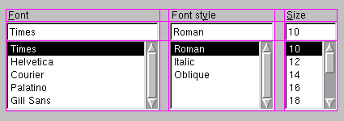

# QGridLayout Class Reference

## [[QtGui](index.htm) module]

该QGridLayout类，勾画出一格的小部件。[More...](#details)

继承[QLayout](qlayout.html)。

### Methods

*   `__init__ (self, QWidget parent)`
*   `__init__ (self)`
*   `addItem (self, QLayoutItem item, int row, int column, int rowSpan = 1, int columnSpan = 1, Qt.Alignment alignment = 0)`
*   `addItem (self, QLayoutItem)`
*   `addLayout (self, QLayout, int row, int column, Qt.Alignment alignment = 0)`
*   `addLayout (self, QLayout, int row, int column, int rowSpan, int columnSpan, Qt.Alignment alignment = 0)`
*   `addWidget (self, QWidget w)`
*   `addWidget (self, QWidget, int row, int column, Qt.Alignment alignment = 0)`
*   `addWidget (self, QWidget, int row, int column, int rowSpan, int columnSpan, Qt.Alignment alignment = 0)`
*   `QRect cellRect (self, int row, int column)`
*   `int columnCount (self)`
*   `int columnMinimumWidth (self, int column)`
*   `int columnStretch (self, int column)`
*   `int count (self)`
*   `Qt.Orientations expandingDirections (self)`
*   `(int row, int column, int rowSpan, int columnSpan) getItemPosition (self, int idx)`
*   `bool hasHeightForWidth (self)`
*   `int heightForWidth (self, int)`
*   `int horizontalSpacing (self)`
*   `invalidate (self)`
*   `QLayoutItem itemAt (self, int)`
*   `QLayoutItem itemAtPosition (self, int row, int column)`
*   `QSize maximumSize (self)`
*   `int minimumHeightForWidth (self, int)`
*   `QSize minimumSize (self)`
*   `Qt.Corner originCorner (self)`
*   `int rowCount (self)`
*   `int rowMinimumHeight (self, int row)`
*   `int rowStretch (self, int row)`
*   `setColumnMinimumWidth (self, int column, int minSize)`
*   `setColumnStretch (self, int column, int stretch)`
*   `setDefaultPositioning (self, int n, Qt.Orientation orient)`
*   `setGeometry (self, QRect)`
*   `setHorizontalSpacing (self, int spacing)`
*   `setOriginCorner (self, Qt.Corner)`
*   `setRowMinimumHeight (self, int row, int minSize)`
*   `setRowStretch (self, int row, int stretch)`
*   `setSpacing (self, int spacing)`
*   `setVerticalSpacing (self, int spacing)`
*   `QSize sizeHint (self)`
*   `int spacing (self)`
*   `QLayoutItem takeAt (self, int)`
*   `int verticalSpacing (self)`

* * *

## Detailed Description

该QGridLayout类，勾画出一格的小部件。

QGridLayout需要提供给它的空间（由其父布局或受[parentWidget](qlayout.html#parentWidget)（ ） ） ，将其划分成的行和列，并把它管理到正确的单元格每个插件。

列和行具有相同的行为，我们将讨论列，但也有同等功能的行。

每一列具有最小宽度和拉伸因子。使用的最小宽度是最大的那组[setColumnMinimumWidth](qgridlayout.html#setColumnMinimumWidth)（）和在该列中的每个窗口部件的最小宽度。拉伸系数设置使用[setColumnStretch](qgridlayout.html#setColumnStretch)（ ），并且确定如何在可用空间的多列将得到超出其必要的最低限度。

通常情况下，每个被管理的小窗口或布局被放入其自己的小区使用[addWidget](qgridlayout.html#addWidget)（ ） 。它也可以用于小窗口使用行和列跨越的重载佔用多个小区[addItem](qgridlayout.html#addItem)（）和[addWidget](qgridlayout.html#addWidget)（ ） 。如果你这样做， QGridLayout将猜测如何分配的大小比列/行（基于拉伸的因素） 。

从布局中删除一个小部件，请致电[removeWidget](qlayout.html#removeWidget)（ ） 。调用[QWidget.hide](qwidget.html#hide)（ ）上的一个小部件也有效地消除了从布局小部件，直到[QWidget.show](qwidget.html#show)（）被调用。

此图显示了五列，三列网格（网格叠加显示在洋红色）对话框的片段：



列0,2和4在该对话框片段是由一个[QLabel](qlabel.html)，一[QLineEdit](qlineedit.html)和[QListBox](index.htm#qlistbox)。列1和3是用由佔位符[setColumnMinimumWidth](qgridlayout.html#setColumnMinimumWidth)（ ） 。第0行包括三个[QLabel](qlabel.html)对象，三排1[QLineEdit](qlineedit.html)对象和三个第2行[QListBox](index.htm#qlistbox)对象。我们使用佔位符列（ 1和3 ），以获得空间适量的列之间。

请注意，列和行是同样的宽或高。如果你想两列具有相同的宽度，必须设置它们的最小宽度和伸展的因素是相同的自己。你就用这[setColumnMinimumWidth](qgridlayout.html#setColumnMinimumWidth)（）和[setColumnStretch](qgridlayout.html#setColumnStretch)（ ） 。

如果QGridLayout不是顶层布局（即不管理的所有部件的面积和儿童） ，您必须将其添加到其父布局，当你创建它，但是你做任何事情与它前。正常的方式来添加一个布局是通过调用[addLayout](qgridlayout.html#addLayout)（ ）在父布局。

一旦你添加你的布局就可以开始把控件以及其他布局到您的网格布局的细胞用[addWidget](qgridlayout.html#addWidget)（ ）[addItem](qgridlayout.html#addItem)（）和[addLayout](qgridlayout.html#addLayout)（ ） 。

QGridLayout还包括两个边宽度：在[contents margin](qlayout.html#getContentsMargins)和[spacing](qgridlayout.html#spacing)（ ） 。内容馀量是沿各QGridLayout的四边的保留空间的宽度。该[spacing](qgridlayout.html#spacing)（）是邻近框之间的自动分配的间隔的宽度。

由提供的默认内容边距值[style](qstyle.html#pixelMetric)。默认值为Qt的样式指定为9的子控件和11窗口。的间隔预设为相同的边宽为顶层布局，或以相同的父布局。

* * *

## Method Documentation

```
QGridLayout.__init__ (self, QWidget parent)
```

该_parent_的说法，如果不是没有，原因_self_通过Qt的，而不是PyQt的拥有。

构造一个新的[QGridLayout](qgridlayout.html)与父部件，_parent_。布局具有一行和一列的最初，并插入新的项目时，也将扩大。

```
QGridLayout.__init__ (self)
```

构造一个新的网格布局。

你必须将这个网格到另一个布局。您可以随时插入控件和布局这个布局，但布局在此之前被插入到另一个布局将不会被执行。

```
QGridLayout.addItem (self, QLayoutItem item, int row, int column, int rowSpan = 1, int columnSpan = 1, Qt.Alignment alignment = 0)
```

该_item_说法有它的所有权转移给Qt的。

添加_item_在位置_row_，_column_，跨越_rowSpan_行和_columnSpan_列，并对齐，根据它_alignment_。如果_rowSpan_和/或_columnSpan_为-1，则该项目将延伸至底部和/或右边缘，分别。布局采用的所有权_item_。

**Warning:**请不要使用此功能来添加子布局或子部件项目。使用[addLayout](qgridlayout.html#addLayout)（）或[addWidget](qgridlayout.html#addWidget)（ ）来代替。

```
QGridLayout.addItem (self, QLayoutItem)
```

该_QLayoutItem_说法有它的所有权转移给Qt的。

从重新实现[QLayout.addItem](qlayout.html#addItem)（ ） 。

```
QGridLayout.addLayout (self, QLayout, int row, int column, Qt.Alignment alignment = 0)
```

该_QLayout_说法有它的所有权转移给Qt的。

地方_layout_在位置（_row_，_column_）在网格中。左上角的坐标为（ 0 ，0）。

该路线是由指定的_alignment_。默认的对齐是0，这意味着该插件充满整个细胞。

非零对准指示该布局不应成长以填充可用空间，而应根据调整大小[sizeHint](qgridlayout.html#sizeHint)（ ） 。

_layout_成为网格布局的一个孩子。

```
QGridLayout.addLayout (self, QLayout, int row, int column, int rowSpan, int columnSpan, Qt.Alignment alignment = 0)
```

该_QLayout_说法有它的所有权转移给Qt的。

这是一个重载函数。

该版本增加了布局_layout_到小区网格，跨越多个行/列。细胞将开始_row_，_column_跨越_rowSpan_行和_columnSpan_列。

If _rowSpan_和/或_columnSpan_是-1，则布局将延伸至底部和/或右边缘，分别。

```
QGridLayout.addWidget (self, QWidget w)
```

该_w_说法有它的所有权转移给Qt的。

将给定_widget_到小区网格在_row_，_column_。左上角的位置为（ 0 ， 0 ）在默认情况下。

该路线是由指定的_alignment_。默认的对齐是0，这意味着该插件充满整个细胞。

```
QGridLayout.addWidget (self, QWidget, int row, int column, Qt.Alignment alignment = 0)
```

该_QWidget_说法有它的所有权转移给Qt的。

这是一个重载函数。

该版本增加了给定的_widget_到小区网格，跨越多个行/列。细胞将开始_fromRow_，_fromColumn_跨越_rowSpan_行和_columnSpan_列。该_widget_将具有给定的_alignment_。

If _rowSpan_和/或_columnSpan_是-1，则部件将延伸至底部和/或右边缘，分别。

```
QGridLayout.addWidget (self, QWidget, int row, int column, int rowSpan, int columnSpan, Qt.Alignment alignment = 0)
```

该_QWidget_说法有它的所有权转移给Qt的。

```
QRect QGridLayout.cellRect (self, int row, int column)
```

[

返回与列的单元格的几何_row_和列_column_在网格中。返回一个无效的矩形，如果_row_ or _column_是网格之外。

](qrect.html)

[**Warning:**Qt中的当前版本此函数不返回有效的结果，直到](qrect.html)[setGeometry](qgridlayout.html#setGeometry)（ ）被调用，即后[parentWidget](qlayout.html#parentWidget)（）是可见的。

```
int QGridLayout.columnCount (self)
```

返回列在该网格的数量。

```
int QGridLayout.columnMinimumWidth (self, int column)
```

返回列间距列_column_。

**See also** [setColumnMinimumWidth](qgridlayout.html#setColumnMinimumWidth)（ ） 。

```
int QGridLayout.columnStretch (self, int column)
```

返回列的拉伸因子_column_。

**See also** [setColumnStretch](qgridlayout.html#setColumnStretch)（ ） 。

```
int QGridLayout.count (self)
```

从重新实现[QLayout.count](qlayout.html#count)（ ） 。

```
Qt.Orientations QGridLayout.expandingDirections (self)
```

[](index.htm)

[从重新实现](index.htm)[QLayoutItem.expandingDirections](qlayoutitem.html#expandingDirections)（ ） 。

```
(int row, int column, int rowSpan, int columnSpan) QGridLayout.getItemPosition (self, int idx)
```

用给定的返回的项的位置信息_index_。

通过为变量_row_和_column_与该项目的布局中的位置，并且更新了_rowSpan_和_columnSpan_变量被更新的项目的垂直和水平跨度。

**See also** [itemAtPosition](qgridlayout.html#itemAtPosition)（）和[itemAt](qgridlayout.html#itemAt)（ ） 。

```
bool QGridLayout.hasHeightForWidth (self)
```

从重新实现[QLayoutItem.hasHeightForWidth](qlayoutitem.html#hasHeightForWidth)（ ） 。

```
int QGridLayout.heightForWidth (self, int)
```

从重新实现[QLayoutItem.heightForWidth](qlayoutitem.html#heightForWidth)（ ） 。

```
int QGridLayout.horizontalSpacing (self)
```

```
QGridLayout.invalidate (self)
```

从重新实现[QLayoutItem.invalidate](qlayoutitem.html#invalidate)（ ） 。

```
QLayoutItem QGridLayout.itemAt (self, int)
```

[](qlayoutitem.html)

[从重新实现](qlayoutitem.html)[QLayout.itemAt](qlayout.html#itemAt)（ ） 。

```
QLayoutItem QGridLayout.itemAtPosition (self, int row, int column)
```

[

返回佔据细胞布局项目（_row_，_column_） ，或者0，如果单元格为空。

此功能被引入Qt的4.4 。

](qlayoutitem.html)

[**See also**](qlayoutitem.html) [getItemPosition](qgridlayout.html#getItemPosition)（）和[indexOf](qlayout.html#indexOf)（ ） 。

```
QSize QGridLayout.maximumSize (self)
```

[](qsize.html)

[从重新实现](qsize.html)[QLayoutItem.maximumSize](qlayoutitem.html#maximumSize)（ ） 。

```
int QGridLayout.minimumHeightForWidth (self, int)
```

从重新实现[QLayoutItem.minimumHeightForWidth](qlayoutitem.html#minimumHeightForWidth)（ ） 。

```
QSize QGridLayout.minimumSize (self)
```

[](qsize.html)

[从重新实现](qsize.html)[QLayoutItem.minimumSize](qlayoutitem.html#minimumSize)（ ） 。

```
Qt.Corner QGridLayout.originCorner (self)
```

[

返回的用于网格的原点的拐角处，即对位置（ 0 ， 0 ） 。

](qt.html#Corner-enum)

[**See also**](qt.html#Corner-enum) [setOriginCorner](qgridlayout.html#setOriginCorner)（ ） 。

```
int QGridLayout.rowCount (self)
```

返回行的该网格的数量。

```
int QGridLayout.rowMinimumHeight (self, int row)
```

返回最小宽度设置为行_row_。

**See also** [setRowMinimumHeight](qgridlayout.html#setRowMinimumHeight)（ ） 。

```
int QGridLayout.rowStretch (self, int row)
```

返回行的拉伸因子_row_。

**See also** [setRowStretch](qgridlayout.html#setRowStretch)（ ） 。

```
QGridLayout.setColumnMinimumWidth (self, int column, int minSize)
```

设置列的最小宽度_column_至_minSize_像素。

**See also** [columnMinimumWidth](qgridlayout.html#columnMinimumWidth)（）和[setRowMinimumHeight](qgridlayout.html#setRowMinimumHeight)（ ） 。

```
QGridLayout.setColumnStretch (self, int column, int stretch)
```

设置列的拉伸因子_column_至_stretch_。第一列是数字0。

拉伸系数是相对于该网格的其他列。列具有更高的拉伸系数取更多的可用空间。

默认拉伸系数为0 。如果拉伸系数为0，在此表中没有其他的列可以生长在所有的列仍然会增长。

另一种方法是使用添加间距[addItem](qgridlayout.html#addItem)（ ）与[QSpacerItem](qspaceritem.html)。

**See also** [columnStretch](qgridlayout.html#columnStretch)（）和[setRowStretch](qgridlayout.html#setRowStretch)（ ） 。

```
QGridLayout.setDefaultPositioning (self, int n, Qt.Orientation orient)
```

```
QGridLayout.setGeometry (self, QRect)
```

从重新实现[QLayoutItem.setGeometry](qlayoutitem.html#setGeometry)（ ） 。

```
QGridLayout.setHorizontalSpacing (self, int spacing)
```

```
QGridLayout.setOriginCorner (self, Qt.Corner)
```

设置网格的原点角落，即位置（ 0 ， 0 ） ，以_corner_。

**See also** [originCorner](qgridlayout.html#originCorner)（ ） 。

```
QGridLayout.setRowMinimumHeight (self, int row, int minSize)
```

设置行的最小高度_row_至_minSize_像素。

**See also** [rowMinimumHeight](qgridlayout.html#rowMinimumHeight)（）和[setColumnMinimumWidth](qgridlayout.html#setColumnMinimumWidth)（ ） 。

```
QGridLayout.setRowStretch (self, int row, int stretch)
```

设置行的拉伸因子_row_至_stretch_。第一行是数字0。

拉伸系数是相对于该网格的其他行。行具有更高的拉伸系数取更多的可用空间。

默认拉伸系数为0 。如果拉伸系数为0，在此表中没有其他行可成长可言，该行仍可能增长。

**See also** [rowStretch](qgridlayout.html#rowStretch)（ ）[setRowMinimumHeight](qgridlayout.html#setRowMinimumHeight)（）和[setColumnStretch](qgridlayout.html#setColumnStretch)（ ） 。

```
QGridLayout.setSpacing (self, int spacing)
```

此功能可设置垂直和水平间距_spacing_。

**See also** [spacing](qgridlayout.html#spacing)（ ）[setVerticalSpacing](qgridlayout.html#verticalSpacing-prop)（）和[setHorizontalSpacing](qgridlayout.html#horizontalSpacing-prop)（ ） 。

```
QGridLayout.setVerticalSpacing (self, int spacing)
```

```
QSize QGridLayout.sizeHint (self)
```

[](qsize.html)

[从重新实现](qsize.html)[QLayoutItem.sizeHint](qlayoutitem.html#sizeHint)（ ） 。

```
int QGridLayout.spacing (self)
```

如果垂直间距相等的水平间距，该函数返回一个值，否则返回-1。

**See also** [setSpacing](qgridlayout.html#setSpacing)（ ）[verticalSpacing](qgridlayout.html#verticalSpacing-prop)（）和[horizontalSpacing](qgridlayout.html#horizontalSpacing-prop)（ ） 。

```
QLayoutItem QGridLayout.takeAt (self, int)
```

[

该_QLayoutItem_结果

](qlayoutitem.html)

[从重新实现](qlayoutitem.html)[QLayout.takeAt](qlayout.html#takeAt)（ ） 。

```
int QGridLayout.verticalSpacing (self)
```