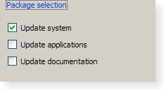
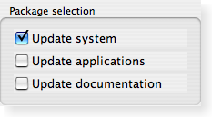
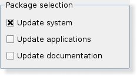

# QGroupBox Class Reference

## [[QtGui](index.htm) module]

该QGroupBox小部件提供一个带标题的分组框框架。[More...](#details)

继承[QWidget](qwidget.html)。

### Methods

*   `__init__ (self, QWidget parent = None)`
*   `__init__ (self, QString title, QWidget parent = None)`
*   `Qt.Alignment alignment (self)`
*   `changeEvent (self, QEvent)`
*   `childEvent (self, QChildEvent)`
*   `bool event (self, QEvent)`
*   `focusInEvent (self, QFocusEvent)`
*   `initStyleOption (self, QStyleOptionGroupBox option)`
*   `bool isCheckable (self)`
*   `bool isChecked (self)`
*   `bool isFlat (self)`
*   `QSize minimumSizeHint (self)`
*   `mouseMoveEvent (self, QMouseEvent event)`
*   `mousePressEvent (self, QMouseEvent event)`
*   `mouseReleaseEvent (self, QMouseEvent event)`
*   `paintEvent (self, QPaintEvent)`
*   `resizeEvent (self, QResizeEvent)`
*   `setAlignment (self, int)`
*   `setCheckable (self, bool b)`
*   `setChecked (self, bool b)`
*   `setFlat (self, bool b)`
*   `setTitle (self, QString)`
*   `QString title (self)`

### Qt Signals

*   `void clicked (bool = 0)`
*   `void toggled (bool)`

* * *

## Detailed Description

该QGroupBox小部件提供一个带标题的分组框框架。

一组框提供了一个框架，一个标题和一个键盘快捷键，并显示其自身内部的各种其他部件。标题是在顶部，键盘快捷键将键盘焦点移至该组框的子控件之一。

QGroupBox也可以让你设置[title](qgroupbox.html#title-prop)（通常是在构造函数中设置）和标题的[alignment](qgroupbox.html#alignment-prop)。组框可以[checkable](qgroupbox.html#checkable-prop)，在可复组框子控件可以启用或禁用依赖于组框是否[checked](qgroupbox.html#checked-prop)。

您可以通过启用最小化组框的空间消耗的[flat](qgroupbox.html#flat-prop)属性。在大多数[styles](qstyle.html)，从而使该属性的结果中去除左侧，框架的右边缘和下边缘的。

QGroupBox不会自动布局的子控件（通常是[QCheckBox](qcheckbox.html)ES或[QRadioButton](qradiobutton.html)s，但可以是任何小部件） 。下面的例子展示了如何建立一个QGroupBox与布局：

```
     QGroupBox *groupBox = new QGroupBox(tr("Exclusive Radio Buttons"));

     [QRadioButton](qradiobutton.html) *radio1 = new [QRadioButton](qradiobutton.html)(tr("&Radio button 1"));
     [QRadioButton](qradiobutton.html) *radio2 = new [QRadioButton](qradiobutton.html)(tr("R&adio button 2"));
     [QRadioButton](qradiobutton.html) *radio3 = new [QRadioButton](qradiobutton.html)(tr("Ra&dio button 3"));

     radio1->setChecked(true);

     [QVBoxLayout](qvboxlayout.html) *vbox = new [QVBoxLayout](qvboxlayout.html);
     vbox->addWidget(radio1);
     vbox->addWidget(radio2);
     vbox->addWidget(radio3);
     vbox->addStretch(1);
     groupBox->setLayout(vbox);

```

|  |  |  |
| A [Windows XP style](index.htm) group box. | A [Macintosh style](index.htm) group box. | A [Plastique style](index.htm) group box. |

* * *

## Method Documentation

```
QGroupBox.__init__ (self, QWidget parent = None)
```

该_parent_的说法，如果不是没有，原因_self_通过Qt的，而不是PyQt的拥有。

构造一个组合框控件与给定_parent_但没有标题。

```
QGroupBox.__init__ (self, QString title, QWidget parent = None)
```

该_parent_的说法，如果不是没有，原因_self_通过Qt的，而不是PyQt的拥有。

构造一个组合框与给定_title_和_parent_。

```
Qt.Alignment QGroupBox.alignment (self)
```

[

```
QGroupBox.changeEvent (self, QEvent)
```

](index.htm)

[从重新实现](index.htm)[QWidget.changeEvent](qwidget.html#changeEvent)（ ） 。

```
QGroupBox.childEvent (self, QChildEvent)
```

从重新实现[QObject.childEvent](qobject.html#childEvent)（ ） 。

```
bool QGroupBox.event (self, QEvent)
```

从重新实现[QObject.event](qobject.html#event)（ ） 。

```
QGroupBox.focusInEvent (self, QFocusEvent)
```

从重新实现[QWidget.focusInEvent](qwidget.html#focusInEvent)（ ） 。

```
QGroupBox.initStyleOption (self, QStyleOptionGroupBox option)
```

初始化_option_与其它的值[QGroupBox](qgroupbox.html)。当他们需要一个这种方法是有用的子类[QStyleOptionGroupBox](qstyleoptiongroupbox.html)，但不希望在所有的信息填写自己。

**See also** [QStyleOption.initFrom](qstyleoption.html#initFrom)（ ） 。

```
bool QGroupBox.isCheckable (self)
```

```
bool QGroupBox.isChecked (self)
```

```
bool QGroupBox.isFlat (self)
```

```
QSize QGroupBox.minimumSizeHint (self)
```

[](qsize.html)

[从重新实现](qsize.html)[QWidget.minimumSizeHint](qwidget.html#minimumSizeHint-prop)（ ） 。

```
QGroupBox.mouseMoveEvent (self, QMouseEvent event)
```

从重新实现[QWidget.mouseMoveEvent](qwidget.html#mouseMoveEvent)（ ） 。

```
QGroupBox.mousePressEvent (self, QMouseEvent event)
```

从重新实现[QWidget.mousePressEvent](qwidget.html#mousePressEvent)（ ） 。

```
QGroupBox.mouseReleaseEvent (self, QMouseEvent event)
```

从重新实现[QWidget.mouseReleaseEvent](qwidget.html#mouseReleaseEvent)（ ） 。

```
QGroupBox.paintEvent (self, QPaintEvent)
```

从重新实现[QWidget.paintEvent](qwidget.html#paintEvent)（ ） 。

```
QGroupBox.resizeEvent (self, QResizeEvent)
```

从重新实现[QWidget.resizeEvent](qwidget.html#resizeEvent)（ ） 。

```
QGroupBox.setAlignment (self, int)
```

```
QGroupBox.setCheckable (self, bool b)
```

```
QGroupBox.setChecked (self, bool b)
```

这种方法也是一个Qt槽与C + +的签名`void setChecked(bool)`。

```
QGroupBox.setFlat (self, bool b)
```

```
QGroupBox.setTitle (self, QString)
```

```
QString QGroupBox.title (self)
```

* * *

## Qt Signal Documentation

```
void clicked (bool = 0)
```

这是该信号的默认超载。

当复选框被激活（即按下然后释放，而鼠标光标在按钮内） ，或当快捷键打字，值得注意的是，该信号是这个信号被发射_not_如果你调用发出[setChecked](qgroupbox.html#checked-prop)（ ） 。

如果复选框被选中_checked_是真的，它是假的，如果未选中此复选框。

这个函数中引入了Qt 4.2中。

**See also** [checkable](qgroupbox.html#checkable-prop)，[toggled](qgroupbox.html#toggled)（）和[checked](qgroupbox.html#checked-prop)。

```
void toggled (bool)
```

这是该信号的默认超载。

如果该组框是可复，此信号时，该复选框被触发发出。_on_是真的，如果该复选框被选中，否则为假。

**See also** [checkable](qgroupbox.html#checkable-prop)。