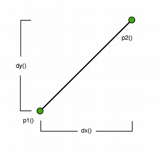
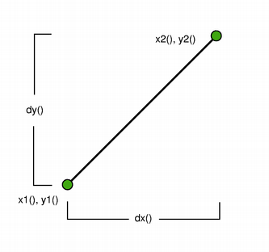
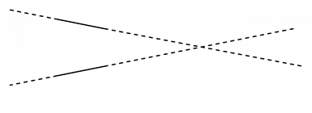
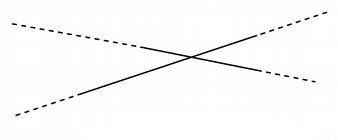
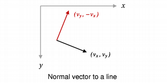

# QLineF Class Reference

## [[QtCore](index.htm) module]

该QLineF类提供了使用浮点精度二维向量。[More...](#details)

### Types

*   `enum IntersectType { NoIntersection, BoundedIntersection, UnboundedIntersection }`

### Methods

*   `__init__ (self, QLine line)`
*   `__init__ (self)`
*   `__init__ (self, QPointF apt1, QPointF apt2)`
*   `__init__ (self, float x1pos, float y1pos, float x2pos, float y2pos)`
*   `__init__ (self, QLineF)`
*   `float angle (self, QLineF l)`
*   `float angle (self)`
*   `float angleTo (self, QLineF l)`
*   `float dx (self)`
*   `float dy (self)`
*   `IntersectType intersect (self, QLineF l, QPointF intersectionPoint)`
*   `bool isNull (self)`
*   `float length (self)`
*   `QLineF normalVector (self)`
*   `QPointF p1 (self)`
*   `QPointF p2 (self)`
*   `QPointF pointAt (self, float t)`
*   `setAngle (self, float angle)`
*   `setLength (self, float len)`
*   `setLine (self, float aX1, float aY1, float aX2, float aY2)`
*   `setP1 (self, QPointF aP1)`
*   `setP2 (self, QPointF aP2)`
*   `setPoints (self, QPointF aP1, QPointF aP2)`
*   `QLine toLine (self)`
*   `translate (self, QPointF point)`
*   `translate (self, float adx, float ady)`
*   `QLineF translated (self, QPointF p)`
*   `QLineF translated (self, float adx, float ady)`
*   `QLineF unitVector (self)`
*   `float x1 (self)`
*   `float x2 (self)`
*   `float y1 (self)`
*   `float y2 (self)`

### Static Methods

*   `QLineF fromPolar (float length, float angle)`

### Special Methods

*   `QLineF __mul__ (self, QMatrix m)`
*   `QLineF __mul__ (self, QTransform m)`
*   `int __bool__ (self)`
*   `bool __eq__ (self, QLineF d)`
*   `bool __ne__ (self, QLineF d)`
*   `str __repr__ (self)`

* * *

## Detailed Description

这个类可以醃制。

该QLineF类提供了使用浮点精度二维向量。

甲QLineF描述了一个二维表面上的有限长度线（或线段） 。 QLineF定义了使用浮点精度坐标的线的起点和终点。使用[toLine](qlinef.html#toLine)（ ）函数来检索此行的一个基于整数副本。

|  |  |

可使用检索到的线的开始点和结束点的位置的[p1](qlinef.html#p1)（ ）[x1](qlinef.html#x1)（ ）[y1](qlinef.html#y1)（ ）[p2](qlinef.html#p2)（ ）[x2](qlinef.html#x2)（）和[y2](qlinef.html#y2)（）函数。该[dx](qlinef.html#dx)（）和[dy](qlinef.html#dy)（）函数返回该行的水平和垂直分量。

该生产线的长度可以通过检索的[length](qlinef.html#length)（）函数，并使用改变了[setLength](qlinef.html#setLength)（）函数。同样，[angle](qlinef.html#angle)（）和[setAngle](qlinef.html#setAngle)（）分别用于检索和改变线的角度。使用[isNull](qlinef.html#isNull)（ ）函数来确定QLineF是否代表一个有效的行或空行。

该[intersect](qlinef.html#intersect)（ ）函数确定[IntersectType](qlinef.html#IntersectType-enum)对于这条线和一个给定的线，而[angle](qlinef.html#angle)（ ）函数返回线之间的夹角。此外，该[unitVector](qlinef.html#unitVector)（）函数返回具有相同的起始点作为该行的线，但是仅为1的长度，而[normalVector](qlinef.html#normalVector)（ ）函数返回一个线垂直于这条线具有相同的起点和长度。

最后，该线可以被转换的给定使用偏移[translate](qlinef.html#translate)（）函数，并且可以使用被遍历的[pointAt](qlinef.html#pointAt)（）函数。

* * *

## Type Documentation

```
QLineF.IntersectType
```

描述两条线之间的交点。

|  |  |
| QLineF.UnboundedIntersection | QLineF.BoundedIntersection |

| Constant | Value | Description |
| --- | --- | --- |
| `QLineF.NoIntersection` | `0` | 表明该线没有相交，也就是说，它们是平行的。 |
| `QLineF.UnboundedIntersection` | `2` | 这两条线相交，但不被它们的长度所定义的范围之内。这将是这种情况，如果线不平行。 |

[intersect](qlinef.html#intersect)（）也将返回该值，如果相交点是唯一的线路之一的开始和结束点内。

| Constant | Value | Description |
| --- | --- | --- |
| `QLineF.BoundedIntersection` | `1` | 两条线彼此相交的每一行的开始和结束点内。 |

**See also** [intersect](qlinef.html#intersect)（ ） 。

* * *

## Method Documentation

```
QLineF.__init__ (self, QLine line)
```

构造一个空行。

```
QLineF.__init__ (self)
```

构造一个线对象，它代表之间的界线_p1_和_p2_。

```
QLineF.__init__ (self, QPointF apt1, QPointF apt2)
```

构造一个线对象，它代表之间（线_x1_，_y1_）和（_x2_，_y2_） 。

```
QLineF.__init__ (self, float x1pos, float y1pos, float x2pos, float y2pos)
```

构建[QLineF](qlinef.html)从给定的基于整数对象_line_。

**See also** [toLine](qlinef.html#toLine)（ ） 。

```
QLineF.__init__ (self, QLineF)
```

```
float QLineF.angle (self, QLineF l)
```

返回该行的以度为单位的角度。

返回值将是值的范围从0.0 ，但不包括360.0 。该角度逆时针从在x轴上的点处测量到的原点（X\u003e 0）的权利。

此功能被引入Qt的4.4 。

**See also** [setAngle](qlinef.html#setAngle)（ ） 。

```
float QLineF.angle (self)
```

```
float QLineF.angleTo (self, QLineF l)
```

从该行返回的角度（正度）为给定的_line_，取线的方向考虑在内。如果该行不其范围内相交，这是交叉处的延长线在作为原点的点（见[QLineF.UnboundedIntersection](qlinef.html#IntersectType-enum)） 。

返回的值表示的程度，你需要添加到该行，使其具有相同的角度给出的数字_line_，逆时针旋转下去。

此功能被引入Qt的4.4 。

**See also** [intersect](qlinef.html#intersect)（ ） 。

```
float QLineF.dx (self)
```

返回该行的矢量的水平分量。返回值是，如果正[x2](qlinef.html#x2)（）\u003e =[x1](qlinef.html#x1)（）和负如果[x2](qlinef.html#x2)（）\u003c[x1](qlinef.html#x1)（ ） 。

**See also** [dy](qlinef.html#dy)（）和[pointAt](qlinef.html#pointAt)（ ） 。

```
float QLineF.dy (self)
```

返回该行的矢量的垂直分量。返回值是，如果正[y2](qlinef.html#y2)（）\u003e =[y1](qlinef.html#y1)（）和负如果[y2](qlinef.html#y2)（）\u003c[y1](qlinef.html#y1)（ ） 。

**See also** [dx](qlinef.html#dx)（）和[pointAt](qlinef.html#pointAt)（ ） 。

```
QLineF QLineF.fromPolar (float length, float angle)
```

[](qlinef.html)

[返回](qlinef.html)[QLineF](qlinef.html)用给定的_length_和_angle_。

行的第一点将在原点。

用于角度的正值逆时针意思而负值意味着顺时针方向。零度是在3点钟的位置。

此功能被引入Qt的4.4 。

```
IntersectType QLineF.intersect (self, QLineF l, QPointF intersectionPoint)
```

[

返回一个值，指示是否_this_用给定的线相交_line_。

实际的交点提取到_intersectionPoint_（如果指针是有效的） 。如果该线是平行的，交叉点是未定义的。

```
bool QLineF.isNull (self)
```

返回True如果该行没有设置与有效的起始和结束点，否则返回False 。

```
float QLineF.length (self)
```

返回该行的长度。

](qlinef.html#IntersectType-enum)

[**See also**](qlinef.html#IntersectType-enum) [setLength](qlinef.html#setLength)（ ） 。

```
QLineF QLineF.normalVector (self)
```

[

返回线的垂直于该线具有相同的起点和长度。



](qlinef.html)

[**See also**](qlinef.html) [unitVector](qlinef.html#unitVector)（ ） 。

```
QPointF QLineF.p1 (self)
```

[

返回该行的起点。

](qpointf.html)

[**See also**](qpointf.html) [setP1](qlinef.html#setP1)（ ）[x1](qlinef.html#x1)（ ）[y1](qlinef.html#y1)（）和[p2](qlinef.html#p2)（ ） 。

```
QPointF QLineF.p2 (self)
```

[

返回该行的终点。

](qpointf.html)

[**See also**](qpointf.html) [setP2](qlinef.html#setP2)（ ）[x2](qlinef.html#x2)（ ）[y2](qlinef.html#y2)（）和[p1](qlinef.html#p1)（ ） 。

```
QPointF QLineF.pointAt (self, float t)
```

[

返回点在由指定的参数位置_t_。该函数返回该行的起点，如果T = 0 ，它的终点，如果T = 1 。

](qpointf.html)

[**See also**](qpointf.html) [dx](qlinef.html#dx)（）和[dy](qlinef.html#dy)（ ） 。

```
QLineF.setAngle (self, float angle)
```

设置直线的角度为给定的_angle_（单位：度） 。这将改变线路，使得所述线具有给定角度的第二点的位置。

用于角度的正值逆时针意思而负值意味着顺时针方向。零度是在3点钟的位置。

此功能被引入Qt的4.4 。

**See also** [angle](qlinef.html#angle)（ ） 。

```
QLineF.setLength (self, float len)
```

设置为给定的行的长度_length_。[QLineF](qlinef.html)会移动的终点 - [p2](qlinef.html#p2)该行给予该行的新长度 - （ ） 。如果给定的_length_是负的[angle](qlinef.html#angle)（）也被改变。

如果该行是一个空行，其长度将保持零无论指定的长度。

**See also** [length](qlinef.html#length)（）和[isNull](qlinef.html#isNull)（ ） 。

```
QLineF.setLine (self, float aX1, float aY1, float aX2, float aY2)
```

设置此行到开始_x1_，_y1_并在结束_x2_，_y2_。

此功能被引入Qt的4.4 。

**See also** [setP1](qlinef.html#setP1)（ ）[setP2](qlinef.html#setP2)（ ）[p1](qlinef.html#p1)（）和[p2](qlinef.html#p2)（ ） 。

```
QLineF.setP1 (self, QPointF aP1)
```

设置此行的起点，以_p1_。

此功能被引入Qt的4.4 。

**See also** [setP2](qlinef.html#setP2)（）和[p1](qlinef.html#p1)（ ） 。

```
QLineF.setP2 (self, QPointF aP2)
```

设置此行的终点_p2_。

此功能被引入Qt的4.4 。

**See also** [setP1](qlinef.html#setP1)（）和[p2](qlinef.html#p2)（ ） 。

```
QLineF.setPoints (self, QPointF aP1, QPointF aP2)
```

设置此行的起点_p1_并且这条线的终点_p2_。

此功能被引入Qt的4.4 。

**See also** [setP1](qlinef.html#setP1)（ ）[setP2](qlinef.html#setP2)（ ）[p1](qlinef.html#p1)（）和[p2](qlinef.html#p2)（ ） 。

```
QLine QLineF.toLine (self)
```

[

返回此行的一个基于整数副本。

注意，返回的行的起点和终点均四舍五入到最接近的整数。

](qline.html)

[**See also**](qline.html) [QLineF](qlinef.html#QLineF)（ ） 。

```
QLineF.translate (self, QPointF point)
```

由给定的转换这一行_offset_。

```
QLineF.translate (self, float adx, float ady)
```

这是一个重载函数。

翻译这行指定的距离_dx_和_dy_。

```
QLineF QLineF.translated (self, QPointF p)
```

[

返回此行翻译由给定_offset_。

此功能被引入Qt的4.4 。

](qlinef.html)

```
QLineF QLineF.translated (self, float adx, float ady)
```

[

这是一个重载函数。

返回此行翻译指定的距离_dx_和_dy_。

此功能被引入Qt的4.4 。

](qlinef.html)

```
QLineF QLineF.unitVector (self)
```

[

返回在同一点开始作为单位矢量为这条线，即线_this_用1.0的长度一致。

](qlinef.html)

[**See also**](qlinef.html) [normalVector](qlinef.html#normalVector)（ ） 。

```
float QLineF.x1 (self)
```

返回该行的起始点的X坐标。

**See also** [p1](qlinef.html#p1)（ ） 。

```
float QLineF.x2 (self)
```

返回该行的结束点的x坐标。

**See also** [p2](qlinef.html#p2)（ ） 。

```
float QLineF.y1 (self)
```

返回该行的起点的y坐标。

**See also** [p1](qlinef.html#p1)（ ） 。

```
float QLineF.y2 (self)
```

返回该行的结束点的Y坐标。

**See also** [p2](qlinef.html#p2)（ ） 。

```
QLineF __mul__ (self, QMatrix m)
```

[

如果QtGui模块导入此方法仅适用。

](qlinef.html)

```
QLineF __mul__ (self, QTransform m)
```

[

如果QtGui模块导入此方法仅适用。

```
int QLineF.__bool__ (self)
```

```
bool QLineF.__eq__ (self, QLineF d)
```

```
bool QLineF.__ne__ (self, QLineF d)
```

```
str QLineF.__repr__ (self)
```

](qlinef.html)