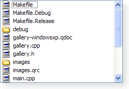
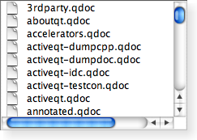
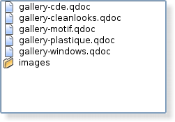

# QListWidget Class Reference

## [[QtGui](index.htm) module]

该QListWidget类提供了一个基于项目的列表控件。[More...](#details)

继承[QListView](qlistview.html)。

### Methods

*   `__init__ (self, QWidget parent = None)`
*   `addItem (self, QListWidgetItem aitem)`
*   `addItem (self, QString label)`
*   `addItems (self, QStringList labels)`
*   `clear (self)`
*   `closePersistentEditor (self, QListWidgetItem item)`
*   `int count (self)`
*   `QListWidgetItem currentItem (self)`
*   `int currentRow (self)`
*   `dropEvent (self, QDropEvent event)`
*   `bool dropMimeData (self, int index, QMimeData data, Qt.DropAction action)`
*   `editItem (self, QListWidgetItem item)`
*   `bool event (self, QEvent e)`
*   `list-of-QListWidgetItem findItems (self, QString text, Qt.MatchFlags flags)`
*   `QModelIndex indexFromItem (self, QListWidgetItem item)`
*   `insertItem (self, int row, QListWidgetItem item)`
*   `insertItem (self, int row, QString label)`
*   `insertItems (self, int row, QStringList labels)`
*   `bool isItemHidden (self, QListWidgetItem item)`
*   `bool isItemSelected (self, QListWidgetItem item)`
*   `bool isSortingEnabled (self)`
*   `QListWidgetItem item (self, int row)`
*   `QListWidgetItem itemAt (self, QPoint p)`
*   `QListWidgetItem itemAt (self, int ax, int ay)`
*   `QListWidgetItem itemFromIndex (self, QModelIndex index)`
*   `list-of-QListWidgetItem items (self, QMimeData data)`
*   `QWidget itemWidget (self, QListWidgetItem item)`
*   `QMimeData mimeData (self, list-of-QListWidgetItem items)`
*   `QStringList mimeTypes (self)`
*   `openPersistentEditor (self, QListWidgetItem item)`
*   `removeItemWidget (self, QListWidgetItem aItem)`
*   `int row (self, QListWidgetItem item)`
*   `scrollToItem (self, QListWidgetItem item, QAbstractItemView.ScrollHint hint = QAbstractItemView.EnsureVisible)`
*   `list-of-QListWidgetItem selectedItems (self)`
*   `setCurrentItem (self, QListWidgetItem item)`
*   `setCurrentItem (self, QListWidgetItem item, QItemSelectionModel.SelectionFlags command)`
*   `setCurrentRow (self, int row)`
*   `setCurrentRow (self, int row, QItemSelectionModel.SelectionFlags command)`
*   `setItemHidden (self, QListWidgetItem item, bool hide)`
*   `setItemSelected (self, QListWidgetItem item, bool select)`
*   `setItemWidget (self, QListWidgetItem item, QWidget widget)`
*   `setSortingEnabled (self, bool enable)`
*   `sortItems (self, Qt.SortOrder order = Qt.AscendingOrder)`
*   `Qt.DropActions supportedDropActions (self)`
*   `QListWidgetItem takeItem (self, int row)`
*   `QRect visualItemRect (self, QListWidgetItem item)`

### Special Methods

*   `__len__ (self)`

### Qt Signals

*   `void currentItemChanged (QListWidgetItem *,QListWidgetItem *)`
*   `void currentRowChanged (int)`
*   `void currentTextChanged (const QString&)`
*   `void itemActivated (QListWidgetItem *)`
*   `void itemChanged (QListWidgetItem *)`
*   `void itemClicked (QListWidgetItem *)`
*   `void itemDoubleClicked (QListWidgetItem *)`
*   `void itemEntered (QListWidgetItem *)`
*   `void itemPressed (QListWidgetItem *)`
*   `void itemSelectionChanged ()`

* * *

## Detailed Description

该QListWidget类提供了一个基于项目的列表控件。

QListWidget是一个方便的类，它提供了类似于通过提供的一个列表视图[QListView](qlistview.html)，但采用了经典的基于项目的接口，用于添加和删除项目。 QListWidget使用内部模型来管理每个[QListWidgetItem](qlistwidgetitem.html)在列表中。

对于一个更加灵活的列表视图控件，使用[QListView](qlistview.html)类与标准模型。

列表部件构造以同样的方式为其他部件：

```
     QListWidget *listWidget = new QListWidget(this);

```

该[selectionMode](qabstractitemview.html#selectionMode-prop)列表窗口小部件（）确定多少的列表中的项目可以在同一时间被选择，并确定是否可以创建项的复选。这可以通过设置[setSelectionMode](qabstractitemview.html#selectionMode-prop)（）函数。

有两种方法将项目添加到列表中：他们可以用列表控件作为它们的父窗口部件来构建，也可以没有父窗口部件的构造和添加到列表中后。如果列表插件已经存在时，这些项构成，第一种方法更易于使用：

```
     new [QListWidgetItem](qlistwidgetitem.html)(tr("Oak"), listWidget);
     new [QListWidgetItem](qlistwidgetitem.html)(tr("Fir"), listWidget);
     new [QListWidgetItem](qlistwidgetitem.html)(tr("Pine"), listWidget);

```

如果你需要插入一个新的项目到列表中的一个特定位置，那么它应该是没有父部件构成。该[insertItem](qlistwidget.html#insertItem)（）函数应该被用来将其放置在列表中。列表控件将项目的所有权。

```
     [QListWidgetItem](qlistwidgetitem.html) *newItem = new [QListWidgetItem](qlistwidgetitem.html);
     newItem->setText(itemText);
     listWidget->insertItem(row, newItem);

```

为多个项目，[insertItems](qlistwidget.html#insertItems)（）可以被代替使用。在列表中的项数被发现与[count](qlistwidget.html#count-prop)（）函数。若要从列表中删除项目，请使用[takeItem](qlistwidget.html#takeItem)（ ） 。

在列表中的当前项目可以与发现[currentItem](qlistwidget.html#currentItem)（ ） ，并改变了[setCurrentItem](qlistwidget.html#setCurrentItem)（ ） 。用户还可以通过用一个不同的项目的键盘或点击导航更改当前资料。当目前的项目发生变化，[currentItemChanged](qlistwidget.html#currentItemChanged)（ ）信号被发射的新的当前项目，这是以前的电流的项目。

|  |  |  |
| A [Windows XP style](index.htm) list widget. | A [Macintosh style](index.htm) list widget. | A [Plastique style](index.htm) list widget. |

* * *

## Method Documentation

```
QListWidget.__init__ (self, QWidget parent = None)
```

该_parent_的说法，如果不是没有，原因_self_通过Qt的，而不是PyQt的拥有。

构造一个空[QListWidget](qlistwidget.html)用给定的_parent_。

```
QListWidget.addItem (self, QListWidgetItem aitem)
```

该_aitem_说法有它的所有权转移给Qt的。

插入的文本的项_label_在列表窗口小部件的末端。

```
QListWidget.addItem (self, QString label)
```

插入_item_在列表窗口小部件的末端。

**Warning:** A [QListWidgetItem](qlistwidgetitem.html)只能添加到一个[QListWidget](qlistwidget.html)一次。添加相同[QListWidgetItem](qlistwidgetitem.html)多次给[QListWidget](qlistwidget.html)将导致不确定的行为。

**See also** [insertItem](qlistwidget.html#insertItem)（ ） 。

```
QListWidget.addItems (self, QStringList labels)
```

插入项目与文本_labels_在列表窗口小部件的末端。

**See also** [insertItems](qlistwidget.html#insertItems)（ ） 。

```
QListWidget.clear (self)
```

这种方法也是一个Qt槽与C + +的签名`void clear()`。

删除所有项，并选择在视图中。

**Warning:**所有项目将被永久删除。

```
QListWidget.closePersistentEditor (self, QListWidgetItem item)
```

关闭持久编辑器给定_item_。

**See also** [openPersistentEditor](qlistwidget.html#openPersistentEditor)（ ） 。

```
int QListWidget.count (self)
```

```
QListWidgetItem QListWidget.currentItem (self)
```

[

返回当前项目。

](qlistwidgetitem.html)

[**See also**](qlistwidgetitem.html) [setCurrentItem](qlistwidget.html#setCurrentItem)（ ） 。

```
int QListWidget.currentRow (self)
```

```
QListWidget.dropEvent (self, QDropEvent event)
```

从重新实现[QWidget.dropEvent](qwidget.html#dropEvent)（ ） 。

```
bool QListWidget.dropMimeData (self, int index, QMimeData data, Qt.DropAction action)
```

把手_data_由外部拖放操作，与给定的供给结束_action_在给定的_index_。返回True如果_data_和_action_可以通过模型来处理，否则返回False 。

**See also** [supportedDropActions](qlistwidget.html#supportedDropActions)（ ） 。

```
QListWidget.editItem (self, QListWidgetItem item)
```

开始编辑_item_如果是可编辑的。

```
bool QListWidget.event (self, QEvent e)
```

从重新实现[QObject.event](qobject.html#event)（ ） 。

```
list-of-QListWidgetItem QListWidget.findItems (self, QString text, Qt.MatchFlags flags)
```

查找与该字符串匹配的文本项_text_使用给定的_flags_。

```
QModelIndex QListWidget.indexFromItem (self, QListWidgetItem item)
```

[](qmodelindex.html)

[返回](qmodelindex.html)[QModelIndex](qmodelindex.html)assocated用给定的_item_。

```
QListWidget.insertItem (self, int row, QListWidgetItem item)
```

该_item_说法有它的所有权转移给Qt的。

插入_item_在由给定的列表中的位置_row_。

**See also** [addItem](qlistwidget.html#addItem)（ ） 。

```
QListWidget.insertItem (self, int row, QString label)
```

插入的文本的项_label_在列表控件由给定的位置_row_。

**See also** [addItem](qlistwidget.html#addItem)（ ） 。

```
QListWidget.insertItems (self, int row, QStringList labels)
```

从列表中插入件_labels_入列表中，开始于指定的_row_。

**See also** [insertItem](qlistwidget.html#insertItem)（）和[addItem](qlistwidget.html#addItem)（ ） 。

```
bool QListWidget.isItemHidden (self, QListWidgetItem item)
```

```
bool QListWidget.isItemSelected (self, QListWidgetItem item)
```

```
bool QListWidget.isSortingEnabled (self)
```

```
QListWidgetItem QListWidget.item (self, int row)
```

[

返回佔用给定的项目_row_在列表中，如果已设置，否则返回0 。

](qlistwidgetitem.html)

[**See also**](qlistwidgetitem.html) [row](qlistwidget.html#row)（ ） 。

```
QListWidgetItem QListWidget.itemAt (self, QPoint p)
```

[](qlistwidgetitem.html)

[返回一个指针，指向了该项目的坐标_p_。该坐标是相对于列表控件的](qlistwidgetitem.html)[viewport()](qabstractscrollarea.html#viewport)。

```
QListWidgetItem QListWidget.itemAt (self, int ax, int ay)
```

[

这是一个重载函数。

](qlistwidgetitem.html)

[返回一个指向该项目在坐标（_x_，_y_） 。该坐标是相对于列表控件的](qlistwidgetitem.html)[viewport()](qabstractscrollarea.html#viewport)。

```
QListWidgetItem QListWidget.itemFromIndex (self, QModelIndex index)
```

[](qlistwidgetitem.html)

[返回一个指针](qlistwidgetitem.html)[QListWidgetItem](qlistwidgetitem.html)assocated用给定的_index_。

```
list-of-QListWidgetItem QListWidget.items (self, QMimeData data)
```

返回指针的列表，包含在该项目_data_对象。如果对象不是由创建[QListWidget](qlistwidget.html)在同一过程中，该列表是空的。

```
QWidget QListWidget.itemWidget (self, QListWidgetItem item)
```

[

返回在给定显示的窗口小部件_item_。

这个函数是Qt 4.1中引入。

](qwidget.html)

[**See also**](qwidget.html) [setItemWidget](qlistwidget.html#setItemWidget)（ ） 。

```
QMimeData QListWidget.mimeData (self, list-of-QListWidgetItem items)
```

[

该_QMimeData_结果

](qmimedata.html)

[返回一个对象，该对象包含指定的序列化描述_items_。用于描述的项目的格式是从所获得的](qmimedata.html)[mimeTypes](qlistwidget.html#mimeTypes)（）函数。

如果项目列表为空，则返回一个序列化的空列表0代替。

```
QStringList QListWidget.mimeTypes (self)
```

返回可用于描述listwidget项目清单的MIME类型的列表。

**See also** [mimeData](qlistwidget.html#mimeData)（ ） 。

```
QListWidget.openPersistentEditor (self, QListWidgetItem item)
```

打开一个编辑器为给定的_item_。该编辑器编辑后仍保持打开状态。

**See also** [closePersistentEditor](qlistwidget.html#closePersistentEditor)（ ） 。

```
QListWidget.removeItemWidget (self, QListWidgetItem aItem)
```

删除给定的窗口小部件设置_item_。

此功能被引入Qt的4.3 。

```
int QListWidget.row (self, QListWidgetItem item)
```

返回包含给定的行_item_。

**See also** [item](qlistwidget.html#item)（ ） 。

```
QListWidget.scrollToItem (self, QListWidgetItem item, QAbstractItemView.ScrollHint hint = QAbstractItemView.EnsureVisible)
```

这种方法也是一个Qt槽与C + +的签名`void scrollToItem(const QListWidgetItem *,QAbstractItemView::ScrollHint = QAbstractItemView.EnsureVisible)`。

滚动的视图，如果必要，以确保_item_是可见的。

_hint_指定了_item_应设在手术后。

```
list-of-QListWidgetItem QListWidget.selectedItems (self)
```

返回列表控件所有选定项的列表。

```
QListWidget.setCurrentItem (self, QListWidgetItem item)
```

设置当前项目_item_。

除非选择模式为[NoSelection](qabstractitemview.html#SelectionMode-enum)时，该项目也被选中。

**See also** [currentItem](qlistwidget.html#currentItem)（ ） 。

```
QListWidget.setCurrentItem (self, QListWidgetItem item, QItemSelectionModel.SelectionFlags command)
```

当前项设置为_item_，使用给定的_command_。

此功能被引入Qt的4.4 。

```
QListWidget.setCurrentRow (self, int row)
```

```
QListWidget.setCurrentRow (self, int row, QItemSelectionModel.SelectionFlags command)
```

```
QListWidget.setItemHidden (self, QListWidgetItem item, bool hide)
```

```
QListWidget.setItemSelected (self, QListWidgetItem item, bool select)
```

```
QListWidget.setItemWidget (self, QListWidgetItem item, QWidget widget)
```

该_widget_说法有它的所有权转移给Qt的。

设置_widget_要显示在该给予_item_。

此功能只能用于显示在一个列表控件选项的位置静态内容。如果你想显示自定义的动态内容或实现自定义编辑器部件，使用[QListView](qlistview.html)和子类[QItemDelegate](qitemdelegate.html)代替。

这个函数是Qt 4.1中引入。

**See also** [itemWidget](qlistwidget.html#itemWidget)（）和[Delegate Classes](index.htm#delegate-classes)。

```
QListWidget.setSortingEnabled (self, bool enable)
```

```
QListWidget.sortItems (self, Qt.SortOrder order = Qt.AscendingOrder)
```

根据指定的列表中的各种插件中的所有项目_order_。

```
Qt.DropActions QListWidget.supportedDropActions (self)
```

[

返回此视图支持的放置动作。

](index.htm)

[**See also**](index.htm) [Qt.DropActions](qt.html#DropAction-enum)。

```
QListWidgetItem QListWidget.takeItem (self, int row)
```

[

该_QListWidgetItem_结果

移除并从给定的返回项_row_在列表控件，否则返回0 。

项目从一个列表控件中删除不会被Qt进行管理，并需要手动删除。

](qlistwidgetitem.html)

[**See also**](qlistwidgetitem.html) [insertItem](qlistwidget.html#insertItem)（）和[addItem](qlistwidget.html#addItem)（ ） 。

```
QRect QListWidget.visualItemRect (self, QListWidgetItem item)
```

[

返回矩形上通过了该项目所佔用的视_item_。

```
 QListWidget.__len__ (self)
```

* * *

## Qt Signal Documentation

```
void currentItemChanged (QListWidgetItem *,QListWidgetItem *)
```

这是该信号的默认超载。

这个信号被发射时的当前项的变化。

_previous_是，以前有焦点的项目;_current_是新的当前项。

```
void currentRowChanged (int)
```

这是该信号的默认超载。

这个信号被发射时的当前项的变化。

_currentRow_是当前项目的行。如果不存在当前项目时_currentRow_是-1。

```
void currentTextChanged (const QString&)
```

这是该信号的默认超载。

这个信号被发射时的当前项的变化。

_currentText_在当前项目中的文字资料。如果不存在当前项目时_currentText_是无效的。

```
void itemActivated (QListWidgetItem *)
```

这是该信号的默认超载。

这个信号被发射时的_item_被激活。该_item_被激活时，用户单击或双击就可以了，具体取决于系统的配置。当用户按下启动键（在Windows和X11这是它也被激活了**Return**键，在Mac OS X是**Ctrl+0**） 。

```
void itemChanged (QListWidgetItem *)
```

这是该信号的默认超载。

这个信号被发射时的数据_item_已经改变。

```
void itemClicked (QListWidgetItem *)
```

这是该信号的默认超载。

这个信号被发射与指定_item_单击当鼠标按钮上的某个项目中的部件。

](qrect.html)

[**See also**](qrect.html) [itemPressed](qlistwidget.html#itemPressed)（）和[itemDoubleClicked](qlistwidget.html#itemDoubleClicked)（ ） 。

```
void itemDoubleClicked (QListWidgetItem *)
```

这是该信号的默认超载。

这个信号被发射与指定_item_当鼠标按钮被双击时的某个项目中的部件。

**See also** [itemClicked](qlistwidget.html#itemClicked)（）和[itemPressed](qlistwidget.html#itemPressed)（ ） 。

```
void itemEntered (QListWidgetItem *)
```

这是该信号的默认超载。

当鼠标光标进入一个项目，这个信号被发射。该_item_在该项目进入。这个信号只发射时[mouseTracking](qwidget.html#mouseTracking-prop)被接通时，或者当在移动到一个产品上，按下鼠标按钮。

**See also** [QWidget.setMouseTracking](qwidget.html#mouseTracking-prop)（ ） 。

```
void itemPressed (QListWidgetItem *)
```

这是该信号的默认超载。

这个信号被发射与指定_item_当鼠标按钮在微件压在项目上。

**See also** [itemClicked](qlistwidget.html#itemClicked)（）和[itemDoubleClicked](qlistwidget.html#itemDoubleClicked)（ ） 。

```
void itemSelectionChanged ()
```

这是该信号的默认超载。

这个信号被发射时的选择改变。

**See also** [selectedItems](qlistwidget.html#selectedItems)（ ）[QListWidgetItem.isSelected](qlistwidgetitem.html#isSelected)（）和[currentItemChanged](qlistwidget.html#currentItemChanged)（ ） 。