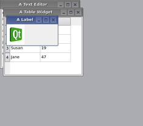
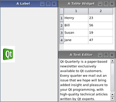

# QMdiArea Class Reference

## [[QtGui](index.htm) module]

该QMdiArea小部件提供在MDI窗口的显示区域。[More...](#details)

继承[QAbstractScrollArea](qabstractscrollarea.html)。

### Types

*   `enum AreaOption { DontMaximizeSubWindowOnActivation }`
*   `class **[AreaOptions](index.htm)**`
*   `enum ViewMode { SubWindowView, TabbedView }`
*   `enum WindowOrder { CreationOrder, StackingOrder, ActivationHistoryOrder }`

### Methods

*   `__init__ (self, QWidget parent = None)`
*   `activateNextSubWindow (self)`
*   `activatePreviousSubWindow (self)`
*   `WindowOrder activationOrder (self)`
*   `QMdiSubWindow activeSubWindow (self)`
*   `QMdiSubWindow addSubWindow (self, QWidget widget, Qt.WindowFlags flags = 0)`
*   `QBrush background (self)`
*   `cascadeSubWindows (self)`
*   `childEvent (self, QChildEvent childEvent)`
*   `closeActiveSubWindow (self)`
*   `closeAllSubWindows (self)`
*   `QMdiSubWindow currentSubWindow (self)`
*   `bool documentMode (self)`
*   `bool event (self, QEvent event)`
*   `bool eventFilter (self, QObject object, QEvent event)`
*   `QSize minimumSizeHint (self)`
*   `paintEvent (self, QPaintEvent paintEvent)`
*   `removeSubWindow (self, QWidget widget)`
*   `resizeEvent (self, QResizeEvent resizeEvent)`
*   `scrollContentsBy (self, int dx, int dy)`
*   `setActivationOrder (self, WindowOrder order)`
*   `setActiveSubWindow (self, QMdiSubWindow window)`
*   `setBackground (self, QBrush background)`
*   `setDocumentMode (self, bool enabled)`
*   `setOption (self, AreaOption option, bool on = True)`
*   `setTabPosition (self, QTabWidget.TabPosition position)`
*   `setTabsClosable (self, bool closable)`
*   `setTabShape (self, QTabWidget.TabShape shape)`
*   `setTabsMovable (self, bool movable)`
*   `setupViewport (self, QWidget viewport)`
*   `setViewMode (self, ViewMode mode)`
*   `showEvent (self, QShowEvent showEvent)`
*   `QSize sizeHint (self)`
*   `list-of-QMdiSubWindow subWindowList (self, WindowOrder order = QMdiArea.CreationOrder)`
*   `QTabWidget.TabPosition tabPosition (self)`
*   `bool tabsClosable (self)`
*   `QTabWidget.TabShape tabShape (self)`
*   `bool tabsMovable (self)`
*   `bool testOption (self, AreaOption opton)`
*   `tileSubWindows (self)`
*   `timerEvent (self, QTimerEvent timerEvent)`
*   `ViewMode viewMode (self)`
*   `bool viewportEvent (self, QEvent event)`

### Qt Signals

*   `void subWindowActivated (QMdiSubWindow *)`

* * *

## Detailed Description

该QMdiArea小部件提供在MDI窗口的显示区域。

QMdiArea功能，本质上，就像一个窗口管理器的MDI窗口。例如，它绘制它管理自身并安排他们在一个层叠或平铺图案的窗户。 QMdiArea是常用的在一个中心部件[QMainWindow](qmainwindow.html)创建MDI应用程序，但也可以放置在任何布局。下面的代码将一个区域的主窗口：

```
     [QMainWindow](qmainwindow.html) *mainWindow = new [QMainWindow](qmainwindow.html);
     mainWindow->setCentralWidget(mdiArea);

```

不同的是窗口管理器的顶层窗口，所有窗口的标志（[Qt.WindowFlags](qt.html#WindowType-enum)）通过QMdiArea只要标志由当前插件式支承。如果一个特定的标记是不支持的样式（例如，[WindowShadeButtonHint](qt.html#WindowType-enum)） ，你仍然可以遮阳的窗口showShaded （ ） 。

在QMdiArea子窗口的实例[QMdiSubWindow](qmdisubwindow.html)。它们被添加到一个MDI面积[addSubWindow](qmdiarea.html#addSubWindow)（ ） 。这是常见的传递[QWidget](qwidget.html)，它被设置为内部部件，该函数，但也有可能通过一个[QMdiSubWindow](qmdisubwindow.html)directly.The类继承[QWidget](qwidget.html)和编程时，你可以使用相同的API作为一个正常的顶层窗口。[QMdiSubWindow](qmdisubwindow.html)也有行为特定于MDI窗口。请参阅[QMdiSubWindow](qmdisubwindow.html)类的描述更多的细节。

当它获取键盘焦点时，或者当子窗口被激活[setFocus](qwidget.html#setFocus)（）被调用。用户通过在通常的方式移动焦点激活一个窗口。在MDI领域放出[subWindowActivated](qmdiarea.html#subWindowActivated)（ ）信号，当活动窗口的变化，以及[activeSubWindow](qmdiarea.html#activeSubWindow)（ ）函数返回活动子窗口。

便利的功能[subWindowList](qmdiarea.html#subWindowList)（ ）返回所有子窗口的列表。此信息可以在含有窗口的列表的弹出式菜单中使用，例如。

该子窗口是由当前分类[WindowOrder](qmdiarea.html#WindowOrder-enum)。这是用于[subWindowList](qmdiarea.html#subWindowList)（ ）和[activateNextSubWindow](qmdiarea.html#activateNextSubWindow)（）和acivatePreviousSubWindow （） 。此外，它与层叠或平铺的窗口时使用[cascadeSubWindows](qmdiarea.html#cascadeSubWindows)（）和[tileSubWindows](qmdiarea.html#tileSubWindows)（ ） 。

QMdiArea为子窗口有两个内置的布局策略：[cascadeSubWindows](qmdiarea.html#cascadeSubWindows)（）和[tileSubWindows](qmdiarea.html#tileSubWindows)（ ） 。两者都是插槽，很容易连接到菜单项。

|  |  |

**Note:**默认的滚动条属性QMdiArea是[Qt.ScrollBarAlwaysOff](qt.html#ScrollBarPolicy-enum)。

* * *

## Type Documentation

```
QMdiArea.AreaOption
```

这个枚举变量描述了自定义的行为的选项[QMdiArea](qmdiarea.html)。

| Constant | Value | Description |
| --- | --- | --- |
| `QMdiArea.DontMaximizeSubWindowOnActivation` | `0x1` | 当活动的子窗口最大化时，默认的行为是最大限度的被激活的下一个子窗口。如果你不希望出现此行为，设置这个选项。 |

该AreaOptions类型是一个typedef为[QFlags](index.htm)\u003cAreaOption\u003e 。它存储AreaOption值的或组合。

```
QMdiArea.ViewMode
```

这个枚举变量描述了区域的视图模式，即如何子窗口将被显示。

| Constant | Value | Description |
| --- | --- | --- |
| `QMdiArea.SubWindowView` | `0` | 显示子窗口与窗框（默认） 。 |
| `QMdiArea.TabbedView` | `1` | 显示子窗口与标籤在标籤栏。 |

这个枚举被引入或修改的Qt 4.4 。

**See also** [setViewMode](qmdiarea.html#viewMode-prop)（ ） 。

```
QMdiArea.WindowOrder
```

指定的标准来使用订购的通过返回的子窗口列表[subWindowList](qmdiarea.html#subWindowList)（ ） 。该功能[cascadeSubWindows](qmdiarea.html#cascadeSubWindows)（）和[tileSubWindows](qmdiarea.html#tileSubWindows)（ ）布置窗口的时候按照这个顺序。

| Constant | Value | Description |
| --- | --- | --- |
| `QMdiArea.CreationOrder` | `0` | 该窗口在其创建的顺序返回。 |
| `QMdiArea.StackingOrder` | `1` | 该窗口在它们被叠的顺序返回，与最顶层窗口是在列表的最后。 |
| `QMdiArea.ActivationHistoryOrder` | `2` | 该窗口在其被激活的顺序返回。 |

**See also** [subWindowList](qmdiarea.html#subWindowList)（ ） 。

* * *

## Method Documentation

```
QMdiArea.__init__ (self, QWidget parent = None)
```

该_parent_的说法，如果不是没有，原因_self_通过Qt的，而不是PyQt的拥有。

构造一个空MDI区域。_parent_被传递给[QWidget](qwidget.html)的构造。

```
QMdiArea.activateNextSubWindow (self)
```

这种方法也是一个Qt槽与C + +的签名`void activateNextSubWindow()`。

使键盘焦点到另一个窗口的子窗口的列表中。激活该窗口将成为下一个由电流决定[activation order](qmdiarea.html#WindowOrder-enum)。

**See also** [activatePreviousSubWindow](qmdiarea.html#activatePreviousSubWindow)（）和[QMdiArea.WindowOrder](qmdiarea.html#WindowOrder-enum)。

```
QMdiArea.activatePreviousSubWindow (self)
```

这种方法也是一个Qt槽与C + +的签名`void activatePreviousSubWindow()`。

使键盘焦点到另一个窗口的子窗口的列表中。激活的窗口将是前一个的电流确定[activation order](qmdiarea.html#WindowOrder-enum)。

**See also** [activateNextSubWindow](qmdiarea.html#activateNextSubWindow)（）和[QMdiArea.WindowOrder](qmdiarea.html#WindowOrder-enum)。

```
WindowOrder QMdiArea.activationOrder (self)
```

[](qmdiarea.html#WindowOrder-enum)

```
QMdiSubWindow QMdiArea.activeSubWindow (self)
```

[

返回一个指向当前活动的子窗口。如果没有窗口当前处于活动状态，则返回0 。

子窗口被视为顶层窗口相对于窗口状态，即，如果在MDI禁区外一个小部件是活动窗口，没有子窗口将被激活。请注意，如果在窗口小部件中，在MDI领域的生活获得焦点时，该窗口将被激活。

](qmdisubwindow.html)

[**See also**](qmdisubwindow.html) [setActiveSubWindow](qmdiarea.html#setActiveSubWindow)（）和[Qt.WindowState](qt.html#WindowState-enum)。

```
QMdiSubWindow QMdiArea.addSubWindow (self, QWidget widget, Qt.WindowFlags flags = 0)
```

[

该_widget_说法有它的所有权转移给Qt的。

添加_widget_作为一个新的子窗口的MDI区域。如果_windowFlags_是非零的，它们将复盖在部件上设置的标志。

](qmdisubwindow.html)

[该_widget_可以是一个](qmdisubwindow.html)[QMdiSubWindow](qmdisubwindow.html)或其他[QWidget](qwidget.html)（在这种情况下， MDI的区域将创建一个子窗口，并设置_widget_作为内部部件） 。

**Note:**一旦子窗口已经被添加，其母公司将是_viewport widget_的[QMdiArea](qmdiarea.html)。

```
     [QMdiArea](qmdiarea.html) mdiArea;
     [QMdiSubWindow](qmdisubwindow.html) *subWindow1 = new [QMdiSubWindow](qmdisubwindow.html);
     subWindow1->setWidget(internalWidget1);
     subWindow1->setAttribute([Qt](qt.html).WA_DeleteOnClose);
     mdiArea.addSubWindow(subWindow1);

     [QMdiSubWindow](qmdisubwindow.html) *subWindow2 =
         mdiArea.addSubWindow(internalWidget2);

```

当您创建自己的子窗口中，你必须设置[Qt.WA_DeleteOnClose](qt.html#WidgetAttribute-enum)如果您想要在在MDI领域关上窗户要删除小工具属性。如果不是，该窗口会被隐藏，并在MDI面积不会激活下一个子窗口。

返回[QMdiSubWindow](qmdisubwindow.html)被添加到MDI区域。

**See also** [removeSubWindow](qmdiarea.html#removeSubWindow)（ ） 。

```
QBrush QMdiArea.background (self)
```

[

```
QMdiArea.cascadeSubWindows (self)
```

这种方法也是一个Qt槽与C + +的签名`void cascadeSubWindows()`。

安排所有子窗口在级联模式。

](qbrush.html)

[**See also**](qbrush.html) [tileSubWindows](qmdiarea.html#tileSubWindows)（ ） 。

```
QMdiArea.childEvent (self, QChildEvent childEvent)
```

从重新实现[QObject.childEvent](qobject.html#childEvent)（ ） 。

```
QMdiArea.closeActiveSubWindow (self)
```

这种方法也是一个Qt槽与C + +的签名`void closeActiveSubWindow()`。

关闭激活的子窗口。

**See also** [closeAllSubWindows](qmdiarea.html#closeAllSubWindows)（ ） 。

```
QMdiArea.closeAllSubWindows (self)
```

这种方法也是一个Qt槽与C + +的签名`void closeAllSubWindows()`。

通过发送关闭所有的子窗口[QCloseEvent](qcloseevent.html)每个窗口。您可能会收到[subWindowActivated](qmdiarea.html#subWindowActivated)（ ）从子窗口的信号，他们正在关闭之前（如果在MDI领域启动子窗口时，另一个被关闭） 。

这种无视close事件子窗口将保持打开状态。

**See also** [closeActiveSubWindow](qmdiarea.html#closeActiveSubWindow)（ ） 。

```
QMdiSubWindow QMdiArea.currentSubWindow (self)
```

[

返回一个指向当前子窗口，或者0，如果没有当前的子窗口。

](qmdisubwindow.html)

[这个函数将返回相同的](qmdisubwindow.html)[activeSubWindow](qmdiarea.html#activeSubWindow)（）如果[QApplication](qapplication.html) containing [QMdiArea](qmdiarea.html)是活动的。

**See also** [activeSubWindow](qmdiarea.html#activeSubWindow)（）和[QApplication.activeWindow](qapplication.html#activeWindow)（ ） 。

```
bool QMdiArea.documentMode (self)
```

```
bool QMdiArea.event (self, QEvent event)
```

从重新实现[QObject.event](qobject.html#event)（ ） 。

```
bool QMdiArea.eventFilter (self, QObject object, QEvent event)
```

从重新实现[QObject.eventFilter](qobject.html#eventFilter)（ ） 。

```
QSize QMdiArea.minimumSizeHint (self)
```

[](qsize.html)

[从重新实现](qsize.html)[QWidget.minimumSizeHint](qwidget.html#minimumSizeHint-prop)（ ） 。

```
QMdiArea.paintEvent (self, QPaintEvent paintEvent)
```

从重新实现[QWidget.paintEvent](qwidget.html#paintEvent)（ ） 。

```
QMdiArea.removeSubWindow (self, QWidget widget)
```

移除_widget_从MDI区域。该_widget_必须是[QMdiSubWindow](qmdisubwindow.html)或一个小部件是一个子窗口的内部部件。注_widget_是从来没有真正被删除[QMdiArea](qmdiarea.html)。如果[QMdiSubWindow](qmdisubwindow.html)传递在其父被设置为0 ，并将其除去，但是，如果内部部件被传递到子插件被设置为0 ，但[QMdiSubWindow](qmdisubwindow.html)不会被删除。

**See also** [addSubWindow](qmdiarea.html#addSubWindow)（ ） 。

```
QMdiArea.resizeEvent (self, QResizeEvent resizeEvent)
```

从重新实现[QWidget.resizeEvent](qwidget.html#resizeEvent)（ ） 。

```
QMdiArea.scrollContentsBy (self, int dx, int dy)
```

从重新实现[QAbstractScrollArea.scrollContentsBy](qabstractscrollarea.html#scrollContentsBy)（ ） 。

```
QMdiArea.setActivationOrder (self, WindowOrder order)
```

```
QMdiArea.setActiveSubWindow (self, QMdiSubWindow window)
```

这种方法也是一个Qt槽与C + +的签名`void setActiveSubWindow(QMdiSubWindow *)`。

激活的子窗口_window_。如果_window_为0时，任何当前活动窗口被关闭。

**See also** [activeSubWindow](qmdiarea.html#activeSubWindow)（ ） 。

```
QMdiArea.setBackground (self, QBrush background)
```

```
QMdiArea.setDocumentMode (self, bool enabled)
```

```
QMdiArea.setOption (self, AreaOption option, bool on = True)
```

If _on_是真的，_option_是对MDI的区域中启用，否则它被禁用。看[AreaOption](qmdiarea.html#AreaOption-enum)每个选项的效果。

**See also** [AreaOption](qmdiarea.html#AreaOption-enum)和[testOption](qmdiarea.html#testOption)（ ） 。

```
QMdiArea.setTabPosition (self, QTabWidget.TabPosition position)
```

```
QMdiArea.setTabsClosable (self, bool closable)
```

```
QMdiArea.setTabShape (self, QTabWidget.TabShape shape)
```

```
QMdiArea.setTabsMovable (self, bool movable)
```

```
QMdiArea.setupViewport (self, QWidget viewport)
```

这个槽被调用者[QAbstractScrollArea](qabstractscrollarea.html)后[setViewport](qabstractscrollarea.html#setViewport)（ ）被调用。在子类重新实现此功能[QMdiArea](qmdiarea.html)初始化新_viewport_之前就被采用。

**See also** [setViewport](qabstractscrollarea.html#setViewport)（ ） 。

```
QMdiArea.setViewMode (self, ViewMode mode)
```

```
QMdiArea.showEvent (self, QShowEvent showEvent)
```

从重新实现[QWidget.showEvent](qwidget.html#showEvent)（ ） 。

```
QSize QMdiArea.sizeHint (self)
```

[](qsize.html)

[从重新实现](qsize.html)[QWidget.sizeHint](qwidget.html#sizeHint-prop)（ ） 。

```
list-of-QMdiSubWindow QMdiArea.subWindowList (self, WindowOrder order = QMdiArea.CreationOrder)
```

返回在MDI领域的所有子窗口的列表。如果_order_ is [CreationOrder](qmdiarea.html#WindowOrder-enum)（默认值） ，该窗口被排列在它们被插入到工作区中的顺序。如果_order_ is [StackingOrder](qmdiarea.html#WindowOrder-enum)，窗口中列出了它们的堆叠顺序，与最顶层窗口的最后一个项目在列表中。如果_order_ is [ActivationHistoryOrder](qmdiarea.html#WindowOrder-enum)，窗户是根据他们最近的激活历史记录中列出。

**See also** [WindowOrder](qmdiarea.html#WindowOrder-enum)。

```
QTabWidget.TabPosition QMdiArea.tabPosition (self)
```

[

```
bool QMdiArea.tabsClosable (self)
```

](qtabwidget.html#TabPosition-enum)

```
QTabWidget.TabShape QMdiArea.tabShape (self)
```

[

```
bool QMdiArea.tabsMovable (self)
```

```
bool QMdiArea.testOption (self, AreaOption opton)
```

返回True如果_option_被启用，否则返回False 。

](qtabwidget.html#TabShape-enum)

[**See also**](qtabwidget.html#TabShape-enum) [AreaOption](qmdiarea.html#AreaOption-enum)和[setOption](qmdiarea.html#setOption)（ ） 。

```
QMdiArea.tileSubWindows (self)
```

这种方法也是一个Qt槽与C + +的签名`void tileSubWindows()`。

安排所有子窗口的瓷砖图案。

**See also** [cascadeSubWindows](qmdiarea.html#cascadeSubWindows)（ ） 。

```
QMdiArea.timerEvent (self, QTimerEvent timerEvent)
```

从重新实现[QObject.timerEvent](qobject.html#timerEvent)（ ） 。

```
ViewMode QMdiArea.viewMode (self)
```

[

```
bool QMdiArea.viewportEvent (self, QEvent event)
```

](qmdiarea.html#ViewMode-enum)

[从重新实现](qmdiarea.html#ViewMode-enum)[QAbstractScrollArea.viewportEvent](qabstractscrollarea.html#viewportEvent)（ ） 。

* * *

## Qt Signal Documentation

```
void subWindowActivated (QMdiSubWindow *)
```

这是该信号的默认超载。

[QMdiArea](qmdiarea.html)之后发出这个信号_window_已被激活。何时_window_为0时，[QMdiArea](qmdiarea.html)刚刚解除其最后一个活动窗口，并有在工作区没有活动的窗口。

**See also** [QMdiArea.activeSubWindow](qmdiarea.html#activeSubWindow)（ ） 。