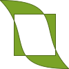
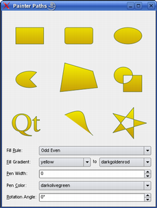
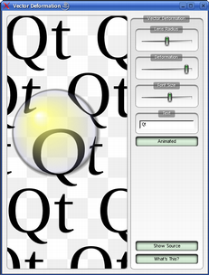
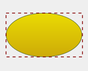
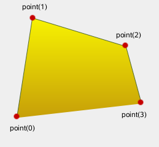
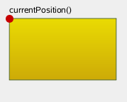
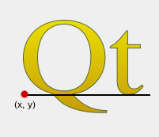
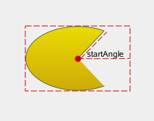
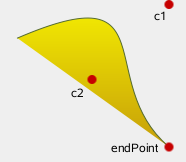

# QPainterPath Class Reference

## [[QtGui](index.htm) module]

该QPainterPath类提供一个容器，用于绘制操作，从而能够构造和重用的图形形状。[More...](#details)

### Types

*   `class **[Element](index.htm)**`
*   `enum ElementType { MoveToElement, LineToElement, CurveToElement, CurveToDataElement }`

### Methods

*   `__init__ (self)`
*   `__init__ (self, QPointF startPoint)`
*   `__init__ (self, QPainterPath other)`
*   `addEllipse (self, QRectF rect)`
*   `addEllipse (self, float x, float y, float w, float h)`
*   `addEllipse (self, QPointF center, float rx, float ry)`
*   `addPath (self, QPainterPath path)`
*   `addPolygon (self, QPolygonF polygon)`
*   `addRect (self, QRectF rect)`
*   `addRect (self, float x, float y, float w, float h)`
*   `addRegion (self, QRegion region)`
*   `addRoundedRect (self, QRectF rect, float xRadius, float yRadius, Qt.SizeMode mode = Qt.AbsoluteSize)`
*   `addRoundedRect (self, float x, float y, float w, float h, float xRadius, float yRadius, Qt.SizeMode mode = Qt.AbsoluteSize)`
*   `addRoundRect (self, QRectF rect, int xRnd, int yRnd)`
*   `addRoundRect (self, float x, float y, float w, float h, int xRnd, int yRnd)`
*   `addRoundRect (self, QRectF rect, int roundness)`
*   `addRoundRect (self, float x, float y, float w, float h, int roundness)`
*   `addText (self, QPointF point, QFont f, QString text)`
*   `addText (self, float x, float y, QFont f, QString text)`
*   `float angleAtPercent (self, float t)`
*   `arcMoveTo (self, QRectF rect, float angle)`
*   `arcMoveTo (self, float x, float y, float w, float h, float angle)`
*   `arcTo (self, QRectF rect, float startAngle, float arcLength)`
*   `arcTo (self, float x, float y, float w, float h, float startAngle, float arcLenght)`
*   `QRectF boundingRect (self)`
*   `closeSubpath (self)`
*   `connectPath (self, QPainterPath path)`
*   `bool contains (self, QPointF pt)`
*   `bool contains (self, QRectF rect)`
*   `bool contains (self, QPainterPath p)`
*   `QRectF controlPointRect (self)`
*   `cubicTo (self, QPointF ctrlPt1, QPointF ctrlPt2, QPointF endPt)`
*   `cubicTo (self, float ctrlPt1x, float ctrlPt1y, float ctrlPt2x, float ctrlPt2y, float endPtx, float endPty)`
*   `QPointF currentPosition (self)`
*   `Element elementAt (self, int i)`
*   `int elementCount (self)`
*   `Qt.FillRule fillRule (self)`
*   `QPainterPath intersected (self, QPainterPath r)`
*   `bool intersects (self, QRectF rect)`
*   `bool intersects (self, QPainterPath p)`
*   `bool isEmpty (self)`
*   `float length (self)`
*   `lineTo (self, QPointF p)`
*   `lineTo (self, float x, float y)`
*   `moveTo (self, QPointF p)`
*   `moveTo (self, float x, float y)`
*   `float percentAtLength (self, float t)`
*   `QPointF pointAtPercent (self, float t)`
*   `quadTo (self, QPointF ctrlPt, QPointF endPt)`
*   `quadTo (self, float ctrlPtx, float ctrlPty, float endPtx, float endPty)`
*   `setElementPositionAt (self, int i, float x, float y)`
*   `setFillRule (self, Qt.FillRule fillRule)`
*   `QPainterPath simplified (self)`
*   `float slopeAtPercent (self, float t)`
*   `QPainterPath subtracted (self, QPainterPath r)`
*   `QPainterPath subtractedInverted (self, QPainterPath r)`
*   `swap (self, QPainterPath other)`
*   `QPolygonF toFillPolygon (self, QMatrix matrix = QMatrix())`
*   `QPolygonF toFillPolygon (self, QTransform matrix)`
*   `list-of-QPolygonF toFillPolygons (self, QMatrix matrix = QMatrix())`
*   `list-of-QPolygonF toFillPolygons (self, QTransform matrix)`
*   `QPainterPath toReversed (self)`
*   `list-of-QPolygonF toSubpathPolygons (self, QMatrix matrix = QMatrix())`
*   `list-of-QPolygonF toSubpathPolygons (self, QTransform matrix)`
*   `translate (self, float dx, float dy)`
*   `translate (self, QPointF offset)`
*   `QPainterPath translated (self, float dx, float dy)`
*   `QPainterPath translated (self, QPointF offset)`
*   `QPainterPath united (self, QPainterPath r)`

### Special Methods

*   `QPainterPath __add__ (self, QPainterPath other)`
*   `QPainterPath __and__ (self, QPainterPath other)`
*   `bool __eq__ (self, QPainterPath other)`
*   `QPainterPath __iadd__ (self, QPainterPath other)`
*   `QPainterPath __iand__ (self, QPainterPath other)`
*   `QPainterPath __ior__ (self, QPainterPath other)`
*   `QPainterPath __isub__ (self, QPainterPath other)`
*   `QPainterPath __mul__ (self, QMatrix m)`
*   `QPainterPath __mul__ (self, QTransform m)`
*   `bool __ne__ (self, QPainterPath other)`
*   `QPainterPath __or__ (self, QPainterPath other)`
*   `QPainterPath __sub__ (self, QPainterPath other)`

* * *

## Detailed Description

该QPainterPath类提供一个容器，用于绘制操作，从而能够构造和重用的图形形状。

一个画家路径是大量的图形积木，如矩形，椭圆，直线和曲线组成的对象。积木可以在封闭的子路径被接合，例如为矩形或椭圆形。一个封闭的路径已重合的起点和终点。或者，他们可以独立存在的未封闭的子路径，如直线和曲线。

一个QPainterPath对象可用于填充，概述，和削波。要生成可填写概括为一个给定的画家路径，使用[QPainterPathStroker](qpainterpathstroker.html)类。画家路径超过正常的绘图操作的主要优点是，复杂的形状只需要创建一次，然后就可以使用绘制多次调用只对[QPainter.drawPath](qpainter.html#drawPath)（）函数。

QPainterPath提供了可用于获得关于路径和它的元素的信息的功能的集合。此外，可以利用扭转元素的顺序的[toReversed](qpainterpath.html#toReversed)（）函数。还有一些功能，这个画家路径对象转换为多边形表示。

### Composing a QPainterPath

甲QPainterPath对象可以被构造为一个空的路径，与给定的起始点，或者作为另一个QPainterPath对象的一个副本。一旦创建，直线和曲线可以使用被添加到路径的[lineTo](qpainterpath.html#lineTo)（ ）[arcTo](qpainterpath.html#arcTo)（ ）[cubicTo](qpainterpath.html#cubicTo)（）和[quadTo](qpainterpath.html#quadTo)（）函数。在直线和曲线舒展从[currentPosition](qpainterpath.html#currentPosition)（）来作为参数传递的位置。

该[currentPosition](qpainterpath.html#currentPosition)该QPainterPath对象的（ ）始终是添加的最后一个子路径（或初始起点）的结束位置。使用[moveTo](qpainterpath.html#moveTo)（ ）函数来移动[currentPosition](qpainterpath.html#currentPosition)（）无添加的成分。该[moveTo](qpainterpath.html#moveTo)（）函数，隐启动一个新的子路径，并且关闭前一个。开始一个新的子路径的另一种方式是调用[closeSubpath](qpainterpath.html#closeSubpath)（ ）函数，它通过从添加一行关闭当前路径[currentPosition](qpainterpath.html#currentPosition)（ ）返回路径的起始位置。请注意，新的路径不会有（0,0 ），作为其初始[currentPosition](qpainterpath.html#currentPosition)（ ） 。

QPainterPath类还提供了一些方便的功能来封闭的子路径添加到一个画家路径：[addEllipse](qpainterpath.html#addEllipse)（ ）[addPath](qpainterpath.html#addPath)（ ）[addRect](qpainterpath.html#addRect)（ ）[addRegion](qpainterpath.html#addRegion)（）和[addText](qpainterpath.html#addText)（ ） 。该[addPolygon](qpainterpath.html#addPolygon)（ ）函数添加_unclosed_子路径。事实上，这些功能是所有集合[moveTo](qpainterpath.html#moveTo)（ ）[lineTo](qpainterpath.html#lineTo)（）和[cubicTo](qpainterpath.html#cubicTo)（ ）操作。

此外，一个路径可以使用被添加到当前路径[connectPath](qpainterpath.html#connectPath)（）函数。但要注意，这个函数将在当前路径的最后一个元素连接到给定的一个的第一个元素添加一行。

下面是一个代码片段显示了如何QPainterPath对象可用于：

|  | 

```
 QPainterPath path;
 path.addRect(20, 20, 60, 60);

 path.moveTo(0, 0);
 path.cubicTo(99, 0,  50, 50,  99, 99);
 path.cubicTo(0, 99,  50, 50,  0, 0);

 [QPainter](qpainter.html) painter(this);
 painter.fillRect(0, 0, 100, 100, [Qt](qt.html).white);
 painter.setPen([QPen](qpen.html)([QColor](qcolor.html)(79, 106, 25), 1, [Qt](qt.html).SolidLine,
                     [Qt](qt.html).FlatCap, [Qt](qt.html).MiterJoin));
 painter.setBrush([QColor](qcolor.html)(122, 163, 39));

 painter.drawPath(path);

```

 |

当构建画家路径最初是空的。我们首先添加一个矩形，这是一个封闭的子路径。然后，我们添加两个贝兹曲线共同构成，即使他们不是单独关闭一个封闭的子路径。最后，我们绘制整个路径。该路径是使用默认的填充规则填充，[Qt.OddEvenFill](qt.html#FillRule-enum)。 Qt提供了两种方法来填充路径：

| [Qt.OddEvenFill](qt.html#FillRule-enum) | [Qt.WindingFill](qt.html#FillRule-enum) |
| --- | --- |
|  |  |

请参阅[Qt.FillRule](qt.html#FillRule-enum)文档规则的定义。一个画家路径的当前设置填充规则可使用检索到的[fillRule](qpainterpath.html#fillRule)（）函数，并使用改变了[setFillRule](qpainterpath.html#setFillRule)（）函数。

### QPainterPath Information

该QPainterPath类提供的功能的集合，它返回的路径及其元素的信息。

该[currentPosition](qpainterpath.html#currentPosition)（ ）函数返回已添加的最后一个子路径（或初始起点）的终点。该[elementAt](qpainterpath.html#elementAt)（）函数可以被用于检索各个子路径元素，则_number_元素可使用检索到的[elementCount](qpainterpath.html#elementCount)（）函数，并且[isEmpty](qpainterpath.html#isEmpty)（ ）函数告诉这个QPainterPath对象是否包含在所有的任何元素。

该[controlPointRect](qpainterpath.html#controlPointRect)（ ）函数返回一个包含此路径的所有点和控制点的矩形。这个功能是显着更快的计算比精确[boundingRect](qpainterpath.html#boundingRect)（ ）返回这个画家路径的边界矩形与浮点精度。

最后， QPainterPath提供[contains](qpainterpath.html#contains)（）函数可以被用来确定一个给定的点或矩形是否是路径内，并且[intersects](qpainterpath.html#intersects)（ ）函数，它确定是否任何一个给定的矩形内的点也都是这个路径里。

### QPainterPath Conversion

由于兼容性的原因，它可能需要简化画家路径的表示： QPainterPath提供[toFillPolygon](qpainterpath.html#toFillPolygon)（ ）[toFillPolygons](qpainterpath.html#toFillPolygons)（）和[toSubpathPolygons](qpainterpath.html#toSubpathPolygons)（ ）函数的转换画家路径转换为多边形。该[toFillPolygon](qpainterpath.html#toFillPolygon)（ ）返回画家路径作为一个单独的多边形，而后面两个函数返回的多边形列表。

该[toFillPolygons](qpainterpath.html#toFillPolygons)（）和[toSubpathPolygons](qpainterpath.html#toSubpathPolygons)提供（）函数，因为它通常是更快地绘制几个小的多边形，而不是绘制一个大的多边形，即使点绘制的总数是相同的。两者之间的区别是_number_多边形他们返回：该[toSubpathPolygons](qpainterpath.html#toSubpathPolygons)（ ）创建一个多边形的每个子路径，无论相交的子路径（即重叠边界矩形） ，而[toFillPolygons](qpainterpath.html#toFillPolygons)（ ）函数只创建一个重叠的子路径多边形。

该[toFillPolygon](qpainterpath.html#toFillPolygon)（）和[toFillPolygons](qpainterpath.html#toFillPolygons)（ ）函数首先将所有的子路径为多边形，然后使用倒带技术，以确保重叠的子路径可以使用正确的填充规则来填补。注意，倒带插入附加行中的多边形，以便填充多边形的轮廓并不路径的轮廓相匹配。

### Examples

Qt提供了[Painter Paths Example](index.htm)和[Vector Deformation Demo](index.htm)分别位于Qt的例子和演示目录分别。

该[Painter Paths Example](index.htm)显示了画家的路径如何可以用来构建复杂的形状进行渲染，并让用户实验用的填充和描边。该[Vector Deformation Demo](index.htm)展示了如何使用QPainterPath绘制文本。

| [Painter Paths Example](index.htm) | [Vector Deformation Demo](index.htm) |
| --- | --- |
|  |  |

* * *

## Type Documentation

```
QPainterPath.ElementType
```

该枚举描述了用于连接的顶点中的子路径元素的类型。

需要注意的是元素的加入为封闭的子路径使用[addEllipse](qpainterpath.html#addEllipse)（ ）[addPath](qpainterpath.html#addPath)（ ）[addPolygon](qpainterpath.html#addPolygon)（ ）[addRect](qpainterpath.html#addRect)（ ）[addRegion](qpainterpath.html#addRegion)（）和[addText](qpainterpath.html#addText)（ ）的便利功能，采用实际添加到路径作为单独的元素的集合[moveTo](qpainterpath.html#moveTo)（ ）[lineTo](qpainterpath.html#lineTo)（）和[cubicTo](qpainterpath.html#cubicTo)（）函数。

| Constant | Value | Description |
| --- | --- | --- |
| `QPainterPath.MoveToElement` | `0` | 一个新的子路径。另请参阅[moveTo](qpainterpath.html#moveTo)（ ） 。 |
| `QPainterPath.LineToElement` | `1` | A线。另请参阅[lineTo](qpainterpath.html#lineTo)（ ） 。 |
| `QPainterPath.CurveToElement` | `2` | 曲线。另请参阅[cubicTo](qpainterpath.html#cubicTo)（）和[quadTo](qpainterpath.html#quadTo)（ ） 。 |
| `QPainterPath.CurveToDataElement` | `3` | 描述曲线在CurveToElement元素所需的额外数据。 |

**See also** [elementAt](qpainterpath.html#elementAt)（）和[elementCount](qpainterpath.html#elementCount)（ ） 。

* * *

## Method Documentation

```
QPainterPath.__init__ (self)
```

构造一个空[QPainterPath](qpainterpath.html)对象。

```
QPainterPath.__init__ (self, QPointF startPoint)
```

创建[QPainterPath](qpainterpath.html)与给定对象_startPoint_作为它的当前位置。

```
QPainterPath.__init__ (self, QPainterPath other)
```

创建[QPainterPath](qpainterpath.html)对象，它是给定一个副本_path_。

**See also** [operator=](qpainterpath.html#operator-eq)（ ） 。

```
QPainterPath.addEllipse (self, QRectF rect)
```

建立内指定的椭圆_boundingRectangle_并把它添加到画家路径作为一个封闭的子路径。

椭圆是由顺时针曲线，并开始在零摄氏度整理（ 3点钟位置） 。

|  | 

```
 [QLinearGradient](qlineargradient.html) myGradient;
 [QPen](qpen.html) myPen;
 [QRectF](qrectf.html) boundingRectangle;

 [QPainterPath](qpainterpath.html) myPath;
 myPath.addEllipse(boundingRectangle);

 [QPainter](qpainter.html) painter(this);
 painter.setBrush(myGradient);
 painter.setPen(myPen);
 painter.drawPath(myPath);

```

 |

**See also** [arcTo](qpainterpath.html#arcTo)（ ）[QPainter.drawEllipse](qpainter.html#drawEllipse)（）和[Composing a QPainterPath](qpainterpath.html#composing-a-qpainterpath)。

```
QPainterPath.addEllipse (self, float x, float y, float w, float h)
```

这是一个重载函数。

建立由它左上角的定义矩形边界内的椭圆形（_x_，_y_） ，_width_和_height_，并将其添加到画家路径作为一个封闭的子路径。

```
QPainterPath.addEllipse (self, QPointF center, float rx, float ry)
```

这是一个重载函数。

创建放置在一个椭圆_center_与半径_rx_和_ry_，并将其添加到画家路径作为一个封闭的子路径。

此功能被引入Qt的4.4 。

```
QPainterPath.addPath (self, QPainterPath path)
```

将给定_path_至_this_路径作为一个封闭的子路径。

**See also** [connectPath](qpainterpath.html#connectPath)（）和[Composing a QPainterPath](qpainterpath.html#composing-a-qpainterpath)。

```
QPainterPath.addPolygon (self, QPolygonF polygon)
```

将给定_polygon_该路径作为（未关闭）子路径。

注意，该多边形后的当前位置已被添加，是在最后一个点_polygon_。画一条线回到第一点，用[closeSubpath](qpainterpath.html#closeSubpath)（）函数。

|  | 

```
 [QLinearGradient](qlineargradient.html) myGradient;
 [QPen](qpen.html) myPen;
 [QPolygonF](qpolygonf.html) myPolygon;

 [QPainterPath](qpainterpath.html) myPath;
 myPath.addPolygon(myPolygon);

 [QPainter](qpainter.html) painter(this);
 painter.setBrush(myGradient);
 painter.setPen(myPen);
 painter.drawPath(myPath);

```

 |

**See also** [lineTo](qpainterpath.html#lineTo)（）和[Composing a QPainterPath](qpainterpath.html#composing-a-qpainterpath)。

```
QPainterPath.addRect (self, QRectF rect)
```

将给定_rectangle_这条道路是一个封闭的子路径。

该_rectangle_添加为顺时针套系。后画家路径的当前位置_rectangle_已经被添加为矩形的左上角。

|  | 

```
 [QLinearGradient](qlineargradient.html) myGradient;
 [QPen](qpen.html) myPen;
 [QRectF](qrectf.html) myRectangle;

 [QPainterPath](qpainterpath.html) myPath;
 myPath.addRect(myRectangle);

 [QPainter](qpainter.html) painter(this);
 painter.setBrush(myGradient);
 painter.setPen(myPen);
 painter.drawPath(myPath);

```

 |

**See also** [addRegion](qpainterpath.html#addRegion)（ ）[lineTo](qpainterpath.html#lineTo)（）和[Composing a QPainterPath](qpainterpath.html#composing-a-qpainterpath)。

```
QPainterPath.addRect (self, float x, float y, float w, float h)
```

这是一个重载函数。

添加一个矩形的位置（_x_，_y_） ，使用给定的_width_和_height_作为一个封闭的子路径。

```
QPainterPath.addRegion (self, QRegion region)
```

将给定_region_通过增加该区域的每个矩形作为一个单独的封闭的子路径的路径。

**See also** [addRect](qpainterpath.html#addRect)（）和[Composing a QPainterPath](qpainterpath.html#composing-a-qpainterpath)。

```
QPainterPath.addRoundedRect (self, QRectF rect, float xRadius, float yRadius, Qt.SizeMode mode = Qt.AbsoluteSize)
```

将指定的矩形_rect_带圆角的路径。

该_xRadius_和_yRadius_参数指定限定的圆角矩形的角部的椭圆形的半径。何时_mode_ is [Qt.RelativeSize](qt.html#SizeMode-enum)，_xRadius_和_yRadius_在一半的矩形的宽度和高度的比例分别指定，并应在范围0.0至100.0 。

此功能被引入Qt的4.4 。

**See also** [addRect](qpainterpath.html#addRect)（ ） 。

```
QPainterPath.addRoundedRect (self, float x, float y, float w, float h, float xRadius, float yRadius, Qt.SizeMode mode = Qt.AbsoluteSize)
```

这是一个重载函数。

将指定的矩形_x_，_y_，_w_，_h_带圆角的路径。

此功能被引入Qt的4.4 。

```
QPainterPath.addRoundRect (self, QRectF rect, int xRnd, int yRnd)
```

```
QPainterPath.addRoundRect (self, float x, float y, float w, float h, int xRnd, int yRnd)
```

```
QPainterPath.addRoundRect (self, QRectF rect, int roundness)
```

```
QPainterPath.addRoundRect (self, float x, float y, float w, float h, int roundness)
```

```
QPainterPath.addText (self, QPointF point, QFont f, QString text)
```

将给定_text_这个路径作为一组从已建立封闭的子路径_font_提供。该子路径定位，使文本的基线的左端在于在指定的_point_。

|  | 

```
 [QLinearGradient](qlineargradient.html) myGradient;
 [QPen](qpen.html) myPen;
 [QFont](qfont.html) myFont;
 [QPointF](qpointf.html) baseline(x, y);

 [QPainterPath](qpainterpath.html) myPath;
 myPath.addText(baseline, myFont, tr("Qt"));

 [QPainter](qpainter.html) painter(this);
 painter.setBrush(myGradient);
 painter.setPen(myPen);
 painter.drawPath(myPath);

```

 |

**See also** [QPainter.drawText](qpainter.html#drawText)（）和[Composing a QPainterPath](qpainterpath.html#composing-a-qpainterpath)。

```
QPainterPath.addText (self, float x, float y, QFont f, QString text)
```

这是一个重载函数。

将给定_text_这个路径作为一组从已建立封闭的子路径_font_提供。该子路径定位，使文本的基线的左端处在于通过指定的点（_x_，_y_） 。

```
float QPainterPath.angleAtPercent (self, float t)
```

返回的路径切线角度的百分比_t_。这个论点_t_必须是0和1之间。

用于角度的正值逆时针意思而负值意味着顺时针方向。零度是在3点钟的位置。

注意，类似于其它百分比的方法，该百分比的测量是不与问候的长度呈线性的曲线，如果是存在于路径。当曲线存在的比例的参数被映射到吨贝塞尔方程的参数。

```
QPainterPath.arcMoveTo (self, QRectF rect, float angle)
```

创建一个举动是在于佔用给定弧_rectangle_在_angle_。

角度单位是度。顺时针圆弧可以用负角度被指定。

这个函数中引入了Qt 4.2中。

**See also** [moveTo](qpainterpath.html#moveTo)（）和[arcTo](qpainterpath.html#arcTo)（ ） 。

```
QPainterPath.arcMoveTo (self, float x, float y, float w, float h, float angle)
```

这是一个重载函数。

创建一个移动到躺在床上，佔据了弧线[QRectF](qrectf.html)（_x_，_y_，_width_，_height_）在_angle_。

这个函数中引入了Qt 4.2中。

```
QPainterPath.arcTo (self, QRectF rect, float startAngle, float arcLength)
```

创建圆弧佔用给定的_rectangle_，开始于指定的_startAngle_并延伸_sweepLength_逆时针旋转度。

角度单位是度。顺时针圆弧可以用负角度被指定。

注意，这个函数圆弧的起点连接到当前的位置，如果它们尚未连接。之后电弧已经被添加，当前位置是在电弧的最后一点。画一条线回到第一点，用[closeSubpath](qpainterpath.html#closeSubpath)（）函数。

|  | 

```
 [QLinearGradient](qlineargradient.html) myGradient;
 [QPen](qpen.html) myPen;

 [QPointF](qpointf.html) center, startPoint;

 [QPainterPath](qpainterpath.html) myPath;
 myPath.moveTo(center);
 myPath.arcTo(boundingRect, startAngle,
              sweepLength);

 [QPainter](qpainter.html) painter(this);
 painter.setBrush(myGradient);
 painter.setPen(myPen);
 painter.drawPath(myPath);

```

 |

**See also** [arcMoveTo](qpainterpath.html#arcMoveTo)（ ）[addEllipse](qpainterpath.html#addEllipse)（ ）[QPainter.drawArc](qpainter.html#drawArc)（ ）[QPainter.drawPie](qpainter.html#drawPie)（）和[Composing a QPainterPath](qpainterpath.html#composing-a-qpainterpath)。

```
QPainterPath.arcTo (self, float x, float y, float w, float h, float startAngle, float arcLenght)
```

这是一个重载函数。

创建圆弧佔据的矩形[QRectF](qrectf.html)（_x_，_y_，_width_，_height_） ，开始于指定的_startAngle_并延伸_sweepLength_逆时针旋转度。

```
QRectF QPainterPath.boundingRect (self)
```

[

返回与浮点精度的矩形这个画家路径的边框。

](qrectf.html)

[**See also**](qrectf.html) [controlPointRect](qpainterpath.html#controlPointRect)（ ） 。

```
QPainterPath.closeSubpath (self)
```

通过画线的子路径的开始，自动启动一个新的路径关闭当前子路径。新路径的当前点为（ 0,0） 。

如果子路径不包含任何元素，该函数不起作用。

**See also** [moveTo](qpainterpath.html#moveTo)（）和[Composing a QPainterPath](qpainterpath.html#composing-a-qpainterpath)。

```
QPainterPath.connectPath (self, QPainterPath path)
```

连接指定的_path_至_this_通过添加从该路径的最后一个元素的线为给定路径的第一个元素的路径。

**See also** [addPath](qpainterpath.html#addPath)（）和[Composing a QPainterPath](qpainterpath.html#composing-a-qpainterpath)。

```
bool QPainterPath.contains (self, QPointF pt)
```

返回True如果给定的_point_是的路径里面，否则返回False 。

**See also** [intersects](qpainterpath.html#intersects)（ ） 。

```
bool QPainterPath.contains (self, QRectF rect)
```

返回True如果给定的_rectangle_是的路径里面，否则返回False 。

```
bool QPainterPath.contains (self, QPainterPath p)
```

返回True如果给定的路径_p_包含在当前路径内。返回False如果当前路径以及任何边缘_p_相交。

设置路径的操作将视路径，领域。非闭合路径将被隐式关闭处理。

此功能被引入Qt的4.3 。

**See also** [intersects](qpainterpath.html#intersects)（ ） 。

```
QRectF QPainterPath.controlPointRect (self)
```

[

返回包含此路径的所有点和控制点的矩形。

](qrectf.html)

[这个功能是显着更快的计算比精确](qrectf.html)[boundingRect](qpainterpath.html#boundingRect)（） ，并返回的矩形总是返回的矩形的一个超[boundingRect](qpainterpath.html#boundingRect)（ ） 。

**See also** [boundingRect](qpainterpath.html#boundingRect)（ ） 。

```
QPainterPath.cubicTo (self, QPointF ctrlPt1, QPointF ctrlPt2, QPointF endPt)
```

将当前位置与给定之间的三次贝塞尔曲线_endPoint_通过使用指定的控制点_c1_和_c2_。

该曲线被加入后，当前位置被更新为在该曲线的终点。

|  | 

```
 [QLinearGradient](qlineargradient.html) myGradient;
 [QPen](qpen.html) myPen;

 [QPainterPath](qpainterpath.html) myPath;
 myPath.cubicTo(c1, c2, endPoint);

 [QPainter](qpainter.html) painter(this);
 painter.setBrush(myGradient);
 painter.setPen(myPen);
 painter.drawPath(myPath);

```

 |

**See also** [quadTo](qpainterpath.html#quadTo)（）和[Composing a QPainterPath](qpainterpath.html#composing-a-qpainterpath)。

```
QPainterPath.cubicTo (self, float ctrlPt1x, float ctrlPt1y, float ctrlPt2x, float ctrlPt2y, float endPtx, float endPty)
```

这是一个重载函数。

将当前位置和结束点之间的三次Bezier曲线（_endPointX_，_endPointY_）与管制站（指定_c1X_，_c1Y_）和（_c2X_，_c2Y_） 。

```
QPointF QPainterPath.currentPosition (self)
```

[

返回路径的当前位置。

](qpointf.html)

```
Element QPainterPath.elementAt (self, int i)
```

[

返回元素在给定的_index_在画家的路径。

](index.htm)

[**See also**](index.htm) [ElementType](qpainterpath.html#ElementType-enum)，[elementCount](qpainterpath.html#elementCount)（）和[isEmpty](qpainterpath.html#isEmpty)（ ） 。

```
int QPainterPath.elementCount (self)
```

返回在画家路径路径的元素数。

**See also** [ElementType](qpainterpath.html#ElementType-enum)，[elementAt](qpainterpath.html#elementAt)（）和[isEmpty](qpainterpath.html#isEmpty)（ ） 。

```
Qt.FillRule QPainterPath.fillRule (self)
```

[

返回画家路径的当前设置填充规则。

](qt.html#FillRule-enum)

[**See also**](qt.html#FillRule-enum) [setFillRule](qpainterpath.html#setFillRule)（ ） 。

```
QPainterPath QPainterPath.intersected (self, QPainterPath r)
```

[

返回作为此路径的填充区域的交叉点和路径_p_的填充区域。贝塞尔曲线可压扁排队，由于做贝塞尔曲线交点的数值不稳定段。

此功能被引入Qt的4.3 。

```
bool QPainterPath.intersects (self, QRectF rect)
```

返回True如果在给定的任何一点_rectangle_相交的路径，否则返回False 。

有一个交叉点，如果任何组成矩形的线条相交的路径的一部分，或者如果任何部分的矩形的带路径包围的任何区域重叠。这个函数尊重当前fillRule以确定被认为是路径之内。

](qpainterpath.html)

[**See also**](qpainterpath.html) [contains](qpainterpath.html#contains)（ ） 。

```
bool QPainterPath.intersects (self, QPainterPath p)
```

如果当前路径相交在任何点给定的路径，则返回True_p_。如果当前路径包含或被包含的任何部分也返回True_p_。

设置路径的操作将视路径，领域。非闭合路径将被隐式关闭处理。

此功能被引入Qt的4.3 。

**See also** [contains](qpainterpath.html#contains)（ ） 。

```
bool QPainterPath.isEmpty (self)
```

如果不是有这个路径没有任何元素，则返回True，如果只有元素是[MoveToElement](qpainterpath.html#ElementType-enum)否则返回False 。

**See also** [elementCount](qpainterpath.html#elementCount)（ ） 。

```
float QPainterPath.length (self)
```

返回电流路径的长度。

```
QPainterPath.lineTo (self, QPointF p)
```

添加一条直线从当前位置到指定_endPoint_。后绘制的线，当前位置被更新为在该行的终点。

**See also** [addPolygon](qpainterpath.html#addPolygon)（ ）[addRect](qpainterpath.html#addRect)（）和[Composing a QPainterPath](qpainterpath.html#composing-a-qpainterpath)。

```
QPainterPath.lineTo (self, float x, float y)
```

这是一个重载函数。

绘制一条线从当前位置至点（_x_，_y_） 。

```
QPainterPath.moveTo (self, QPointF p)
```

移动当前点到给定_point_，隐式地开始一个新的子路径和关闭前一个。

**See also** [closeSubpath](qpainterpath.html#closeSubpath)（）和[Composing a QPainterPath](qpainterpath.html#composing-a-qpainterpath)。

```
QPainterPath.moveTo (self, float x, float y)
```

这是一个重载函数。

将当前位置移动到（_x_，_y_），并开始一个新的子路径，隐含收盘前一路径。

```
float QPainterPath.percentAtLength (self, float t)
```

返回整个路径的百分比在规定的长度_len_。

注意，类似于其它百分比的方法，该百分比的测量是不与问候的长度呈线性，如果曲线中存在的路径。当曲线存在的比例的参数被映射到吨贝塞尔方程的参数。

```
QPointF QPainterPath.pointAtPercent (self, float t)
```

[

返回点的百分比_t_的电流通路的。这个论点_t_必须是0和1之间。

注意，类似于其它百分比的方法，该百分比的测量是不与问候的长度呈线性，如果曲线中存在的路径。当曲线存在的比例的参数被映射到吨贝塞尔方程的参数。

```
QPainterPath.quadTo (self, QPointF ctrlPt, QPointF endPt)
```

将当前位置和给定的二次贝塞尔曲线_endPoint_由指定的控制点_c_。

该曲线被加入后，当前点被更新为在该曲线的终点。

](qpointf.html)

[**See also**](qpointf.html) [cubicTo](qpainterpath.html#cubicTo)（）和[Composing a QPainterPath](qpainterpath.html#composing-a-qpainterpath)。

```
QPainterPath.quadTo (self, float ctrlPtx, float ctrlPty, float endPtx, float endPty)
```

这是一个重载函数。

将目前的点和终点之间的二次贝塞尔曲线（_endPointX_，_endPointY_）与（指定控制点_cx_，_cy_） 。

```
QPainterPath.setElementPositionAt (self, int i, float x, float y)
```

元素的索引设置x和y坐标_index_至_x_和_y_。

这个函数中引入了Qt 4.2中。

```
QPainterPath.setFillRule (self, Qt.FillRule fillRule)
```

设定画家路径的填充规则给定的_fillRule_。 Qt提供了两种方法来填充路径：

| [Qt.OddEvenFill](qt.html#FillRule-enum) (default) | [Qt.WindingFill](qt.html#FillRule-enum) |
| --- | --- |
|  |  |

**See also** [fillRule](qpainterpath.html#fillRule)（ ） 。

```
QPainterPath QPainterPath.simplified (self)
```

[](qpainterpath.html)

[返回此路径的简化版本。这意味着合并相交的所有子路径，并返回包含任何相交的边缘的路径。连续的平行线也将被合并。简化的路径将始终使用默认的填充规则，](qpainterpath.html)[Qt.OddEvenFill](qt.html#FillRule-enum)。贝塞尔曲线可压扁排队，由于做贝塞尔曲线交点的数值不稳定段。

此功能被引入Qt的4.4 。

```
float QPainterPath.slopeAtPercent (self, float t)
```

返回路径的斜率的百分比_t_。这个论点_t_必须是0和1之间。

注意，类似于其它百分比的方法，该百分比的测量是不与问候的长度呈线性，如果曲线中存在的路径。当曲线存在的比例的参数被映射到吨贝塞尔方程的参数。

```
QPainterPath QPainterPath.subtracted (self, QPainterPath r)
```

[

返回这是一个路径_p_的填充区域由这条路径的填充区域中减去。

设置路径的操作将视路径，领域。非闭合路径将被隐式关闭处理。贝塞尔曲线可压扁排队，由于做贝塞尔曲线交点的数值不稳定段。

此功能被引入Qt的4.3 。

](qpainterpath.html)

```
QPainterPath QPainterPath.subtractedInverted (self, QPainterPath r)
```

[

```
QPainterPath.swap (self, QPainterPath other)
```

掉期的画家路径_other_这个画家路径。这个操作是非常快的，而且永远不会。

此功能被引入Qt的4.8 。

](qpainterpath.html)

```
QPolygonF QPainterPath.toFillPolygon (self, QMatrix matrix = QMatrix())
```

[](qpolygonf.html)

[路径转换成使用多边形](qpolygonf.html)[QTransform](qtransform.html) _matrix_，并返回该多边形。

多边形是由首先将所有的子路径为多边形，然后使用回卷技术，以确保重叠的子路径可以使用正确的填充规则填充创建。

注意，倒带插入附加系中的多边形，以便填充多边形的轮廓并不路径的轮廓相匹配。

**See also** [toSubpathPolygons](qpainterpath.html#toSubpathPolygons)（ ）[toFillPolygons](qpainterpath.html#toFillPolygons)（）和[QPainterPath Conversion](qpainterpath.html#qpainterpath-conversion)。

```
QPolygonF QPainterPath.toFillPolygon (self, QTransform matrix)
```

[

这是一个重载函数。

```
list-of-QPolygonF QPainterPath.toFillPolygons (self, QMatrix matrix = QMatrix())
```

](qpolygonf.html)

[路径转换成多边形使用列表中的](qpolygonf.html)[QTransform](qtransform.html) _matrix_，并返回该列表。

该功能不同于[toFillPolygon](qpainterpath.html#toFillPolygon)（ ）函数，它创建几个多边形。它被设置，因为它通常更快速地绘制几个小的多边形，而不是绘制一个大的多边形，即使点绘制的总数是相同的。

该toFillPolygons （）函数不同于[toSubpathPolygons](qpainterpath.html#toSubpathPolygons)（ ）函数，它创建具有重叠边界矩形子路径只有多边形。

像[toFillPolygon](qpainterpath.html#toFillPolygon)（ ）函数，该函数使用一个收卷技术，以确保重叠的子路径可以使用正确的填充规则来填补。另外，在多边形复捲插入附加系，以便填充多边形的轮廓并不路径的轮廓相匹配。

**See also** [toSubpathPolygons](qpainterpath.html#toSubpathPolygons)（ ）[toFillPolygon](qpainterpath.html#toFillPolygon)（）和[QPainterPath Conversion](qpainterpath.html#qpainterpath-conversion)。

```
list-of-QPolygonF QPainterPath.toFillPolygons (self, QTransform matrix)
```

这是一个重载函数。

```
QPainterPath QPainterPath.toReversed (self)
```

[

创建并返回路径的逆转副本。

](qpainterpath.html)

[它是一种颠倒元素的顺序：如果](qpainterpath.html)[QPainterPath](qpainterpath.html)通过调用组成的[moveTo](qpainterpath.html#moveTo)（ ）[lineTo](qpainterpath.html#lineTo)（）和[cubicTo](qpainterpath.html#cubicTo)（ ）按照指定的顺序功能，逆转副本是通过调用组成[cubicTo](qpainterpath.html#cubicTo)（ ）[lineTo](qpainterpath.html#lineTo)（）和[moveTo](qpainterpath.html#moveTo)（ ） 。

```
list-of-QPolygonF QPainterPath.toSubpathPolygons (self, QMatrix matrix = QMatrix())
```

路径转换成多边形使用列表中的[QTransform](qtransform.html) _matrix_，并返回该列表。

这个函数创建一个多边形的每个子路径，无论相交的子路径（即重叠边界矩形）的。为了确保这种重叠的子路径正确填写，使用[toFillPolygons](qpainterpath.html#toFillPolygons)（ ）函数来代替。

**See also** [toFillPolygons](qpainterpath.html#toFillPolygons)（ ）[toFillPolygon](qpainterpath.html#toFillPolygon)（）和[QPainterPath Conversion](qpainterpath.html#qpainterpath-conversion)。

```
list-of-QPolygonF QPainterPath.toSubpathPolygons (self, QTransform matrix)
```

这是一个重载函数。

```
QPainterPath.translate (self, float dx, float dy)
```

由（转换路径中的所有元素_dx_，_dy_） 。

此功能被引入Qt的4.6 。

**See also** [translated](qpainterpath.html#translated)（ ） 。

```
QPainterPath.translate (self, QPointF offset)
```

这是一个重载函数。

由给定的转化路径中的所有元素_offset_。

此功能被引入Qt的4.6 。

**See also** [translated](qpainterpath.html#translated)（ ） 。

```
QPainterPath QPainterPath.translated (self, float dx, float dy)
```

[

返回由（翻译路径的拷贝_dx_，_dy_） 。

此功能被引入Qt的4.6 。

](qpainterpath.html)

[**See also**](qpainterpath.html) [translate](qpainterpath.html#translate)（ ） 。

```
QPainterPath QPainterPath.translated (self, QPointF offset)
```

[

这是一个重载函数。

返回一个由给定的原版的路径的副本_offset_。

此功能被引入Qt的4.6 。

](qpainterpath.html)

[**See also**](qpainterpath.html) [translate](qpainterpath.html#translate)（ ） 。

```
QPainterPath QPainterPath.united (self, QPainterPath r)
```

[

返回作为此路径的填充区域和工会的路径_p_的填充区域。

设置路径的操作将视路径，领域。非闭合路径将被隐式关闭处理。贝塞尔曲线可压扁排队，由于做贝塞尔曲线交点的数值不稳定段。

此功能被引入Qt的4.3 。

](qpainterpath.html)

[**See also**](qpainterpath.html) [intersected](qpainterpath.html#intersected)（）和[subtracted](qpainterpath.html#subtracted)（ ） 。

```
QPainterPath QPainterPath.__add__ (self, QPainterPath other)
```

[](qpainterpath.html)

```
QPainterPath QPainterPath.__and__ (self, QPainterPath other)
```

[

```
bool QPainterPath.__eq__ (self, QPainterPath other)
```

](qpainterpath.html)

```
QPainterPath QPainterPath.__iadd__ (self, QPainterPath other)
```

[](qpainterpath.html)

```
QPainterPath QPainterPath.__iand__ (self, QPainterPath other)
```

[](qpainterpath.html)

```
QPainterPath QPainterPath.__ior__ (self, QPainterPath other)
```

[](qpainterpath.html)

```
QPainterPath QPainterPath.__isub__ (self, QPainterPath other)
```

[](qpainterpath.html)

```
QPainterPath QPainterPath.__mul__ (self, QMatrix m)
```

[](qpainterpath.html)

```
QPainterPath QPainterPath.__mul__ (self, QTransform m)
```

[

```
bool QPainterPath.__ne__ (self, QPainterPath other)
```

](qpainterpath.html)

```
QPainterPath QPainterPath.__or__ (self, QPainterPath other)
```

[](qpainterpath.html)

```
QPainterPath QPainterPath.__sub__ (self, QPainterPath other)
```

[](qpainterpath.html)