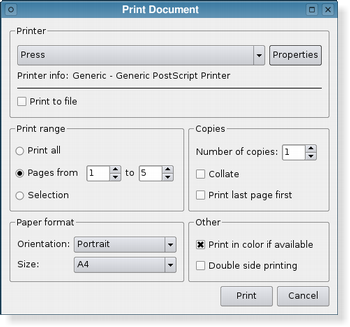
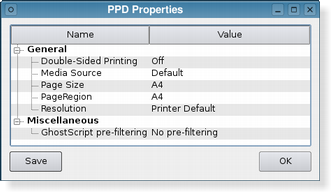

# QPrintDialog Class Reference

## [[QtGui](index.htm) module]

该QPrintDialog中类提供用于指定打印机的配置对话框。[More...](#details)

继承[QAbstractPrintDialog](qabstractprintdialog.html)。

### Methods

*   `__init__ (self, QPrinter printer, QWidget parent = None)`
*   `__init__ (self, QWidget parent = None)`
*   `accept (self)`
*   `accepted (self)`
*   `done (self, int result)`
*   `int exec_ (self)`
*   `open (self)`
*   `open (self, QObject receiver, SLOT()SLOT() member)`
*   `open (self, callable receiver)`
*   `QAbstractPrintDialog.PrintDialogOptions options (self)`
*   `setOption (self, QAbstractPrintDialog.PrintDialogOption option, bool on = True)`
*   `setOptions (self, QAbstractPrintDialog.PrintDialogOptions options)`
*   `setVisible (self, bool visible)`
*   `bool testOption (self, QAbstractPrintDialog.PrintDialogOption option)`

### Qt Signals

*   `void accepted (QPrinter *)`

* * *

## Detailed Description

该QPrintDialog中类提供用于指定打印机的配置对话框。

该对话框允许用户更改文件相关的设置，如纸张大小和方向，打印（彩色或灰阶）类型，页数范围，以及要打印的副本数。

还提供控制，以使用户能够从现有的打印机，包括任何已配置网络打印机进行选择。

通常情况下， QPrintDialog中对象与构造[QPrinter](qprinter.html)对象，并使用所执行的[exec_](qprintdialog.html#exec)（）函数。

```
 QPrintDialog printDialog(printer, parent);
 if (printDialog.exec() == [QDialog](qdialog.html).Accepted) {
     // print ...
 }

```

如果对话框被用户接受，则[QPrinter](qprinter.html)对象被正确配置打印。

|  |  |

打印机对话框（在PLASTIQUE风格如上图所示）可以访问常用的印刷性能。在使用CUPS打印系统的X11平台，为每个可用的打印机的设置可以通过对话框的修改**Properties**按下按钮。

在Windows和Mac OS X ，则使用本机打印对话框，这意味着一些[QWidget](qwidget.html)和[QDialog](qdialog.html)在对话框中设置的属性不会被尊重。在Mac OS X上的本机打印对话框不支持设置打印机选项，即[setOptions](qprintdialog.html#options-prop)（）和[setOption](qprintdialog.html#setOption)（ ）没有任何效果。

在Qt 4.4 ，它是可以使用的静态函数，以显示在Mac OS X上的这片已经不再在Qt的4.5的支持。如果你想要这个功能，使用[QPrintDialog.open](qprintdialog.html#open)（ ） 。

* * *

## Method Documentation

```
QPrintDialog.__init__ (self, QPrinter printer, QWidget parent = None)
```

该_parent_的说法，如果不是没有，原因_self_通过Qt的，而不是PyQt的拥有。

构造一个新的模态对话框的打印机为给定的_printer_用给定的_parent_。

```
QPrintDialog.__init__ (self, QWidget parent = None)
```

该_parent_的说法，如果不是没有，原因_self_通过Qt的，而不是PyQt的拥有。

构造一个打印对话框给定的_parent_。

```
QPrintDialog.accept (self)
```

```
QPrintDialog.accepted (self)
```

当用户接受在打印对话框中设置的值，这个信号被发射。该_printer_参数包括该设置被应用到打印机。

```
QPrintDialog.done (self, int result)
```

从重新实现[QDialog.done](qdialog.html#done)（ ） 。

关闭对话框，并将其结果代码_result_。如果显示此对话框[exec_](qprintdialog.html#exec)（ ） ， （）完成将导致本地事件循环来完成，并[exec_](qprintdialog.html#exec)（ ）返回_result_。

**See also** [QDialog.done](qdialog.html#done)（ ） 。

```
int QPrintDialog.exec_ (self)
```

从重新实现[QAbstractPrintDialog.exec](qabstractprintdialog.html#exec)（ ） 。

```
QPrintDialog.open (self)
```

这是一个重载函数。

在打开的对话框并连接其[accepted](qprintdialog.html#accepted)（）信号到由指定的槽_receiver_和_member_。

该信号会从插槽中断开时，关闭对话框。

此功能被引入Qt的4.5 。

```
QPrintDialog.open (self, QObject receiver, SLOT()SLOT() member)
```

```
QPrintDialog.open (self, callable receiver)
```

```
QAbstractPrintDialog.PrintDialogOptions QPrintDialog.options (self)
```

[

```
QPrintDialog.setOption (self, QAbstractPrintDialog.PrintDialogOption option, bool on = True)
```

设置给定_option_被启用，如果_on_是真的，否则，清除给定的_option_。

](index.htm)

[**See also**](index.htm) [options](qprintdialog.html#options-prop)和[testOption](qprintdialog.html#testOption)（ ） 。

```
QPrintDialog.setOptions (self, QAbstractPrintDialog.PrintDialogOptions options)
```

```
QPrintDialog.setVisible (self, bool visible)
```

从重新实现[QWidget.setVisible](qwidget.html#visible-prop)（ ） 。

```
bool QPrintDialog.testOption (self, QAbstractPrintDialog.PrintDialogOption option)
```

返回True如果给定的_option_被启用，否则返回False 。

**See also** [options](qprintdialog.html#options-prop)和[setOption](qprintdialog.html#setOption)（ ） 。

* * *

## Qt Signal Documentation

```
void accepted (QPrinter *)
```

这是该信号的默认超载。