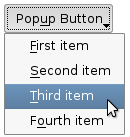
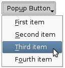

# QPushButton Class Reference

## [[QtGui](index.htm) module]

该QPushButton窗口部件提供了一个命令按钮。[More...](#details)

继承[QAbstractButton](qabstractbutton.html)。

通过继承[QCommandLinkButton](qcommandlinkbutton.html)。

### Methods

*   `__init__ (self, QWidget parent = None)`
*   `__init__ (self, QString text, QWidget parent = None)`
*   `__init__ (self, QIcon icon, QString text, QWidget parent = None)`
*   `bool autoDefault (self)`
*   `bool event (self, QEvent e)`
*   `focusInEvent (self, QFocusEvent)`
*   `focusOutEvent (self, QFocusEvent)`
*   `initStyleOption (self, QStyleOptionButton option)`
*   `bool isDefault (self)`
*   `bool isFlat (self)`
*   `keyPressEvent (self, QKeyEvent)`
*   `QMenu menu (self)`
*   `QSize minimumSizeHint (self)`
*   `paintEvent (self, QPaintEvent)`
*   `setAutoDefault (self, bool)`
*   `setDefault (self, bool)`
*   `setFlat (self, bool)`
*   `setMenu (self, QMenu menu)`
*   `showMenu (self)`
*   `QSize sizeHint (self)`

* * *

## Detailed Description

该QPushButton窗口部件提供了一个命令按钮。

按钮或命令按钮，也许是任何图形用户界面中最常用的部件。推（点击）按钮来命令计算机执行某些操作，或回答一个问题。典型的按钮是确定，应用，取消，关闭，是，否和帮助。

一个命令按钮是长方形，通常会显示描述其操作的文本标籤。快捷键可以首选使用的字符在文本中的＆符号前面的指定。例如：

```
 QPushButton *button = new QPushButton("&Download", this);

```

在这个例子中，快捷键是_Alt+D_。请参阅[QShortcut](qshortcut.html#mnemonic)有关详细信息的文档（显示的实际符号，使用“\u0026\u0026” ） 。

按钮显示文本标籤，以及可选的小图标。这些可以通过构造函数来设置和使用后来改[setText](qabstractbutton.html#text-prop)（）和[setIcon](qabstractbutton.html#icon-prop)（ ） 。如果禁用该按钮上的文字和图标的外观将会被操纵方面的图形用户界面风格，使按钮看起来“已禁用” 。

一个按钮发出的信号[clicked](qabstractbutton.html#clicked)（）时，它是由鼠标，空格键或键盘快捷方式激活。连接到这个信号来执行按钮的操作。推动按钮也提供不太常用的信号，例如，[pressed](qabstractbutton.html#pressed)（）和[released](qabstractbutton.html#released)（ ） 。

在对话框的命令按钮是默认自动默认按钮，即会自动成为默认的按钮，当他们收到的键盘输入焦点。默认按钮是一个按钮，当用户按下Enter键或Return键在对话框被激活。您可以更改此[setAutoDefault](qpushbutton.html#autoDefault-prop)（ ） 。需要注意的是自动默认按钮保留一点点额外的空间，它是要订一个默认按钮指示灯。如果你不想在你的按钮这个空间，调用setAutoDefault （假） 。

由于酒店地处中央，按钮控件已经成长为容纳了大量的变化，在过去的十年。微软风格指南现在显示的Windows按钮约十个不同国家和文本意味着有几十个，当的特征的所有组合都考虑到了。

最重要的模式或状态是：

*   Available or not (grayed out, disabled).
*   Standard push button, toggling push button or menu button.
*   On or off (only for toggling push buttons).
*   Default or normal. The default button in a dialog can generally be "clicked" using the Enter or Return key.
*   Auto-repeat or not.
*   Pressed down or not.

作为一般规则，使用一个按钮时，应用程序或对话框窗口，当用户点击它执行一个动作（如适用，取消，关闭和帮助）_and_当插件被认为具有广泛的，矩形的形状，文本标籤。小，一般方形按钮，改变窗口的状态，而不是执行中的的右上角一个动作（如按钮[QFileDialog](qfiledialog.html)）没有命令按钮，但工具按钮。 Qt提供了一个特殊的类（[QToolButton](qtoolbutton.html)），这些按钮。

如果你需要切换行为（见[setCheckable](qabstractbutton.html#checkable-prop)（））或者一个按钮，自动重复启动信号时被按下一样在滚动条中的箭头（参见[setAutoRepeat](qabstractbutton.html#autoRepeat-prop)（ ） ） ，一个命令按钮可能不是你想要的。当有疑问时，可使用的工具按钮。

命令按钮的变化是菜单按钮。它们提供的不只是一个命令，但是有几个，因为他们被点击时，弹出一个选项菜单。使用方法[setMenu](qpushbutton.html#setMenu)（ ）一个弹出菜单与按钮相关联。

其他类的按钮选项按钮（请参阅[QRadioButton](qradiobutton.html)）和复选框（见[QCheckBox](qcheckbox.html)） 。

|  | A push button shown in the [Macintosh widget style](index.htm).请注意，当一个按钮的宽度变得小于50或它的高度变得比30小，按钮的角被改变从圆形到方形。使用[setMinimumSize](qwidget.html#minimumSize-prop)（ ）函数来防止这种行为。 |
|  | A push button shown in the [Windows XP widget style](index.htm). |
|  | A push button shown in the [Plastique widget style](index.htm). |

在Qt中，[QAbstractButton](qabstractbutton.html)基类提供了大部分的模式和其他的API ，和QPushButton提供GUI逻辑。看[QAbstractButton](qabstractbutton.html)有关API的详细信息。

* * *

## Method Documentation

```
QPushButton.__init__ (self, QWidget parent = None)
```

该_parent_的说法，如果不是没有，原因_self_通过Qt的，而不是PyQt的拥有。

构造一个按钮，没有文字和_parent_。

```
QPushButton.__init__ (self, QString text, QWidget parent = None)
```

该_parent_的说法，如果不是没有，原因_self_通过Qt的，而不是PyQt的拥有。

构造一个按钮与父_parent_和文本_text_。

```
QPushButton.__init__ (self, QIcon icon, QString text, QWidget parent = None)
```

该_parent_的说法，如果不是没有，原因_self_通过Qt的，而不是PyQt的拥有。

构造一个按钮用_icon_和_text_和_parent_。

请注意，您也可以通过一个[QPixmap](qpixmap.html)对象为一个图标（这要归功于C + +中提供的隐式类型转换） 。

```
bool QPushButton.autoDefault (self)
```

```
bool QPushButton.event (self, QEvent e)
```

从重新实现[QObject.event](qobject.html#event)（ ） 。

```
QPushButton.focusInEvent (self, QFocusEvent)
```

从重新实现[QWidget.focusInEvent](qwidget.html#focusInEvent)（ ） 。

```
QPushButton.focusOutEvent (self, QFocusEvent)
```

从重新实现[QWidget.focusOutEvent](qwidget.html#focusOutEvent)（ ） 。

```
QPushButton.initStyleOption (self, QStyleOptionButton option)
```

初始化_option_与其它的值[QPushButton](qpushbutton.html)。当他们需要一个这种方法是有用的子类[QStyleOptionButton](qstyleoptionbutton.html)，但不希望在所有的信息填写自己。

**See also** [QStyleOption.initFrom](qstyleoption.html#initFrom)（ ） 。

```
bool QPushButton.isDefault (self)
```

```
bool QPushButton.isFlat (self)
```

```
QPushButton.keyPressEvent (self, QKeyEvent)
```

从重新实现[QWidget.keyPressEvent](qwidget.html#keyPressEvent)（ ） 。

```
QMenu QPushButton.menu (self)
```

[

返回按钮相关的弹出菜单或0 ，如果没有弹出式菜单已设置。

](qmenu.html)

[**See also**](qmenu.html) [setMenu](qpushbutton.html#setMenu)（ ） 。

```
QSize QPushButton.minimumSizeHint (self)
```

[](qsize.html)

[从重新实现](qsize.html)[QWidget.minimumSizeHint](qwidget.html#minimumSizeHint-prop)（ ） 。

```
QPushButton.paintEvent (self, QPaintEvent)
```

从重新实现[QWidget.paintEvent](qwidget.html#paintEvent)（ ） 。

```
QPushButton.setAutoDefault (self, bool)
```

```
QPushButton.setDefault (self, bool)
```

```
QPushButton.setFlat (self, bool)
```

```
QPushButton.setMenu (self, QMenu menu)
```

关联弹出菜单_menu_与此按钮。这将打开该按钮的菜单按钮，这在一些风格会产生一个小三角按钮的文本的右侧。

菜单的所有权_not_转移到按钮。

|  |  | Push buttons with popup menus shown in the [Plastique widget style](index.htm) (left) and [Cleanlooks widget style](index.htm) (right). |

**See also** [menu](qpushbutton.html#menu)（ ） 。

```
QPushButton.showMenu (self)
```

这种方法也是一个Qt槽与C + +的签名`void showMenu()`。

显示（弹出）相关的弹出式菜单。如果没有这样的菜单，这个函数什么都不做。此函数不返回，直到弹出菜单已经被用户关闭。

```
QSize QPushButton.sizeHint (self)
```

[](qsize.html)

[从重新实现](qsize.html)[QWidget.sizeHint](qwidget.html#sizeHint-prop)（ ） 。