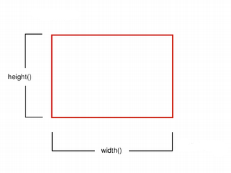
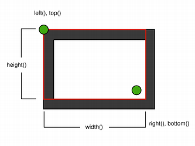
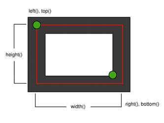
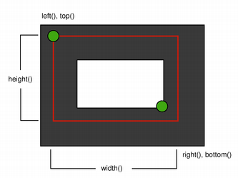
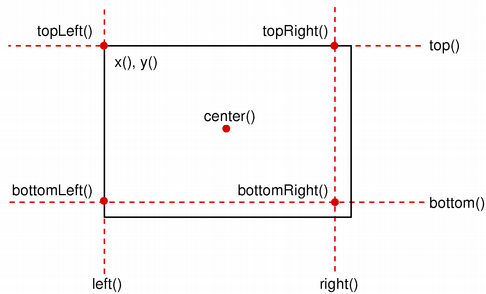

# QRect Class Reference

## [[QtCore](index.htm) module]

查阅QRect类定义使用整数精度在平面的矩形。[More...](#details)

### Methods

*   `__init__ (self)`
*   `__init__ (self, int aleft, int atop, int awidth, int aheight)`
*   `__init__ (self, QPoint atopLeft, QPoint abottomRight)`
*   `__init__ (self, QPoint atopLeft, QSize asize)`
*   `__init__ (self, QRect)`
*   `adjust (self, int dx1, int dy1, int dx2, int dy2)`
*   `QRect adjusted (self, int xp1, int yp1, int xp2, int yp2)`
*   `int bottom (self)`
*   `QPoint bottomLeft (self)`
*   `QPoint bottomRight (self)`
*   `QPoint center (self)`
*   `bool contains (self, QPoint point, bool proper = False)`
*   `bool contains (self, QRect rectangle, bool proper = False)`
*   `bool contains (self, int ax, int ay, bool aproper)`
*   `bool contains (self, int ax, int ay)`
*   `(int xp1, int yp1, int xp2, int yp2) getCoords (self)`
*   `(int ax, int ay, int aw, int ah) getRect (self)`
*   `int height (self)`
*   `QRect intersect (self, QRect r)`
*   `QRect intersected (self, QRect other)`
*   `bool intersects (self, QRect r)`
*   `bool isEmpty (self)`
*   `bool isNull (self)`
*   `bool isValid (self)`
*   `int left (self)`
*   `moveBottom (self, int pos)`
*   `moveBottomLeft (self, QPoint p)`
*   `moveBottomRight (self, QPoint p)`
*   `moveCenter (self, QPoint p)`
*   `moveLeft (self, int pos)`
*   `moveRight (self, int pos)`
*   `moveTo (self, int ax, int ay)`
*   `moveTo (self, QPoint p)`
*   `moveTop (self, int pos)`
*   `moveTopLeft (self, QPoint p)`
*   `moveTopRight (self, QPoint p)`
*   `QRect normalized (self)`
*   `int right (self)`
*   `setBottom (self, int pos)`
*   `setBottomLeft (self, QPoint p)`
*   `setBottomRight (self, QPoint p)`
*   `setCoords (self, int xp1, int yp1, int xp2, int yp2)`
*   `setHeight (self, int h)`
*   `setLeft (self, int pos)`
*   `setRect (self, int ax, int ay, int aw, int ah)`
*   `setRight (self, int pos)`
*   `setSize (self, QSize s)`
*   `setTop (self, int pos)`
*   `setTopLeft (self, QPoint p)`
*   `setTopRight (self, QPoint p)`
*   `setWidth (self, int w)`
*   `setX (self, int ax)`
*   `setY (self, int ay)`
*   `QSize size (self)`
*   `int top (self)`
*   `QPoint topLeft (self)`
*   `QPoint topRight (self)`
*   `translate (self, int dx, int dy)`
*   `translate (self, QPoint p)`
*   `QRect translated (self, int dx, int dy)`
*   `QRect translated (self, QPoint p)`
*   `QRect unite (self, QRect r)`
*   `QRect united (self, QRect r)`
*   `int width (self)`
*   `int x (self)`
*   `int y (self)`

### Special Methods

*   `QRect __and__ (self, QRect r)`
*   `int __bool__ (self)`
*   `int __contains__ (self, QPoint p)`
*   `int __contains__ (self, QRect r)`
*   `bool __eq__ (self, QRect r2)`
*   `QRect __iand__ (self, QRect r)`
*   `QRect __ior__ (self, QRect r)`
*   `bool __ne__ (self, QRect r2)`
*   `QRect __or__ (self, QRect r)`
*   `str __repr__ (self)`

* * *

## Detailed Description

这个类可以醃制。

查阅QRect类定义使用整数精度在平面的矩形。

一个矩形，通常表示为左上角和尺寸。一个查阅QRect的大小（宽度和高度）总是等于其形成的基础，其呈现的数学矩形。

阿查阅QRect可以用一组左，上，宽度和高度的整数，或者从一个被构造[QPoint](qpoint.html)和[QSize](qsize.html)。下面的代码创建两个相同的矩形。

```
 QRect r1(100, 200, 11, 16);
 QRect r2([QPoint](qpoint.html)(100, 200), [QSize](qsize.html)(11, 16));

```

还有就是使用左上角和右下角坐标创建一个查阅QRect第三个构造函数，但是我们建议您避免使用它。理由是，由于历史原因，返回的值[bottom](qrect.html#bottom)（）和[right](qrect.html#right)（）函数偏离矩形的真实右下角。

查阅QRect类提供了返回的各种矩形坐标函数的集合，使操纵这些。查阅QRect也提供功能，以矩形相对移动到不同的坐标。此外，还有一个[moveTo](qrect.html#moveTo)（ ）函数，移动矩形，留下它的左上角在给定的坐标。或者，所述[translate](qrect.html#translate)（）函数使矩形给定的偏移量相对于当前位置，并且[translated](qrect.html#translated)（ ）函数返回这个矩形的翻译件。

该[size](qrect.html#size)（ ）函数返回rectange的尺寸为[QSize](qsize.html)。的尺寸也可以单独使用检索到的[width](qrect.html#width)（）和[height](qrect.html#height)（）函数。操控方面使用[setSize](qrect.html#setSize)（ ）[setWidth](qrect.html#setWidth)（）或[setHeight](qrect.html#setHeight)（）函数。可替换地，大小可以通过应用或功能设定矩形的坐标，例如被改变，[setBottom](qrect.html#setBottom)（）或[setRight](qrect.html#setRight)（ ） 。

该[contains](qrect.html#contains)（ ）函数告诉一个给定的点是否是里面的矩形或没有了，[intersects](qrect.html#intersects)如果这个矩形相交与给定的矩形（ ）函数返回True。查阅QRect类还提供了[intersected](qrect.html#intersected)（）函数返回相交的矩形，并在[united](qrect.html#united)（ ）函数将返回一个封装给定的矩形，这个矩形：

|  |  |
| [intersected](qrect.html#intersected)() | [united](qrect.html#united)() |

该[isEmpty](qrect.html#isEmpty)（ ）函数返回True，如果[left](qrect.html#left)（ ） \u003e[right](qrect.html#right)（）或[top](qrect.html#top)（ ） \u003e[bottom](qrect.html#bottom)（ ） 。需要注意的是一个空矩形是无效的：在[isValid](qrect.html#isValid)（ ）函数返回True，如果[left](qrect.html#left)（ ）\u003c=[right](qrect.html#right)（ ）_and_ [top](qrect.html#top)（ ）\u003c=[bottom](qrect.html#bottom)（ ） 。一个空矩形（[isNull](qrect.html#isNull)（）== TRUE） ，另一方面，也将宽度和高度设置为0。

注意，由于该方式查阅QRect和[QRectF](qrectf.html)被定义，一个空的查阅QRect在本质上以同样的方式定义为[QRectF](qrectf.html)。

最后，相比查阅QRect对象可以被串流播放，以及。

### Rendering

当使用一个[anti-aliased](qpainter.html#RenderHint-enum)画家，查阅QRect的边界线将对称地在数学矩形的边界线的两侧呈现。但使用一个别名画家（默认值）时，其他规则。

然后，用一个像素宽的画笔渲染时查阅QRect的边界线将呈现给正确的和数学矩形的边界线下方。

当与两个像素宽画笔绘制边界线会由数学矩形被分割在中间。这将是这种情况时的笔被设置成偶数个像素，而与像素数为奇数的笔绘制，备用像素将呈现向右和数学矩形中的一个像素的情况下。

|  |  |
| Logical representation | One pixel wide pen |
|  |  |
| Two pixel wide pen | Three pixel wide pen |

### Coordinates

查阅QRect类提供了返回的各种矩形坐标函数的集合，使操纵这些。查阅QRect也提供功能，以矩形相对移动到不同的坐标。

例如在[left](qrect.html#left)（ ）[setLeft](qrect.html#setLeft)（）和[moveLeft](qrect.html#moveLeft)（）函数，例如：[left](qrect.html#left)（）返回矩形的左边缘的x坐标，[setLeft](qrect.html#setLeft)（）设置矩形的左边缘到给定的x坐标（它可能会改变宽度，但决不会改变矩形的右边缘）和[moveLeft](qrect.html#moveLeft)（ ）移动整个矩形水平，使矩形的左边缘在给定的x坐标和尺寸不变。



请注意，返回的值的历史原因[bottom](qrect.html#bottom)（）和[right](qrect.html#right)（）函数偏离矩形的真实右下角：该[right](qrect.html#right)（ ）函数返回_[left](qrect.html#left)() + [width](qrect.html#width)() - 1_和[bottom](qrect.html#bottom)（ ）函数返回_[top](qrect.html#top)() + [height](qrect.html#height)() - 1_。同样是由返回的点的情况[bottomRight](qrect.html#bottomRight)（ ）的便利功能。另外， x和y的坐标[topRight](qrect.html#topRight)（）和[bottomLeft](qrect.html#bottomLeft)（）函数，分别包含来自真右边缘和下边缘的偏差相同。

我们建议您使用[x](qrect.html#x)（）+[width](qrect.html#width)（）和[y](qrect.html#y)（）+[height](qrect.html#height)（ ）找到真正的右下角，并避免[right](qrect.html#right)（）和[bottom](qrect.html#bottom)（ ） 。另一个解决方案是使用[QRectF](qrectf.html)：该[QRectF](qrectf.html)类定义使用浮点精度的坐标平面中的矩形，而[QRectF.right](qrectf.html#right)（）和[QRectF.bottom](qrectf.html#bottom)（ ）函数_do_返回右边和底部坐标。

另外，也可以使用偏移量添加到该矩形的坐标[adjust](qrect.html#adjust)（）函数，以及检索使用基于原来的1调整一个新的矩形的[adjusted](qrect.html#adjusted)（）函数。如果其中的宽度和高度为负时，用[normalized](qrect.html#normalized)（）函数来检索其中的角部被交换的矩形。

此外，查阅QRect提供[getCoords](qrect.html#getCoords)（）函数，其提取的矩形的左上角和右下角的位置，并且[getRect](qrect.html#getRect)（ ）函数，它提取矩形的左上角，宽度和高度。使用[setCoords](qrect.html#setCoords)（）和[setRect](qrect.html#setRect)（ ）函数来处理矩形的坐标和尺寸一气呵成。

* * *

## Method Documentation

```
QRect.__init__ (self)
```

构造一个空矩形。

**See also** [isNull](qrect.html#isNull)（ ） 。

```
QRect.__init__ (self, int aleft, int atop, int awidth, int aheight)
```

构造一个矩形与给定_topLeft_和_bottomRight_角落。

**See also** [setTopLeft](qrect.html#setTopLeft)（）和[setBottomRight](qrect.html#setBottomRight)（ ） 。

```
QRect.__init__ (self, QPoint atopLeft, QPoint abottomRight)
```

构造一个矩形与给定_topLeft_角部和所述定_size_。

**See also** [setTopLeft](qrect.html#setTopLeft)（）和[setSize](qrect.html#setSize)（ ） 。

```
QRect.__init__ (self, QPoint atopLeft, QSize asize)
```

构造一个矩形（_x_，_y_）作为它的左上角和给定的_width_和_height_。

**See also** [setRect](qrect.html#setRect)（ ） 。

```
QRect.__init__ (self, QRect)
```

```
QRect.adjust (self, int dx1, int dy1, int dx2, int dy2)
```

添加_dx1_，_dy1_，_dx2_和_dy2_分别以矩形的现有的坐标。

**See also** [adjusted](qrect.html#adjusted)（）和[setRect](qrect.html#setRect)（ ） 。

```
QRect QRect.adjusted (self, int xp1, int yp1, int xp2, int yp2)
```

[

返回一个新的矩形_dx1_，_dy1_，_dx2_和_dy2_分别加入到这个矩形的现有坐标。

](qrect.html)

[**See also**](qrect.html) [adjust](qrect.html#adjust)（ ） 。

```
int QRect.bottom (self)
```

返回矩形的底边的y坐标。

请注意，由于历史原因，该函数返回[top](qrect.html#top)（）+[height](qrect.html#height)（ ） - 1 ;使用[y](qrect.html#y)（）+[height](qrect.html#height)（）来获取真正的y坐标。

**See also** [setBottom](qrect.html#setBottom)（ ）[bottomLeft](qrect.html#bottomLeft)（）和[bottomRight](qrect.html#bottomRight)（ ） 。

```
QPoint QRect.bottomLeft (self)
```

[](qpoint.html)

[返回矩形的左下角的位置。请注意，由于历史原因，该函数返回](qpoint.html)[QPoint](qpoint.html)（[left](qrect.html#left)（ ）[top](qrect.html#top)（）+[height](qrect.html#height)（ ） - 1 ） 。

**See also** [setBottomLeft](qrect.html#setBottomLeft)（ ）[bottom](qrect.html#bottom)（）和[left](qrect.html#left)（ ） 。

```
QPoint QRect.bottomRight (self)
```

[

返回矩形的右下角的位置。

](qpoint.html)

[请注意，由于历史原因，该函数返回](qpoint.html)[QPoint](qpoint.html)（[left](qrect.html#left)（）+[width](qrect.html#width)（）-1 ，[top](qrect.html#top)（）+[height](qrect.html#height)（ ） - 1 ） 。

**See also** [setBottomRight](qrect.html#setBottomRight)（ ）[bottom](qrect.html#bottom)（）和[right](qrect.html#right)（ ） 。

```
QPoint QRect.center (self)
```

[

返回矩形的中心点。

](qpoint.html)

[**See also**](qpoint.html) [moveCenter](qrect.html#moveCenter)（ ） 。

```
bool QRect.contains (self, QPoint point, bool proper = False)
```

返回True如果给定的_point_是内部或矩形的边缘，否则返回False 。如果_proper_诚然，这个功能只有在给定返回True_point_ is _inside_的矩形（即，不上的边缘）。

**See also** [intersects](qrect.html#intersects)（ ） 。

```
bool QRect.contains (self, QRect rectangle, bool proper = False)
```

这是一个重载函数。

返回True如果点（_x_，_y_）是内部或矩形的边缘，否则返回False 。如果_proper_诚然，这个功能只有在点是完全的矩形（而不是在边缘）内返回True 。

```
bool QRect.contains (self, int ax, int ay, bool aproper)
```

这是一个重载函数。

返回True如果点（_x_，_y_）是这个矩形内，否则返回False 。

```
bool QRect.contains (self, int ax, int ay)
```

这是一个重载函数。

返回True如果给定的_rectangle_这是矩形内。否则返回False 。如果_proper_诚然，这个函数只返回True，如果_rectangle_完全是这个矩形（而不是在边缘）内。

```
(int xp1, int yp1, int xp2, int yp2) QRect.getCoords (self)
```

提取矩形的左上角的位置*_x1_和*_y1_和右下角为*的位置_x2_和*_y2_。

**See also** [setCoords](qrect.html#setCoords)（）和[getRect](qrect.html#getRect)（ ） 。

```
(int ax, int ay, int aw, int ah) QRect.getRect (self)
```

提取矩形的左上角的位置*_x_和*_y_，其尺寸*_width_和*_height_。

**See also** [setRect](qrect.html#setRect)（）和[getCoords](qrect.html#getCoords)（ ） 。

```
int QRect.height (self)
```

返回该矩形的高度。

**See also** [setHeight](qrect.html#setHeight)（ ）[width](qrect.html#width)（）和[size](qrect.html#size)（ ） 。

```
QRect QRect.intersect (self, QRect r)
```

[](qrect.html)

```
QRect QRect.intersected (self, QRect other)
```

[

返回此矩形的交集和给定的_rectangle_。需要注意的是`r.intersected(s)`相当于`r & s`。


这个函数中引入了Qt 4.2中。

](qrect.html)

[**See also**](qrect.html) [intersects](qrect.html#intersects)（ ）[united](qrect.html#united)（）和[operator&=](qrect.html#operator-and-eq)（ ） 。

```
bool QRect.intersects (self, QRect r)
```

如果这个矩形相交与给定的，则返回True_rectangle_（即，至少有一个像素是两个矩形内），否则返回假。

相交的矩形可使用检索到的[intersected](qrect.html#intersected)（）函数。

**See also** [contains](qrect.html#contains)（ ） 。

```
bool QRect.isEmpty (self)
```

返回True如果矩形为空，否则返回False 。

一个空矩形有一个[left](qrect.html#left)（ ） \u003e[right](qrect.html#right)（）或[top](qrect.html#top)（ ） \u003e[bottom](qrect.html#bottom)（ ） 。一个空矩形是无效的（即，参考isEmpty （ ） == ！[isValid](qrect.html#isValid)（））。

使用[normalized](qrect.html#normalized)（）函数来检索其中的角部被交换的矩形。

**See also** [isNull](qrect.html#isNull)（ ）[isValid](qrect.html#isValid)（）和[normalized](qrect.html#normalized)（ ） 。

```
bool QRect.isNull (self)
```

返回True如果矩形为空矩形，否则返回False 。

空矩形具有的宽度和高度设置为0 （即[right](qrect.html#right)（）==[left](qrect.html#left)（ ） - 1[bottom](qrect.html#bottom)（）==[top](qrect.html#top)（ ） - 1 ） 。一个空的矩形也是空的，因此是无效的。

**See also** [isEmpty](qrect.html#isEmpty)（）和[isValid](qrect.html#isValid)（ ） 。

```
bool QRect.isValid (self)
```

返回True如果矩形是有效的，否则返回False 。

一个有效的矩形有一个[left](qrect.html#left)（）\u003c[right](qrect.html#right)（）和[top](qrect.html#top)（）\u003c[bottom](qrect.html#bottom)（ ） 。请注意，就像十字路口不平凡的操作没有定义无效矩形。一个有效的矩形不为空（即参考isValid （ ） == ！[isEmpty](qrect.html#isEmpty)（））。

**See also** [isNull](qrect.html#isNull)（ ）[isEmpty](qrect.html#isEmpty)（）和[normalized](qrect.html#normalized)（ ） 。

```
int QRect.left (self)
```

返回矩形的左边缘的x坐标。相当于[x](qrect.html#x)（ ） 。

**See also** [setLeft](qrect.html#setLeft)（ ）[topLeft](qrect.html#topLeft)（）和[bottomLeft](qrect.html#bottomLeft)（ ） 。

```
QRect.moveBottom (self, int pos)
```

移动矩形垂直，使矩形的底边在给定的_y_协调。矩形的尺寸是不变的。

**See also** [bottom](qrect.html#bottom)（ ）[setBottom](qrect.html#setBottom)（）和[moveTop](qrect.html#moveTop)（ ） 。

```
QRect.moveBottomLeft (self, QPoint p)
```

移动矩形，留下左下角在给定的_position_。矩形的尺寸是不变的。

**See also** [setBottomLeft](qrect.html#setBottomLeft)（ ）[moveBottom](qrect.html#moveBottom)（）和[moveLeft](qrect.html#moveLeft)（ ） 。

```
QRect.moveBottomRight (self, QPoint p)
```

移动矩形，留下右下角的定_position_。矩形的尺寸是不变的。

**See also** [setBottomRight](qrect.html#setBottomRight)（ ）[moveRight](qrect.html#moveRight)（）和[moveBottom](qrect.html#moveBottom)（ ） 。

```
QRect.moveCenter (self, QPoint p)
```

移动矩形，而使中心点在给定的_position_。矩形的尺寸是不变的。

**See also** [center](qrect.html#center)（ ） 。

```
QRect.moveLeft (self, int pos)
```

水平移动矩形，使矩形的左边缘在给定的_x_协调。矩形的尺寸是不变的。

**See also** [left](qrect.html#left)（ ）[setLeft](qrect.html#setLeft)（）和[moveRight](qrect.html#moveRight)（ ） 。

```
QRect.moveRight (self, int pos)
```

水平移动矩形，使矩形的右边缘在给定的_x_协调。矩形的尺寸是不变的。

**See also** [right](qrect.html#right)（ ）[setRight](qrect.html#setRight)（）和[moveLeft](qrect.html#moveLeft)（ ） 。

```
QRect.moveTo (self, int ax, int ay)
```

移动矩形，留下左上角的指定位置（_x_，_y_） 。矩形的尺寸是不变的。

**See also** [translate](qrect.html#translate)（）和[moveTopLeft](qrect.html#moveTopLeft)（ ） 。

```
QRect.moveTo (self, QPoint p)
```

移动矩形，留下左上角在给定的_position_。

```
QRect.moveTop (self, int pos)
```

移动矩形垂直，使矩形的顶边在给定的_y_协调。矩形的尺寸是不变的。

**See also** [top](qrect.html#top)（ ）[setTop](qrect.html#setTop)（）和[moveBottom](qrect.html#moveBottom)（ ） 。

```
QRect.moveTopLeft (self, QPoint p)
```

移动矩形，留下左上角在给定的_position_。矩形的尺寸是不变的。

**See also** [setTopLeft](qrect.html#setTopLeft)（ ）[moveTop](qrect.html#moveTop)（）和[moveLeft](qrect.html#moveLeft)（ ） 。

```
QRect.moveTopRight (self, QPoint p)
```

移动矩形，留下右上角的定_position_。矩形的尺寸是不变的。

**See also** [setTopRight](qrect.html#setTopRight)（ ）[moveTop](qrect.html#moveTop)（）和[moveRight](qrect.html#moveRight)（ ） 。

```
QRect QRect.normalized (self)
```

[

返回一个归一化的矩形，即，具有一个非负的宽度和高度的矩形。

](qrect.html)

[If](qrect.html) [width](qrect.html#width)（）\u003c 0的函数交换的左右角部，并且交换的顶部和底部边角，如果[height](qrect.html#height)（）\u003c 0 。

**See also** [isValid](qrect.html#isValid)（）和[isEmpty](qrect.html#isEmpty)（ ） 。

```
int QRect.right (self)
```

返回矩形的右边缘的x坐标。

请注意，由于历史原因，该函数返回[left](qrect.html#left)（）+[width](qrect.html#width)（ ） - 1 ;使用[x](qrect.html#x)（）+[width](qrect.html#width)（）来获取真正的x坐标。

**See also** [setRight](qrect.html#setRight)（ ）[topRight](qrect.html#topRight)（）和[bottomRight](qrect.html#bottomRight)（ ） 。

```
QRect.setBottom (self, int pos)
```

设置的矩形的底部边缘与给定的_y_协调。可能会改变高度，但决不会改变矩形的上边缘。

**See also** [bottom](qrect.html#bottom)（）和[moveBottom](qrect.html#moveBottom)（ ） 。

```
QRect.setBottomLeft (self, QPoint p)
```

设置矩形的左下角给定的_position_。可以改变大小，但决不会改变矩形的右上角。

**See also** [bottomLeft](qrect.html#bottomLeft)（）和[moveBottomLeft](qrect.html#moveBottomLeft)（ ） 。

```
QRect.setBottomRight (self, QPoint p)
```

设置矩形的右下角为给定的_position_。可以改变大小，但决不会改变矩形的左上角。

**See also** [bottomRight](qrect.html#bottomRight)（）和[moveBottomRight](qrect.html#moveBottomRight)（ ） 。

```
QRect.setCoords (self, int xp1, int yp1, int xp2, int yp2)
```

设置矩形的左上角的坐标为（_x1_，_y1_）和其右下角的坐标（_x2_，_y2_） 。

**See also** [coords](index.htm#coords)（ ）[getCoords](qrect.html#getCoords)（）和[setRect](qrect.html#setRect)（ ） 。

```
QRect.setHeight (self, int h)
```

设置了矩形的高度为给定的_height_。底部边缘被改变，但不顶一个。

**See also** [height](qrect.html#height)（）和[setSize](qrect.html#setSize)（ ） 。

```
QRect.setLeft (self, int pos)
```

设置了矩形的左边缘到给定的_x_协调。可能会改变宽度，但决不会改变矩形的右边缘。

相当于[setX](qrect.html#setX)（ ） 。

**See also** [left](qrect.html#left)（）和[moveLeft](qrect.html#moveLeft)（ ） 。

```
QRect.setRect (self, int ax, int ay, int aw, int ah)
```

设置矩形的左上角的坐标为（_x_，_y_） ，并且其大小为给定的_width_和_height_。

**See also** [rect](index.htm#rect)（ ）[getRect](qrect.html#getRect)（）和[setCoords](qrect.html#setCoords)（ ） 。

```
QRect.setRight (self, int pos)
```

设置了矩形的右边缘到给定的_x_协调。可能会改变宽度，但决不会改变矩形的左边缘。

**See also** [right](qrect.html#right)（）和[moveRight](qrect.html#moveRight)（ ） 。

```
QRect.setSize (self, QSize s)
```

设置了矩形的大小给定的_size_。在左上角不移动。

**See also** [size](qrect.html#size)（ ）[setWidth](qrect.html#setWidth)（）和[setHeight](qrect.html#setHeight)（ ） 。

```
QRect.setTop (self, int pos)
```

设置了矩形的顶边到给定的_y_协调。可能会改变高度，但决不会改变矩形的底边。

相当于[setY](qrect.html#setY)（ ） 。

**See also** [top](qrect.html#top)（）和[moveTop](qrect.html#moveTop)().

```
QRect.setTopLeft (self, QPoint p)
```

设置的矩形的左上角的给定_position_。可以改变大小，但决不会改变矩形的右下角。

**See also** [topLeft](qrect.html#topLeft)（）和[moveTopLeft](qrect.html#moveTopLeft)（ ） 。

```
QRect.setTopRight (self, QPoint p)
```

设置矩形的右上角，以给定的_position_。可以改变大小，但决不会改变矩形的左下角。

**See also** [topRight](qrect.html#topRight)（）和[moveTopRight](qrect.html#moveTopRight)（ ） 。

```
QRect.setWidth (self, int w)
```

设置了矩形的宽度与给定_width_。右边缘被改变，但不是左1 。

**See also** [width](qrect.html#width)（）和[setSize](qrect.html#setSize)（ ） 。

```
QRect.setX (self, int ax)
```

设置了矩形的左边缘到给定的_x_协调。可能会改变宽度，但决不会改变矩形的右边缘。

相当于[setLeft](qrect.html#setLeft)（ ） 。

**See also** [x](qrect.html#x)（ ）[setY](qrect.html#setY)（）和[setTopLeft](qrect.html#setTopLeft)（ ） 。

```
QRect.setY (self, int ay)
```

设置了矩形的顶边到给定的_y_协调。可能会改变高度，但决不会改变矩形的底边。

相当于[setTop](qrect.html#setTop)（ ） 。

**See also** [y](qrect.html#y)（ ）[setX](qrect.html#setX)（）和[setTopLeft](qrect.html#setTopLeft)（ ） 。

```
QSize QRect.size (self)
```

[

返回矩形的大小。

](qsize.html)

[**See also**](qsize.html) [setSize](qrect.html#setSize)（ ）[width](qrect.html#width)（）和[height](qrect.html#height)（ ） 。

```
int QRect.top (self)
```

返回矩形的上边缘的y坐标。相当于[y](qrect.html#y)（ ） 。

**See also** [setTop](qrect.html#setTop)（ ）[topLeft](qrect.html#topLeft)（）和[topRight](qrect.html#topRight)（ ） 。

```
QPoint QRect.topLeft (self)
```

[

返回矩形的左上角的位置。

](qpoint.html)

[**See also**](qpoint.html) [setTopLeft](qrect.html#setTopLeft)（ ）[top](qrect.html#top)（）和[left](qrect.html#left)（ ） 。

```
QPoint QRect.topRight (self)
```

[

返回矩形的右上角的位置。

](qpoint.html)

[请注意，由于历史原因，该函数返回](qpoint.html)[QPoint](qpoint.html)（[left](qrect.html#left)（）+[width](qrect.html#width)（）-1 ，[top](qrect.html#top)（））。

**See also** [setTopRight](qrect.html#setTopRight)（ ）[top](qrect.html#top)（）和[right](qrect.html#right)（ ） 。

```
QRect.translate (self, int dx, int dy)
```

移动矩形_dx_沿x轴和_dy_沿着y轴，相对于当前位置。正值移动矩形向右和向下。

**See also** [moveTopLeft](qrect.html#moveTopLeft)（ ）[moveTo](qrect.html#moveTo)（）和[translated](qrect.html#translated)（ ） 。

```
QRect.translate (self, QPoint p)
```

这是一个重载函数。

移动矩形_offset_。[x()](qpoint.html#x)沿x轴和_offset_。[y()](qpoint.html#y)沿着y轴，相对于当前位置。

```
QRect QRect.translated (self, int dx, int dy)
```

[

返回矩形的副本被翻译_dx_沿x轴和_dy_沿着y轴，相对于当前位置。正值移动矩形向右和向下。

](qrect.html)

[**See also**](qrect.html) [translate](qrect.html#translate)（ ） 。

```
QRect QRect.translated (self, QPoint p)
```

[

这是一个重载函数。

](qrect.html)

[返回矩形的副本被翻译_offset_。](qrect.html)[x()](qpoint.html#x)沿x轴和_offset_。[y()](qpoint.html#y)沿着y轴，相对于当前位置。

```
QRect QRect.unite (self, QRect r)
```

[](qrect.html)

```
QRect QRect.united (self, QRect r)
```

[

返回此矩形的边框和给定_rectangle_。


这个函数中引入了Qt 4.2中。

](qrect.html)

[**See also**](qrect.html) [intersected](qrect.html#intersected)（ ） 。

```
int QRect.width (self)
```

返回矩形的宽度。

**See also** [setWidth](qrect.html#setWidth)（ ）[height](qrect.html#height)（）和[size](qrect.html#size)（ ） 。

```
int QRect.x (self)
```

返回矩形的左边缘的x坐标。相当于[left](qrect.html#left)（ ） 。

**See also** [setX](qrect.html#setX)（ ）[y](qrect.html#y)（）和[topLeft](qrect.html#topLeft)（ ） 。

```
int QRect.y (self)
```

返回矩形的上边缘的y坐标。相当于[top](qrect.html#top)（ ） 。

**See also** [setY](qrect.html#setY)（ ）[x](qrect.html#x)（）和[topLeft](qrect.html#topLeft)（ ） 。

```
QRect QRect.__and__ (self, QRect r)
```

[

```
int QRect.__bool__ (self)
```

```
int QRect.__contains__ (self, QPoint p)
```

```
int QRect.__contains__ (self, QRect r)
```

```
bool QRect.__eq__ (self, QRect r2)
```

](qrect.html)

```
QRect QRect.__iand__ (self, QRect r)
```

[](qrect.html)

```
QRect QRect.__ior__ (self, QRect r)
```

[

```
bool QRect.__ne__ (self, QRect r2)
```

](qrect.html)

```
QRect QRect.__or__ (self, QRect r)
```

[

```
str QRect.__repr__ (self)
```

](qrect.html)