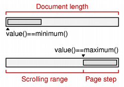

# QScrollBar Class Reference

## [[QtGui](index.htm) module]

该QScrollBar小工具提供了一个垂直或水平滚动条。[More...](#details)

继承[QAbstractSlider](qabstractslider.html)。

### Methods

*   `__init__ (self, QWidget parent = None)`
*   `__init__ (self, Qt.Orientation orientation, QWidget parent = None)`
*   `contextMenuEvent (self, QContextMenuEvent)`
*   `bool event (self, QEvent event)`
*   `hideEvent (self, QHideEvent)`
*   `initStyleOption (self, QStyleOptionSlider option)`
*   `mouseMoveEvent (self, QMouseEvent)`
*   `mousePressEvent (self, QMouseEvent)`
*   `mouseReleaseEvent (self, QMouseEvent)`
*   `paintEvent (self, QPaintEvent)`
*   `QSize sizeHint (self)`
*   `sliderChange (self, QAbstractSlider.SliderChange change)`

* * *

## Detailed Description

该QScrollBar小工具提供了一个垂直或水平滚动条。

滚动条是一个控制，使用户能够访问一个文件，比用于显示它的插件较大的部件。它提供的文档中的用户的当前位置的视觉指示，并且是可见的文档的量。滚动条通常配有其他的控制，使更精确的导航。 Qt的滚动显示的方式，适用于每个平台吧。

如果你需要提供一个滚动视图到另一个窗口小部件，它可能会更方便使用[QScrollArea](qscrollarea.html)类，因为这提供了一个视角构件和滚动条。如果你需要使用实施专门的小工具类似的功能QScrollBar是非常有用的[QAbstractScrollArea](qabstractscrollarea.html)，例如，如果你决定要继承[QAbstractItemView](qabstractitemview.html)。对于其中一个滑块控件用于在给定范围内获得的值，其他大多数情况下[QSlider](qslider.html)类可能更适合您的需要。

|  | Scroll bars typically include four separate controls: a slider, scroll arrows, and a page control.

*   a. The slider provides a way to quickly go to any part of the document, but does not support accurate navigation within large documents.
*   b. The scroll arrows are push buttons which can be used to accurately navigate to a particular place in a document. For a vertical scroll bar connected to a text editor, these typically move the current position one "line" up or down, and adjust the position of the slider by a small amount. In editors and list boxes a "line" might mean one line of text; in an image viewer it might mean 20 pixels.
*   c. The page control is the area over which the slider is dragged (the scroll bar's background). Clicking here moves the scroll bar towards the click by one "page". This value is usually the same as the length of the slider.

 |

每个捲轴都有一个值，指示多远滑块是滚动条的开始，这是与获得[value](qabstractslider.html#value-prop)（ ），并设置用[setValue](qabstractslider.html#value-prop)（ ） 。此值始终在滚动条中定义的值的范围之内在于，从[minimum()](qabstractslider.html#minimum-prop)至[maximum()](qabstractslider.html#minimum-prop)包容性。可接受的值的范围可以从被设置[setMinimum](qabstractslider.html#minimum-prop)（）和[setMaximum](qabstractslider.html#maximum-prop)（ ） 。在最小值时，滑块（对于垂直滚动条）或左边缘（对于水平滚动条）的顶部边缘将在顶部（或左）滚动条的末端。在最大值，底部（或右）的滑块的边缘将在底部（或右）滚动条的末端。

滑块的长度通常是关系到页步长的值，并且通常表示在滚动视图所示的文件区域的比例。在网页的步骤是量，当用户按下由值的变化**Page Up**和**Page Down**键，并且设置有[setPageStep](qabstractslider.html#pageStep-prop)（ ） 。由行步中定义的值较小的更改，可使用光标键做，并且这个数量被设置[setSingleStep()](qabstractslider.html#singleStep-prop)。

注意，所使用的值的范围是独立的滚动条控件的实际尺寸。你不需要当您选择的范围和页面步长值，以考虑到这一点。

滚动条中指定的值的范围往往决定不同，以这些为[QSlider](qslider.html)因为需要将滑块的长度来加以考虑。如果我们有一个100行的文件，我们只能显示一个小部件20行，我们不妨来构造一个滚动条与20页的步骤，为0的最小值， 80最大值。这将使我们有五个“页面”一个滚动条。

|  | The relationship between a document length, the range of values used in a scroll bar, and the page step is simple in many common situations. The scroll bar's range of values is determined by subtracting a chosen page step from some value representing the length of the document. In such cases, the following equation is useful: _document length_ = [maximum](qabstractslider.html#maximum-prop)() - [minimum](qabstractslider.html#minimum-prop)() + [pageStep](qabstractslider.html#pageStep-prop)(). |

QScrollBar只提供整数范围。请注意，虽然QScrollBar处理非常大的数字，对当前屏幕上的滚动条不能有效地代表上述约10万像素的范围。除此之外，它变得难以为用户控制使用键盘或鼠标的滑动件，和滚动箭头将具有有限的使用。

滚动条继承了一套完整的从信号[QAbstractSlider](qabstractslider.html)：

*   [valueChanged()](qabstractslider.html#valueChanged) is emitted when the scroll bar's value has changed. The tracking() determines whether this signal is emitted during user interaction.
*   [rangeChanged()](qabstractslider.html#rangeChanged) is emitted when the scroll bar's range of values has changed.
*   [sliderPressed()](qabstractslider.html#sliderPressed) is emitted when the user starts to drag the slider.
*   [sliderMoved()](qabstractslider.html#sliderMoved) is emitted when the user drags the slider.
*   [sliderReleased()](qabstractslider.html#sliderReleased) is emitted when the user releases the slider.
*   [actionTriggered()](qabstractslider.html#actionTriggered) is emitted when the scroll bar is changed by user interaction or via the [triggerAction()](qabstractslider.html#triggerAction) function.

滚动条可以通过键盘来控制，但它有一个缺省[focusPolicy](qwidget.html#focusPolicy-prop)的（ ）[Qt.NoFocus](qt.html#FocusPolicy-enum)。使用[setFocusPolicy](qwidget.html#focusPolicy-prop)（ ）来启用键盘交互使用滚动条：

*   Left/Right move a horizontal scroll bar by one single step.
*   Up/Down move a vertical scroll bar by one single step.
*   PageUp moves up one page.
*   PageDown moves down one page.
*   Home moves to the start (mininum).
*   End moves to the end (maximum).

滑动件本身可通过使用可控制的[triggerAction()](qabstractslider.html#triggerAction)函数来模拟使用滚动条控件的用户交互。如果你有很多使用值的常见各种不同的部件，这是很有用的。

大多数的GUI风格使用[pageStep](qabstractslider.html#pageStep-prop)（）值来计算滑块的尺寸。

|  | A scroll bar shown in the [Macintosh widget style](index.htm). |
|  | A scroll bar shown in the [Windows XP widget style](index.htm). |
|  | A scroll bar shown in the [Plastique widget style](index.htm). |

* * *

## Method Documentation

```
QScrollBar.__init__ (self, QWidget parent = None)
```

该_parent_的说法，如果不是没有，原因_self_通过Qt的，而不是PyQt的拥有。

构造一个垂直滚动条。

该_parent_参数被发送到[QWidget](qwidget.html)构造函数。

该[minimum](qabstractslider.html#minimum-prop)缺省值为0 ，则[maximum](qabstractslider.html#maximum-prop)为99，用[singleStep](qabstractslider.html#singleStep-prop)1尺寸和[pageStep](qabstractslider.html#pageStep-prop)10的尺寸，和一个初始[value](qabstractslider.html#value-prop)0 。

```
QScrollBar.__init__ (self, Qt.Orientation orientation, QWidget parent = None)
```

该_parent_的说法，如果不是没有，原因_self_通过Qt的，而不是PyQt的拥有。

构造一个滚动条给定的_orientation_。

该_parent_参数被传递到[QWidget](qwidget.html)构造函数。

该[minimum](qabstractslider.html#minimum-prop)缺省值为0 ，则[maximum](qabstractslider.html#maximum-prop)为99，用[singleStep](qabstractslider.html#singleStep-prop)1尺寸和[pageStep](qabstractslider.html#pageStep-prop)10的尺寸，和一个初始[value](qabstractslider.html#value-prop)0 。

```
QScrollBar.contextMenuEvent (self, QContextMenuEvent)
```

从重新实现[QWidget.contextMenuEvent](qwidget.html#contextMenuEvent)（ ） 。

```
bool QScrollBar.event (self, QEvent event)
```

从重新实现[QObject.event](qobject.html#event)（ ） 。

```
QScrollBar.hideEvent (self, QHideEvent)
```

从重新实现[QWidget.hideEvent](qwidget.html#hideEvent)（ ） 。

```
QScrollBar.initStyleOption (self, QStyleOptionSlider option)
```

初始化_option_与其它的值[QScrollBar](qscrollbar.html)。当他们需要一个这种方法是有用的子类[QStyleOptionSlider](qstyleoptionslider.html)，但不希望在所有的信息填写自己。

**See also** [QStyleOption.initFrom](qstyleoption.html#initFrom)（ ） 。

```
QScrollBar.mouseMoveEvent (self, QMouseEvent)
```

从重新实现[QWidget.mouseMoveEvent](qwidget.html#mouseMoveEvent)（ ） 。

```
QScrollBar.mousePressEvent (self, QMouseEvent)
```

从重新实现[QWidget.mousePressEvent](qwidget.html#mousePressEvent)（ ） 。

```
QScrollBar.mouseReleaseEvent (self, QMouseEvent)
```

从重新实现[QWidget.mouseReleaseEvent](qwidget.html#mouseReleaseEvent)（ ） 。

```
QScrollBar.paintEvent (self, QPaintEvent)
```

从重新实现[QWidget.paintEvent](qwidget.html#paintEvent)（ ） 。

```
QSize QScrollBar.sizeHint (self)
```

[](qsize.html)

[从重新实现](qsize.html)[QWidget.sizeHint](qwidget.html#sizeHint-prop)（ ） 。

```
QScrollBar.sliderChange (self, QAbstractSlider.SliderChange change)
```

从重新实现[QAbstractSlider.sliderChange](qabstractslider.html#sliderChange)（ ） 。