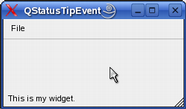
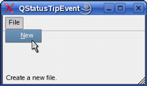

# QStatusTipEvent Class Reference

## [[QtGui](index.htm) module]

该QStatusTipEvent类提供了用于显示在状态栏消息的事件。[More...](#details)

继承[QEvent](qevent.html)。

### Methods

*   `__init__ (self, QString tip)`
*   `__init__ (self, QStatusTipEvent)`
*   `QString tip (self)`

* * *

## Detailed Description

该QStatusTipEvent类提供了用于显示在状态栏消息的事件。

状态提示可以在窗口小部件使用设置的[QWidget.setStatusTip](qwidget.html#statusTip-prop)（）函数。它们显示在状态栏，当鼠标光标进入窗口小部件。例如：

| 

```
 MainWindow.MainWindow([QWidget](qwidget.html) *parent)
     : [QMainWindow](qmainwindow.html)(parent)
 {
     [QWidget](qwidget.html) *myWidget = new [QWidget](qwidget.html);
     myWidget-&gt;setStatusTip(tr("This is my widget."));

     setCentralWidget(myWidget);
     ...
 }

```

 |  |

状态提示也可以使用动作设置[QAction.setStatusTip](qaction.html#statusTip-prop)（ ）函数：

| 

```
 MainWindow.MainWindow([QWidget](qwidget.html) *parent)
     : [QMainWindow](qmainwindow.html)(parent)
 {
     [QMenu](qmenu.html) *fileMenu = menuBar()-&gt;addMenu(tr("File"));

     [QAction](qaction.html) *newAct = new [QAction](qaction.html)(tr("&New"), this);
     newAct-&gt;setStatusTip(tr("Create a new file."));
     fileMenu-&gt;addAction(newAct);
     ...
 }

```

 |  |

最后，状态提示通过支持的项目视图类的[Qt.StatusTipRole](qt.html#ItemDataRole-enum)枚举值。

* * *

## Method Documentation

```
QStatusTipEvent.__init__ (self, QString tip)
```

构造一个状态提示事件与指定的文本_tip_。

**See also** [tip](qstatustipevent.html#tip)（ ） 。

```
QStatusTipEvent.__init__ (self, QStatusTipEvent)
```

```
QString QStatusTipEvent.tip (self)
```

返回消息在状态栏中显示。

**See also** [QStatusBar.showMessage](qstatusbar.html#showMessage)（ ） 。