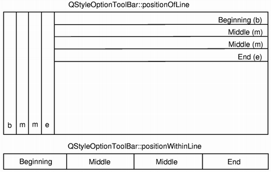

# QStyleOptionToolBar Class Reference

## [[QtGui](index.htm) module]

该QStyleOptionToolBar类用于描述参数绘图工具栏。[More...](#details)

继承[QStyleOption](qstyleoption.html)。

### Types

*   `enum StyleOptionType { Type }`
*   `enum StyleOptionVersion { Version }`
*   `enum ToolBarFeature { None, Movable }`
*   `class **[ToolBarFeatures](index.htm)**`
*   `enum ToolBarPosition { Beginning, Middle, End, OnlyOne }`

### Methods

*   `__init__ (self)`
*   `__init__ (self, QStyleOptionToolBar other)`

### Members

*   `ToolBarFeatures **[features](qstyleoptiontoolbar.html#features-var)**`
*   `int **[lineWidth](qstyleoptiontoolbar.html#lineWidth-var)**`
*   `int **[midLineWidth](qstyleoptiontoolbar.html#midLineWidth-var)**`
*   `ToolBarPosition **[positionOfLine](qstyleoptiontoolbar.html#positionOfLine-var)**`
*   `ToolBarPosition **[positionWithinLine](qstyleoptiontoolbar.html#positionWithinLine-var)**`
*   `Qt.ToolBarArea **[toolBarArea](qstyleoptiontoolbar.html#toolBarArea-var)**`

* * *

## Detailed Description

该QStyleOptionToolBar类用于描述参数绘图工具栏。

QStyleOptionToolBar包含的所有信息，[QStyle](qstyle.html)功能需要绘制[QToolBar](qtoolbar.html)。

出于性能方面的原因，访问成员变量是直接的（即使用`.` or `-&gt;`操作符）。这种低层次的感觉，使结构简单的使用，并强调这些只是所用的样式函数的参数。

该QStyleOptionToolBar类持有[lineWidth](qstyleoptiontoolbar.html#lineWidth-var)和[midLineWidth](qstyleoptiontoolbar.html#midLineWidth-var)用于绘制的窗口小部件。它还存储哪些信息[area](qstyleoptiontoolbar.html#toolBarArea-var)工具栏应设在，无论是动产还是不行，哪个位置的工具栏专线应具有（[positionOfLine](qstyleoptiontoolbar.html#positionOfLine-var)） ，以及工具栏的行内位置（[positionWithinLine](qstyleoptiontoolbar.html#positionWithinLine-var)） 。

此外，该类提供了一些枚举：本[ToolBarFeature](qstyleoptiontoolbar.html#ToolBarFeature-enum)枚举是用来描述一个工具栏是否是可移动的或不和[ToolBarPosition](qstyleoptiontoolbar.html#ToolBarPosition-enum)枚举是用来描述一个工具条线的位置，以及行内的工具栏的位置。

举一个例子展示风格选择如何使用，请参阅[Styles](index.htm)例子。

* * *

## Type Documentation

```
QStyleOptionToolBar.StyleOptionType
```

此枚举是用来保存有关样式选项的类型信息，并定义每个[QStyleOption](qstyleoption.html)子类。

| Constant | Value | Description |
| --- | --- | --- |
| `QStyleOptionToolBar.Type` | `SO_ToolBar` | 风格选择该类型提供（[SO_ToolBar](qstyleoption.html#OptionType-enum)这个类） 。 |

该类型在内部使用[QStyleOption](qstyleoption.html)，它的子类，并[qstyleoption_cast](qstyleoption.html#qstyleoption_cast)（）来确定的样式选项的类型。一般来说，你不需要担心这个，除非你想创建自己的[QStyleOption](qstyleoption.html)子类和你自己的风格。

**See also** [StyleOptionVersion](qstyleoptiontoolbar.html#StyleOptionVersion-enum)。

```
QStyleOptionToolBar.StyleOptionVersion
```

此枚举是用来保存有关样式选项的版本信息，并定义每个[QStyleOption](qstyleoption.html)子类。

| Constant | Value | Description |
| --- | --- | --- |
| `QStyleOptionToolBar.Version` | `1` | 1 |

的版本是由[QStyleOption](qstyleoption.html)子类实现不破坏兼容性扩展。如果你使用[qstyleoption_cast](qstyleoption.html#qstyleoption_cast)（ ） ，你通常并不需要检查它。

**See also** [StyleOptionType](qstyleoptiontoolbar.html#StyleOptionType-enum)。

```
QStyleOptionToolBar.ToolBarFeature
```

此枚举是用来描述一个工具栏是否是动产还是不行。

| Constant | Value | Description |
| --- | --- | --- |
| `QStyleOptionToolBar.None` | `0x0` | 该工具栏不能移动。的默认值。 |
| `QStyleOptionToolBar.Movable` | `0x1` | 工具栏是可移动的，并按住光标移到工具栏的边界时，手柄会出现。 |

该ToolBarFeatures类型是一个typedef为[QFlags](index.htm)\u003cToolBarFeature\u003e 。它存储ToolBarFeature值的或组合。

**See also** [features](qstyleoptiontoolbar.html#features-var)和[QToolBar.isMovable](qtoolbar.html#movable-prop)（ ） 。

```
QStyleOptionToolBar.ToolBarPosition
```



此枚举是用来描述一个工具栏线的位置，以及行内工具栏的位置。

一条线内的位置的顺序开始于垂直线的上方，并从左侧内的水平线。该线位置的顺序总是从父控件的边界边。

| Constant | Value | Description |
| --- | --- | --- |
| `QStyleOptionToolBar.Beginning` | `0` | 工具栏位于一行的开头，或在工具条线是第几行。只能有一个工具（只有一行）这一立场。 |
| `QStyleOptionToolBar.Middle` | `1` | 工具栏位于线的中间，或在工具条线是在几行的中间。能有几个工具栏（和线）这一立场。 |
| `QStyleOptionToolBar.End` | `2` | 该工具栏位于该行的末尾，或者在工具栏行是最后的几行。只能有一个工具（只有一行）这一立场。 |
| `QStyleOptionToolBar.OnlyOne` | `3` | 只有一个工具条或线。这是缺省值[positionOfLine](qstyleoptiontoolbar.html#positionOfLine-var)和[positionWithinLine](qstyleoptiontoolbar.html#positionWithinLine-var)变量。 |

**See also** [positionWithinLine](qstyleoptiontoolbar.html#positionWithinLine-var)和[positionOfLine](qstyleoptiontoolbar.html#positionOfLine-var)。

* * *

## Method Documentation

```
QStyleOptionToolBar.__init__ (self)
```

构造一个[QStyleOptionToolBar](qstyleoptiontoolbar.html)，初始化成员变量，它们的默认值。

```
QStyleOptionToolBar.__init__ (self, QStyleOptionToolBar other)
```

构造的一个副本_other_样式选项。

* * *

## Member Documentation

```
ToolBarFeatures features
```

[

这个变量保存工具栏是否是动产还是不行。

](index.htm)

[缺省值是](index.htm)[None](qstyleoptiontoolbar.html#ToolBarFeature-enum)。

```
int lineWidth
```

这个变量保存线宽绘制工具栏。

默认值是0。

```
int midLineWidth
```

这个变量保存中间线宽绘制工具栏。

默认值是0。

```
ToolBarPosition positionOfLine
```

[

这个变量保存在工具栏线的位置。

](qstyleoptiontoolbar.html#ToolBarPosition-enum)

[缺省值是](qstyleoptiontoolbar.html#ToolBarPosition-enum)[QStyleOptionToolBar.OnlyOne](qstyleoptiontoolbar.html#ToolBarPosition-enum)。

```
ToolBarPosition positionWithinLine
```

[

这个变量保存在一行内工具栏的位置。

](qstyleoptiontoolbar.html#ToolBarPosition-enum)

[缺省值是](qstyleoptiontoolbar.html#ToolBarPosition-enum)[QStyleOptionToolBar.OnlyOne](qstyleoptiontoolbar.html#ToolBarPosition-enum)。

```
Qt.ToolBarArea toolBarArea
```

[

这个变量保存的绘图工具栏的位置。

](qt.html#ToolBarArea-enum)

[缺省值是](qt.html#ToolBarArea-enum)[Qt.TopToolBarArea](qt.html#ToolBarArea-enum)。

**See also** [Qt.ToolBarArea](qt.html#ToolBarArea-enum)。