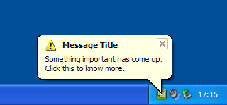

# QSystemTrayIcon Class Reference

## [[QtGui](index.htm) module]

该QSystemTrayIcon类提供了在系统托盘中的应用程序的图标。[More...](#details)

继承[QObject](qobject.html)。

### Types

*   `enum ActivationReason { Unknown, Context, DoubleClick, Trigger, MiddleClick }`
*   `enum MessageIcon { NoIcon, Information, Warning, Critical }`

### Methods

*   `__init__ (self, QObject parent = None)`
*   `__init__ (self, QIcon icon, QObject parent = None)`
*   `QMenu contextMenu (self)`
*   `bool event (self, QEvent event)`
*   `QRect geometry (self)`
*   `hide (self)`
*   `QIcon icon (self)`
*   `bool isVisible (self)`
*   `setContextMenu (self, QMenu menu)`
*   `setIcon (self, QIcon icon)`
*   `setToolTip (self, QString tip)`
*   `setVisible (self, bool visible)`
*   `show (self)`
*   `showMessage (self, QString title, QString msg, MessageIcon icon = QSystemTrayIcon.Information, int msecs = 10000)`
*   `QString toolTip (self)`

### Static Methods

*   `bool isSystemTrayAvailable ()`
*   `bool supportsMessages ()`

### Qt Signals

*   `void activated (QSystemTrayIcon::ActivationReason)`
*   `void messageClicked ()`

* * *

## Detailed Description

该QSystemTrayIcon类提供了在系统托盘中的应用程序的图标。

现代操作系统通常提供的特殊区域在桌面上，称为_system tray_ or _notification area_，其中长期运行的应用程序可以显示图标和短消息。



该QSystemTrayIcon类可以在以下平台上使用：

*   All supported versions of Windows.
*   All window managers for X11 that implement the [freedesktop.org](http://www.freedesktop.org/) system tray specification, including recent versions of KDE and GNOME.
*   All supported versions of Mac OS X. Note that the Growl notification system must be installed for [QSystemTrayIcon.showMessage](qsystemtrayicon.html#showMessage)() to display messages.

要检查系统托盘是否存在在用户的桌面上，调用[QSystemTrayIcon.isSystemTrayAvailable](qsystemtrayicon.html#isSystemTrayAvailable)（ ）静态函数。

要添加一个系统托盘项，创建一个QSystemTrayIcon对象，调用[setContextMenu](qsystemtrayicon.html#setContextMenu)（ ）提供的图标的上下文菜单，并调用[show](qsystemtrayicon.html#show)（） ，使其在系统托盘中可见。状态通知邮件（ “气球消息” ）可以被使用在任何时间显示[showMessage](qsystemtrayicon.html#showMessage)（ ） 。

如果系统托盘不可用时，系统托盘图标的构造，但后来变为可用， QSystemTrayIcon会自动在系统托盘中的应用程序添加一个条目，如果图标[visible](qsystemtrayicon.html#visible-prop)。

该[activated](qsystemtrayicon.html#activated)当用户激活的图标（）信号被发射。

只有在X11上，在工具提示的要求， QSystemTrayIcon收到[QHelpEvent](qhelpevent.html)类型[QEvent.ToolTip](qevent.html#Type-enum)。此外， QSystemTrayIcon接收型滚轮事件[QEvent.Wheel](qevent.html#Type-enum)。这些不支持在任何其他平台。

* * *

## Type Documentation

```
QSystemTrayIcon.ActivationReason
```

这个枚举变量描述系统托盘被激活的原因。

| Constant | Value | Description |
| --- | --- | --- |
| `QSystemTrayIcon.Unknown` | `0` | 不明原因 |
| `QSystemTrayIcon.Context` | `1` | 要求系统托盘项中的上下文菜单 |
| `QSystemTrayIcon.DoubleClick` | `2` | 系统托盘条目被双击时 |
| `QSystemTrayIcon.Trigger` | `3` | 系统托盘项被点击 |
| `QSystemTrayIcon.MiddleClick` | `4` | 系统托盘项与单击鼠标中键 |

**See also** [activated](qsystemtrayicon.html#activated)（ ） 。

```
QSystemTrayIcon.MessageIcon
```

这个枚举描述显示气球消息时所显示的图标。

| Constant | Value | Description |
| --- | --- | --- |
| `QSystemTrayIcon.NoIcon` | `0` | 显示图标。 |
| `QSystemTrayIcon.Information` | `1` | 显示信息图标。 |
| `QSystemTrayIcon.Warning` | `2` | 显示一个标准的警告图标。 |
| `QSystemTrayIcon.Critical` | `3` | 显示的严重警告图标。 |

**See also** [QMessageBox](qmessagebox.html)。

* * *

## Method Documentation

```
QSystemTrayIcon.__init__ (self, QObject parent = None)
```

该_parent_的说法，如果不是没有，原因_self_通过Qt的，而不是PyQt的拥有。

构造一个[QSystemTrayIcon](qsystemtrayicon.html)与给定对象_parent_。

该图标是最初不可见的。

**See also** [visible](qsystemtrayicon.html#visible-prop)。

```
QSystemTrayIcon.__init__ (self, QIcon icon, QObject parent = None)
```

该_parent_的说法，如果不是没有，原因_self_通过Qt的，而不是PyQt的拥有。

构造一个[QSystemTrayIcon](qsystemtrayicon.html)与给定对象_icon_和_parent_。

该图标是最初不可见的。

**See also** [visible](qsystemtrayicon.html#visible-prop)。

```
QMenu QSystemTrayIcon.contextMenu (self)
```

[

返回系统托盘项中的当前上下文菜单。

](qmenu.html)

[**See also**](qmenu.html) [setContextMenu](qsystemtrayicon.html#setContextMenu)（ ） 。

```
bool QSystemTrayIcon.event (self, QEvent event)
```

从重新实现[QObject.event](qobject.html#event)（ ） 。

```
QRect QSystemTrayIcon.geometry (self)
```

[

返回屏幕坐标系统托盘图标的几何形状。

此功能被引入Qt的4.3 。

](qrect.html)

[**See also**](qrect.html) [visible](qsystemtrayicon.html#visible-prop)。

```
QSystemTrayIcon.hide (self)
```

这种方法也是一个Qt槽与C + +的签名`void hide()`。

隐藏系统托盘项。

**See also** [show](qsystemtrayicon.html#show)（）和[visible](qsystemtrayicon.html#visible-prop)。

```
QIcon QSystemTrayIcon.icon (self)
```

[

```
bool QSystemTrayIcon.isSystemTrayAvailable ()
```

返回True如果系统托盘可用，否则返回False 。

](qicon.html)

[如果系统盘是目前不可用，但后来变为可用，](qicon.html)[QSystemTrayIcon](qsystemtrayicon.html)会自动在系统托盘中添加一个条目，如果它是[visible](qsystemtrayicon.html#visible-prop)。

```
bool QSystemTrayIcon.isVisible (self)
```

```
QSystemTrayIcon.setContextMenu (self, QMenu menu)
```

设置指定_menu_是为系统托盘图标的上下文菜单。

用户请求的上下文菜单中单击鼠标按钮，系统托盘图标时，菜单会弹出。

在Mac OS X ，这是currenly转换为NSMenu ，所以aboutToHide （ ）信号未发出。

**Note:**系统托盘图标不会拿菜单的所有权。必须确保它被删除在适当的时间通过，例如，在创建菜单与合适的父对象。

**See also** [contextMenu](qsystemtrayicon.html#contextMenu)（ ） 。

```
QSystemTrayIcon.setIcon (self, QIcon icon)
```

```
QSystemTrayIcon.setToolTip (self, QString tip)
```

```
QSystemTrayIcon.setVisible (self, bool visible)
```

这种方法也是一个Qt槽与C + +的签名`void setVisible(bool)`。

```
QSystemTrayIcon.show (self)
```

这种方法也是一个Qt槽与C + +的签名`void show()`。

显示在系统托盘中的图标。

**See also** [hide](qsystemtrayicon.html#hide)（）和[visible](qsystemtrayicon.html#visible-prop)。

```
QSystemTrayIcon.showMessage (self, QString title, QString msg, MessageIcon icon = QSystemTrayIcon.Information, int msecs = 10000)
```

示出了与给定的条目气球消息_title_，_message_和_icon_在指定的时间_millisecondsTimeoutHint_。_title_和_message_必须是纯文本字符串。

消息可以由用户进行点击;的[messageClicked](qsystemtrayicon.html#messageClicked)当这种情况发生时（ ）信号会发出。

注意消息的显示依赖于系统配置和用户偏好，而且信息可能不会出现在所有。因此，不应被依赖作为提供重要信息的唯一手段。

在Windows上，_millisecondsTimeoutHint_通常被忽略的系统时，该应用程序具有焦点。

在Mac OS X ，低吼通知系统必须安装此功能来显示消息。

此功能被引入Qt的4.3 。

**See also** [show](qsystemtrayicon.html#show)（）和[supportsMessages](qsystemtrayicon.html#supportsMessages)（ ） 。

```
bool QSystemTrayIcon.supportsMessages ()
```

返回True如果系统托盘支持气球的消息，否则返回False 。

**See also** [showMessage](qsystemtrayicon.html#showMessage)（ ） 。

```
QString QSystemTrayIcon.toolTip (self)
```

* * *

## Qt Signal Documentation

```
void activated (QSystemTrayIcon::ActivationReason)
```

这是该信号的默认超载。

当用户激活系统托盘图标这个信号被发射。_reason_指定用于激活的原因。[QSystemTrayIcon.ActivationReason](qsystemtrayicon.html#ActivationReason-enum)列举的各种原因。

**See also** [QSystemTrayIcon.ActivationReason](qsystemtrayicon.html#ActivationReason-enum)。

```
void messageClicked ()
```

这是该信号的默认超载。

当使用显示的消息这个信号被发射[showMessage](qsystemtrayicon.html#showMessage)（）被点击的用户。

目前，这个信号没有在Mac OS X发送

**Note:**我们遵循微软Windows XP / Vista的行为，所以当用户点击并显示气球消息托盘图标的信号也被发射。

**See also** [activated](qsystemtrayicon.html#activated)（ ） 。