# Qt Class Reference

## [[QtCore](index.htm) module]

Qt的命名空间包含了整个Qt库使用其他标识符。[More...](#details)

### Types

*   `class **[Alignment](index.htm)**`
*   `enum AlignmentFlag { AlignLeft, AlignLeading, AlignRight, AlignTrailing, ..., AlignCenter }`
*   `enum AnchorAttribute { AnchorName, AnchorHref }`
*   `enum AnchorPoint { AnchorLeft, AnchorHorizontalCenter, AnchorRight, AnchorTop, AnchorVerticalCenter, AnchorBottom }`
*   `enum ApplicationAttribute { AA_ImmediateWidgetCreation, AA_MSWindowsUseDirect3DByDefault, AA_DontShowIconsInMenus, AA_NativeWindows, ..., AA_CaptureMultimediaKeys }`
*   `enum ArrowType { NoArrow, UpArrow, DownArrow, LeftArrow, RightArrow }`
*   `enum AspectRatioMode { IgnoreAspectRatio, KeepAspectRatio, KeepAspectRatioByExpanding }`
*   `enum Axis { XAxis, YAxis, ZAxis }`
*   `enum BGMode { TransparentMode, OpaqueMode }`
*   `enum BrushStyle { NoBrush, SolidPattern, Dense1Pattern, Dense2Pattern, ..., TexturePattern }`
*   `enum CaseSensitivity { CaseInsensitive, CaseSensitive }`
*   `enum CheckState { Unchecked, PartiallyChecked, Checked }`
*   `enum ClipOperation { NoClip, ReplaceClip, IntersectClip, UniteClip }`
*   `enum ConnectionType { AutoConnection, DirectConnection, QueuedConnection, AutoCompatConnection, BlockingQueuedConnection, UniqueConnection }`
*   `enum ContextMenuPolicy { NoContextMenu, PreventContextMenu, DefaultContextMenu, ActionsContextMenu, CustomContextMenu }`
*   `enum CoordinateSystem { DeviceCoordinates, LogicalCoordinates }`
*   `enum Corner { TopLeftCorner, TopRightCorner, BottomLeftCorner, BottomRightCorner }`
*   `enum CursorMoveStyle { LogicalMoveStyle, VisualMoveStyle }`
*   `enum CursorShape { ArrowCursor, UpArrowCursor, CrossCursor, WaitCursor, ..., DragLinkCursor }`
*   `enum DateFormat { TextDate, ISODate, LocalDate, SystemLocaleDate, ..., DefaultLocaleLongDate }`
*   `enum DayOfWeek { Monday, Tuesday, Wednesday, Thursday, ..., Sunday }`
*   `enum DockWidgetArea { LeftDockWidgetArea, RightDockWidgetArea, TopDockWidgetArea, BottomDockWidgetArea, ..., NoDockWidgetArea }`
*   `class **[DockWidgetAreas](index.htm)**`
*   `enum DropAction { CopyAction, MoveAction, LinkAction, ActionMask, TargetMoveAction, IgnoreAction }`
*   `class **[DropActions](index.htm)**`
*   `enum EventPriority { HighEventPriority, NormalEventPriority, LowEventPriority }`
*   `enum FillRule { OddEvenFill, WindingFill }`
*   `enum FocusPolicy { NoFocus, TabFocus, ClickFocus, StrongFocus, WheelFocus }`
*   `enum FocusReason { MouseFocusReason, TabFocusReason, BacktabFocusReason, ActiveWindowFocusReason, ..., NoFocusReason }`
*   `enum GestureFlag { DontStartGestureOnChildren, ReceivePartialGestures, IgnoredGesturesPropagateToParent }`
*   `class **[GestureFlags](index.htm)**`
*   `enum GestureState { GestureStarted, GestureUpdated, GestureFinished, GestureCanceled }`
*   `enum GestureType { TapGesture, TapAndHoldGesture, PanGesture, PinchGesture, SwipeGesture, CustomGesture }`
*   `enum GlobalColor { color0, color1, black, white, ..., transparent }`
*   `enum HitTestAccuracy { ExactHit, FuzzyHit }`
*   `enum ImageConversionFlag { AutoColor, ColorOnly, MonoOnly, ThresholdAlphaDither, ..., AvoidDither }`
*   `class **[ImageConversionFlags](index.htm)**`
*   `enum InputMethodHint { ImhNone, ImhHiddenText, ImhNoAutoUppercase, ImhPreferNumbers, ..., ImhExclusiveInputMask }`
*   `class **[InputMethodHints](index.htm)**`
*   `enum InputMethodQuery { ImMicroFocus, ImFont, ImCursorPosition, ImSurroundingText, ..., ImAnchorPosition }`
*   `enum ItemDataRole { DisplayRole, DecorationRole, EditRole, ToolTipRole, ..., UserRole }`
*   `enum ItemFlag { NoItemFlags, ItemIsSelectable, ItemIsEditable, ItemIsDragEnabled, ..., ItemIsTristate }`
*   `class **[ItemFlags](index.htm)**`
*   `enum ItemSelectionMode { ContainsItemShape, IntersectsItemShape, ContainsItemBoundingRect, IntersectsItemBoundingRect }`
*   `enum Key { Key_Escape, Key_Tab, Key_Backtab, Key_Backspace, ..., Key_CameraFocus }`
*   `enum KeyboardModifier { NoModifier, ShiftModifier, ControlModifier, AltModifier, ..., KeyboardModifierMask }`
*   `class **[KeyboardModifiers](index.htm)**`
*   `enum LayoutDirection { LeftToRight, RightToLeft, LayoutDirectionAuto }`
*   `enum MaskMode { MaskInColor, MaskOutColor }`
*   `enum MatchFlag { MatchExactly, MatchFixedString, MatchContains, MatchStartsWith, ..., MatchRecursive }`
*   `class **[MatchFlags](index.htm)**`
*   `enum Modifier { META, SHIFT, CTRL, ALT, MODIFIER_MASK, UNICODE_ACCEL }`
*   `enum MouseButton { NoButton, LeftButton, RightButton, MidButton, ..., XButton2 }`
*   `class **[MouseButtons](index.htm)**`
*   `enum NavigationMode { NavigationModeNone, NavigationModeKeypadTabOrder, NavigationModeKeypadDirectional, NavigationModeCursorAuto, NavigationModeCursorForceVisible }`
*   `enum Orientation { Horizontal, Vertical }`
*   `class **[Orientations](index.htm)**`
*   `enum PenCapStyle { FlatCap, SquareCap, RoundCap, MPenCapStyle }`
*   `enum PenJoinStyle { MiterJoin, BevelJoin, RoundJoin, MPenJoinStyle, SvgMiterJoin }`
*   `enum PenStyle { NoPen, SolidLine, DashLine, DotLine, ..., MPenStyle }`
*   `enum ScrollBarPolicy { ScrollBarAsNeeded, ScrollBarAlwaysOff, ScrollBarAlwaysOn }`
*   `enum ShortcutContext { WidgetShortcut, WindowShortcut, ApplicationShortcut, WidgetWithChildrenShortcut }`
*   `enum SizeHint { MinimumSize, PreferredSize, MaximumSize, MinimumDescent }`
*   `enum SizeMode { AbsoluteSize, RelativeSize }`
*   `enum SortOrder { AscendingOrder, DescendingOrder }`
*   `enum TextElideMode { ElideLeft, ElideRight, ElideMiddle, ElideNone }`
*   `enum TextFlag { TextSingleLine, TextDontClip, TextExpandTabs, TextShowMnemonic, ..., TextJustificationForced }`
*   `enum TextFormat { PlainText, RichText, AutoText, LogText }`
*   `enum TextInteractionFlag { NoTextInteraction, TextSelectableByMouse, TextSelectableByKeyboard, LinksAccessibleByMouse, ..., TextBrowserInteraction }`
*   `class **[TextInteractionFlags](index.htm)**`
*   `enum TileRule { StretchTile, RepeatTile, RoundTile }`
*   `enum TimeSpec { LocalTime, UTC, OffsetFromUTC }`
*   `enum ToolBarArea { LeftToolBarArea, RightToolBarArea, TopToolBarArea, BottomToolBarArea, ..., NoToolBarArea }`
*   `class **[ToolBarAreas](index.htm)**`
*   `enum ToolButtonStyle { ToolButtonIconOnly, ToolButtonTextOnly, ToolButtonTextBesideIcon, ToolButtonTextUnderIcon, ToolButtonFollowStyle }`
*   `enum TouchPointState { TouchPointPressed, TouchPointMoved, TouchPointStationary, TouchPointReleased }`
*   `class **[TouchPointStates](index.htm)**`
*   `enum TransformationMode { FastTransformation, SmoothTransformation }`
*   `enum UIEffect { UI_General, UI_AnimateMenu, UI_FadeMenu, UI_AnimateCombo, ..., UI_AnimateToolBox }`
*   `enum WhiteSpaceMode { WhiteSpaceNormal, WhiteSpacePre, WhiteSpaceNoWrap, WhiteSpaceModeUndefined }`
*   `enum WidgetAttribute { WA_Disabled, WA_UnderMouse, WA_MouseTracking, WA_OpaquePaintEvent, ..., WA_MacNoShadow }`
*   `class **[WindowFlags](index.htm)**`
*   `enum WindowFrameSection { NoSection, LeftSection, TopLeftSection, TopSection, ..., TitleBarArea }`
*   `enum WindowModality { NonModal, WindowModal, ApplicationModal }`
*   `enum WindowState { WindowNoState, WindowMinimized, WindowMaximized, WindowFullScreen, WindowActive }`
*   `class **[WindowStates](index.htm)**`
*   `enum WindowType { Widget, Window, Dialog, Sheet, ..., WindowSoftkeysRespondHint }`

### Static Methods

*   `QString convertFromPlainText (QString plain, WhiteSpaceMode mode = Qt.WhiteSpacePre)`
*   `QString escape (QString plain)`
*   `bool mightBeRichText (QString)`

* * *

## Detailed Description

Qt的命名空间包含了整个Qt库使用其他标识符。

* * *

## Type Documentation

```
Qt.AlignmentFlag
```

该枚举类型用于描述对齐。它包含水平和垂直标记，它们可以被组合，以产生所需的效果。

该[TextElideMode](qt.html#TextElideMode-enum)列举也可以用在许多情况下，以微调对齐文本的外观。

水平的标志是：

| Constant | Value | Description |
| --- | --- | --- |
| `Qt.AlignLeft` | `0x0001` | 对齐的左边缘。 |
| `Qt.AlignRight` | `0x0002` | 对齐的右边缘。 |
| `Qt.AlignHCenter` | `0x0004` | 在可用空间中水平居中。 |
| `Qt.AlignJustify` | `0x0008` | 证明在可用空间的文字。 |

垂直标志是：

| Constant | Value | Description |
| --- | --- | --- |
| `Qt.AlignTop` | `0x0020` | 对齐顶部。 |
| `Qt.AlignBottom` | `0x0040` | 对齐的底部。 |
| `Qt.AlignVCenter` | `0x0080` | 在可用空间垂直居中。 |

你可以一次只的水平标志之一使用。有一个二维的标志：

| Constant | Value | Description |
| --- | --- | --- |
| `Qt.AlignCenter` | `AlignVCenter &#124; AlignHCenter` | 中心在这两个方面。 |

您可以在最一横一纵旗在同一时间使用。 Qt.AlignCenter计为横向和纵向。

三个枚举值是有用的，可以在从右到左的模式下运行的应用程序：

| Constant | Value | Description |
| --- | --- | --- |
| `Qt.AlignAbsolute` | `0x0010` | 如果小部件的布局方向是[Qt.RightToLeft](qt.html#LayoutDirection-enum)（而不是[Qt.LeftToRight](qt.html#LayoutDirection-enum)，默认值） ， Qt.AlignLeft指_right_边缘Qt.AlignRight到_left_边缘。这通常是所期望的行为。如果你想Qt.AlignLeft总是意味着“左”和Qt.AlignRight总是意味着“正确” ，结合标志与Qt.AlignAbsolute 。 |
| `Qt.AlignLeading` | `AlignLeft` | 同义词Qt.AlignLeft 。 |
| `Qt.AlignTrailing` | `AlignRight` | 同义词Qt.AlignRight 。 |

面具：

| Constant | Value |
| --- | --- |
| `Qt.AlignHorizontal_Mask` | `AlignLeft &#124; AlignRight &#124; AlignHCenter &#124; AlignJustify &#124; AlignAbsolute` |
| `Qt.AlignVertical_Mask` | `AlignTop &#124; AlignBottom &#124; AlignVCenter` |

标志相互矛盾的组合都未定义的含义。

对齐类型是一个typedef为[QFlags](index.htm)\u003cAlignmentFlag\u003e 。它存储AlignmentFlag值的或组合。

```
Qt.AnchorAttribute
```

一个锚固装置具有下列一个或多个属性：

| Constant | Value | Description |
| --- | --- | --- |
| `Qt.AnchorName` | `0` | 锚的name属性。滚动到文档中的定位时，这个属性被使用。 |
| `Qt.AnchorHref` | `1` | 锚点的href属性。这个属性用来当链接被点击，以确定哪些内容加载。 |

```
Qt.AnchorPoint
```

指定可被锚定的布局项目的一侧。这是由[QGraphicsAnchorLayout](qgraphicsanchorlayout.html)。

| Constant | Value | Description |
| --- | --- | --- |
| `Qt.AnchorLeft` | `0` | 布局项的左侧。 |
| `Qt.AnchorHorizontalCenter` | `1` | “虚拟”侧即左侧和右侧的一个布局项目之间的中央。 |
| `Qt.AnchorRight` | `2` | 右侧布局项目。 |
| `Qt.AnchorTop` | `3` | 布局项目的上侧。 |
| `Qt.AnchorVerticalCenter` | `4` | “虚拟”侧即顶部和布局项目的底侧之间的中央。 |
| `Qt.AnchorBottom` | `5` | 布局项目的底侧。 |

**See also** [QGraphicsAnchorLayout](qgraphicsanchorlayout.html)。

```
Qt.ApplicationAttribute
```

这个枚举说明更改应用程序级功能的行为属性。这些被启用和禁用使用[QCoreApplication.setAttribute](qcoreapplication.html#setAttribute)（ ），并且可以用于与被测试[QCoreApplication.testAttribute](qcoreapplication.html#testAttribute)（ ） 。

| Constant | Value | Description |
| --- | --- | --- |
| `Qt.AA_ImmediateWidgetCreation` | `0` | 确保小部件，尽快为他们构造创建。默认情况下，部件资源的按需分配，提高效率，减少资源的使用。设置或清除该属性影响的变化之后建造的部件。设置它告诉Qt立即创建顶层窗口。因此，如果要最大限度地减少资源消耗是很重要的，不要设置此属性。 |
| `Qt.AA_MSWindowsUseDirect3DByDefault` | `1` | 此值已过时，没有任何效果。 |
| `Qt.AA_DontShowIconsInMenus` | `2` | 与Icon属性的操作将不会显示在任何菜单，除非特别的设置[QAction.iconVisibleInMenu](qaction.html#iconVisibleInMenu-prop)属性。菜单当前打开或菜单中的原生Mac OS X的菜单栏已创建_may not_拿起这个属性的改变。变化[QAction.iconVisibleInMenu](qaction.html#iconVisibleInMenu-prop)属性将总是被拾起。 |
| `Qt.AA_NativeWindows` | `3` | 确保部件有本机窗口。 |
| `Qt.AA_DontCreateNativeWidgetSiblings` | `4` | 确保原生窗口部件的兄弟姐妹留的非本地除非特别由设置[Qt.WA_NativeWindow](qt.html#WidgetAttribute-enum)属性。 |
| `Qt.AA_MacPluginApplication` | `5` | 从做特定的初始化使用Qt来编写一个插件时，不一定有道理停止了Qt的mac应用程序。这包括避免加载我们的笔尖在主菜单中，而不是接管本机菜单栏。当设置该属性为True，也将设置AA_DontUseNativeMenuBar属性设置为True 。 |
| `Qt.AA_DontUseNativeMenuBar` | `6` | 而创造这个属性被设置为True的所有菜单栏将不会被用作本地菜单栏（例如，在菜单栏上的Mac OS X或Windows CE中底部的主屏幕的顶部） 。 |
| `Qt.AA_MacDontSwapCtrlAndMeta` | `7` | 在Mac OS X在默认情况下， Qt的交换控制和Meta （命令）键（即，当控制被按下时， Qt的发送梅塔，每当元被按下控制被发送） 。当此属性为True， Qt会不会做翻转。 QKeySequence.StandardShortcuts也将相应地翻动（即，[QKeySequence.Copy](qkeysequence.html#StandardKey-enum)将命令+ C在键盘上，无论设置的值，虽然什么是输出QKeySequence.toString （[QKeySequence.PortableText](qkeysequence.html#SequenceFormat-enum)）会有所不同） 。 |
| `Qt.AA_S60DontConstructApplicationPanes` | `8` | 停止从Qt的初始化S60的状态窗格和在Symbian软键窗格。这是为了节省内存并减少启动时间将在全屏模式下他们的整个生命周期中运行的应用程序非常有用。此属性之前，必须设置[QApplication](qapplication.html)构造。 |
| `Qt.AA_S60DisablePartialScreenInputMode` | `9` | 默认情况下，在Symbian ^ 3 ，一个单独的编辑窗口打开的应用程序的顶部。这也正是像编辑在Symbian循规蹈矩的早期版本。当该属性是假的，非全屏虚拟键盘窗口上显示的应用程序的顶部和它是确保聚焦的文本输入小部件是可见的。自动翻译输入窗口小部件仅支持基于应用程序[QGraphicsView](qgraphicsview.html)，但全萤幕虚拟键盘将工作（即QWidgets为主）的任何类型的应用程序。默认情况下这个属性为True 。此属性后，必须设置[QApplication](qapplication.html)构造。这是只支持Symbian ^ 3和Symbian的后释放。 |
| `Qt.AA_X11InitThreads` | `10` | 调用XInitThreads （）作为部分[QApplication](qapplication.html)建设，以使Xlib的调用线程安全的。此属性之前，必须设置[QApplication](qapplication.html)构造。 |
| `Qt.AA_CaptureMultimediaKeys` | `11` | 使应用程序能够接收多媒体按键事件（播放，下一个，上等等） 。这也包括外部来源，例如耳机。应用程序不能在Symbian上使用远程控制框架，如果此属性设置。在Symbian ，多媒体键事件路由可以在不同设备之间有所不同。例如，在后台应用程序可能会收到的多媒体按键事件仅当它有积极的音频流，即它正在播放的音乐或视频。此属性之前，必须设置[QApplication](qapplication.html)构造。此属性仅在Symbian平台的支持。 |

```
Qt.ArrowType
```

| Constant | Value |
| --- | --- |
| `Qt.NoArrow` | `0` |
| `Qt.UpArrow` | `1` |
| `Qt.DownArrow` | `2` |
| `Qt.LeftArrow` | `3` |
| `Qt.RightArrow` | `4` |

```
Qt.AspectRatioMode
```

这个枚举类型定义缩放的矩形时发生了宽高比什么。


| Constant | Value | Description |
| --- | --- | --- |
| `Qt.IgnoreAspectRatio` | `0` | 的尺寸可自由缩放。的纵横比不保留。 |
| `Qt.KeepAspectRatio` | `1` | 的大小进行缩放，以尽可能大的给定矩形中的矩形，保持纵横比。 |
| `Qt.KeepAspectRatioByExpanding` | `2` | 的尺寸被缩小到尽可能小的矩形指定的矩形外，保持纵横比。 |

**See also** [QSize.scale](qsize.html#scale)（）和[QImage.scaled](qimage.html#scaled)（ ） 。

```
Qt.Axis
```

该枚举类型定义了三个值来表示笛卡尔坐标系中的三个轴。

| Constant | Value | Description |
| --- | --- | --- |
| `Qt.XAxis` | `0` | X轴。 |
| `Qt.YAxis` | `1` | Y轴。 |
| `Qt.ZAxis` | `2` | Z轴。 |

**See also** [QTransform.rotate](qtransform.html#rotate)（）和[QTransform.rotateRadians](qtransform.html#rotateRadians)（ ） 。

```
Qt.BGMode
```

背景模式：

| Constant | Value |
| --- | --- |
| `Qt.TransparentMode` | `0` |
| `Qt.OpaqueMode` | `1` |

```
Qt.BrushStyle
```

这个枚举类型定义Qt所支持的画笔样式，即形状绘制使用的填充图案[QPainter](qpainter.html)。


| Constant | Value | Description |
| --- | --- | --- |
| `Qt.NoBrush` | `0` | 没刷模式。 |
| `Qt.SolidPattern` | `1` | 色泽均匀。 |
| `Qt.Dense1Pattern` | `2` | 极为密集的刷子模式。 |
| `Qt.Dense2Pattern` | `3` | 非常密集的刷子模式。 |
| `Qt.Dense3Pattern` | `4` | 有些密集刷模式。 |
| `Qt.Dense4Pattern` | `5` | 半密集刷模式。 |
| `Qt.Dense5Pattern` | `6` | 有些稀疏刷模式。 |
| `Qt.Dense6Pattern` | `7` | 非常稀疏刷模式。 |
| `Qt.Dense7Pattern` | `8` | 极其稀疏刷模式。 |
| `Qt.HorPattern` | `9` | 水平线。 |
| `Qt.VerPattern` | `10` | 垂直线。 |
| `Qt.CrossPattern` | `11` | 越过水平线和垂直线。 |
| `Qt.BDiagPattern` | `12` | 向后对角线。 |
| `Qt.FDiagPattern` | `13` | 向前的斜线。 |
| `Qt.DiagCrossPattern` | `14` | 渡对角线。 |
| `Qt.LinearGradientPattern` | `15` | 使用专用的线性梯度（设置[QBrush](qbrush.html)构造函数）。 |
| `Qt.ConicalGradientPattern` | `17` | 采用专用的锥型梯度（设置[QBrush](qbrush.html)构造函数）。 |
| `Qt.RadialGradientPattern` | `16` | 使用专用的径向渐变（设置[QBrush](qbrush.html)构造函数）。 |
| `Qt.TexturePattern` | `24` | 自定义模式（见[QBrush.setTexture](qbrush.html#setTexture)（））。 |

**See also** [QBrush](qbrush.html)。

```
Qt.CaseSensitivity
```

| Constant | Value |
| --- | --- |
| `Qt.CaseInsensitive` | `0` |
| `Qt.CaseSensitive` | `1` |

```
Qt.CheckState
```

这个枚举描述辨认物品，控件和小部件的状态。

| Constant | Value | Description |
| --- | --- | --- |
| `Qt.Unchecked` | `0` | 该项目处于未选中状态。 |
| `Qt.PartiallyChecked` | `1` | 该项目被部分选中。在分层模型项目可能如果一些被部分遏制，但不是他们的孩子的一切，都检查。 |
| `Qt.Checked` | `2` | 该项目被选中。 |

**See also** [QCheckBox](qcheckbox.html)，[Qt.ItemFlags](qt.html#ItemFlag-enum)和[Qt.ItemDataRole](qt.html#ItemDataRole-enum)。

```
Qt.ClipOperation
```

| Constant | Value | Description |
| --- | --- | --- |
| `Qt.NoClip` | `0` | 此操作将裁剪关闭。 |
| `Qt.ReplaceClip` | `1` | 替换当前剪辑路径/矩形/地区与在函数调用中提供的之一。 |
| `Qt.IntersectClip` | `2` | 相交当前剪辑路径/矩形/地区与在函数调用中提供的之一。 |
| `Qt.UniteClip` | `3` | 联合了当前剪辑路径/矩形/地区与在函数调用中提供的之一。 |

```
Qt.ConnectionType
```

这个枚举变量描述了可以信号和槽之间使用的连接类型。特别是，它确定一个特定的信号是否被传递到紧接在一个时隙或排队等待传递在以后的时间。

| Constant | Value | Description |
| --- | --- | --- |
| `Qt.AutoConnection` | `0` | （默认）如果该信号是从一个不同的线程以外的线程接收对象物所发出的信号进行排队，表现为Qt.QueuedConnection 。否则，插槽直接调用，表现为Qt.DirectConnection 。连接的类型，当信号被发射来确定。 |
| `Qt.DirectConnection` | `1` | 的时隙被立即调用，当信号被发射。 |
| `Qt.QueuedConnection` | `2` | 槽被调用时控制返回到接收器的线程的事件循环。插槽是在接收器的线程中执行。 |
| `Qt.BlockingQueuedConnection` | `4` | 同QueuedConnection ，除了当前线程阻塞，直到插槽回报。这种连接类型应该只用在发射器和接收器在不同的线程。**Note:**违背此规则将导致应用程序死锁。 |
| `Qt.UniqueConnection` | `0x80` | 一样的自动连接，但连接是唯一的，如果它不复制现有的连接。即，如果相同的信号已经连接到同一时隙的同一对的对象，则连接将失败。这种连接类型被引入Qt的4.6 。 |
| `Qt.AutoCompatConnection` | `3` | 当Qt的3支持启用默认的类型。相同，自动连接，但也将导致警告，在特定情况下的输出。看[Compatibility Signals and Slots](index.htm#compatibility-signals-and-slots)进一步的信息。 |

随着排队的连接，该参数必须是已知Qt的元对象系统类型，因为Qt的需要复制到它们存储在幕后事件的参数。如果您尝试使用一个排队的连接，并得到错误消息：

```
 QObject.connect: Cannot queue arguments of type 'MyType'

```

Call [qRegisterMetaType](qmetatype.html#qRegisterMetaType)（）注册的数据类型你建立连接之前。

当使用信号和槽多线程，请参见[Signals and Slots Across Threads](index.htm#signals-and-slots-across-threads)。

**See also** [Thread Support in Qt](index.htm)，[QObject.connect](qobject.html#connect)（ ）[qRegisterMetaType](qmetatype.html#qRegisterMetaType)（）和[Q_DECLARE_METATYPE](qmetatype.html#Q_DECLARE_METATYPE)（ ） 。

```
Qt.ContextMenuPolicy
```

这个枚举类型定义了各种政策窗口小部件可以相对于显示上下文菜单。

| Constant | Value | Description |
| --- | --- | --- |
| `Qt.NoContextMenu` | `0` | 小部件不具有上下文菜单，上下文菜单的处理被推迟到小部件的父。 |
| `Qt.PreventContextMenu` | `4` | 小部件不具有上下文菜单，并在对比`NoContextMenu`的处理是_not_推迟到控件的父级。这意味着所有的鼠标右键事件，保证通过mousePressEvent （ ）被传递到窗口小部件本身，而mouseReleaseEvent （ ） 。 |
| `Qt.DefaultContextMenu` | `1` | widget的[QWidget.contextMenuEvent](qwidget.html#contextMenuEvent)（ ）处理程序被调用。 |
| `Qt.ActionsContextMenu` | `2` | 该插件播放其[QWidget.actions](qwidget.html#actions)（）作为上下文菜单。 |
| `Qt.CustomContextMenu` | `3` | 小部件发出的[QWidget.customContextMenuRequested](qwidget.html#customContextMenuRequested)（）信号。 |

```
Qt.CoordinateSystem
```

这个枚举变量指定的坐标系。

| Constant | Value | Description |
| --- | --- | --- |
| `Qt.DeviceCoordinates` | `0` | 坐标是相对于对象的绘图设备的左上角。 |
| `Qt.LogicalCoordinates` | `1` | 坐标是相对于对象的左上角。 |

这个枚举被引入或修改的Qt 4.6 。

```
Qt.Corner
```

该枚举类型指定一个矩形一角：

| Constant | Value | Description |
| --- | --- | --- |
| `Qt.TopLeftCorner` | `0x00000` | 该矩形的左上角。 |
| `Qt.TopRightCorner` | `0x00001` | 矩形的右上角。 |
| `Qt.BottomLeftCorner` | `0x00002` | 矩形的左下角。 |
| `Qt.BottomRightCorner` | `0x00003` | 矩形的右下角。 |

```
Qt.CursorMoveStyle
```

这个枚举介绍可用于文本光标的运动风格。选项有：

| Constant | Value | Description |
| --- | --- | --- |
| `Qt.LogicalMoveStyle` | `0` | 在左到右文本块，减少光标位置按下左方向键时，按下向右箭头键时增加光标位置。如果文本块是从右到左，相反的行为适用。 |
| `Qt.VisualMoveStyle` | `1` | 按下左箭头键总是导致光标向左移动，而不管文本的写作方向。按右箭头键总是导致光标向右移动。 |

这个枚举被引入或修改的Qt 4.8 。

```
Qt.CursorShape
```

该枚举类型定义了可以使用的各种游标。

标准的箭头光标默认在正常状态小部件。

| Constant | Value | Description |
| --- | --- | --- |
| `Qt.ArrowCursor` | `0` | 标准的箭头光标。 |
| `Qt.UpArrowCursor` | `1` | 一个向上的箭头朝屏幕顶部指点。 |
| `Qt.CrossCursor` | `2` | 十字光标，通常用于帮助用户准确地在屏幕上选择一个点。 |
| `Qt.WaitCursor` | `3` | 沙漏或手表指针，通常的操作是防止用户与应用程序交互时显示。 |
| `Qt.IBeamCursor` | `4` | 插入符号或IBEAM光标，表明一个widget可以接受并显示文本输入。 |
| `Qt.SizeVerCursor` | `5` | 用于用来垂直调整顶层窗口元素的游标。 |
| `Qt.SizeHorCursor` | `6` | 用于元件的游标，用来调整水平顶层窗口。 |
| `Qt.SizeBDiagCursor` | `7` | 用于元件的游标，用于对角调整顶层窗口在其右上方和左下方的角落。 |
| `Qt.SizeFDiagCursor` | `8` | 用于元件的游标，用于对角调整顶层窗口在其左上角和右下角的角落。 |
| `Qt.SizeAllCursor` | `9` | 用于用来调整顶层窗口在任何方向元素的游标。 |
| `Qt.BlankCursor` | `10` | 空白/不可见光标，通常使用的光标形状需要被隐藏时。 |
| `Qt.SplitVCursor` | `11` | 用于垂直分割光标，表明一个手柄可以水平拖动来调整利用可用空间。 |
| `Qt.SplitHCursor` | `12` | 用于水平分离器A的光标，显示一个手柄可以垂直拖动来调整利用可用空间。 |
| `Qt.PointingHandCursor` | `13` | 指向手游标通常用于可点击的元素，如超链接。 |
| `Qt.ForbiddenCursor` | `14` | 斜线圆圈光标，在拖放操作通常用来表示拖着内容不能在特定的部件或某些地区内下降。 |
| `Qt.OpenHandCursor` | `17` | 游标较开放的手，通常用来表示光标所在的区域是一个画布，用户可以单击并拖动以滚动周围的可见部分。 |
| `Qt.ClosedHandCursor` | `18` | 光标代表一个封闭的面，通常用于表示一个拖动操作正在进行中，涉及到的滚动。 |
| `Qt.WhatsThisCursor` | `15` | 带问号的箭头，通常用来表示这是什么存在？帮助一个小部件。 |
| `Qt.BusyCursor` | `16` | 沙漏或手表指针，通常操作，它允许用户在他们在后台执行与应用程序进行交互时显示。 |
| `Qt.DragMoveCursor` | `20` | 拖动某一项时，通常使用的光标。 |
| `Qt.DragCopyCursor` | `19` | 拖动某一项进行复制时，通常使用的光标。 |
| `Qt.DragLinkCursor` | `21` | 拖动某一项时做一个链接到它，通常使用的光标。 |
| `Qt.BitmapCursor` | `24` |   |

```
Qt.DateFormat
```

| Constant | Value | Description |
| --- | --- | --- |
| `Qt.TextDate` | `0` | 默认的Qt的格式，其中包括天，月，该月的天数，以及全面的一年。日期和月份的名称将是短期的，局部的名字。这基本上等同于使用日期格式字符串， “ DDD MMM月Ð ” 。看[QDate.toString](qdate.html#toString)（ ）获取更多信息。 |
| `Qt.ISODate` | `1` | [ISO 8601](http://www.iso.org/iso/date_and_time_format)扩展格式：要么`YYYY-MM-DD`对于日期或`YYYY-MM-DDTHH:mm:ss`，`YYYY-MM-DDTHH:mm:ssTZD`（例如，1997 -07- 16T19 ： 20:30 +01:00 ）用于组合日期和时间。 |
| `Qt.SystemLocaleShortDate` | ？ | 该[short format](qlocale.html#FormatType-enum)所使用的[operating system](qlocale.html#system)。 |
| `Qt.SystemLocaleLongDate` | ？ | 该[long format](qlocale.html#FormatType-enum)所使用的[operating system](qlocale.html#system)。 |
| `Qt.DefaultLocaleShortDate` | ？ | 该[short format](qlocale.html#FormatType-enum)由指定的[application's locale](qlocale.html#setDefault)。 |
| `Qt.DefaultLocaleLongDate` | ？ | 该[long format](qlocale.html#FormatType-enum)所使用的[application's locale](qlocale.html#setDefault)。 |
| `Qt.SystemLocaleDate` | `2` | _This enum value is deprecated._（如果你想长日期或Qt.SystemLocaleLongDate ）使用Qt.SystemLocaleShortDate代替。 |
| `Qt.LocaleDate` | ？ | _This enum value is deprecated._（如果你想长日期或Qt.DefaultLocaleLongDate ）使用Qt.DefaultLocaleShortDate代替。 |
| `Qt.LocalDate` | `SystemLocaleDate` | _This enum value is deprecated._（如果你想长日期或Qt.SystemLocaleLongDate ）使用Qt.SystemLocaleShortDate代替。 |

**Note:**为`ISODate`格式，每`Y`，`M`和`D`代表一年中的单个数字，月份和用于指定日期天。每`H`，`M`和`S`代表小时的个位数，分钟和秒来指定时间。的字面存在`T`字符用于分隔日期和时两者都指定时间。

```
Qt.DayOfWeek
```

| Constant | Value |
| --- | --- |
| `Qt.Monday` | `1` |
| `Qt.Tuesday` | `2` |
| `Qt.Wednesday` | `3` |
| `Qt.Thursday` | `4` |
| `Qt.Friday` | `5` |
| `Qt.Saturday` | `6` |
| `Qt.Sunday` | `7` |

```
Qt.DockWidgetArea
```

| Constant | Value |
| --- | --- |
| `Qt.LeftDockWidgetArea` | `0x1` |
| `Qt.RightDockWidgetArea` | `0x2` |
| `Qt.TopDockWidgetArea` | `0x4` |
| `Qt.BottomDockWidgetArea` | `0x8` |
| `Qt.AllDockWidgetAreas` | `DockWidgetArea_Mask` |
| `Qt.NoDockWidgetArea` | `0` |

该DockWidgetAreas类型是一个typedef为[QFlags](index.htm)\u003cDockWidgetArea\u003e 。它存储DockWidgetArea值的或组合。

```
Qt.DropAction
```

| Constant | Value | Description |
| --- | --- | --- |
| `Qt.CopyAction` | `0x1` | 将数据复制到目标。 |
| `Qt.MoveAction` | `0x2` | 从源移动数据到目标。 |
| `Qt.LinkAction` | `0x4` | 建立从源到目标的链接。 |
| `Qt.ActionMask` | `0xff` |   |
| `Qt.IgnoreAction` | `0x0` | 忽略的动作（做什么用的数据） 。 |
| `Qt.TargetMoveAction` | `0x8002` | 在Windows上，这个值是用来当D ＆D数据的所有权应被接管目标应用程序，例如，源应用程序不应该删除的数据。
在X11这个值是用来做的举动。
TargetMoveAction不使用Mac上。 |

该DropActions类型是一个typedef为[QFlags](index.htm)\u003cDropAction\u003e 。它存储DropAction值的或组合。

```
Qt.EventPriority
```

这个枚举可用于指定事件的优先次序。

| Constant | Value | Description |
| --- | --- | --- |
| `Qt.HighEventPriority` | `1` | 与此优先级的事件与NormalEventPriority或LowEventPriority事件之前发送。 |
| `Qt.NormalEventPriority` | `0` | 与此优先级的事件与HighEventPriority事件后发送，但LowEventPriority事件之前。 |
| `Qt.LowEventPriority` | `-1` | 与此优先级的事件与HighEventPriority或NormalEventPriority事件后发送。 |

请注意，这些值是纯粹提供了方便，因为事件优先级可之间的任何值`INT_MAX`和`INT_MIN`，包容性。例如，您可以定义自定义的优先事项是相对于对方：

```
 enum CustomEventPriority
 {
     // An important event
     ImportantEventPriority = [Qt](qt.html).HighEventPriority,

     // A more important event
     MoreImportantEventPriority = ImportantEventPriority + 1,

     // A critical event
     CriticalEventPriority = 100 * MoreImportantEventPriority,

     // Not that important
     StatusEventPriority = [Qt](qt.html).LowEventPriority,

     // These are less important than Status events
     IdleProcessingDoneEventPriority = StatusEventPriority - 1
 };

```

**See also** [QCoreApplication.postEvent](qcoreapplication.html#postEvent)（ ） 。

```
Qt.FillRule
```

指定哪些方法应该被用于填充路径和多边形。

| Constant | Value | Description |
| --- | --- | --- |
| `Qt.OddEvenFill` | `0` | 指定区域使用奇偶填充规则填充。与此规则，我们确定一个点是否在形状内通过使用下面的方法。画横线的点的形状以外的位置，并计算交叉点的数目。如果交叉点的数目是奇数时，该点是在形状的内部。这种模式是默认的。 |
| `Qt.WindingFill` | `1` | 指定区域使用的是非零缠绕规则填补。与此规则，我们确定一个点是否在形状内通过使用下面的方法。画横线的点的形状以外的位置。确定线路在每个交叉点的方向是向上或向下。绕组数由求和每个交叉点的方向来确定。如果数字为非零，该点是在形状内部。此填充模式也可以在大多数情况下被认为是封闭的形状的交叉点。 |

```
Qt.FocusPolicy
```

这个枚举类型定义了各种政策窗口小部件可以就获得键盘焦点。

| Constant | Value | Description |
| --- | --- | --- |
| `Qt.TabFocus` | `0x1` | 小部件接受焦点由tab键。 |
| `Qt.ClickFocus` | `0x2` | 小部件接受焦点通过点击。 |
| `Qt.StrongFocus` | `TabFocus &#124; ClickFocus &#124; 0x8` | 小部件接受集中双方Tab键并单击。在Mac OS X这也将表明，窗口小部件选项卡接受焦点时，在“文本/列表对焦模式' 。 |
| `Qt.WheelFocus` | `StrongFocus &#124; 0x4` | 像Qt.StrongFocus加上小部件接受焦点使用鼠标滚轮。 |
| `Qt.NoFocus` | `0` | 该控件不接受焦点。 |

```
Qt.FocusReason
```

此枚举指定为什么焦点改变。它将通过QWidget.setFocus获得通过，可以检索在[QFocusEvent](qfocusevent.html)在焦点更改发送到窗口小部件。

| Constant | Value | Description |
| --- | --- | --- |
| `Qt.MouseFocusReason` | `0` | 发生鼠标动作。 |
| `Qt.TabFocusReason` | `1` | Tab键被按下。 |
| `Qt.BacktabFocusReason` | `2` | 一个BACKTAB发生。输入这可能包括Shift或Ctrl键;如Shift + Tab键。 |
| `Qt.ActiveWindowFocusReason` | `3` | 窗口系统使这个窗口不是有效或无效。 |
| `Qt.PopupFocusReason` | `4` | 该应用程序打开/关闭一个弹出窗口，抓起/释放键盘焦点。 |
| `Qt.ShortcutFocusReason` | `5` | 用户键入一个标籤的哥们快捷方式 |
| `Qt.MenuBarFocusReason` | `6` | 在菜单栏中把焦点。 |
| `Qt.OtherFocusReason` | `7` | 另一个原因，通常是应用程序特定的。 |

**See also** [Keyboard Focus](index.htm)。

```
Qt.GestureFlag
```

该枚举类型描述了可以订阅一个手势时，可以使用其他标志。

| Constant | Value | Description |
| --- | --- | --- |
| `Qt.DontStartGestureOnChildren` | `0x01` | 默认情况下手势就可以开始在小工具或任何以上的儿童。使用此标志来禁用该功能，允许一个手势，开始只在小部件。 |
| `Qt.ReceivePartialGestures` | `0x02` | 允许任何忽略手势事件传播到已指定该提示的父窗口部件。默认情况下，只有手势都在[Qt.GestureStarted](qt.html#GestureState-enum)国家传播和部件总是得到完整的手势序列开始的手势[Qt.GestureStarted](qt.html#GestureState-enum)态，并与在一个手势结束[Qt.GestureFinished](qt.html#GestureState-enum) or [Qt.GestureCanceled](qt.html#GestureState-enum)状态。 |
| `Qt.IgnoredGesturesPropagateToParent` | `0x04` | 由于Qt的4.7 ，这个标志可以让你微调手势事件的传播。通过设置标志时，[grabbing](qgraphicsobject.html#grabGesture)一个手势都忽略了部分手势将传播到它们的父项。 |

这个枚举被引入或修改的Qt 4.6 。

该GestureFlags类型是一个typedef为[QFlags](index.htm)\u003cGestureFlag\u003e 。它存储GestureFlag值的或组合。

**See also** [QWidget.grabGesture](qwidget.html#grabGesture)（）和[QGraphicsObject.grabGesture](qgraphicsobject.html#grabGesture)（ ） 。

```
Qt.GestureState
```

该枚举类型描述了一个手势的状态。

| Constant | Value | Description |
| --- | --- | --- |
| `Qt.GestureStarted` | `1` | 连续的手势已经开始。 |
| `Qt.GestureUpdated` | `2` | 手势继续。 |
| `Qt.GestureFinished` | `3` | 手势已经完成。 |
| `Qt.GestureCanceled` | `4` | 手势被取消。 |

这个枚举被引入或修改的Qt 4.6 。

**See also** [QGesture](qgesture.html)。

```
Qt.GestureType
```

该枚举类型描述的标准手势。

| Constant | Value | Description |
| --- | --- | --- |
| `Qt.TapGesture` | `1` | 一个塔的姿态。 |
| `Qt.TapAndHoldGesture` | `2` | 自来水和保持（龙塔）的姿态。 |
| `Qt.PanGesture` | `3` | 平移手势。 |
| `Qt.PinchGesture` | `4` | 捏的手势。 |
| `Qt.SwipeGesture` | `5` | 轻扫手势。 |
| `Qt.CustomGesture` | `0x0100` | 可用于测试，如果姿态是用户定义的姿势编号的标志。 |

用户自定义的手势被注册到[QGestureRecognizer.registerRecognizer](qgesturerecognizer.html#registerRecognizer)（ ）函数生成一个自定义的手势识别码与Qt.CustomGesture标志设置。

这个枚举被引入或修改的Qt 4.6 。

**See also** [QGesture](qgesture.html)，[QWidget.grabGesture](qwidget.html#grabGesture)（）和[QGraphicsObject.grabGesture](qgraphicsobject.html#grabGesture)（ ） 。

```
Qt.GlobalColor
```

Qt的预定义[QColor](qcolor.html)对象：

| Constant | Value | Description |
| --- | --- | --- |
| `Qt.white` | `3` | White (#ffffff) |
| `Qt.black` | `2` | Black (#000000) |
| `Qt.red` | `7` | Red (#ff0000) |
| `Qt.darkRed` | `13` | Dark red (#800000) |
| `Qt.green` | `8` | Green (#00ff00) |
| `Qt.darkGreen` | `14` | Dark green (#008000) |
| `Qt.blue` | `9` | Blue (#0000ff) |
| `Qt.darkBlue` | `15` | Dark blue (#000080) |
| `Qt.cyan` | `10` | Cyan (#00ffff) |
| `Qt.darkCyan` | `16` | Dark cyan (#008080) |
| `Qt.magenta` | `11` | Magenta (#ff00ff) |
| `Qt.darkMagenta` | `17` | Dark magenta (#800080) |
| `Qt.yellow` | `12` | Yellow (#ffff00) |
| `Qt.darkYellow` | `18` | Dark yellow (#808000) |
| `Qt.gray` | `5` | Gray (#a0a0a4) |
| `Qt.darkGray` | `4` | Dark gray (#808080) |
| `Qt.lightGray` | `6` | Light gray (#c0c0c0) |
| `Qt.transparent` | `19` | 一个透明的黑色值（即，[QColor](qcolor.html)（0 ，0，0 ，0）） |
| `Qt.color0` | `0` | 0的像素值（位图） |
| `Qt.color1` | `1` | 1个像素值（位图） |

**See also** [QColor](qcolor.html)。

```
Qt.HitTestAccuracy
```

如果QtGui模块导入这种类型才可用。

该枚举包含可使用的准确性的种类[QTextDocument](qtextdocument.html)类文本文件用于测试鼠标点击时。

| Constant | Value | Description |
| --- | --- | --- |
| `Qt.ExactHit` | `0` | 在发生输入点必须完全一致，使文档输入敏感的部件。 |
| `Qt.FuzzyHit` | `1` | 在发生输入点可以躺在靠近文档的输入敏感的部件。 |

该枚举是在所定义的`&lt;QTextDocument&gt;`头文件。

```
Qt.ImageConversionFlag
```

标记选项“ （默认）”设置，如果从列表中没有其他值都包含（因为默认值是零） ：

彩色/黑白偏好（忽略[QBitmap](qbitmap.html)） ：

| Constant | Value | Description |
| --- | --- | --- |
| `Qt.AutoColor` | `0x00000000` | （默认） - 如果图像有[depth](qimage.html#depth)1 ，仅包含黑色和白色像素，像素图变成单色。 |
| `Qt.ColorOnly` | `0x00000003` | 该像素图抖动/转换为[native display depth](qpixmap.html#defaultDepth)。 |
| `Qt.MonoOnly` | `0x00000002` | 像素图变成单色。如果有必要，它使用所选择的抖动算法抖动。 |

抖动模式偏好RGB通道：

| Constant | Value | Description |
| --- | --- | --- |
| `Qt.DiffuseDither` | `0x00000000` | （默认） - 高品质的抖动。 |
| `Qt.OrderedDither` | `0x00000010` | 更快，更有序抖动。 |
| `Qt.ThresholdDither` | `0x00000020` | 无抖动;最接近的颜色使用。 |

抖动模式偏好alpha通道：

| Constant | Value | Description |
| --- | --- | --- |
| `Qt.ThresholdAlphaDither` | `0x00000000` | （默认） - 无抖动。 |
| `Qt.OrderedAlphaDither` | `0x00000004` | 更快，更有序抖动。 |
| `Qt.DiffuseAlphaDither` | `0x00000008` | 高品质的抖动。 |

色彩搭配与抖动的偏好：

| Constant | Value | Description |
| --- | --- | --- |
| `Qt.PreferDither` | `0x00000040` | （转换为像素图时，默认） - 总是抖动32位图像时的图像转换为8位。 |
| `Qt.AvoidDither` | `0x00000080` | （默认转换保存到文件的目的时） - 抖动32位图像只有当图像有超过256种颜色，它被转换为8位。 |
| `Qt.NoOpaqueDetection` | `0x00000100` | 不检查图像是否包含非透明像素。你想避免检查图像中的像素的开销，直到一个透明的像素被发现，或者使用这个，如果你知道，图像是半透明的，如果你想要的像素图，以保留alpha通道的某些其他原因。如果图像没有alpha通道这个标志没有任何效果。 |

不要做在图像上的任何格式转换。转换时可能是有用的一[QImage](qimage.html)到[QPixmap](qpixmap.html)为例如一次性渲染操作。

该ImageConversionFlags类型是一个typedef为[QFlags](index.htm)\u003cImageConversionFlag\u003e 。它存储ImageConversionFlag值的或组合。

```
Qt.InputMethodHint
```

| Constant | Value | Description |
| --- | --- | --- |
| `Qt.ImhNone` | `0x0` | 没有任何提示。 |

标志，改变行为：

| Constant | Value | Description |
| --- | --- | --- |
| `Qt.ImhHiddenText` | `0x1` | 字符应该被隐藏，输入口令时，为通常使用。这是设置时自动设置[QLineEdit.echoMode](qlineedit.html#echoMode-prop)至`Password`。 |
| `Qt.ImhNoAutoUppercase` | `0x2` | 输入法不应该试图自动切换到大写时的一句话结束。 |
| `Qt.ImhPreferNumbers` | `0x4` | 号码是优选（但不是必需的）。 |
| `Qt.ImhPreferUppercase` | `0x8` | 大写字母是优选（但不是必需的）。 |
| `Qt.ImhPreferLowercase` | `0x10` | 小写字母是优选（但不是必需的）。 |
| `Qt.ImhNoPredictiveText` | `0x20` | 不要使用预测文字（即字典查询） ，同时打字。 |

标志，限制输入（不包括标志） ：

| Constant | Value | Description |
| --- | --- | --- |
| `Qt.ImhDigitsOnly` | `0x10000` | 只有数字是允许的。 |
| `Qt.ImhFormattedNumbersOnly` | `0x20000` | 只有数字输入是允许的。这包括小数点和减号。 |
| `Qt.ImhUppercaseOnly` | `0x40000` | 只有大写字母输入是允许的。 |
| `Qt.ImhLowercaseOnly` | `0x80000` | 只有小写字母输入是允许的。 |
| `Qt.ImhDialableCharactersOnly` | `0x100000` | 适用于手机拨号仅字符。 |
| `Qt.ImhEmailCharactersOnly` | `0x200000` | 适用于电子邮件地址只字符。 |
| `Qt.ImhUrlCharactersOnly` | `0x400000` | 适合的URL中的字符是允许的。 |

面具：

| Constant | Value | Description |
| --- | --- | --- |
| `Qt.ImhExclusiveInputMask` | `0xffff0000` | 此面膜产生非零如有的独家标志使用。 |

**Note:**如果几个独有的标志一起进行或操作，产生的字符集将包含指定集合的并集的。例如指定`ImhNumbersOnly`和`ImhUppercaseOnly`会产生一组由数字和大写字母。

该InputMethodHints类型是一个typedef为[QFlags](index.htm)\u003cInputMethodHint\u003e 。它存储InputMethodHint值的或组合。

**See also** [QGraphicsItem.inputMethodHints](qgraphicsitem.html#inputMethodHints)（ ） 。

```
Qt.InputMethodQuery
```

| Constant | Value | Description |
| --- | --- | --- |
| `Qt.ImMicroFocus` | `0` | 该矩形复盖在插件坐标输入光标的面积。 |
| `Qt.ImFont` | `1` | 当前使用的字体文本输入。 |
| `Qt.ImCursorPosition` | `2` | 光标周围的输入区中的文本内的逻辑位置（见`ImSurroundingText`） 。 |
| `Qt.ImSurroundingText` | `3` | 周围的输入区域的纯文本，例如当前段落。 |
| `Qt.ImCurrentSelection` | `4` | 当前选定的文本。 |
| `Qt.ImMaximumTextLength` | `5` | 字符，小部件可以容纳的最大数量。如果没有限制，则返回的QVariant （） 。 |
| `Qt.ImAnchorPosition` | `6` | 选择锚点的位置。这可以是小于或大于`ImCursorPosition`，这取决于选择的哪一侧上的光标。如果没有选择，则返回相同`ImCursorPosition`。 |

```
Qt.ItemDataRole
```

模型中的每个项目都有一组与之相关的数据元素，每个都有自己的作用。的作用所使用的视图，以表明它需要的数据的类型的模型。定制机型应该返回这些类型的数据。

通用角色（以及相关的类型） ：

| Constant | Value | Description |
| --- | --- | --- |
| `Qt.DisplayRole` | `0` | 关键数据以文本的形式来呈现。 （[QString](qstring.html)） |
| `Qt.DecorationRole` | `1` | 数据被呈现为在一个图标的形式的装饰。 （[QColor](qcolor.html)，[QIcon](qicon.html) or [QPixmap](qpixmap.html)） |
| `Qt.EditRole` | `2` | 在适合编辑在编辑器中的表单数据。 （[QString](qstring.html)） |
| `Qt.ToolTipRole` | `3` | 在该项目的工具提示中显示的数据。 （[QString](qstring.html)） |
| `Qt.StatusTipRole` | `4` | 在状态栏上显示的数据。 （[QString](qstring.html)） |
| `Qt.WhatsThisRole` | `5` | 在显示该项目的数据“这是什么？ ”模式。 （[QString](qstring.html)） |
| `Qt.SizeHintRole` | `13` | 大小为暗示将提供给意见的项目。 （[QSize](qsize.html)） |

角色描述的外观和元数据（具有相关的类型） ：

| Constant | Value | Description |
| --- | --- | --- |
| `Qt.FontRole` | `6` | 用于与默认的代表呈现的项的字体。 （[QFont](qfont.html)） |
| `Qt.TextAlignmentRole` | `7` | 文本与默认的委讬提供项目的对齐方式。 （[Qt.AlignmentFlag](qt.html#AlignmentFlag-enum)） |
| `Qt.BackgroundRole` | `8` | 用于与默认的委讬提供项目背景刷。 （[QBrush](qbrush.html)) |
| `Qt.BackgroundColorRole` | `8` | 这个角色已经过时了。使用BackgroundRole代替。 |
| `Qt.ForegroundRole` | `9` | 前台刷（文本颜色，典型值）用于与默认渲染委讬项目。 （[QBrush](qbrush.html)） |
| `Qt.TextColorRole` | `9` | 这个角色已经过时了。使用ForegroundRole代替。 |
| `Qt.CheckStateRole` | `10` | 这个作用是用来获得一个项目的选中状态。 （[Qt.CheckState](qt.html#CheckState-enum)） |
| `Qt.InitialSortOrderRole` | `14` | 这个角色是用来获取一个标题视图部分的初始排序顺序。 （[Qt.SortOrder](qt.html#SortOrder-enum)） 。这个角色被引入Qt的4.8 。 |

辅助角色（具有相关的类型） ：

| Constant | Value | Description |
| --- | --- | --- |
| `Qt.AccessibleTextRole` | `11` | 要使用辅助功能的扩展和插件，如屏幕阅读器的文本。 （[QString](qstring.html)） |
| `Qt.AccessibleDescriptionRole` | `12` | 该项目的可访问性目的的描述。 （[QString](qstring.html)） |

用户角色：

| Constant | Value | Description |
| --- | --- | --- |
| `Qt.UserRole` | `32` | 可以用于特定应用目的的第一作用。 |

对于用户的角色，它是由开发人员来决定哪些类型的使用，并确保组件访问和设置数据的时候使用正确的类型。

```
Qt.ItemFlag
```

这个枚举变量描述了一个项目的属性：

| Constant | Value | Description |
| --- | --- | --- |
| `Qt.NoItemFlags` | `0` | 它没有设置任何属性。 |
| `Qt.ItemIsSelectable` | `1` | 它可以被选择。 |
| `Qt.ItemIsEditable` | `2` | 它可以被编辑。 |
| `Qt.ItemIsDragEnabled` | `4` | 它可以拖动。 |
| `Qt.ItemIsDropEnabled` | `8` | 它可以作为一个放置目标。 |
| `Qt.ItemIsUserCheckable` | `16` | 它可以由用户选中或取消选中。 |
| `Qt.ItemIsEnabled` | `32` | 用户可以与产品进行交互。 |
| `Qt.ItemIsTristate` | `64` | 该项目是可复用三个独立的状态。 |

请注意，可选中项目需要给予这两个一组合适的标志和初始状态，表示该项目被选中与否。这对于模型/视图组件自动处理，但需要明确的实例设置[QListWidgetItem](qlistwidgetitem.html)，[QTableWidgetItem](qtablewidgetitem.html)和[QTreeWidgetItem](qtreewidgetitem.html)。

该ItemFlags类型是一个typedef为[QFlags](index.htm)\u003cItemFlag\u003e 。它存储ItemFlag值的或组合。

**See also** [QAbstractItemModel](qabstractitemmodel.html)。

```
Qt.ItemSelectionMode
```

该枚举用于[QGraphicsItem](qgraphicsitem.html)，[QGraphicsScene](qgraphicsscene.html)和[QGraphicsView](qgraphicsview.html)指定如何选择项目，或如何确定一个形状和物品碰撞。

| Constant | Value | Description |
| --- | --- | --- |
| `Qt.ContainsItemShape` | `0x0` | 输出列表中包含的唯一项目[shape](qgraphicsitem.html#shape)被完全包含在选择区域内。这与该地区的轮廓相交的项目不包括在内。 |
| `Qt.IntersectsItemShape` | `0x1` | 输出列表包含两个项目，其[shape](qgraphicsitem.html#shape)完全包含在选择区域内，并与该区域的轮廓相交的项目。这是一种常见的模式为橡皮筋选择。 |
| `Qt.ContainsItemBoundingRect` | `0x2` | 输出列表中包含的唯一项目[bounding rectangle](qgraphicsitem.html#boundingRect)被完全包含在选择区域内。这与该地区的轮廓相交的项目不包括在内。 |
| `Qt.IntersectsItemBoundingRect` | `0x3` | 输出列表包含两个项目，其[bounding rectangle](qgraphicsitem.html#boundingRect)完全包含在选择区域内，并与该区域的轮廓相交的项目。此方法通常用于确定需要重画的区域。 |

**See also** [QGraphicsScene.items](qgraphicsscene.html#items)（ ）[QGraphicsScene.collidingItems](qgraphicsscene.html#collidingItems)（ ）[QGraphicsView.items](qgraphicsview.html#items)（ ）[QGraphicsItem.collidesWithItem](qgraphicsitem.html#collidesWithItem)（）和[QGraphicsItem.collidesWithPath](qgraphicsitem.html#collidesWithPath)（ ） 。

```
Qt.Key
```

使用Qt的键名。

| Constant | Value | Description |
| --- | --- | --- |
| `Qt.Key_Escape` | `0x01000000` |   |
| `Qt.Key_Tab` | `0x01000001` |   |
| `Qt.Key_Backtab` | `0x01000002` |   |
| `Qt.Key_Backspace` | `0x01000003` |   |
| `Qt.Key_Return` | `0x01000004` |   |
| `Qt.Key_Enter` | `0x01000005` | 通常位于键盘上。 |
| `Qt.Key_Insert` | `0x01000006` |   |
| `Qt.Key_Delete` | `0x01000007` |   |
| `Qt.Key_Pause` | `0x01000008` | 暂停/ Break键（**Note:**没有任何与暂停媒体） |
| `Qt.Key_Print` | `0x01000009` |   |
| `Qt.Key_SysReq` | `0x0100000a` |   |
| `Qt.Key_Clear` | `0x0100000b` |   |
| `Qt.Key_Home` | `0x01000010` |   |
| `Qt.Key_End` | `0x01000011` |   |
| `Qt.Key_Left` | `0x01000012` |   |
| `Qt.Key_Up` | `0x01000013` |   |
| `Qt.Key_Right` | `0x01000014` |   |
| `Qt.Key_Down` | `0x01000015` |   |
| `Qt.Key_PageUp` | `0x01000016` |   |
| `Qt.Key_PageDown` | `0x01000017` |   |
| `Qt.Key_Shift` | `0x01000020` |   |
| `Qt.Key_Control` | `0x01000021` | 在Mac OS X上，这对应于命令键。 |
| `Qt.Key_Meta` | `0x01000022` | 在Mac OS X上，这对应于控制键。在Windows键盘，该键被映射到Windows键。 |
| `Qt.Key_Alt` | `0x01000023` |   |
| `Qt.Key_AltGr` | `0x01001103` | 在Windows上，当KeyDown事件为这个键发送，按Ctrl + Alt键调节剂也被设置。 |
| `Qt.Key_CapsLock` | `0x01000024` |   |
| `Qt.Key_NumLock` | `0x01000025` |   |
| `Qt.Key_ScrollLock` | `0x01000026` |   |
| `Qt.Key_F1` | `0x01000030` |   |
| `Qt.Key_F2` | `0x01000031` |   |
| `Qt.Key_F3` | `0x01000032` |   |
| `Qt.Key_F4` | `0x01000033` |   |
| `Qt.Key_F5` | `0x01000034` |   |
| `Qt.Key_F6` | `0x01000035` |   |
| `Qt.Key_F7` | `0x01000036` |   |
| `Qt.Key_F8` | `0x01000037` |   |
| `Qt.Key_F9` | `0x01000038` |   |
| `Qt.Key_F10` | `0x01000039` |   |
| `Qt.Key_F11` | `0x0100003a` |   |
| `Qt.Key_F12` | `0x0100003b` |   |
| `Qt.Key_F13` | `0x0100003c` |   |
| `Qt.Key_F14` | `0x0100003d` |   |
| `Qt.Key_F15` | `0x0100003e` |   |
| `Qt.Key_F16` | `0x0100003f` |   |
| `Qt.Key_F17` | `0x01000040` |   |
| `Qt.Key_F18` | `0x01000041` |   |
| `Qt.Key_F19` | `0x01000042` |   |
| `Qt.Key_F20` | `0x01000043` |   |
| `Qt.Key_F21` | `0x01000044` |   |
| `Qt.Key_F22` | `0x01000045` |   |
| `Qt.Key_F23` | `0x01000046` |   |
| `Qt.Key_F24` | `0x01000047` |   |
| `Qt.Key_F25` | `0x01000048` |   |
| `Qt.Key_F26` | `0x01000049` |   |
| `Qt.Key_F27` | `0x0100004a` |   |
| `Qt.Key_F28` | `0x0100004b` |   |
| `Qt.Key_F29` | `0x0100004c` |   |
| `Qt.Key_F30` | `0x0100004d` |   |
| `Qt.Key_F31` | `0x0100004e` |   |
| `Qt.Key_F32` | `0x0100004f` |   |
| `Qt.Key_F33` | `0x01000050` |   |
| `Qt.Key_F34` | `0x01000051` |   |
| `Qt.Key_F35` | `0x01000052` |   |
| `Qt.Key_Super_L` | `0x01000053` |   |
| `Qt.Key_Super_R` | `0x01000054` |   |
| `Qt.Key_Menu` | `0x01000055` |   |
| `Qt.Key_Hyper_L` | `0x01000056` |   |
| `Qt.Key_Hyper_R` | `0x01000057` |   |
| `Qt.Key_Help` | `0x01000058` |   |
| `Qt.Key_Direction_L` | `0x01000059` |   |
| `Qt.Key_Direction_R` | `0x01000060` |   |
| `Qt.Key_Space` | `0x20` |   |
| `Qt.Key_Any` | `Key_Space` |   |
| `Qt.Key_Exclam` | `0x21` |   |
| `Qt.Key_QuoteDbl` | `0x22` |   |
| `Qt.Key_NumberSign` | `0x23` |   |
| `Qt.Key_Dollar` | `0x24` |   |
| `Qt.Key_Percent` | `0x25` |   |
| `Qt.Key_Ampersand` | `0x26` |   |
| `Qt.Key_Apostrophe` | `0x27` |   |
| `Qt.Key_ParenLeft` | `0x28` |   |
| `Qt.Key_ParenRight` | `0x29` |   |
| `Qt.Key_Asterisk` | `0x2a` |   |
| `Qt.Key_Plus` | `0x2b` |   |
| `Qt.Key_Comma` | `0x2c` |   |
| `Qt.Key_Minus` | `0x2d` |   |
| `Qt.Key_Period` | `0x2e` |   |
| `Qt.Key_Slash` | `0x2f` |   |
| `Qt.Key_0` | `0x30` |   |
| `Qt.Key_1` | `0x31` |   |
| `Qt.Key_2` | `0x32` |   |
| `Qt.Key_3` | `0x33` |   |
| `Qt.Key_4` | `0x34` |   |
| `Qt.Key_5` | `0x35` |   |
| `Qt.Key_6` | `0x36` |   |
| `Qt.Key_7` | `0x37` |   |
| `Qt.Key_8` | `0x38` |   |
| `Qt.Key_9` | `0x39` |   |
| `Qt.Key_Colon` | `0x3a` |   |
| `Qt.Key_Semicolon` | `0x3b` |   |
| `Qt.Key_Less` | `0x3c` |   |
| `Qt.Key_Equal` | `0x3d` |   |
| `Qt.Key_Greater` | `0x3e` |   |
| `Qt.Key_Question` | `0x3f` |   |
| `Qt.Key_At` | `0x40` |   |
| `Qt.Key_A` | `0x41` |   |
| `Qt.Key_B` | `0x42` |   |
| `Qt.Key_C` | `0x43` |   |
| `Qt.Key_D` | `0x44` |   |
| `Qt.Key_E` | `0x45` |   |
| `Qt.Key_F` | `0x46` |   |
| `Qt.Key_G` | `0x47` |   |
| `Qt.Key_H` | `0x48` |   |
| `Qt.Key_I` | `0x49` |   |
| `Qt.Key_J` | `0x4a` |   |
| `Qt.Key_K` | `0x4b` |   |
| `Qt.Key_L` | `0x4c` |   |
| `Qt.Key_M` | `0x4d` |   |
| `Qt.Key_N` | `0x4e` |   |
| `Qt.Key_O` | `0x4f` |   |
| `Qt.Key_P` | `0x50` |   |
| `Qt.Key_Q` | `0x51` |   |
| `Qt.Key_R` | `0x52` |   |
| `Qt.Key_S` | `0x53` |   |
| `Qt.Key_T` | `0x54` |   |
| `Qt.Key_U` | `0x55` |   |
| `Qt.Key_V` | `0x56` |   |
| `Qt.Key_W` | `0x57` |   |
| `Qt.Key_X` | `0x58` |   |
| `Qt.Key_Y` | `0x59` |   |
| `Qt.Key_Z` | `0x5a` |   |
| `Qt.Key_BracketLeft` | `0x5b` |   |
| `Qt.Key_Backslash` | `0x5c` |   |
| `Qt.Key_BracketRight` | `0x5d` |   |
| `Qt.Key_AsciiCircum` | `0x5e` |   |
| `Qt.Key_Underscore` | `0x5f` |   |
| `Qt.Key_QuoteLeft` | `0x60` |   |
| `Qt.Key_BraceLeft` | `0x7b` |   |
| `Qt.Key_Bar` | `0x7c` |   |
| `Qt.Key_BraceRight` | `0x7d` |   |
| `Qt.Key_AsciiTilde` | `0x7e` |   |
| `Qt.Key_nobreakspace` | `0x0a0` |   |
| `Qt.Key_exclamdown` | `0x0a1` |   |
| `Qt.Key_cent` | `0x0a2` |   |
| `Qt.Key_sterling` | `0x0a3` |   |
| `Qt.Key_currency` | `0x0a4` |   |
| `Qt.Key_yen` | `0x0a5` |   |
| `Qt.Key_brokenbar` | `0x0a6` |   |
| `Qt.Key_section` | `0x0a7` |   |
| `Qt.Key_diaeresis` | `0x0a8` |   |
| `Qt.Key_copyright` | `0x0a9` |   |
| `Qt.Key_ordfeminine` | `0x0aa` |   |
| `Qt.Key_guillemotleft` | `0x0ab` |   |
| `Qt.Key_notsign` | `0x0ac` |   |
| `Qt.Key_hyphen` | `0x0ad` |   |
| `Qt.Key_registered` | `0x0ae` |   |
| `Qt.Key_macron` | `0x0af` |   |
| `Qt.Key_degree` | `0x0b0` |   |
| `Qt.Key_plusminus` | `0x0b1` |   |
| `Qt.Key_twosuperior` | `0x0b2` |   |
| `Qt.Key_threesuperior` | `0x0b3` |   |
| `Qt.Key_acute` | `0x0b4` |   |
| `Qt.Key_mu` | `0x0b5` |   |
| `Qt.Key_paragraph` | `0x0b6` |   |
| `Qt.Key_periodcentered` | `0x0b7` |   |
| `Qt.Key_cedilla` | `0x0b8` |   |
| `Qt.Key_onesuperior` | `0x0b9` |   |
| `Qt.Key_masculine` | `0x0ba` |   |
| `Qt.Key_guillemotright` | `0x0bb` |   |
| `Qt.Key_onequarter` | `0x0bc` |   |
| `Qt.Key_onehalf` | `0x0bd` |   |
| `Qt.Key_threequarters` | `0x0be` |   |
| `Qt.Key_questiondown` | `0x0bf` |   |
| `Qt.Key_Agrave` | `0x0c0` |   |
| `Qt.Key_Aacute` | `0x0c1` |   |
| `Qt.Key_Acircumflex` | `0x0c2` |   |
| `Qt.Key_Atilde` | `0x0c3` |   |
| `Qt.Key_Adiaeresis` | `0x0c4` |   |
| `Qt.Key_Aring` | `0x0c5` |   |
| `Qt.Key_AE` | `0x0c6` |   |
| `Qt.Key_Ccedilla` | `0x0c7` |   |
| `Qt.Key_Egrave` | `0x0c8` |   |
| `Qt.Key_Eacute` | `0x0c9` |   |
| `Qt.Key_Ecircumflex` | `0x0ca` |   |
| `Qt.Key_Ediaeresis` | `0x0cb` |   |
| `Qt.Key_Igrave` | `0x0cc` |   |
| `Qt.Key_Iacute` | `0x0cd` |   |
| `Qt.Key_Icircumflex` | `0x0ce` |   |
| `Qt.Key_Idiaeresis` | `0x0cf` |   |
| `Qt.Key_ETH` | `0x0d0` |   |
| `Qt.Key_Ntilde` | `0x0d1` |   |
| `Qt.Key_Ograve` | `0x0d2` |   |
| `Qt.Key_Oacute` | `0x0d3` |   |
| `Qt.Key_Ocircumflex` | `0x0d4` |   |
| `Qt.Key_Otilde` | `0x0d5` |   |
| `Qt.Key_Odiaeresis` | `0x0d6` |   |
| `Qt.Key_multiply` | `0x0d7` |   |
| `Qt.Key_Ooblique` | `0x0d8` |   |
| `Qt.Key_Ugrave` | `0x0d9` |   |
| `Qt.Key_Uacute` | `0x0da` |   |
| `Qt.Key_Ucircumflex` | `0x0db` |   |
| `Qt.Key_Udiaeresis` | `0x0dc` |   |
| `Qt.Key_Yacute` | `0x0dd` |   |
| `Qt.Key_THORN` | `0x0de` |   |
| `Qt.Key_ssharp` | `0x0df` |   |
| `Qt.Key_division` | `0x0f7` |   |
| `Qt.Key_ydiaeresis` | `0x0ff` |   |
| `Qt.Key_Multi_key` | `0x01001120` |   |
| `Qt.Key_Codeinput` | `0x01001137` |   |
| `Qt.Key_SingleCandidate` | `0x0100113c` |   |
| `Qt.Key_MultipleCandidate` | `0x0100113d` |   |
| `Qt.Key_PreviousCandidate` | `0x0100113e` |   |
| `Qt.Key_Mode_switch` | `0x0100117e` |   |
| `Qt.Key_Kanji` | `0x01001121` |   |
| `Qt.Key_Muhenkan` | `0x01001122` |   |
| `Qt.Key_Henkan` | `0x01001123` |   |
| `Qt.Key_Romaji` | `0x01001124` |   |
| `Qt.Key_Hiragana` | `0x01001125` |   |
| `Qt.Key_Katakana` | `0x01001126` |   |
| `Qt.Key_Hiragana_Katakana` | `0x01001127` |   |
| `Qt.Key_Zenkaku` | `0x01001128` |   |
| `Qt.Key_Hankaku` | `0x01001129` |   |
| `Qt.Key_Zenkaku_Hankaku` | `0x0100112a` |   |
| `Qt.Key_Touroku` | `0x0100112b` |   |
| `Qt.Key_Massyo` | `0x0100112c` |   |
| `Qt.Key_Kana_Lock` | `0x0100112d` |   |
| `Qt.Key_Kana_Shift` | `0x0100112e` |   |
| `Qt.Key_Eisu_Shift` | `0x0100112f` |   |
| `Qt.Key_Eisu_toggle` | `0x01001130` |   |
| `Qt.Key_Hangul` | `0x01001131` |   |
| `Qt.Key_Hangul_Start` | `0x01001132` |   |
| `Qt.Key_Hangul_End` | `0x01001133` |   |
| `Qt.Key_Hangul_Hanja` | `0x01001134` |   |
| `Qt.Key_Hangul_Jamo` | `0x01001135` |   |
| `Qt.Key_Hangul_Romaja` | `0x01001136` |   |
| `Qt.Key_Hangul_Jeonja` | `0x01001138` |   |
| `Qt.Key_Hangul_Banja` | `0x01001139` |   |
| `Qt.Key_Hangul_PreHanja` | `0x0100113a` |   |
| `Qt.Key_Hangul_PostHanja` | `0x0100113b` |   |
| `Qt.Key_Hangul_Special` | `0x0100113f` |   |
| `Qt.Key_Dead_Grave` | `0x01001250` |   |
| `Qt.Key_Dead_Acute` | `0x01001251` |   |
| `Qt.Key_Dead_Circumflex` | `0x01001252` |   |
| `Qt.Key_Dead_Tilde` | `0x01001253` |   |
| `Qt.Key_Dead_Macron` | `0x01001254` |   |
| `Qt.Key_Dead_Breve` | `0x01001255` |   |
| `Qt.Key_Dead_Abovedot` | `0x01001256` |   |
| `Qt.Key_Dead_Diaeresis` | `0x01001257` |   |
| `Qt.Key_Dead_Abovering` | `0x01001258` |   |
| `Qt.Key_Dead_Doubleacute` | `0x01001259` |   |
| `Qt.Key_Dead_Caron` | `0x0100125a` |   |
| `Qt.Key_Dead_Cedilla` | `0x0100125b` |   |
| `Qt.Key_Dead_Ogonek` | `0x0100125c` |   |
| `Qt.Key_Dead_Iota` | `0x0100125d` |   |
| `Qt.Key_Dead_Voiced_Sound` | `0x0100125e` |   |
| `Qt.Key_Dead_Semivoiced_Sound` | `0x0100125f` |   |
| `Qt.Key_Dead_Belowdot` | `0x01001260` |   |
| `Qt.Key_Dead_Hook` | `0x01001261` |   |
| `Qt.Key_Dead_Horn` | `0x01001262` |   |
| `Qt.Key_Back` | `0x01000061` |   |
| `Qt.Key_Forward` | `0x01000062` |   |
| `Qt.Key_Stop` | `0x01000063` |   |
| `Qt.Key_Refresh` | `0x01000064` |   |
| `Qt.Key_VolumeDown` | `0x01000070` |   |
| `Qt.Key_VolumeMute` | `0x01000071` |   |
| `Qt.Key_VolumeUp` | `0x01000072` |   |
| `Qt.Key_BassBoost` | `0x01000073` |   |
| `Qt.Key_BassUp` | `0x01000074` |   |
| `Qt.Key_BassDown` | `0x01000075` |   |
| `Qt.Key_TrebleUp` | `0x01000076` |   |
| `Qt.Key_TrebleDown` | `0x01000077` |   |
| `Qt.Key_MediaPlay` | `0x01000080` | 一键设置媒体播放器的状态打 |
| `Qt.Key_MediaStop` | `0x01000081` | 一键设置媒体播放器的状态停止 |
| `Qt.Key_MediaPrevious` | `0x01000082` |   |
| `Qt.Key_MediaNext` | `0x01000083` |   |
| `Qt.Key_MediaRecord` | `0x01000084` |   |
| `Qt.Key_MediaPause` | `0x1000085` | 一键设置媒体播放器的状态暂停（**Note:**不暂停/ Break键） |
| `Qt.Key_MediaTogglePlayPause` | `0x1000086` | 一键切换的媒体播放器的播放/暂停状态（而不是设置一个绝对的状态） |
| `Qt.Key_HomePage` | `0x01000090` |   |
| `Qt.Key_Favorites` | `0x01000091` |   |
| `Qt.Key_Search` | `0x01000092` |   |
| `Qt.Key_Standby` | `0x01000093` |   |
| `Qt.Key_OpenUrl` | `0x01000094` |   |
| `Qt.Key_LaunchMail` | `0x010000a0` |   |
| `Qt.Key_LaunchMedia` | `0x010000a1` |   |
| `Qt.Key_Launch0` | `0x010000a2` | 在X11上这个键映射到“我的电脑” （ XF86XK_MyComputer ）键遗留原因。 |
| `Qt.Key_Launch1` | `0x010000a3` | 在X11上这个键映射到“计算器” （ XF86XK_Calculator ）键遗留原因。 |
| `Qt.Key_Launch2` | `0x010000a4` | 在X11上这个键映射到XF86XK_Launch0键遗留原因。 |
| `Qt.Key_Launch3` | `0x010000a5` | 在X11上这个键映射到XF86XK_Launch1键遗留原因。 |
| `Qt.Key_Launch4` | `0x010000a6` | 在X11上这个键映射到XF86XK_Launch2键遗留原因。 |
| `Qt.Key_Launch5` | `0x010000a7` | 在X11上这个键映射到XF86XK_Launch3键遗留原因。 |
| `Qt.Key_Launch6` | `0x010000a8` | 在X11上这个键映射到XF86XK_Launch4键遗留原因。 |
| `Qt.Key_Launch7` | `0x010000a9` | 在X11上这个键映射到XF86XK_Launch5键遗留原因。 |
| `Qt.Key_Launch8` | `0x010000aa` | 在X11上这个键映射到XF86XK_Launch6键遗留原因。 |
| `Qt.Key_Launch9` | `0x010000ab` | 在X11上这个键映射到XF86XK_Launch7键遗留原因。 |
| `Qt.Key_LaunchA` | `0x010000ac` | 在X11上这个键映射到XF86XK_Launch8键遗留原因。 |
| `Qt.Key_LaunchB` | `0x010000ad` | 在X11上这个键映射到XF86XK_Launch9键遗留原因。 |
| `Qt.Key_LaunchC` | `0x010000ae` | 在X11上这个键映射到XF86XK_LaunchA键遗留原因。 |
| `Qt.Key_LaunchD` | `0x010000af` | 在X11上这个键映射到XF86XK_LaunchB键遗留原因。 |
| `Qt.Key_LaunchE` | `0x010000b0` | 在X11上这个键映射到XF86XK_LaunchC键遗留原因。 |
| `Qt.Key_LaunchF` | `0x010000b1` | 在X11上这个键映射到XF86XK_LaunchD键遗留原因。 |
| `Qt.Key_LaunchG` | `0x0100010e` | 在X11上这个键映射到XF86XK_LaunchE键遗留原因。 |
| `Qt.Key_LaunchH` | `0x0100010f` | 在X11上这个键映射到XF86XK_LaunchF键遗留原因。 |
| `Qt.Key_MonBrightnessUp` | `0x010000b2` |   |
| `Qt.Key_MonBrightnessDown` | `0x010000b3` |   |
| `Qt.Key_KeyboardLightOnOff` | `0x010000b4` |   |
| `Qt.Key_KeyboardBrightnessUp` | `0x010000b5` |   |
| `Qt.Key_KeyboardBrightnessDown` | `0x010000b6` |   |
| `Qt.Key_PowerOff` | `0x010000b7` |   |
| `Qt.Key_WakeUp` | `0x010000b8` |   |
| `Qt.Key_Eject` | `0x010000b9` |   |
| `Qt.Key_ScreenSaver` | `0x010000ba` |   |
| `Qt.Key_WWW` | `0x010000bb` |   |
| `Qt.Key_Memo` | `0x010000bc` |   |
| `Qt.Key_LightBulb` | `0x010000bd` |   |
| `Qt.Key_Shop` | `0x010000be` |   |
| `Qt.Key_History` | `0x010000bf` |   |
| `Qt.Key_AddFavorite` | `0x010000c0` |   |
| `Qt.Key_HotLinks` | `0x010000c1` |   |
| `Qt.Key_BrightnessAdjust` | `0x010000c2` |   |
| `Qt.Key_Finance` | `0x010000c3` |   |
| `Qt.Key_Community` | `0x010000c4` |   |
| `Qt.Key_AudioRewind` | `0x010000c5` |   |
| `Qt.Key_BackForward` | `0x010000c6` |   |
| `Qt.Key_ApplicationLeft` | `0x010000c7` |   |
| `Qt.Key_ApplicationRight` | `0x010000c8` |   |
| `Qt.Key_Book` | `0x010000c9` |   |
| `Qt.Key_CD` | `0x010000ca` |   |
| `Qt.Key_Calculator` | `0x010000cb` | 在X11上这个键没有映射为传统的原因。使用Qt.Key_Launch1代替。 |
| `Qt.Key_ToDoList` | `0x010000cc` |   |
| `Qt.Key_ClearGrab` | `0x010000cd` |   |
| `Qt.Key_Close` | `0x010000ce` |   |
| `Qt.Key_Copy` | `0x010000cf` |   |
| `Qt.Key_Cut` | `0x010000d0` |   |
| `Qt.Key_Display` | `0x010000d1` |   |
| `Qt.Key_DOS` | `0x010000d2` |   |
| `Qt.Key_Documents` | `0x010000d3` |   |
| `Qt.Key_Excel` | `0x010000d4` |   |
| `Qt.Key_Explorer` | `0x010000d5` |   |
| `Qt.Key_Game` | `0x010000d6` |   |
| `Qt.Key_Go` | `0x010000d7` |   |
| `Qt.Key_iTouch` | `0x010000d8` |   |
| `Qt.Key_LogOff` | `0x010000d9` |   |
| `Qt.Key_Market` | `0x010000da` |   |
| `Qt.Key_Meeting` | `0x010000db` |   |
| `Qt.Key_MenuKB` | `0x010000dc` |   |
| `Qt.Key_MenuPB` | `0x010000dd` |   |
| `Qt.Key_MySites` | `0x010000de` |   |
| `Qt.Key_News` | `0x010000df` |   |
| `Qt.Key_OfficeHome` | `0x010000e0` |   |
| `Qt.Key_Option` | `0x010000e1` |   |
| `Qt.Key_Paste` | `0x010000e2` |   |
| `Qt.Key_Phone` | `0x010000e3` |   |
| `Qt.Key_Calendar` | `0x010000e4` |   |
| `Qt.Key_Reply` | `0x010000e5` |   |
| `Qt.Key_Reload` | `0x010000e6` |   |
| `Qt.Key_RotateWindows` | `0x010000e7` |   |
| `Qt.Key_RotationPB` | `0x010000e8` |   |
| `Qt.Key_RotationKB` | `0x010000e9` |   |
| `Qt.Key_Save` | `0x010000ea` |   |
| `Qt.Key_Send` | `0x010000eb` |   |
| `Qt.Key_Spell` | `0x010000ec` |   |
| `Qt.Key_SplitScreen` | `0x010000ed` |   |
| `Qt.Key_Support` | `0x010000ee` |   |
| `Qt.Key_TaskPane` | `0x010000ef` |   |
| `Qt.Key_Terminal` | `0x010000f0` |   |
| `Qt.Key_Tools` | `0x010000f1` |   |
| `Qt.Key_Travel` | `0x010000f2` |   |
| `Qt.Key_Video` | `0x010000f3` |   |
| `Qt.Key_Word` | `0x010000f4` |   |
| `Qt.Key_Xfer` | `0x010000f5` |   |
| `Qt.Key_ZoomIn` | `0x010000f6` |   |
| `Qt.Key_ZoomOut` | `0x010000f7` |   |
| `Qt.Key_Away` | `0x010000f8` |   |
| `Qt.Key_Messenger` | `0x010000f9` |   |
| `Qt.Key_WebCam` | `0x010000fa` |   |
| `Qt.Key_MailForward` | `0x010000fb` |   |
| `Qt.Key_Pictures` | `0x010000fc` |   |
| `Qt.Key_Music` | `0x010000fd` |   |
| `Qt.Key_Battery` | `0x010000fe` |   |
| `Qt.Key_Bluetooth` | `0x010000ff` |   |
| `Qt.Key_WLAN` | `0x01000100` |   |
| `Qt.Key_UWB` | `0x01000101` |   |
| `Qt.Key_AudioForward` | `0x01000102` |   |
| `Qt.Key_AudioRepeat` | `0x01000103` |   |
| `Qt.Key_AudioRandomPlay` | `0x01000104` |   |
| `Qt.Key_Subtitle` | `0x01000105` |   |
| `Qt.Key_AudioCycleTrack` | `0x01000106` |   |
| `Qt.Key_Time` | `0x01000107` |   |
| `Qt.Key_Hibernate` | `0x01000108` |   |
| `Qt.Key_View` | `0x01000109` |   |
| `Qt.Key_TopMenu` | `0x0100010a` |   |
| `Qt.Key_PowerDown` | `0x0100010b` |   |
| `Qt.Key_Suspend` | `0x0100010c` |   |
| `Qt.Key_ContrastAdjust` | `0x0100010d` |   |
| `Qt.Key_MediaLast` | `0x0100ffff` |   |
| `Qt.Key_unknown` | `0x01ffffff` |   |
| `Qt.Key_Call` | `0x01100004` | 一键接听或发起呼叫（见Qt.Key_ToggleCallHangup一个按键来切换当前呼叫状态） |
| `Qt.Key_Camera` | `0x01100020` | 一键启动相机快门 |
| `Qt.Key_CameraFocus` | `0x01100021` | 一键对焦相机 |
| `Qt.Key_Context1` | `0x01100000` |   |
| `Qt.Key_Context2` | `0x01100001` |   |
| `Qt.Key_Context3` | `0x01100002` |   |
| `Qt.Key_Context4` | `0x01100003` |   |
| `Qt.Key_Flip` | `0x01100006` |   |
| `Qt.Key_Hangup` | `0x01100005` | 一键结束当前通话（见Qt.Key_ToggleCallHangup一个按键来切换当前呼叫状态） |
| `Qt.Key_No` | `0x01010002` |   |
| `Qt.Key_Select` | `0x01010000` |   |
| `Qt.Key_Yes` | `0x01010001` |   |
| `Qt.Key_ToggleCallHangup` | `0x01100007` | 一键切换当前呼叫状态（即可以选择接听或挂起），根据当前的呼叫状态 |
| `Qt.Key_VoiceDial` | `0x01100008` |   |
| `Qt.Key_LastNumberRedial` | `0x01100009` |   |
| `Qt.Key_Execute` | `0x01020003` |   |
| `Qt.Key_Printer` | `0x01020002` |   |
| `Qt.Key_Play` | `0x01020005` |   |
| `Qt.Key_Sleep` | `0x01020004` |   |
| `Qt.Key_Zoom` | `0x01020006` |   |
| `Qt.Key_Cancel` | `0x01020001` |   |

**See also** [QKeyEvent.key](qkeyevent.html#key)（ ） 。

```
Qt.KeyboardModifier
```

这个枚举变量描述了修饰键。

| Constant | Value | Description |
| --- | --- | --- |
| `Qt.NoModifier` | `0x00000000` | 没有修饰键被按下。 |
| `Qt.ShiftModifier` | `0x02000000` | 键盘上的Shift键被按下。 |
| `Qt.ControlModifier` | `0x04000000` | 键盘上的Ctrl键被按下。 |
| `Qt.AltModifier` | `0x08000000` | 在键盘上的ALT键被按下。 |
| `Qt.MetaModifier` | `0x10000000` | 键盘上的Meta键被按下。 |
| `Qt.KeypadModifier` | `0x20000000` | 小键盘按钮被按下。 |
| `Qt.GroupSwitchModifier` | `0x40000000` | 仅用于X11 。键盘上的Mode_switch键被按下。 |

**Note:**在Mac OS X中，`ControlModifier`值对应于Macintosh的键盘上的键的命令，并且`MetaModifier`值对应的控制键。该`KeypadModifier`当箭头键被按下的方向键被认为是键盘部分的价值也将被设置。

**Note:**在Windows键盘， Qt.MetaModifier和[Qt.Key_Meta](qt.html#Key-enum)映射到Windows键。

该KeyboardModifiers类型是一个typedef为[QFlags](index.htm)\u003cKeyboardModifier\u003e 。它存储KeyboardModifier值的或组合。

**See also** [MouseButton](qt.html#MouseButton-enum)和[Modifier](qt.html#Modifier-enum)。

```
Qt.LayoutDirection
```

指定Qt的布局和文本处理的方向。

| Constant | Value | Description |
| --- | --- | --- |
| `Qt.LeftToRight` | `0` | 左到右的布局。 |
| `Qt.RightToLeft` | `1` | 从右到左的布局。 |
| `Qt.LayoutDirectionAuto` | `2` | 自动布局。 |

从右到左的布局是必要的某些语言，尤其是阿拉伯语和希伯来语。

LayoutDirectionAuto有两个目的。当与部件和布局一起使用时，它会意味着使用父控件的布局方向或集[QApplication](qapplication.html)。这具有的效果相同[QWidget.unsetLayoutDirection](qwidget.html#layoutDirection-prop)（ ） 。

当LayoutDirectionAuto用于与文本布点结合，这将意味着该文本的方向性是由被layouted该字符串的内容来确定。

**See also** [QApplication.setLayoutDirection](qapplication.html#layoutDirection-prop)（ ）[QWidget.setLayoutDirection](qwidget.html#layoutDirection-prop)（ ）[QTextOption.setTextDirection](qtextoption.html#setTextDirection)（）和[QString.isRightToLeft](qstring.html#isRightToLeft)（ ） 。

```
Qt.MaskMode
```

这个枚举指定的行为[QPixmap.createMaskFromColor](qpixmap.html#createMaskFromColor)（）和[QImage.createMaskFromColor](qimage.html#createMaskFromColor)（）函数。

| Constant | Value | Description |
| --- | --- | --- |
| `Qt.MaskInColor` | `0` | 创建一个掩码匹配的地方给定的颜色的所有像素是不透明的。 |
| `Qt.MaskOutColor` | `1` | 创建一个面具，其中匹配给定颜色的所有像素是透明的。 |

```
Qt.MatchFlag
```

该枚举描述了可搜索的模型项时，可以使用匹配的类型。

| Constant | Value | Description |
| --- | --- | --- |
| `Qt.MatchExactly` | `0` | 执行[QVariant](qvariant.html)基于匹配。 |
| `Qt.MatchFixedString` | `8` | 执行基于字符串匹配。基于字符串的比较是不区分大小写的，除非`MatchCaseSensitive`标志也被指定。 |
| `Qt.MatchContains` | `1` | 搜索词中包含的项目。 |
| `Qt.MatchStartsWith` | `2` | 搜索词项的开头匹配。 |
| `Qt.MatchEndsWith` | `3` | 搜索词项的末尾匹配。 |
| `Qt.MatchCaseSensitive` | `16` | 搜索是区分大小写的。 |
| `Qt.MatchRegExp` | `4` | 执行使用正则表达式作为搜索词基于字符串匹配。 |
| `Qt.MatchWildcard` | `5` | 执行使用字符串通配符作为搜索词基于字符串匹配。 |
| `Qt.MatchWrap` | `32` | 执行搜索该回绕，因此，当搜索到达模型中的最后一个项目时，再次开始在第一项，并继续直到所有的项目已被检查。 |
| `Qt.MatchRecursive` | `64` | 搜索整个层次结构。 |

该MatchFlags类型是一个typedef为[QFlags](index.htm)\u003cMatchFlag\u003e 。它存储MatchFlag值的或组合。

**See also** [QString.compare](qstring.html#compare)（）和[QRegExp](qregexp.html)。

```
Qt.Modifier
```

此枚举提供了Qt所支持的键盘修饰键较短的名称。

**Note:**在Mac OS X中，`CTRL`值对应于Macintosh的键盘上的键的命令，并且`META`值对应的控制键。

| Constant | Value | Description |
| --- | --- | --- |
| `Qt.SHIFT` | `Qt.ShiftModifier` | 提供的所有标准键盘Shift键。 |
| `Qt.META` | `Qt.MetaModifier` | 该Meta键。 |
| `Qt.CTRL` | `Qt.ControlModifier` | 在按Ctrl键。 |
| `Qt.ALT` | `Qt.AltModifier` | 正常的Alt键键，但按键不喜欢键AltGr 。 |
| `Qt.UNICODE_ACCEL` | `0x00000000` | 快捷方式被指定为Unicode代码点，而不是作为一个Qt的关键。 |

**See also** [KeyboardModifier](qt.html#KeyboardModifier-enum)和[MouseButton](qt.html#MouseButton-enum)。

```
Qt.MouseButton
```

该枚举类型描述了不同的鼠标按键。

| Constant | Value | Description |
| --- | --- | --- |
| `Qt.NoButton` | `0x00000000` | 按钮状态并没有提及任何按钮（参见[QMouseEvent.button](qmouseevent.html#button)（））。 |
| `Qt.LeftButton` | `0x00000001` | 左边的按钮被按下，或者一个事件是指左键。 （左边的按钮可能是左撇子鼠标右键。 ） |
| `Qt.RightButton` | `0x00000002` | 右边的按钮。 |
| `Qt.MidButton` | `0x00000004` | 中间的按钮。 |
| `Qt.MiddleButton` | `MidButton` | 中间的按钮。 |
| `Qt.XButton1` | `0x00000008` | 第一个X按钮。 |
| `Qt.XButton2` | `0x00000010` | 第二个X按钮。 |

该支持MouseButtons类型是一个typedef为[QFlags](index.htm)\u003cMouseButton\u003e 。它存储MouseButton值的或组合。

**See also** [KeyboardModifier](qt.html#KeyboardModifier-enum)和[Modifier](qt.html#Modifier-enum)。

```
Qt.NavigationMode
```

该枚举类型描述的模式在移动焦点。

| Constant | Value | Description |
| --- | --- | --- |
| `Qt.NavigationModeNone` | `0` | 仅在触摸屏使用。 |
| `Qt.NavigationModeKeypadTabOrder` | `1` | [Qt.Key_Up](qt.html#Key-enum)和[Qt.Key_Down](qt.html#Key-enum)用来改变焦点。 |
| `Qt.NavigationModeKeypadDirectional` | `2` | [Qt.Key_Up](qt.html#Key-enum)，[Qt.Key_Down](qt.html#Key-enum)，[Qt.Key_Left](qt.html#Key-enum)和[Qt.Key_Right](qt.html#Key-enum)用来改变焦点。 |
| `Qt.NavigationModeCursorAuto` | `3` | 鼠标光标是用来改变焦点，它仅在非触摸屏设备上显示。键盘被用于实现虚拟光标，除非该设备具有输入装置的模拟鼠标类型（例如，触摸板） 。这对于如需要对触摸和非触摸设备指针控制Web浏览器应用程序中的推荐设置。 |
| `Qt.NavigationModeCursorForceVisible` | `4` | 鼠标光标是用来改变焦点，它显示，无论设备类型。键盘被用于实现虚拟光标，除非该设备具有输入装置的模拟鼠标类型（例如，触摸板） |

**Note:**： 4.6 ，光标导航只实施了Symbian操作系统。在其他平台上，它表现为NavigationModeNone 。

这个枚举被引入或修改的Qt 4.6 。

**See also** [QApplication.setNavigationMode](qapplication.html#setNavigationMode)（）和[QApplication.navigationMode](qapplication.html#navigationMode)（ ） 。

```
Qt.Orientation
```

这种类型是用来表示一个对象的方向。

| Constant | Value |
| --- | --- |
| `Qt.Horizontal` | `0x1` |
| `Qt.Vertical` | `0x2` |

方向是用于[QScrollBar](qscrollbar.html)例如。

该取向类型是一个typedef为[QFlags](index.htm)\u003cOrientation\u003e 。它存储取向价值观的或组合。

```
Qt.PenCapStyle
```

这个枚举类型定义Qt所支持的笔盖样式，即可以使用绘制的线条端盖[QPainter](qpainter.html)。

| 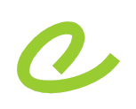 | 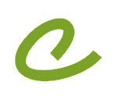 |  |
| Qt.SquareCap | Qt.FlatCap | Qt.RoundCap |

| Constant | Value | Description |
| --- | --- | --- |
| `Qt.FlatCap` | `0x00` | 一个正方形线端未复盖的线的终点。 |
| `Qt.SquareCap` | `0x10` | 方行结束，涵盖了终点，一半线条宽度超出了它。 |
| `Qt.RoundCap` | `0x20` | 一个圆形的行结束。 |

**See also** [QPen](qpen.html)。

```
Qt.PenJoinStyle
```

这个枚举类型定义画笔加入Qt所支持的样式，即两个连接线之间的连接可以通过绘制[QPainter](qpainter.html)。

| 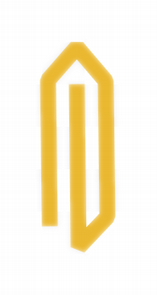 | 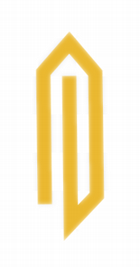 | 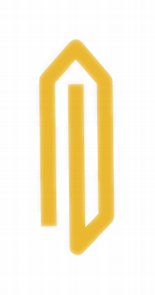 |
| Qt.BevelJoin | Qt.MiterJoin | Qt.RoundJoin |

| Constant | Value | Description |
| --- | --- | --- |
| `Qt.MiterJoin` | `0x00` | 行的外边缘延伸，以满足在一个角度，而这个区域被填充。 |
| `Qt.BevelJoin` | `0x40` | 两条线之间的三角缺口被填满。 |
| `Qt.RoundJoin` | `0x80` | 两条线之间的圆弧被填满。 |
| `Qt.SvgMiterJoin` | `0x100` | 一个斜角连接对应一个斜切的定义凑[SVG 1.2 Tiny](http://www.w3.org/TR/SVGMobile12/)规范。 |

**See also** [QPen](qpen.html)。

```
Qt.PenStyle
```

这个枚举类型定义的画笔样式，可以使用绘制[QPainter](qpainter.html)。样式有：

| 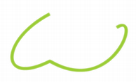 | 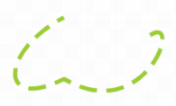 | 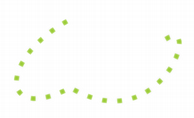 |
| Qt.SolidLine | Qt.DashLine | Qt.DotLine |
| 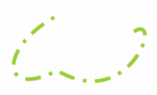 | 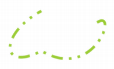 | 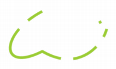 |
| Qt.DashDotLine | Qt.DashDotDotLine | Qt.CustomDashLine |

| Constant | Value | Description |
| --- | --- | --- |
| `Qt.NoPen` | `0` | 没有线的。例如，[QPainter.drawRect](qpainter.html#drawRect)（）填充，但不作出任何边界线。 |
| `Qt.SolidLine` | `1` | 一个普通的线。 |
| `Qt.DashLine` | `2` | 破折号隔开几个像素。 |
| `Qt.DotLine` | `3` | 点了几个像素分离。 |
| `Qt.DashDotLine` | `4` | 备用点和破折号。 |
| `Qt.DashDotDotLine` | `5` | 一个破折号，两个点，一个连字号，两个点。 |
| `Qt.CustomDashLine` | `6` | 使用定义的自定义模式[QPainterPathStroker.setDashPattern](qpainterpathstroker.html#setDashPattern)（ ） 。 |

**See also** [QPen](qpen.html)。

```
Qt.ScrollBarPolicy
```

该枚举类型描述的各种模式[QAbstractScrollArea](qabstractscrollarea.html)的滚动条。

| Constant | Value | Description |
| --- | --- | --- |
| `Qt.ScrollBarAsNeeded` | `0` | [QAbstractScrollArea](qabstractscrollarea.html)显示一个滚动条，当含量太大，不适合，而不是其他。这是默认的。 |
| `Qt.ScrollBarAlwaysOff` | `1` | [QAbstractScrollArea](qabstractscrollarea.html)永远不会显示滚动条。 |
| `Qt.ScrollBarAlwaysOn` | `2` | [QAbstractScrollArea](qabstractscrollarea.html)总是显示滚动条。 |

（该模式为水平和垂直滚动条是独立的。 ）

```
Qt.ShortcutContext
```

对于[QEvent.Shortcut](qevent.html#Type-enum)事件的发生，快捷的键序列必须由用户在上下文中的快捷方式是积极的进入。可能的情境是这些：

| Constant | Value | Description |
| --- | --- | --- |
| `Qt.WidgetShortcut` | `0` | 快捷方式是积极的，当它的父控件具有焦点。 |
| `Qt.WidgetWithChildrenShortcut` | `3` | 快捷方式是积极的，当它的父窗口部件，或任何其子女具有焦点。孩子这是顶级部件，除弹出窗口，不受此快捷方式上下文。 |
| `Qt.WindowShortcut` | `1` | 快捷方式是积极的，当它的父窗口部件是活动的顶层窗口的逻辑子组件。 |
| `Qt.ApplicationShortcut` | `2` | 快捷键处于活动状态时的应用程序窗口中的一个处于活动状态。 |

```
Qt.SizeHint
```

此枚举是由[QGraphicsLayoutItem.sizeHint](qgraphicslayoutitem.html#sizeHint)（ ）

| Constant | Value | Description |
| --- | --- | --- |
| `Qt.MinimumSize` | `0` | 用于指定一个图形布局项目的最小大小。 |
| `Qt.PreferredSize` | `1` | 用于指定一个图形布局项目的最佳尺寸。 |
| `Qt.MaximumSize` | `2` | 用于指定一个图形布局项目的最大尺寸。 |
| `Qt.MinimumDescent` | `3` | 用于指定在图形布局项的文本字符串的最低下降。 |

这个枚举被引入或修改的Qt 4.4 。

**See also** [QGraphicsLayoutItem.sizeHint](qgraphicslayoutitem.html#sizeHint)（ ） 。

```
Qt.SizeMode
```

此枚举是由[QPainter.drawRoundedRect](qpainter.html#drawRoundedRect)（）和[QPainterPath.addRoundedRect](qpainterpath.html#addRoundedRect)（）函数来相对于所指定的边界矩形的尺寸指定的矩形角的半径。

| Constant | Value | Description |
| --- | --- | --- |
| `Qt.AbsoluteSize` | `0` | 指定使用绝对测量的大小。 |
| `Qt.RelativeSize` | `1` | 指定相对于边框，通常使用百分比测量的大小。 |

这个枚举被引入或修改的Qt 4.4 。

```
Qt.SortOrder
```

这个枚举变量描述了如何在一个插件的项目进行排序。

| Constant | Value | Description |
| --- | --- | --- |
| `Qt.AscendingOrder` | `0` | 的各项目按升序如以' AAA'与Latin-1的语言环境“ ZZZ ”结束 |
| `Qt.DescendingOrder` | `1` | 该项目排序降序如以' ZZZ '与Latin-1的语言环境“AAA”结束 |

```
Qt.TextElideMode
```

这个枚举变量指定了省略号应该出现显示不适合文本时：

| Constant | Value | Description |
| --- | --- | --- |
| `Qt.ElideLeft` | `0` | 省略号应该出现在文本的开头。 |
| `Qt.ElideRight` | `1` | 省略号应该出现在文本的末尾。 |
| `Qt.ElideMiddle` | `2` | 省略号应该出现在文本中间。 |
| `Qt.ElideNone` | `3` | 省略号不应该出现在文本。 |

Qt.ElideMiddle通常是URL的最合适的选择（如， “[http://bugreports.qt.../QTWEBSITE-13/](http://bugreports.qt-project.org/browse/QTWEBSITE-13)“ ） ，而Qt.ElideRight适用于其他字符串（例如， ”[Deploying Applications on Ma...](http://qt.nokia.com/doc/qq/qq09-mac-deployment.html)“ ） 。

**See also** [QAbstractItemView.textElideMode](qabstractitemview.html#textElideMode-prop)，[QFontMetrics.elidedText](qfontmetrics.html#elidedText)（ ）[AlignmentFlag](qt.html#AlignmentFlag-enum)和[QTabBar.elideMode](qtabbar.html#elideMode-prop)。

```
Qt.TextFlag
```

该枚举类型用于定义一些修饰符标志。一些这些标志的唯一意义在印刷方面：

| Constant | Value | Description |
| --- | --- | --- |
| `Qt.TextSingleLine` | `0x0100` | 把所有的空格空格和打印只有一行。 |
| `Qt.TextDontClip` | `0x0200` | 如果这是不可能留在给定的范围内，它打印之外。 |
| `Qt.TextExpandTabs` | `0x0400` | Makes the U+0009 (ASCII tab) character move to the next tab stop. |
| `Qt.TextShowMnemonic` | `0x0800` | 显示字符串“普”为&lt;u&gt;P&lt;/u&gt;（见[QButton](index.htm#qbutton)为一个例子）。代表一个与符号，使用“\u0026\u0026” 。 |
| `Qt.TextWordWrap` | `0x1000` | 在适当的点断裂线，例如在字边界。 |
| `Qt.TextWrapAnywhere` | `0x2000` | 断裂线的任何地方，甚至在字。 |
| `Qt.TextHideMnemonic` | `0x8000` | 同Qt.TextShowMnemonic但不绘制下划线。 |
| `Qt.TextDontPrint` | `0x4000` | 把这个文本为“隐藏” ，不打印。 |
| `Qt.IncludeTrailingSpaces` | `TextIncludeTrailingSpaces` | 当这个选项被设置，[QTextLine.naturalTextWidth](qtextline.html#naturalTextWidth)（）和naturalTextRect （）返回一个值，该值包括尾随在文本空间的宽度，否则该宽度被排除在外。 |
| `Qt.TextIncludeTrailingSpaces` | `0x08000000` | 同IncludeTrailingSpaces |
| `Qt.TextJustificationForced` | `0x10000` | 确保文本行是合理的。 |

确保最长的变体计算一个多变量字符串的大小时，总是使用。 （内部）

只要你想你可以使用尽可能多的修饰符标志，除了Qt.TextSingleLine和Qt.TextWordWrap不能合并。

标志，不适合给定的使用一般都忽略不计。

```
Qt.TextFormat
```

此枚举是用在小部件，可以显示纯文本和富文本，如[QLabel](qlabel.html)。它是用于判定一个文本串是否应该被解释为一个或另一个。这通常是通过将枚举值之一到的setTextFormat （ ）函数来完成。

| Constant | Value | Description |
| --- | --- | --- |
| `Qt.PlainText` | `0` | 文本字符串被解释为一个纯文本字符串。 |
| `Qt.RichText` | `1` | 文本字符串被解释为一个富文本字符串。 |
| `Qt.AutoText` | `2` | 文本字符串被解释为Qt.RichText如果[Qt.mightBeRichText](qt.html#mightBeRichText)（ ）返回True，否则为Qt.PlainText 。 |
| `Qt.LogText` | `3` | 这只能由一个特殊的，有限的文本格式[Q3TextEdit](index.htm)在一个优化的模式。 |

```
Qt.TextInteractionFlag
```

此枚举指定如何将文本显示控件响应用户的输入。

| Constant | Value | Description |
| --- | --- | --- |
| `Qt.NoTextInteraction` | `0` | 与文本没有互动是可能的。 |
| `Qt.TextSelectableByMouse` | `1` | 文字可以用鼠标选中并使用上下文菜单或标准键盘快捷键复制到剪贴板。 |
| `Qt.TextSelectableByKeyboard` | `2` | 文本可以用键盘上的光标键来选择。将显示一个文本光标。 |
| `Qt.LinksAccessibleByMouse` | `4` | 友情链接可以高亮显示，用鼠标激活。 |
| `Qt.LinksAccessibleByKeyboard` | `8` | 友情链接可以使用Tab集中，并与输入激活。 |
| `Qt.TextEditable` | `16` | 该文本是完全可编辑的。 |
| `Qt.TextEditorInteraction` | `TextSelectableByMouse &#124; TextSelectableByKeyboard &#124; TextEditable` | 默认的文本编辑器。 |
| `Qt.TextBrowserInteraction` | `TextSelectableByMouse &#124; LinksAccessibleByMouse &#124; LinksAccessibleByKeyboard` | 默认为[QTextBrowser](qtextbrowser.html)。 |

该TextInteractionFlags类型是一个typedef为[QFlags](index.htm)\u003cTextInteractionFlag\u003e 。它存储TextInteractionFlag值的或组合。

```
Qt.TileRule
```

这个枚举介绍如何绘制时重复或拉伸图像的部分。

| Constant | Value | Description |
| --- | --- | --- |
| `Qt.StretchTile` | `0` | 缩放图像以适应可用面积。 |
| `Qt.RepeatTile` | `1` | 重复图像，直到没有更多的空间。可裁剪的最后一个影像。 |
| `Qt.RoundTile` | `2` | 类似的重复，但缩放图像向下，以确保最后一张牌不会被裁剪。 |

这个枚举被引入或修改的Qt 4.6 。

```
Qt.TimeSpec
```

| Constant | Value | Description |
| --- | --- | --- |
| `Qt.LocalTime` | `0` | 与当前位置有关的时间（时区和夏令时） 。 |
| `Qt.UTC` | `1` | 协调世界时，取代格林威治标准时间。 |
| `Qt.OffsetFromUTC` | `2` | 一个在协调世界时秒偏移。 |

```
Qt.ToolBarArea
```

| Constant | Value |
| --- | --- |
| `Qt.LeftToolBarArea` | `0x1` |
| `Qt.RightToolBarArea` | `0x2` |
| `Qt.TopToolBarArea` | `0x4` |
| `Qt.BottomToolBarArea` | `0x8` |
| `Qt.AllToolBarAreas` | `ToolBarArea_Mask` |
| `Qt.NoToolBarArea` | `0` |

该ToolBarAreas类型是一个typedef为[QFlags](index.htm)\u003cToolBarArea\u003e 。它存储ToolBarArea值的或组合。

```
Qt.ToolButtonStyle
```

该工具按钮的样式，描述如何将按钮的文本和图标的显示方式。

| Constant | Value | Description |
| --- | --- | --- |
| `Qt.ToolButtonIconOnly` | `0` | 只显示图标。 |
| `Qt.ToolButtonTextOnly` | `1` | 只显示文本。 |
| `Qt.ToolButtonTextBesideIcon` | `2` | 出现的图标旁边的文字。 |
| `Qt.ToolButtonTextUnderIcon` | `3` | 图标下显示的文本。 |
| `Qt.ToolButtonFollowStyle` | `4` | 按照[style](qstyle.html#StyleHint-enum)。 |

```
Qt.TouchPointState
```

这个枚举变量代表了当时一个触摸点的状态[QTouchEvent](qtouchevent.html)发生。

| Constant | Value | Description |
| --- | --- | --- |
| `Qt.TouchPointPressed` | `0x01` | 触摸点被按下。 |
| `Qt.TouchPointMoved` | `0x02` | 在触摸点移动。 |
| `Qt.TouchPointStationary` | `0x04` | 触摸点不动。 |
| `Qt.TouchPointReleased` | `0x08` | 触摸点被释放。 |

这个枚举被引入或修改的Qt 4.6 。

该TouchPointStates类型是一个typedef为[QFlags](index.htm)\u003cTouchPointState\u003e 。它存储TouchPointState值的或组合。

```
Qt.TransformationMode
```

这个枚举类型定义图像变换（如缩放）是否应光滑与否。

| Constant | Value | Description |
| --- | --- | --- |
| `Qt.FastTransformation` | `0` | 改造是迅速地进行，没有平滑。 |
| `Qt.SmoothTransformation` | `1` | 所得到的图像是利用双线性过滤转化。 |

**See also** [QImage.scaled](qimage.html#scaled)（ ） 。

```
Qt.UIEffect
```

这个枚举变量描述了可用的UI效果。

默认情况下， Qt会尝试使用特定于平台的桌面设置为每个效果。使用[QApplication.setDesktopSettingsAware](qapplication.html#setDesktopSettingsAware)（ ）函数（通过`false`作为参数），以防止这一点，和[QApplication.setEffectEnabled](qapplication.html#setEffectEnabled)（）来启用或禁用特定的效果。

请注意，所有的效果都在不到16位色彩深度运行屏幕禁用。

| Constant | Value | Description |
| --- | --- | --- |
| `Qt.UI_AnimateMenu` | `1` | 显示动画菜单。 |
| `Qt.UI_FadeMenu` | `2` | 显示褪色的菜单。 |
| `Qt.UI_AnimateCombo` | `3` | 动画显示组合框。 |
| `Qt.UI_AnimateTooltip` | `4` | 显示工具提示动画。 |
| `Qt.UI_FadeTooltip` | `5` | 显示工具提示衰落效应。 |
| `Qt.UI_AnimateToolBox` | `6` | Reserved |

**See also** [QApplication.setEffectEnabled](qapplication.html#setEffectEnabled)（）和[QApplication.setDesktopSettingsAware](qapplication.html#setDesktopSettingsAware)（ ） 。

```
Qt.WhiteSpaceMode
```

如果QtGui模块导入这种类型才可用。

这个枚举变量描述了所使用的的空白模式的类型[QTextDocument](qtextdocument.html)类，以满足不同类型的文本信息的要求。

| Constant | Value | Description |
| --- | --- | --- |
| `Qt.WhiteSpaceNormal` | `0` | 用于显示正常字段文字包裹着的空白状态。 |
| `Qt.WhiteSpacePre` | `1` | 其中的空白也正是再现的预格式化文本模式。 |
| `Qt.WhiteSpaceNoWrap` | `2` |   |

该枚举是在所定义的`&lt;QTextDocument&gt;`头文件。

```
Qt.WidgetAttribute
```

该枚举类型用于指定各种部件的属性。属性设置和清除[QWidget.setAttribute](qwidget.html#setAttribute)（ ） ，并与查询[QWidget.testAttribute](qwidget.html#testAttribute)（ ） ，虽然有些有下文将提到的特殊的便利功能。

| Constant | Value | Description |
| --- | --- | --- |
| `Qt.WA_AcceptDrops` | `78` | 允许从拖放操作将数据拖放到窗口小部件（见[QWidget.setAcceptDrops](qwidget.html#acceptDrops-prop)（））。 |
| `Qt.WA_AlwaysShowToolTips` | `84` | 启用工具提示非活动窗口。 |
| `Qt.WA_ContentsPropagated` | `3` | 这个标志是多馀的，过时的，它不再有任何效果。由于Qt的4.1 ，即不设置WA_PaintOnScreen所有的widget传播其内容。 |
| `Qt.WA_CustomWhatsThis` | `47` | 表示该部件要继续正常运行“这是什么？ ”模式。这是由小工具的作者设置。 |
| `Qt.WA_DeleteOnClose` | `55` | 使得Qt的删除这个组件时，小部件已经接受了关闭事件（见[QWidget.closeEvent](qwidget.html#closeEvent)（））。 |
| `Qt.WA_Disabled` | `0` | 表示该部件是禁用的，也就是说，它不接收任何鼠标或键盘事件。还有一个getter函数[QWidget.isEnabled](qwidget.html#enabled-prop)（ ） 。这是设置/由Qt的内核清除。 |
| `Qt.WA_DontShowOnScreen` | `103` | 表示该窗口小部件是隐藏的或不可视的桌面的一部分。 |
| `Qt.WA_ForceDisabled` | `32` | 表示该部件被明确禁用，也就是说，它会保持甚至当它的所有祖先都设置为启用状态禁用。这意味着WA_Disabled 。这是设置/清除[QWidget.setEnabled](qwidget.html#enabled-prop)（）和[QWidget.setDisabled](qwidget.html#setDisabled)（ ） 。 |
| `Qt.WA_ForceUpdatesDisabled` | `59` | 表示更新窗口小部件被明确禁用，也就是说，即使它的所有祖先都设置为更新功能的状态就会保持禁用。这意味着WA_UpdatesDisabled 。这是设置/清除[QWidget.setUpdatesEnabled](qwidget.html#updatesEnabled-prop)（ ） 。 |
| `Qt.WA_GroupLeader` | `72` | _This attribute has been deprecated._使用[QWidget.windowModality](qwidget.html#windowModality-prop)代替。 |
| `Qt.WA_Hover` | `74` | Qt的力量，产生绘制事件，当鼠标进入或离开控件。实现自定义样式时，此功能通常用于，见[Styles](index.htm)例如了解详情。 |
| `Qt.WA_InputMethodEnabled` | `14` | 启用输入法的亚洲语言。创建自定义的文本编辑窗口部件时，必须设置。在Windows CE和Symbian此标志可以在除了用于[QApplication.autoSipEnabled](qapplication.html#autoSipEnabled-prop)进入窗口小部件时自动显示的SIP 。 |
| `Qt.WA_KeyboardFocusChange` | `77` | 设置在顶层窗口时，用户将焦点更改与键盘（选项卡， BACKTAB ，或快捷方式） 。 |
| `Qt.WA_KeyCompression` | `33` | 使关键事件压缩，如果设置，并禁用它，如果没有设置。默认情况下，关键的压缩是关闭的，所以小工具收到一个按键事件，每按一次键（或更多，因为自动重复通常是上） 。如果你打开它，你的程序没有跟上按键输入， Qt的可以尝试压缩，让一个以上的角色可以在每个事件处理按键事件。例如，字处理器窗口小部件可能接收在每2,3或更多个字符[QKeyEvent.text](qkeyevent.html#text)（ ） ，如果布局重新计算时间过长的CPU 。如果一个widget支持多种字符的unicode输入，它始终是安全的打开压缩上。 Qt的只为可打印字符进行关键事件压缩。[Qt.Modifier](qt.html#Modifier-enum)键，光标移动键，功能键和其他按键的动作（如逃生，回车，退格键，打印屏幕）将会停止键事件压缩，即使有更多可用可压缩关键事件。平台比苹果和其他的X11不支持这种压缩，在这种情况下打开它不会有任何效果。这是设置/由小工具的作者被清除。 |
| `Qt.WA_LayoutOnEntireRect` | `48` | 表示该部件要[QLayout](qlayout.html)在整个操作[QWidget.rect](qwidget.html#rect-prop)（） ，不仅对[QWidget.contentsRect](qwidget.html#contentsRect)（ ） 。这是由小工具的作者设置。 |
| `Qt.WA_LayoutUsesWidgetRect` | `92` | 铺设时，这个小部件忽略布局项目RECT从风格[QLayout](qlayout.html)。这使得在差分[QMacStyle](index.htm)和[QPlastiqueStyle](index.htm)对于一些小部件。 |
| `Qt.WA_MacNoClickThrough` | `12` | 当具有该属性设置窗口小部件被点击，并且它的窗口是无效的，点击将使得窗口活性，但不会通过窗口小部件可以看出。典型的使用这个属性是在小部件与“破坏性”的行动，如“删除”按钮。 WA_MacNoClickThrough也适用于有它设置控件的所有子控件。 |
| `Qt.WA_MacOpaqueSizeGrip` | `85` | 表明原生碳大小手柄应该是透明的，而不是（默认值）不透明。此属性仅适用于Mac OS X和由小工具的作者设置。 |
| `Qt.WA_MacShowFocusRect` | `88` | 表明这个窗口部件应该得到一个[QFocusFrame](qfocusframe.html)它周围。一些小工具画出自己的重点光环，无论这个属性的。不就是[QWidget.focusPolicy](qwidget.html#focusPolicy-prop)也起着东西是否获得焦点或不是主要角色，这只能控制是否该获得焦点框。此属性仅适用于Mac OS X的 |
| `Qt.WA_MacNormalSize` | `89` | 指示部件应该有小部件的正常大小在Mac OS X此属性仅适用于Mac OS X的 |
| `Qt.WA_MacSmallSize` | `90` | 指示部件应具备的小尺寸部件在Mac OS X此属性仅适用于Mac OS X的 |
| `Qt.WA_MacMiniSize` | `91` | 指示部件应该有小部件的小型尺寸在Mac OS X此属性仅适用于Mac OS X的 |
| `Qt.WA_MacVariableSize` | `102` | 表示widget可以替代尺寸小部件之间进行选择，以避免削波。此属性仅适用于Mac OS X的 |
| `Qt.WA_MacBrushedMetal` | `46` | 指示部件应在金属拉丝风格的窗口系统所支持的绘制。此属性仅适用于Mac OS X的 |
| `Qt.WA_Mapped` | `11` | 表示该部件被映射在屏幕上。这是设置/由Qt的内核清除。 |
| `Qt.WA_MouseNoMask` | `71` | 使得小部件接收鼠标事件的整个部件，无论当前设置的面具，复盖[QWidget.setMask](qwidget.html#setMask)（ ） 。这不适用于顶层窗口。 |
| `Qt.WA_MouseTracking` | `2` | 表示该部件已启用鼠标跟踪。看[QWidget.mouseTracking](qwidget.html#mouseTracking-prop)。 |
| `Qt.WA_Moved` | `43` | 表示该部件有一个明确的立场。这是设置/清除[QWidget.move](qwidget.html#pos-prop)（）和由[QWidget.setGeometry](qwidget.html#geometry-prop)（ ） 。 |
| `Qt.WA_MSWindowsUseDirect3D` | `94` | 此值已过时，没有任何效果。 |
| `Qt.WA_NoBackground` | `WA_OpaquePaintEvent` | 这个值是过时的。使用WA_OpaquePaintEvent代替。 |
| `Qt.WA_NoChildEventsForParent` | `58` | 表示该部件不希望发送给它的父ChildAdded或ChildRemoved事件。这是很少有必要，但可以帮助避免像分离器和布局自动插入部件。这是一个小部件的作者设置。 |
| `Qt.WA_NoChildEventsFromChildren` | `39` | 表示该部件不希望收到它的孩子送到ChildAdded或ChildRemoved事件。这是一个小部件的作者设置。 |
| `Qt.WA_NoMouseReplay` | `54` | 用于弹出的窗口小部件。表明，在弹出的窗口小部件关闭时最新的鼠标按下事件不应该被重放。该标志是由小部件的作者设置和Qt的每一个内核的控件收到一个新的鼠标事件时清零。 |
| `Qt.WA_NoMousePropagation` | `73` | 从传播到控件的父禁止鼠标事件。此属性默认为禁用。 |
| `Qt.WA_TransparentForMouseEvents` | `51` | 启用时，此属性禁用交付的鼠标事件的小部件和它的孩子。鼠标事件被传递到其他部件，犹如小部件和它的孩子没有出现在组件层次，鼠标点击和其他活动有效地“穿过”他们。此属性默认为禁用。 |
| `Qt.WA_NoSystemBackground` | `9` | 表示该部件有没有背景，即当控件接收绘制事件，背景不会自动重新绘制。**Note:**不像WA_OpaquePaintEvent ，新暴露的区域是**never**填充有背景（例如，显示出一个窗口，供在第一时间后，用户可以看到“通过” ，直到应用程序处理的油漆事件）。此标志设置或清除小工具的作者。 |
| `Qt.WA_OpaquePaintEvent` | `4` | 表示该部件绘制其所有像素，当它接收到一个绘画事件。因此，它不是必需的，如更新，缩放，滚动和重点的变化产生绘制事件之前删除的小部件的操作。使用WA_OpaquePaintEvent的提供帮助，以减少对系统的闪烁不支持双缓冲，避免必要的计算周期擦除之前画的背景上的小优化。**Note:**不像WA_NoSystemBackground ， WA_OpaquePaintEvent作出了努力，以避免透明窗口的背景。此标志设置或清除小工具的作者。 |
| `Qt.WA_OutsideWSRange` | `49` | 表示该部件是外部的窗口系统的坐标系的有效范围内。超出有效范围小部件不能被映射在屏幕上。这是设置/由Qt的内核清除。 |
| `Qt.WA_PaintOnScreen` | `8` | 表示该部件要直接绘制到屏幕上。小部件与此属性集不参与组成的管理，即不能是半透明的或彪炳半透明重叠的窗口小部件。**Note:**此标志只支持X11和它禁用双缓冲。关于Qt嵌入式Linux的标志，只有当一个顶级窗口部件集和它依赖于支持活动的屏幕驱动程序工作。此标志设置或清除小工具的作者。为了使Qt的油漆系统之外，比如，如果你需要本机绘制原语，你需要重新实现[QWidget.paintEngine](qwidget.html#paintEngine)（ ）返回0 ，并设置此标志。 |
| `Qt.WA_PaintOutsidePaintEvent` | `13` | 使得有可能使用[QPainter](qpainter.html)外面的小工具来作画[paintEvent()](qwidget.html#paintEvent)。这个标志是不支持在Windows ， Mac OS X或嵌入式Linux 。我们建议您只在移植Qt的3码，以Qt4使用它。 |
| `Qt.WA_PaintUnclipped` | `52` | 使得这个小工具截短的操作所有的画家。这个小部件或其他部件在它前面的孩子不夹的面积画家可以画上。此标志仅支持小部件与WA_PaintOnScreen标志设置。较好的办法做到这一点的一个跨平台的方式是创建一个透明的小工具，在于其他小部件的前面。 |
| `Qt.WA_PendingMoveEvent` | `34` | 表示一个move事件悬而未决，例如，当一个隐藏的小工具被感动了。此标志设置或清除Qt的内核。 |
| `Qt.WA_PendingResizeEvent` | `35` | 表示一个resize事件悬而未决，例如，当一个隐藏的小工具被调整。此标志设置或清除Qt的内核。 |
| `Qt.WA_QuitOnClose` | `76` | 使得Qt的退出当最后小部件与属性集已接受的closeEvent （ ）的应用程序。这种行为可以用修改[QApplication.quitOnLastWindowClosed](qapplication.html#quitOnLastWindowClosed-prop)属性。默认情况下，此属性设置为类型的所有部件[Qt.Window](qt.html#WindowType-enum)。 |
| `Qt.WA_Resized` | `42` | 表示该部件有一个明确的大小。此标志设置或清除[QWidget.resize](qwidget.html#size-prop)（）和[QWidget.setGeometry](qwidget.html#geometry-prop)（ ） 。 |
| `Qt.WA_RightToLeft` | `56` | 表明，对于小部件的布局方向是从右到左。 |
| `Qt.WA_SetCursor` | `38` | 表示该部件有一个光标自身。此标志设置或清除[QWidget.setCursor](qwidget.html#cursor-prop)（）和[QWidget.unsetCursor](qwidget.html#cursor-prop)（ ） 。 |
| `Qt.WA_SetFont` | `37` | 表示该窗口小部件具有它自己的字体。此标志设置或清除[QWidget.setFont](qwidget.html#font-prop)（ ） 。 |
| `Qt.WA_SetPalette` | `36` | 表示该窗口小部件具有它自己的调色板。此标志设置或清除[QWidget.setPalette](qwidget.html#palette-prop)（ ） 。 |
| `Qt.WA_SetStyle` | `86` | 表示该部件都有自己的风格。此标志设置或清除[QWidget.setStyle](qwidget.html#setStyle)（ ） 。 |
| `Qt.WA_ShowModal` | `70` | _This attribute has been deprecated._使用[QWidget.windowModality](qwidget.html#windowModality-prop)代替。 |
| `Qt.WA_StaticContents` | `5` | 表示该部件内容是西北对齐和静态的。在调整大小，这样的部件将收到paint事件仅适用于部分本身是新近可见。此标志设置或清除小工具的作者。 |
| `Qt.WA_StyleSheet` | `97` | 表示该部件是使用样式[style sheet](index.htm)。 |
| `Qt.WA_TranslucentBackground` | `120` | 表示该部件应该有一个半透明的背景，即小部件的任何非透明区域将半透明的，因为小部件都会有一个alpha通道。设置这个标志使WA_NoSystemBackground进行设置。在Windows上的小部件也需要[Qt.FramelessWindowHint](qt.html#WindowType-enum)窗口标志被设置。此标志设置或清除小工具的作者。 |
| `Qt.WA_UnderMouse` | `1` | 表示该部件是在鼠标光标。该值不会在拖放操作正确更新。还有一种吸气剂的功能，[QWidget.underMouse](qwidget.html#underMouse)（ ） 。此标志设置或清除Qt的内核。 |
| `Qt.WA_UpdatesDisabled` | `10` | 指示更新被封锁（包括系统后台） 。此标志设置或清除Qt的内核。 |

**Warning:**此标志必须_never_可以设置或清除该控件的作者。

| Constant | Value | Description |
| --- | --- | --- |
| `Qt.WA_WindowModified` | `41` | 表示该窗口被标记为修改。在某些平台上这个标志不会做任何事，别人（包括Mac OS X和Windows ）窗口将修改后的外观。此标志设置或清除[QWidget.setWindowModified](qwidget.html#windowModified-prop)（ ） 。 |
| `Qt.WA_WindowPropagation` | `80` | 使一个顶层窗口继承字体和调色板从其父。 |
| `Qt.WA_MacAlwaysShowToolWindow` | `96` | 在Mac OS X上，显示工具窗口，即使在​​应用程序处于非活动状态。默认情况下，所有的工具窗口被隐藏，当应用程序处于非活动状态。 |
| `Qt.WA_SetLocale` | `87` | 表示的区域设置应考虑到在小部件。 |
| `Qt.WA_StyledBackground` | `93` | 指示部件应使用风格的背景绘制。 |
| `Qt.WA_ShowWithoutActivating` | `98` | 显示部件没有使它活跃。 |
| `Qt.WA_NativeWindow` | `100` | 指示本机窗口小部件创建。启用这个标志也将迫使本机窗口小部件的祖先，除非Qt.WA_DontCreateNativeAncestors设置。 |
| `Qt.WA_DontCreateNativeAncestors` | `101` | 表示该部件的祖先保持非母语，即使小部件本身就是当地人。 |
| `Qt.WA_X11NetWmWindowTypeDesktop` | `104` | 添加_NET_WM_WINDOW_TYPE_DESKTOP窗口的_NET_WM_WINDOW_TYPE X11窗口属性。见http://standards.freedesktop.org/wm-spec/更多的细节。此属性对非X11平台上没有任何影响。 |
| `Qt.WA_X11NetWmWindowTypeDock` | `105` | 添加_NET_WM_WINDOW_TYPE_DOCK窗口的_NET_WM_WINDOW_TYPE X11窗口属性。见http://standards.freedesktop.org/wm-spec/更多的细节。此属性对非X11平台上没有任何影响。 |
| `Qt.WA_X11NetWmWindowTypeToolBar` | `106` | 添加_NET_WM_WINDOW_TYPE_TOOLBAR窗口的_NET_WM_WINDOW_TYPE X11窗口属性。见http://standards.freedesktop.org/wm-spec/更多的细节。此属性对非X11平台上没有任何影响。**Note:**Qt的automaticaly设置此属性[QToolBar](qtoolbar.html)。 |
| `Qt.WA_X11NetWmWindowTypeMenu` | `107` | 添加_NET_WM_WINDOW_TYPE_MENU窗口的_NET_WM_WINDOW_TYPE X11窗口属性。见http://standards.freedesktop.org/wm-spec/更多的细节。此属性对非X11平台上没有任何影响。**Note:**Qt的自动设置这个属性[QMenu](qmenu.html)当撕下。 |
| `Qt.WA_X11NetWmWindowTypeUtility` | `108` | 添加_NET_WM_WINDOW_TYPE_UTILITY窗口的_NET_WM_WINDOW_TYPE X11窗口属性。见http://standards.freedesktop.org/wm-spec/更多的细节。此属性对非X11平台上没有任何影响。**Note:**Qt的自动设置该属性为[Qt.Tool](qt.html#WindowType-enum)窗口类型。 |
| `Qt.WA_X11NetWmWindowTypeSplash` | `109` | 添加_NET_WM_WINDOW_TYPE_SPLASH窗口的_NET_WM_WINDOW_TYPE X11窗口属性。见http://standards.freedesktop.org/wm-spec/更多的细节。此属性对非X11平台上没有任何影响。**Note:**Qt的自动设置该属性为[Qt.SplashScreen](qt.html#WindowType-enum)窗口类型。 |
| `Qt.WA_X11NetWmWindowTypeDialog` | `110` | 添加_NET_WM_WINDOW_TYPE_DIALOG窗口的_NET_WM_WINDOW_TYPE X11窗口属性。见http://standards.freedesktop.org/wm-spec/更多的细节。此属性对非X11平台上没有任何影响。**Note:**Qt的自动设置该属性为[Qt.Dialog](qt.html#WindowType-enum)和[Qt.Sheet](qt.html#WindowType-enum)窗口类型。 |
| `Qt.WA_X11NetWmWindowTypeDropDownMenu` | `111` | 添加_NET_WM_WINDOW_TYPE_DROPDOWN_MENU窗口的_NET_WM_WINDOW_TYPE X11窗口属性。见http://standards.freedesktop.org/wm-spec/更多的细节。此属性对非X11平台上没有任何影响。**Note:**Qt的自动设置该属性为QMenus添加到[QMenuBar](qmenubar.html)。 |
| `Qt.WA_X11NetWmWindowTypePopupMenu` | `112` | 添加_NET_WM_WINDOW_TYPE_POPUP_MENU窗口的_NET_WM_WINDOW_TYPE X11窗口属性。见http://standards.freedesktop.org/wm-spec/更多的细节。此属性对非X11平台上没有任何影响。**Note:**Qt的自动设置这个属性[QMenu](qmenu.html)。 |
| `Qt.WA_X11NetWmWindowTypeToolTip` | `113` | 添加_NET_WM_WINDOW_TYPE_TOOLTIP窗口的_NET_WM_WINDOW_TYPE X11窗口属性。见http://standards.freedesktop.org/wm-spec/更多的细节。此属性对非X11平台上没有任何影响。**Note:**Qt的自动设置该属性为[Qt.ToolTip](qt.html#WindowType-enum)窗口类型。 |
| `Qt.WA_X11NetWmWindowTypeNotification` | `114` | 添加_NET_WM_WINDOW_TYPE_NOTIFICATION窗口的_NET_WM_WINDOW_TYPE X11窗口属性。见http://standards.freedesktop.org/wm-spec/更多的细节。此属性对非X11平台上没有任何影响。 |
| `Qt.WA_X11NetWmWindowTypeCombo` | `115` | 添加_NET_WM_WINDOW_TYPE_COMBO窗口的_NET_WM_WINDOW_TYPE X11窗口属性。见http://standards.freedesktop.org/wm-spec/更多的细节。此属性对非X11平台上没有任何影响。**Note:**Qt的自动设置该属性为[QComboBox](qcombobox.html)弹出。 |
| `Qt.WA_X11NetWmWindowTypeDND` | `116` | 添加_NET_WM_WINDOW_TYPE_DND窗口的_NET_WM_WINDOW_TYPE X11窗口属性。见http://standards.freedesktop.org/wm-spec/更多的细节。此属性对非X11平台上没有任何影响。**Note:**Qt将在拖动过程中使用的反馈窗口小部件设置此属性。 |
| `Qt.WA_MacFrameworkScaled` | `117` | 使用碳时使分辨率无关意识到模式在Mac上。这个属性对可可没有影响。该属性默认是关闭的，可以在每个窗口的基础上启用。 |
| `Qt.WA_AcceptTouchEvents` | `121` | 允许触摸事件（见[QTouchEvent](qtouchevent.html)）被发送到窗口小部件。必须在所有的小工具，可以处理触摸事件设置。如果没有这个属性集，从触摸设备的事件将被作为鼠标事件。 |
| `Qt.WA_TouchPadAcceptSingleTouchEvents` | `123` | 允许单个触摸板的触摸事件发送到窗口小部件。 |
| `Qt.WA_MergeSoftkeys` | `124` | 允许小部件合并软键与父widget ，即部件只能设定一个功能键和软键的要求落实到从父采取软键休息。注意父母都走过，直到WA_MergeSoftkeys未设置。又见Qt.WA_MergeSoftkeysRecursively此属性目前只在Symbian平台上的效果 |
| `Qt.WA_MergeSoftkeysRecursively` | `125` | 允许小部件与所有家长递归合并软键。如果此属性设置，窗口小部件父母走过，直到窗口边界（小部件无父或对话）被发现。此属性目前只在Symbian平台上的效果 |
| `Qt.WA_X11DoNotAcceptFocus` | `132` | 要求窗口管理器没有这个顶层窗口提供焦点。此属性对非X11平台上没有任何影响。 |
| `Qt.WA_LockPortraitOrientation` | `128` | 锁定部件到一个纵向方向，而忽略改变显示屏的方向相对于所述用户。 |
| `Qt.WA_LockLandscapeOrientation` | `129` | 锁定部件到一个横向，忽略改变显示屏的方向相对于所述用户。 |
| `Qt.WA_AutoOrientation` | `130` | 导致小部件来改变方向时的显示方向的变化相对于给用户。 |
| `Qt.WA_MacNoShadow` | `134` | 由于Qt的4.8 ，这个属性禁用阴影这个顶层窗口。只影响可可的Qt构建的针对Mac OS X |

```
Qt.WindowFrameSection
```

该枚举用于描述一个窗框部分。它是由返回[QGraphicsWidget.windowFrameSectionAt](qgraphicswidget.html#windowFrameSectionAt)（ ）来描述窗框的什么部分是鼠标下方。

| Constant | Value |
| --- | --- |
| `Qt.NoSection` | `0` |
| `Qt.LeftSection` | `1` |
| `Qt.TopLeftSection` | `2` |
| `Qt.TopSection` | `3` |
| `Qt.TopRightSection` | `4` |
| `Qt.RightSection` | `5` |
| `Qt.BottomRightSection` | `6` |
| `Qt.BottomSection` | `7` |
| `Qt.BottomLeftSection` | `8` |
| `Qt.TitleBarArea` | `9` |

这个枚举被引入或修改的Qt 4.4 。

**See also** [QGraphicsWidget.windowFrameEvent](qgraphicswidget.html#windowFrameEvent)（ ）[QGraphicsWidget.paintWindowFrame](qgraphicswidget.html#paintWindowFrame)（）和[QGraphicsWidget.windowFrameSectionAt](qgraphicswidget.html#windowFrameSectionAt)（ ） 。

```
Qt.WindowModality
```

此枚举指定一个模态窗口的行为。模态窗口是一个块输入到其他窗口。请注意，Windows是一个模态窗口的儿童没有被阻塞。

的值是：

| Constant | Value | Description |
| --- | --- | --- |
| `Qt.NonModal` | `0` | 该窗口不是模态的，并不会阻止输入到其他窗口。 |
| `Qt.WindowModal` | `1` | 该窗口为模态到一个单一的窗口层次结构和模块输入到它的父窗口，所有的祖父母窗口，以及其父母及祖父母的窗户全部兄弟姐妹。 |
| `Qt.ApplicationModal` | `2` | 该窗口为模态应用程序和模块输入到所有窗口。 |

**See also** [QWidget.windowModality](qwidget.html#windowModality-prop)和[QDialog](qdialog.html)。

```
Qt.WindowState
```

该枚举类型用于指定一个顶层窗口的当前状态。

该状态是

| Constant | Value | Description |
| --- | --- | --- |
| `Qt.WindowNoState` | `0x00000000` | 该窗口没有设置状态（正常状态） 。 |
| `Qt.WindowMinimized` | `0x00000001` | 该窗口被最小化（即图标化） 。 |
| `Qt.WindowMaximized` | `0x00000002` | 窗口最大化与周围的框架。 |
| `Qt.WindowFullScreen` | `0x00000004` | 该窗口填满整个屏幕的周围没有任何框架。 |
| `Qt.WindowActive` | `0x00000008` | 该窗口是活动窗口，也就是说，它具有键盘焦点。 |

该WindowStates类型是一个typedef为[QFlags](index.htm)\u003cWindowState\u003e 。它存储的WindowState值的或组合。

```
Qt.WindowType
```

该枚举类型用于指定窗口小部件的各种窗口 - 系统属性。他们是相当不寻常的，但有必要在少数情况下。一些这些标志的依赖于底层的窗口管理器是否支持他们。

其主要类型有

| Constant | Value | Description |
| --- | --- | --- |
| `Qt.Widget` | `0x00000000` | 这是默认类型[QWidget](qwidget.html)。这种类型的Widget是子控件，如果他们有父母，和独立的窗口，如果他们没有父。又见Qt.Window和Qt.SubWindow 。 |
| `Qt.Window` | `0x00000001` | 表示该部件是一个窗口，通常有一个窗口系统框架和标题栏，不论小部件是否有家长或没有。注意，这是不可能的，以不设置该标志，如果插件不具有父代。 |
| `Qt.Dialog` | `0x00000002 &#124; Window` | 表示该部件是一个应该为装饰一个对话框（例如，通常没有最大化或最小化的标题栏按钮）的窗口。这是默认类型[QDialog](qdialog.html)。如果你想使用它作为一个模式对话框，它应该从另外一个窗口中启动，或有父母，并与使用[QWidget.windowModality](qwidget.html#windowModality-prop)属性。如果你把它的模态，对话框将阻止其他顶层窗口的应用程序从获得任何输入。我们指的是顶层窗口，有一个家长为_secondary_窗口。 |
| `Qt.Sheet` | `0x00000004 &#124; Window` | 表示该窗口是Macintosh表。由于使用的是表意味着窗口模式，推荐的方法是使用[QWidget.setWindowModality](qwidget.html#windowModality-prop)（） ，或[QDialog.open](qdialog.html#open)（） ，来代替。 |
| `Qt.Drawer` | `0x00000006 &#124; Window` | 表示该部件是Macintosh抽屉。 |
| `Qt.Popup` | `0x00000008 &#124; Window` | 表示该部件是一个弹出顶层窗口，即它是模态的，但有一个窗口系统框架适合于弹出式菜单。 |
| `Qt.Tool` | `0x0000000a &#124; Window` | 表示该部件是一个工具窗口。工具窗口经常是一个小窗口，比平时更小的标题栏和装饰，通常用于工具按钮的集合。如果有一个家长，工具窗口将始终保持在它的上面。如果没有父母，你可能会考虑使用Qt.WindowStaysOnTopHint为好。如果窗口系统支持它，一个工具窗口可以装饰带有几分轻框架。它也可以与Qt.FramelessWindowHint组合。

在Mac OS X ，工具窗口对应 [Floating](http://developer.apple.com/documentation/Carbon/Conceptual/HandlingWindowsControls/hitb-wind_cont_concept/chapter_2_section_2.html)一流的窗口。这意味着窗口住在上面正常窗口的水平，它不可能把一个正常的窗口在它的上面。默认情况下，当应用程序处于非活动状态的工具窗口将会消失。这可以通过控制[Qt.WA_MacAlwaysShowToolWindow](qt.html#WidgetAttribute-enum)属性。 |
| `Qt.ToolTip` | `0x0000000c &#124; Window` | 表示该部件是一个工具提示。这是在内部用来实现[tooltips](qwidget.html#toolTip-prop)。 |
| `Qt.SplashScreen` | `0x0000000e &#124; Window` | 表示该窗口是一个闪屏。这是默认类型[QSplashScreen](qsplashscreen.html)。 |
| `Qt.Desktop` | `0x00000010 &#124; Window` | 表明这个widget是桌面。这是该类型[QDesktopWidget](qdesktopwidget.html)。 |
| `Qt.SubWindow` | `0x00000012` | 表明，该部件是一个子窗口，如[QMdiSubWindow](qmdisubwindow.html)小工具。 |

也有许多标志，您可以使用自定义的顶层窗口的外观。这些对其他窗口没有影响：

| Constant | Value | Description |
| --- | --- | --- |
| `Qt.MSWindowsFixedSizeDialogHint` | `0x00000100` | 使窗口在Windows上薄对话框边框。这种风格是传统上用于固定大小的对话框。 |
| `Qt.MSWindowsOwnDC` | `0x00000200` | 使窗口在Windows上自己的显示环境。 |
| `Qt.X11BypassWindowManagerHint` | `0x00000400` | 完全绕过窗口管理器。这将导致未在所有（即没有键盘输入管理无边界窗口，除非你调用[QWidget.activateWindow](qwidget.html#activateWindow)（ ）手动） 。 |
| `Qt.FramelessWindowHint` | `0x00000800` | 产生一个无国界的窗口。用户不能移动或通过窗口系统调整无边框窗口。在X11上，标志的结果取决于窗口管理器和它的理解Motif和/或NETWM提示能力。大多数现有的现代窗口管理器可以处理这个问题。 |

该`CustomizeWindowHint`标志用于使窗口控件的定制。这个标志必须被设置为允许`WindowTitleHint`，`WindowSystemMenuHint`，`WindowMinimizeButtonHint`，`WindowMaximizeButtonHint`和`WindowCloseButtonHint`标志被改变。

| Constant | Value | Description |
| --- | --- | --- |
| `Qt.CustomizeWindowHint` | `0x02000000` | 关闭默认的窗口标题提示。 |
| `Qt.WindowTitleHint` | `0x00001000` | 使窗口的标题栏。 |
| `Qt.WindowSystemMenuHint` | `0x00002000` | 增加了一个窗口的系统菜单，并有可能关闭按钮（例如在Mac上） 。如果你需要隐藏或显示关闭按钮，它更便于携带使用`WindowCloseButtonHint`。 |
| `Qt.WindowMinimizeButtonHint` | `0x00004000` | 添加一个最小化按钮。在某些平台上这意味着Qt.WindowSystemMenuHint为它工作。 |
| `Qt.WindowMaximizeButtonHint` | `0x00008000` | 添加一个最大化按钮。在某些平台上这意味着Qt.WindowSystemMenuHint为它工作。 |
| `Qt.WindowMinMaxButtonsHint` | `WindowMinimizeButtonHint &#124; WindowMaximizeButtonHint` | 增加了最小化和最大化按钮。在某些平台上这意味着Qt.WindowSystemMenuHint为它工作。 |
| `Qt.WindowCloseButtonHint` | `0x08000000` | 添加一个关闭按钮。在某些平台上这意味着Qt.WindowSystemMenuHint为它工作。 |
| `Qt.WindowContextHelpButtonHint` | `0x00010000` | 添加上下文帮助按钮的对话框。在某些平台上这意味着Qt.WindowSystemMenuHint为它工作。 |
| `Qt.MacWindowToolBarButtonHint` | `0x10000000` | 在Mac OS X中增加了一个工具栏按钮（即椭圆形按钮是在具有工具栏窗口的右上角） 。 |
| `Qt.BypassGraphicsProxyWidget` | `0x20000000` | 防止窗口及其子自动嵌入自己变成一个[QGraphicsProxyWidget](qgraphicsproxywidget.html)如果父窗口小部件已经嵌入。如果你希望你的小部件总是在桌面上的顶层窗口小部件，无论父控件是否被嵌入在一个场景或没有你可以设置这个标志。 |
| `Qt.WindowShadeButtonHint` | `0x00020000` |   |
| `Qt.WindowStaysOnTopHint` | `0x00040000` | 通知窗口系统的窗口应该留在所有其他窗口之上的。请注意，在X11的一些窗口管理器，你也必须通过Qt.X11BypassWindowManagerHint此标志才能正常工作。 |
| `Qt.WindowStaysOnBottomHint` | `0x04000000` | 通知窗口系统的窗口应该留在所有其他窗口的底部。注意：在X11 ，这暗示将只在支持_NET_WM_STATE_BELOW原子的窗口管理器。如果在底部总是一个窗口有父，母也将留在底部。该窗口提示目前没有针对Mac OS X实现 |
| `Qt.WindowOkButtonHint` | `0x00080000` | 增加了一个确定按钮，一个对话框的窗口装饰。仅支持Windows CE 。 |
| `Qt.WindowCancelButtonHint` | `0x00100000` | 增加了一个取消按钮的对话框的窗口装饰。仅支持Windows CE 。 |
| `Qt.WindowSoftkeysVisibleHint` | `0x40000000` | 让软键时可见小部件是全屏。仅支持Symbian系统。 |
| `Qt.WindowSoftkeysRespondHint` | `0x80000000` | 使得软键，即使看不见接收按键事件。有了这个提示即窗口显示与软键动作触发，即使软键都看不见`showFullscreen()`。仅支持Symbian系统。 |
| `Qt.WindowType_Mask` | `0x000000ff` | 提取的窗口标志的窗口类型部分的遮罩。 |

过时的标志：

| Constant | Value | Description |
| --- | --- | --- |
| `Qt.WMouseNoMask` | `0x00080000` | 使用[Qt.WA_MouseNoMask](qt.html#WidgetAttribute-enum)代替。 |
| `Qt.WDestructiveClose` | `0x00100000` | 使用[Qt.WA_DeleteOnClose](qt.html#WidgetAttribute-enum)代替。 |
| `Qt.WStaticContents` | `0x00200000` | 使用[Qt.WA_StaticContents](qt.html#WidgetAttribute-enum)代替。 |
| `Qt.WGroupLeader` | `0x00400000` | 不再需要。 |
| `Qt.WShowModal` | `0x00800000` | 使用[QWidget.windowModality](qwidget.html#windowModality-prop)代替。 |
| `Qt.WNoMousePropagation` | `0x01000000` | 使用[Qt.WA_NoMousePropagation](qt.html#WidgetAttribute-enum)代替。 |
| `Qt.WType_TopLevel` | `Window` | 使用Qt.Window代替。 |
| `Qt.WType_Dialog` | `Dialog` | 使用Qt.Dialog代替。 |
| `Qt.WType_Popup` | `Popup` | 改用Qt.Popup 。 |
| `Qt.WType_Desktop` | `Desktop` | 使用Qt.Desktop代替。 |
| `Qt.WType_Mask` | `WindowType_Mask` | 使用Qt.WindowType_Mask代替。 |
| `Qt.WStyle_Customize` | `0` | 不再需要。 |
| `Qt.WStyle_NormalBorder` | `0` | 不再需要。 |
| `Qt.WStyle_DialogBorder` | `MSWindowsFixedSizeDialogHint` | 使用Qt.MSWindowsFixedSizeDialogHint代替。 |
| `Qt.WStyle_NoBorder` | `FramelessWindowHint` | 使用Qt.FramelessWindowHint代替。 |
| `Qt.WStyle_Title` | `WindowTitleHint` | 使用Qt.WindowTitleHint代替。 |
| `Qt.WStyle_SysMenu` | `WindowSystemMenuHint` | 使用Qt.WindowSystemMenuHint代替。 |
| `Qt.WStyle_Minimize` | `WindowMinimizeButtonHint` | 使用Qt.WindowMinimizeButtonHint代替。 |
| `Qt.WStyle_Maximize` | `WindowMaximizeButtonHint` | 使用Qt.WindowMaximizeButtonHint代替。 |
| `Qt.WStyle_MinMax` | `WStyle_Minimize &#124; WStyle_Maximize` | 使用Qt.WindowMinMaxButtonsHint代替。 |
| `Qt.WStyle_Tool` | `Tool` | 使用Qt.Tool代替。 |
| `Qt.WStyle_StaysOnTop` | `WindowStaysOnTopHint` | 使用Qt.WindowStaysOnTopHint代替。 |
| `Qt.WStyle_ContextHelp` | `WindowContextHelpButtonHint` | 使用Qt.WindowContextHelpButtonHint代替。 |
| `Qt.WPaintDesktop` | `0` | 不再需要。 |
| `Qt.WPaintClever` | `0` | 不再需要。 |
| `Qt.WX11BypassWM` | `X11BypassWindowManagerHint` | 使用Qt.X11BypassWindowManagerHint代替。 |
| `Qt.WWinOwnDC` | `MSWindowsOwnDC` | 使用Qt.MSWindowsOwnDC代替。 |
| `Qt.WMacSheet` | `Sheet` | 使用Qt.Sheet代替。 |
| `Qt.WMacDrawer` | `Drawer` | 使用Qt.Drawer代替。 |
| `Qt.WStyle_Splash` | `SplashScreen` | 使用Qt.SplashScreen代替。 |
| `Qt.WNoAutoErase` | `0` | 不再需要。 |
| `Qt.WRepaintNoErase` | `0` | 不再需要。 |
| `Qt.WNorthWestGravity` | `WStaticContents` | 使用[Qt.WA_StaticContents](qt.html#WidgetAttribute-enum)代替。 |
| `Qt.WType_Modal` | `Dialog &#124; WShowModal` | 使用Qt.Dialog和[QWidget.windowModality](qwidget.html#windowModality-prop)代替。 |
| `Qt.WStyle_Dialog` | `Dialog` | 使用Qt.Dialog代替。 |
| `Qt.WStyle_NoBorderEx` | `FramelessWindowHint` | 使用Qt.FramelessWindowHint代替。 |
| `Qt.WResizeNoErase` | `0` | 不再需要。 |
| `Qt.WMacNoSheet` | `0` | 不再需要。 |

该WindowFlags类型是一个typedef为[QFlags](index.htm)\u003cWindowType\u003e 。它存储的WindowType值的或组合。

**See also** [QWidget.windowFlags](qwidget.html#windowFlags-prop)和[Window Flags Example](index.htm)。

* * *

## Method Documentation

```
QString Qt.convertFromPlainText (QString plain, WhiteSpaceMode mode = Qt.WhiteSpacePre)
```

如果QtGui模块导入此方法仅适用。

纯文本字符串转换_plain_以同时保留其大部分的外观的HTML格式的段落。

_mode_定义了空格处理。

这个功能是在所定义的`&lt;QTextDocument&gt;`头文件。

**See also** [escape](qt.html#escape)（）和[mightBeRichText](qt.html#mightBeRichText)（ ） 。

```
QString Qt.escape (QString plain)
```

如果QtGui模块导入此方法仅适用。

纯文本字符串转换_plain_使用HTML元字符一个HTML字符串`&lt;`，`&gt;`，`&`和`"`通过HTML实体替换。

例如：

```
 [QString](qstring.html) plain = "#include <QtCore>"
 [QString](qstring.html) html = [Qt](qt.html).escape(plain);
 // html == "#include &lt;QtCore&gt;"

```

这个功能是在所定义的`&lt;QTextDocument&gt;`头文件。

**See also** [convertFromPlainText](qt.html#convertFromPlainText)（）和[mightBeRichText](qt.html#mightBeRichText)（ ） 。

```
bool Qt.mightBeRichText (QString)
```

如果QtGui模块导入此方法仅适用。

返回True ，如果该字符串_text_很可能是富文本，否则返回False 。

该函数使用一个快速，因此简单的启发式。它主要是检查是否有东西，看起来像第一换行符之前的标籤。虽然结果可能是正确的，常见的情况，也不能保证。

这个功能是在所定义的`&lt;QTextDocument&gt;`头文件。