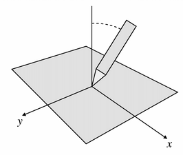

# QTabletEvent Class Reference

## [[QtGui](index.htm) module]

该QTabletEvent类包含描述一个平板事件参数。[More...](#details)

继承[QInputEvent](qinputevent.html)。

### Types

*   `enum PointerType { UnknownPointer, Pen, Cursor, Eraser }`
*   `enum TabletDevice { NoDevice, Puck, Stylus, Airbrush, ..., RotationStylus }`

### Methods

*   `__init__ (self, QEvent.Type t, QPoint pos, QPoint globalPos, QPointF hiResGlobalPos, int device, int pointerType, float pressure, int xTilt, int yTilt, float tangentialPressure, float rotation, int z, Qt.KeyboardModifiers keyState, int uniqueID)`
*   `__init__ (self, QTabletEvent)`
*   `TabletDevice device (self)`
*   `QPoint globalPos (self)`
*   `int globalX (self)`
*   `int globalY (self)`
*   `QPointF hiResGlobalPos (self)`
*   `float hiResGlobalX (self)`
*   `float hiResGlobalY (self)`
*   `PointerType pointerType (self)`
*   `QPoint pos (self)`
*   `float pressure (self)`
*   `float rotation (self)`
*   `float tangentialPressure (self)`
*   `int uniqueId (self)`
*   `int x (self)`
*   `int xTilt (self)`
*   `int y (self)`
*   `int yTilt (self)`
*   `int z (self)`

* * *

## Detailed Description

该QTabletEvent类包含描述一个平板事件参数。

从Wacom数位板产生片剂活动。大多数时候，你会想应对来自平板电脑的事件，好像他们是从一个鼠标事件，例如，您可以检索与光标位置[x](qtabletevent.html#x)（ ）[y](qtabletevent.html#y)（ ）[pos](qtabletevent.html#pos)（ ）[globalX](qtabletevent.html#globalX)（ ）[globalY](qtabletevent.html#globalY)（）和[globalPos](qtabletevent.html#globalPos)（ ） 。在某些情况下，您可能希望获取平板电脑设备驱动程序提供了额外的信息，例如，您可能想要做更高分辨率的坐标subpixeling或者您可能希望根据压力来调整色彩亮度。 QTabletEvent让您阅读[pressure](qtabletevent.html#pressure)（）中的[xTilt](qtabletevent.html#xTilt)（）和[yTilt](qtabletevent.html#yTilt)（） ，以及设备的类型与用来[device](qtabletevent.html#device)（ ） （见[TabletDevice](qtabletevent.html#TabletDevice-enum)） 。它也可以给你的最低和最高值的每个设备的压力和高分辨率的坐标。

片剂事件中包含一个特殊的接受标志，指示接收者是否愿意事件。你应该调用[QTabletEvent.accept](qevent.html#accept)（）如果你处理的平板事件，否则将被发送到父widget 。唯一的例外是[TabletEnterProximity](qevent.html#Type-enum)和[TabletLeaveProximity](qevent.html#Type-enum)事件，这些只发送到[QApplication](qapplication.html)不检查是否它们是否接受。

该[QWidget.setEnabled](qwidget.html#enabled-prop)（）函数可以被用来使能或禁止鼠标和键盘事件为一个部件。

该事件处理程序[QWidget.tabletEvent](qwidget.html#tabletEvent)（ ）接收所有三种类型的平板电脑的事件。 Qt会首先发一个tabletEvent那么，如果不被接受，它会发送一个鼠标事件。这允许不使用平板电脑应用程序使用平板电脑就像一个鼠标，同时也使那些谁想要同时使用平板电脑和鼠标不同。

### Notes for X11 Users

Qt使用下面的硬编码名称来自于X11的xorg.conf文件（除了IRIX ）确定平板设备： “手写笔”，“钢笔”和“橡皮擦” 。如果设备有其他的名字，他们将不会被拾起的Qt 。

* * *

## Type Documentation

```
QTabletEvent.PointerType
```

这个枚举变量定义什么类型的点生成事件。

| Constant | Value | Description |
| --- | --- | --- |
| `QTabletEvent.UnknownPointer` | `0` | 一个未知设备。 |
| `QTabletEvent.Pen` | `1` | 手写笔的设备（笔的窄端）的末端。 |
| `QTabletEvent.Cursor` | `2` | 任何冰球之类的设备。 |
| `QTabletEvent.Eraser` | `3` | 手写笔的设备（笔的宽端）的橡皮擦端。 |

**See also** [pointerType](qtabletevent.html#pointerType)（ ） 。

```
QTabletEvent.TabletDevice
```

这个枚举变量定义什么类型的设备正在生成事件。

| Constant | Value | Description |
| --- | --- | --- |
| `QTabletEvent.NoDevice` | `0` | 没有设备或未知设备。 |
| `QTabletEvent.Puck` | `1` | 冰球（一种装置，类似于一个扁平鼠标采用了透明的圆十字线） 。 |
| `QTabletEvent.Stylus` | `2` | 手写笔。 |
| `QTabletEvent.Airbrush` | `3` | 喷枪 |
| `QTabletEvent.FourDMouse` | `4` | 一个4D鼠标。 |
| `QTabletEvent.RotationStylus` | `6` | 一个特殊的手写笔也知道旋转（一6D手写笔） 。 |

这个枚举被引入或修改的Qt 4.1 。

* * *

## Method Documentation

```
QTabletEvent.__init__ (self, QEvent.Type t, QPoint pos, QPoint globalPos, QPointF hiResGlobalPos, int device, int pointerType, float pressure, int xTilt, int yTilt, float tangentialPressure, float rotation, int z, Qt.KeyboardModifiers keyState, int uniqueID)
```

构造的给定片剂事件_type_。

该_pos_参数表示凡在插件的事件发生;_globalPos_是在绝对坐标中的相应位置。该_hiResGlobalPos_包含的位置的高分辨率测量。

_pressure_包含施加在压力_device_。

_pointerType_描述正在使用的笔的类型。

_xTilt_和_yTilt_分别包含在x和y轴倾斜设备的程度。

_keyState_其键盘功能键被按下指定（如，**Ctrl**） 。

该_uniqueID_参数包含当前设备的唯一ID 。

该_z_参数包含在平板设备的坐标，这通常是由在4D鼠标滚轮给出。如果设备不支持Z轴，传递零这里。

该_tangentialPressure_参数contins气刷的切线压力。如果设备不支持切向压力，传递0在这里。

_rotation_包含度装置的旋转。 4D鼠标支持旋转。如果设备不支持旋转，传递0在这里。

**See also** [pos](qtabletevent.html#pos)（ ）[globalPos](qtabletevent.html#globalPos)（ ）[device](qtabletevent.html#device)（ ）[pressure](qtabletevent.html#pressure)（ ）[xTilt](qtabletevent.html#xTilt)（ ）[yTilt](qtabletevent.html#yTilt)（ ）[uniqueId](qtabletevent.html#uniqueId)（ ）[rotation](qtabletevent.html#rotation)（ ）[tangentialPressure](qtabletevent.html#tangentialPressure)（）和[z](qtabletevent.html#z)（ ） 。

```
QTabletEvent.__init__ (self, QTabletEvent)
```

```
TabletDevice QTabletEvent.device (self)
```

[

返回装置产生事件的类型。

](qtabletevent.html#TabletDevice-enum)

[**See also**](qtabletevent.html#TabletDevice-enum) [TabletDevice](qtabletevent.html#TabletDevice-enum)。

```
QPoint QTabletEvent.globalPos (self)
```

[](qpoint.html)

[返回设备的全球地位_at the time of the event_。这是很重要的异步Windows系统上的X11一样，每当你在响应鼠标事件， globalPos左右移动你的widget （ ）可以显着从当前位置有所不同](qpoint.html)[QCursor.pos](qcursor.html#pos)（ ） 。

**See also** [globalX](qtabletevent.html#globalX)（ ）[globalY](qtabletevent.html#globalY)（）和[hiResGlobalPos](qtabletevent.html#hiResGlobalPos)（ ） 。

```
int QTabletEvent.globalX (self)
```

返回在事件发生时鼠标指针的全局x位置。

**See also** [globalY](qtabletevent.html#globalY)（ ）[globalPos](qtabletevent.html#globalPos)（）和[hiResGlobalX](qtabletevent.html#hiResGlobalX)（ ） 。

```
int QTabletEvent.globalY (self)
```

返回在事件发生时的平板设备的全球y位置。

**See also** [globalX](qtabletevent.html#globalX)（ ）[globalPos](qtabletevent.html#globalPos)（）和[hiResGlobalY](qtabletevent.html#hiResGlobalY)（ ） 。

```
QPointF QTabletEvent.hiResGlobalPos (self)
```

[](qpointf.html)

[从平板电脑传送的高精度坐标表示。子pixeling信息是在的小数部分](qpointf.html)[QPointF](qpointf.html)。

**See also** [globalPos](qtabletevent.html#globalPos)（ ）[hiResGlobalX](qtabletevent.html#hiResGlobalX)（）和[hiResGlobalY](qtabletevent.html#hiResGlobalY)（ ） 。

```
float QTabletEvent.hiResGlobalX (self)
```

平板设备的精度高x位置。

```
float QTabletEvent.hiResGlobalY (self)
```

平板设备的高精度y位置。

```
PointerType QTabletEvent.pointerType (self)
```

[

返回点生成事件的类型。

](qtabletevent.html#PointerType-enum)

```
QPoint QTabletEvent.pos (self)
```

[

返回该装置的位置，相对于接收到的事件的插件。

](qpoint.html)

[如果您在响应鼠标事件，利用左右移动部件](qpoint.html)[globalPos](qtabletevent.html#globalPos)（代替此功能） 。

**See also** [x](qtabletevent.html#x)（ ）[y](qtabletevent.html#y)（）和[globalPos](qtabletevent.html#globalPos)（ ） 。

```
float QTabletEvent.pressure (self)
```

返回该设备的压力。 0.0表示该指示笔是不是就片剂， 1.0表示为触针的压力的最大量。

**See also** [tangentialPressure](qtabletevent.html#tangentialPressure)（ ） 。

```
float QTabletEvent.rotation (self)
```

返回学位的当前设备的旋转。这通常是通过一个4D鼠标给出。如果设备不支持旋转此值始终为0.0 。

```
float QTabletEvent.tangentialPressure (self)
```

返回该设备的切线压力。这通常是通过对喷枪工具手指轮给出。范围是1.0到1.0 。 0.0表示一个中立的立场。当前喷枪只能移动在从量中立型位置的正方向。如果设备不支持切线压力，此值始终为0.0 。

**See also** [pressure](qtabletevent.html#pressure)（ ） 。

```
int QTabletEvent.uniqueId (self)
```

返回一个唯一的ID为当前设备，使得有可能被使用的同时在数位板上的多个设备之间的区分。

支持此功能的是依赖于平板电脑。

值相同的设备可能会有所不同从操作系统到操作系统。

Wacom驱动程式适用于Linux的更高版本现在将报告的ID信息。如果你有一个支持唯一ID的平板电脑，并没有得到在Linux上的信息，请考虑升级您的驱动程序。

由于Qt 4.2中，独特的ID是一样的，不管笔的方向。早期版本会使用橡皮擦端与某些操作系统的手写笔的笔结束的时候报告一个不同的值。

**See also** [pointerType](qtabletevent.html#pointerType)（ ） 。

```
int QTabletEvent.x (self)
```

返回设备的x位置，相对于接收到的事件的插件。

**See also** [y](qtabletevent.html#y)（）和[pos](qtabletevent.html#pos)（ ） 。

```
int QTabletEvent.xTilt (self)
```

返回的x轴的方向上的垂直器件之间的角度（一个笔，例如）和。正值是对平板电脑的实际权利。该角度的范围为-60 〜+60度。



**See also** [yTilt](qtabletevent.html#yTilt)（ ） 。

```
int QTabletEvent.y (self)
```

返回设备的y位置，相对于接收事件的窗口小部件。

**See also** [x](qtabletevent.html#x)（）和[pos](qtabletevent.html#pos)（ ） 。

```
int QTabletEvent.yTilt (self)
```

返回在y轴方向上的垂直器件之间的角度（一个笔，例如）和。正值是对平板电脑的底部。的角度为范围-60到+60度的范围内。

**See also** [xTilt](qtabletevent.html#xTilt)（ ） 。

```
int QTabletEvent.z (self)
```

返回设备的z位置。通常，这是通过在一个4D鼠标滚轮来表示。如果设备不支持Z轴，这个值永远是零。这是**not**相同的压力。

**See also** [pressure](qtabletevent.html#pressure)（ ） 。