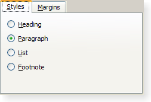
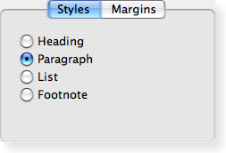
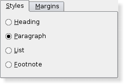

# QTabWidget Class Reference

## [[QtGui](index.htm) module]

该QTabWidget类提供了一个堆栈标籤小部件。[More...](#details)

继承[QWidget](qwidget.html)。

### Types

*   `enum TabPosition { North, South, West, East }`
*   `enum TabShape { Rounded, Triangular }`

### Methods

*   `__init__ (self, QWidget parent = None)`
*   `int addTab (self, QWidget widget, QString)`
*   `int addTab (self, QWidget widget, QIcon icon, QString label)`
*   `changeEvent (self, QEvent)`
*   `clear (self)`
*   `QWidget cornerWidget (self, Qt.Corner corner = Qt.TopRightCorner)`
*   `int count (self)`
*   `int currentIndex (self)`
*   `QWidget currentWidget (self)`
*   `bool documentMode (self)`
*   `Qt.TextElideMode elideMode (self)`
*   `bool event (self, QEvent)`
*   `int heightForWidth (self, int width)`
*   `QSize iconSize (self)`
*   `int indexOf (self, QWidget widget)`
*   `initStyleOption (self, QStyleOptionTabWidgetFrame option)`
*   `int insertTab (self, int index, QWidget widget, QString)`
*   `int insertTab (self, int index, QWidget widget, QIcon icon, QString label)`
*   `bool isMovable (self)`
*   `bool isTabEnabled (self, int index)`
*   `keyPressEvent (self, QKeyEvent)`
*   `QSize minimumSizeHint (self)`
*   `paintEvent (self, QPaintEvent)`
*   `removeTab (self, int index)`
*   `resizeEvent (self, QResizeEvent)`
*   `setCornerWidget (self, QWidget widget, Qt.Corner corner = Qt.TopRightCorner)`
*   `setCurrentIndex (self, int index)`
*   `setCurrentWidget (self, QWidget widget)`
*   `setDocumentMode (self, bool set)`
*   `setElideMode (self, Qt.TextElideMode)`
*   `setIconSize (self, QSize size)`
*   `setMovable (self, bool movable)`
*   `setTabBar (self, QTabBar)`
*   `setTabEnabled (self, int index, bool)`
*   `setTabIcon (self, int index, QIcon icon)`
*   `setTabPosition (self, TabPosition)`
*   `setTabsClosable (self, bool closeable)`
*   `setTabShape (self, TabShape s)`
*   `setTabText (self, int index, QString)`
*   `setTabToolTip (self, int index, QString tip)`
*   `setTabWhatsThis (self, int index, QString text)`
*   `setUsesScrollButtons (self, bool useButtons)`
*   `showEvent (self, QShowEvent)`
*   `QSize sizeHint (self)`
*   `QTabBar tabBar (self)`
*   `QIcon tabIcon (self, int index)`
*   `tabInserted (self, int index)`
*   `TabPosition tabPosition (self)`
*   `tabRemoved (self, int index)`
*   `bool tabsClosable (self)`
*   `TabShape tabShape (self)`
*   `QString tabText (self, int index)`
*   `QString tabToolTip (self, int index)`
*   `QString tabWhatsThis (self, int index)`
*   `bool usesScrollButtons (self)`
*   `QWidget widget (self, int index)`

### Special Methods

*   `__len__ (self)`

### Qt Signals

*   `void currentChanged (int)`
*   `void tabCloseRequested (int)`

* * *

## Detailed Description

该QTabWidget类提供了一个堆栈标籤小部件。

一个标籤控件提供了一个标籤栏（见[QTabBar](qtabbar.html)）和用于显示与每个标籤页的“页内” 。默认情况下，标籤栏上面显示的页面区域，但不同的配置可供选择（参见[TabPosition](qtabwidget.html#TabPosition-enum)） 。每个选项卡都与一个不同的窗口小部件（称为页）相关联。只有在当前页面中显示的页面区域，所有的其他页面是隐藏的。用户可以通过单击其选项卡或按下其ALT +显示不同的页面_letter_快捷方式（如果有） 。

正常的方式来使用QTabWidget是要做到以下几点：

1.  创建QTabWidget 。
2.  创建[QWidget](qwidget.html)每个在选项卡对话框的页面，但不指定父窗口部件他们。
3.  将子控件到页面窗口小部件，使用布局将它们定位为正常。
4.  Call [addTab](qtabwidget.html#addTab)（）或[insertTab](qtabwidget.html#insertTab)（ ）把页面控件到标籤控件，给每个标籤有一个可选的键盘快捷键一个合适的标籤。

翼片的位置被定义为[tabPosition](qtabwidget.html#tabPosition-prop)，它们的形状由[tabShape](qtabwidget.html#tabShape-prop)。

信号[currentChanged](qtabwidget.html#currentChanged)（）当用户选择一个页面被发射。

当前页面的索引可作为[currentIndex](qtabwidget.html#currentIndex-prop)（ ） ，当前页面与小部件[currentWidget](qtabwidget.html#currentWidget)（ ） 。可以使用检索指针的页插件与给定的索引[widget](qtabwidget.html#widget)（） ，并且可以找到一个插件的索引位置与[indexOf](qtabwidget.html#indexOf)（ ） 。使用[setCurrentWidget](qtabwidget.html#setCurrentWidget)（）或[setCurrentIndex](qtabwidget.html#currentIndex-prop)（）来显示一个特定的页面。

您可以使用更改标籤的文字和图标[setTabText](qtabwidget.html#setTabText)（）或[setTabIcon](qtabwidget.html#setTabIcon)（ ） 。一个标籤和它相关联的页面可以被删除[removeTab](qtabwidget.html#removeTab)（ ） 。

每个选项卡是启用或在任何特定时间禁止它们（见[setTabEnabled](qtabwidget.html#setTabEnabled)（））。如果标籤被激活，标籤文本通常绘制，用户可以选择该选项卡。如果它被禁用，该选项卡绘制以不同的方式，用户可以不选择该选项卡。请注意，即使一个选项卡被禁用，页面仍然可以看到，例如，如果所有选项卡碰巧被禁用。

标籤部件可以是一个很好的方式来分割一个复杂的对话框。一个替代方案是使用一个[QStackedWidget](qstackedwidget.html)要为其提供页之间导航的一些装置，例如，一个[QToolBar](qtoolbar.html)或[QListWidget](qlistwidget.html)。

大部分在QTabWidget的功能是由一个提供[QTabBar](qtabbar.html)（在顶部，提供了制表符）和一个[QStackedWidget](qstackedwidget.html)（大部分面积，组织各页） 。

|  |  |  |
| A Windows XP style tab widget. | A Macintosh style tab widget. | A Plastique style tab widget. |

* * *

## Type Documentation

```
QTabWidget.TabPosition
```

该枚举类型定义了[QTabWidget](qtabwidget.html)绘制选项卡行：

| Constant | Value | Description |
| --- | --- | --- |
| `QTabWidget.North` | `0` | 该选项卡上的页面绘制。 |
| `QTabWidget.South` | `1` | 该标籤绘制下面的页面。 |
| `QTabWidget.West` | `2` | 翼片被吸引到页面的左边。 |
| `QTabWidget.East` | `3` | 翼片被吸引到页的右侧。 |

```
QTabWidget.TabShape
```

这个枚举类型定义了标籤的形状：

| Constant | Value | Description |
| --- | --- | --- |
| `QTabWidget.Rounded` | `0` | 该选项卡绘制一个圆角的外观。这是默认的形状。 |
| `QTabWidget.Triangular` | `1` | 的制表符绘制一个三角的外观。 |

* * *

## Method Documentation

```
QTabWidget.__init__ (self, QWidget parent = None)
```

该_parent_的说法，如果不是没有，原因_self_通过Qt的，而不是PyQt的拥有。

构造一个标籤控件与父_parent_。

```
int QTabWidget.addTab (self, QWidget widget, QString)
```

该_widget_说法有它的所有权转移给Qt的。

增加了一个选项卡与给定_page_和_label_在选项卡控件，并返回在标籤栏上的选项卡的索引。

如果选项卡的_label_包含一个符号，继符号的字母是用来作为标籤的快捷方式，例如：如果标籤是“弟兄与WSE ”然后按Alt + W成为这将焦点移动到该选项卡的快捷方式。

**Note:**如果调用addTab （ ）后[show](qwidget.html#show)（ ） ，布局系统将尝试调整的变化，其部件的层次结构，并可能导致闪烁。为了避免这种情况，可以设置[QWidget.updatesEnabled](qwidget.html#updatesEnabled-prop)属性为False更改之前，记得将属性设置为True ，当更改完成，使得小部件再次收到paint事件。

**See also** [insertTab](qtabwidget.html#insertTab)（ ） 。

```
int QTabWidget.addTab (self, QWidget widget, QIcon icon, QString label)
```

该_widget_说法有它的所有权转移给Qt的。

这是一个重载函数。

增加了一个选项卡与给定_page_，_icon_和_label_在选项卡控件，并返回在标籤栏上的选项卡的索引。

这个功能是相同的[addTab](qtabwidget.html#addTab)（），但带有附加_icon_。

```
QTabWidget.changeEvent (self, QEvent)
```

从重新实现[QWidget.changeEvent](qwidget.html#changeEvent)（ ） 。

```
QTabWidget.clear (self)
```

删除所有的页面，但不删除它们。调用此函数相当于调用[removeTab](qtabwidget.html#removeTab)（ ），直到选项卡控件是空的。

```
QWidget QTabWidget.cornerWidget (self, Qt.Corner corner = Qt.TopRightCorner)
```

[

返回图中所示的部件_corner_的选项卡控件或0 。

](qwidget.html)

[**See also**](qwidget.html) [setCornerWidget](qtabwidget.html#setCornerWidget)（ ） 。

```
int QTabWidget.count (self)
```

```
int QTabWidget.currentIndex (self)
```

```
QWidget QTabWidget.currentWidget (self)
```

[

返回一个指针，当前正显示的标籤对话框的网页。该选项卡对话框会尽力确保这个值是永远不为0 （但如果你足够努力，也可以是） 。

](qwidget.html)

[**See also**](qwidget.html) [currentIndex](qtabwidget.html#currentIndex-prop)（）和[setCurrentWidget](qtabwidget.html#setCurrentWidget)（ ） 。

```
bool QTabWidget.documentMode (self)
```

```
Qt.TextElideMode QTabWidget.elideMode (self)
```

[

```
bool QTabWidget.event (self, QEvent)
```

](qt.html#TextElideMode-enum)

[从重新实现](qt.html#TextElideMode-enum)[QObject.event](qobject.html#event)（ ） 。

```
int QTabWidget.heightForWidth (self, int width)
```

从重新实现[QWidget.heightForWidth](qwidget.html#heightForWidth)（ ） 。

此功能被引入Qt的4.8 。

```
QSize QTabWidget.iconSize (self)
```

[

```
int QTabWidget.indexOf (self, QWidget widget)
```

返回该页面的索引位置的小窗口佔用_w_，或-1，如果小部件不能被发现。

```
QTabWidget.initStyleOption (self, QStyleOptionTabWidgetFrame option)
```

](qsize.html)

[初始化_option_与其它的值](qsize.html)[QTabWidget](qtabwidget.html)。当他们需要一个这种方法是有用的子类[QStyleOptionTabWidgetFrame](qstyleoptiontabwidgetframe.html)，但不希望在所有的信息填写自己。

**See also** [QStyleOption.initFrom](qstyleoption.html#initFrom)（）和[QTabBar.initStyleOption](qtabbar.html#initStyleOption)（ ） 。

```
int QTabWidget.insertTab (self, int index, QWidget widget, QString)
```

该_widget_说法有它的所有权转移给Qt的。

插入制表符与给定_label_和_page_成的标籤窗口小部件在指定的_index_，并返回在标籤栏的插入选项卡的索引。

的标籤被显示在选项卡中，并且可以在外观上发生变化取决于标籤插件的配置。

如果选项卡的_label_包含一个符号，继符号的字母是用来作为标籤的快捷方式，例如：如果标籤是“弟兄与WSE ”然后按Alt + W成为这将焦点移动到该选项卡的快捷方式。

If _index_超出范围时，标籤只是简单地追加。否则，它会插入到指定位置。

如果[QTabWidget](qtabwidget.html)为空，此函数被调用之前，新的页面成为当前页面。插入一个新的选项卡的索引小于或等于当前的索引处将增加目前的指数，但保留当前页面。

**Note:**如果调用insertTab （ ）后[show](qwidget.html#show)（ ） ，布局系统将尝试调整的变化，其部件的层次结构，并可能导致闪烁。为了避免这种情况，可以设置[QWidget.updatesEnabled](qwidget.html#updatesEnabled-prop)属性为False更改之前，记得将属性设置为True ，当更改完成，使得小部件再次收到paint事件。

**See also** [addTab](qtabwidget.html#addTab)（ ） 。

```
int QTabWidget.insertTab (self, int index, QWidget widget, QIcon icon, QString label)
```

该_widget_说法有它的所有权转移给Qt的。

```
bool QTabWidget.isMovable (self)
```

```
bool QTabWidget.isTabEnabled (self, int index)
```

返回True如果在位置页面_index_被启用，否则返回False 。

**See also** [setTabEnabled](qtabwidget.html#setTabEnabled)（）和[QWidget.isEnabled](qwidget.html#enabled-prop)（ ） 。

```
QTabWidget.keyPressEvent (self, QKeyEvent)
```

从重新实现[QWidget.keyPressEvent](qwidget.html#keyPressEvent)（ ） 。

```
QSize QTabWidget.minimumSizeHint (self)
```

[](qsize.html)

[从重新实现](qsize.html)[QWidget.minimumSizeHint](qwidget.html#minimumSizeHint-prop)（ ） 。

返回一个合适的最小尺寸为选项卡控件。

```
QTabWidget.paintEvent (self, QPaintEvent)
```

从重新实现[QWidget.paintEvent](qwidget.html#paintEvent)（ ） 。

描绘了标籤控件的标籤栏响应漆_event_。

```
QTabWidget.removeTab (self, int index)
```

移除选项卡的位置_index_从这个堆栈窗口小部件。在网页插件本身不会被删除。

**See also** [addTab](qtabwidget.html#addTab)（）和[insertTab](qtabwidget.html#insertTab)（ ） 。

```
QTabWidget.resizeEvent (self, QResizeEvent)
```

从重新实现[QWidget.resizeEvent](qwidget.html#resizeEvent)（ ） 。

```
QTabWidget.setCornerWidget (self, QWidget widget, Qt.Corner corner = Qt.TopRightCorner)
```

该_widget_说法有它的所有权转移给Qt的。

设置给定_widget_在指定要显示_corner_的选项卡控件。小部件的几何形状是基于Widget的决定[sizeHint](qtabwidget.html#sizeHint)（ ）和[style](qwidget.html#style)（ ） 。

唯一的水平元素_corner_将被使用。

路过0显示没有插件的角落里。

任何以前设置的角落widget被隐藏。

这里设置的所有部件将由选项卡控件时，它被摧毁，除非你单独reparent小部件设置一些其他角落部件（或0 ）后删除。

注：角部件是专为[North](qtabwidget.html#TabPosition-enum)和[South](qtabwidget.html#TabPosition-enum)标籤的位置，其他方位已知无法正常工作。

**See also** [cornerWidget](qtabwidget.html#cornerWidget)（）和[setTabPosition](qtabwidget.html#tabPosition-prop)（ ） 。

```
QTabWidget.setCurrentIndex (self, int index)
```

这种方法也是一个Qt槽与C + +的签名`void setCurrentIndex(int)`。

```
QTabWidget.setCurrentWidget (self, QWidget widget)
```

这种方法也是一个Qt槽与C + +的签名`void setCurrentWidget(QWidget *)`。

品牌_widget_当前的窗口小部件。该_widget_使用的必须是一个页面在此选项卡控件。

**See also** [addTab](qtabwidget.html#addTab)（ ）[setCurrentIndex](qtabwidget.html#currentIndex-prop)（）和[currentWidget](qtabwidget.html#currentWidget)（ ） 。

```
QTabWidget.setDocumentMode (self, bool set)
```

```
QTabWidget.setElideMode (self, Qt.TextElideMode)
```

```
QTabWidget.setIconSize (self, QSize size)
```

```
QTabWidget.setMovable (self, bool movable)
```

```
QTabWidget.setTabBar (self, QTabBar)
```

该_QTabBar_说法有它的所有权转移给Qt的。

替换对话框的[QTabBar](qtabbar.html)与标籤栏标题_tb_。请注意，这必须调用_before_任何标籤已被添加，或行为是未定义的。

**See also** [tabBar](qtabwidget.html#tabBar)（ ） 。

```
QTabWidget.setTabEnabled (self, int index, bool)
```

If _enable_诚然，在位置页面_index_被启用，否则在位置页面_index_被禁用。页面的选项卡进行适当重绘。

[QTabWidget](qtabwidget.html) uses [QWidget.setEnabled](qwidget.html#enabled-prop)（ ）内部，而不是保持一个独立的标志。

请注意，即使已禁用选项卡/页可能是可见的。如果页面已经可见，[QTabWidget](qtabwidget.html)不会隐藏它，如果所有页面都禁用，[QTabWidget](qtabwidget.html)将显示其中之一。

**See also** [isTabEnabled](qtabwidget.html#isTabEnabled)（）和[QWidget.setEnabled](qwidget.html#enabled-prop)（ ） 。

```
QTabWidget.setTabIcon (self, int index, QIcon icon)
```

这是一个重载函数。

设置_icon_对于位置的选项卡_index_。

**See also** [tabIcon](qtabwidget.html#tabIcon)（ ） 。

```
QTabWidget.setTabPosition (self, TabPosition)
```

```
QTabWidget.setTabsClosable (self, bool closeable)
```

```
QTabWidget.setTabShape (self, TabShape s)
```

```
QTabWidget.setTabText (self, int index, QString)
```

定义了一个新_label_对于位置的页面_index_的标籤。

如果提供的文字包含符号字符（ '＆' ） ，一个快捷方式自动为其创建。后面的“＆”将被用来作为快捷键的字符。任何先前的快捷方式将被复盖，或者如果没有快捷方式是通过文本中的定义清除。请参阅[QShortcut](qshortcut.html#mnemonic)有关详细信息的文档（显示的实际符号，使用“\u0026\u0026” ） 。

**See also** [tabText](qtabwidget.html#tabText)（ ） 。

```
QTabWidget.setTabToolTip (self, int index, QString tip)
```

设置选项卡工具提示位置的页面_index_至_tip_。

**See also** [tabToolTip](qtabwidget.html#tabToolTip)（ ） 。

```
QTabWidget.setTabWhatsThis (self, int index, QString text)
```

设置这是什么帮助文本位置的页面_index_至_text_。

这个函数是Qt 4.1中引入。

**See also** [tabWhatsThis](qtabwidget.html#tabWhatsThis)（ ） 。

```
QTabWidget.setUsesScrollButtons (self, bool useButtons)
```

```
QTabWidget.showEvent (self, QShowEvent)
```

从重新实现[QWidget.showEvent](qwidget.html#showEvent)（ ） 。

```
QSize QTabWidget.sizeHint (self)
```

[](qsize.html)

[从重新实现](qsize.html)[QWidget.sizeHint](qwidget.html#sizeHint-prop)（ ） 。

```
QTabBar QTabWidget.tabBar (self)
```

[](qtabbar.html)

[返回当前](qtabbar.html)[QTabBar](qtabbar.html)。

**See also** [setTabBar](qtabwidget.html#setTabBar)（ ） 。

```
QIcon QTabWidget.tabIcon (self, int index)
```

[

返回图标位置的页面上的标籤_index_。

](qicon.html)

[**See also**](qicon.html) [setTabIcon](qtabwidget.html#setTabIcon)（ ） 。

```
QTabWidget.tabInserted (self, int index)
```

后一个新的选项卡中添加或插入的位置这个虚拟处理器被调用_index_。

**See also** [tabRemoved](qtabwidget.html#tabRemoved)（ ） 。

```
TabPosition QTabWidget.tabPosition (self)
```

[

```
QTabWidget.tabRemoved (self, int index)
```

一个选项卡是从位置移除后，此虚拟处理器被调用_index_。

](qtabwidget.html#TabPosition-enum)

[**See also**](qtabwidget.html#TabPosition-enum) [tabInserted](qtabwidget.html#tabInserted)（ ） 。

```
bool QTabWidget.tabsClosable (self)
```

```
TabShape QTabWidget.tabShape (self)
```

[

```
QString QTabWidget.tabText (self, int index)
```

返回的标籤文本在位置页面上的选项卡_index_。

](qtabwidget.html#TabShape-enum)

[**See also**](qtabwidget.html#TabShape-enum) [setTabText](qtabwidget.html#setTabText)（ ） 。

```
QString QTabWidget.tabToolTip (self, int index)
```

返回标籤工具提示位置的页面_index_或空字符串，如果没有刀尖已定。

**See also** [setTabToolTip](qtabwidget.html#setTabToolTip)（ ） 。

```
QString QTabWidget.tabWhatsThis (self, int index)
```

返回这是什么帮助文本位置的页面_index_，或一个空字符串，如果没有帮助文本已定。

这个函数是Qt 4.1中引入。

**See also** [setTabWhatsThis](qtabwidget.html#setTabWhatsThis)（ ） 。

```
bool QTabWidget.usesScrollButtons (self)
```

```
QWidget QTabWidget.widget (self, int index)
```

[

返回标籤页的索引位置_index_或者0，如果_index_超出范围。

```
 QTabWidget.__len__ (self)
```

* * *

## Qt Signal Documentation

```
void currentChanged (int)
```

这是该信号的默认超载。

](qwidget.html)

[这个信号被发射时在当前页面的索引变化。该参数是当前新页面_index_位置，或-1 ，如果没有一个新的（例如，如果没有部件在](qwidget.html)[QTabWidget](qtabwidget.html)）

**See also** [currentWidget](qtabwidget.html#currentWidget)（）和[currentIndex](qtabwidget.html#currentIndex-prop)。

```
void tabCloseRequested (int)
```

这是该信号的默认超载。

点击一个选项卡上的关闭按钮时，这个信号被发射。该_index_是应该被删除的索引。

此功能被引入Qt的4.5 。

**See also** [setTabsClosable](qtabwidget.html#tabsClosable-prop)（ ） 。