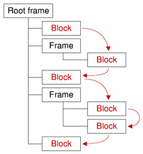

# QTextBlock Class Reference

## [[QtGui](index.htm) module]

该QTextBlock类提供一个容器，用于文本片段中[QTextDocument](qtextdocument.html)。[More...](#details)

### Types

*   `class **[iterator](index.htm)**`

### Methods

*   `__init__ (self)`
*   `__init__ (self, QTextBlock o)`
*   `iterator begin (self)`
*   `QTextBlockFormat blockFormat (self)`
*   `int blockFormatIndex (self)`
*   `int blockNumber (self)`
*   `QTextCharFormat charFormat (self)`
*   `int charFormatIndex (self)`
*   `clearLayout (self)`
*   `bool contains (self, int position)`
*   `QTextDocument document (self)`
*   `iterator end (self)`
*   `int firstLineNumber (self)`
*   `bool isValid (self)`
*   `bool isVisible (self)`
*   `QTextLayout layout (self)`
*   `int length (self)`
*   `int lineCount (self)`
*   `QTextBlock next (self)`
*   `int position (self)`
*   `QTextBlock previous (self)`
*   `int revision (self)`
*   `setLineCount (self, int count)`
*   `setRevision (self, int rev)`
*   `setUserData (self, QTextBlockUserData data)`
*   `setUserState (self, int state)`
*   `setVisible (self, bool visible)`
*   `QString text (self)`
*   `Qt.LayoutDirection textDirection (self)`
*   `QTextList textList (self)`
*   `QTextBlockUserData userData (self)`
*   `int userState (self)`

### Special Methods

*   `bool __eq__ (self, QTextBlock o)`
*   `bool __ge__ (self, QTextBlock o)`
*   `bool __lt__ (self, QTextBlock o)`
*   `bool __ne__ (self, QTextBlock o)`

* * *

## Detailed Description

该QTextBlock类提供一个容器，用于文本片段中[QTextDocument](qtextdocument.html)。

文字块封装在一个块或一段文字[QTextDocument](qtextdocument.html)。 QTextBlock提供QTextDocuments块/段落结构进行只读访问。主要的是使用，如果你想实现自己的布局的可视化表示形式[QTextDocument](qtextdocument.html)，或者如果您想遍历一个文件，写出来的内容在自己的自定义格式。

文本块通过它们的父文件创建的。如果你需要创建一个新的文本块，或修改文件的内容，同时检查其内容，使用所提供的基于指针的接口[QTextCursor](qtextcursor.html)代替。

每个文本块位于一个特定的[position](qtextblock.html#position)在（）[document](qtextblock.html#document)（ ） 。该块的内容可以通过使用所获得的[text](qtextblock.html#text)（）函数。该[length](qtextblock.html#length)（ ）函数确定文件（包括格式化字符）中的块的大小。块的可视属性是由它的文本确定[layout](qtextblock.html#layout)（） ，其[charFormat](qtextblock.html#charFormat)（） ，和其[blockFormat](qtextblock.html#blockFormat)（ ） 。

该[next](qtextblock.html#next)（）和[previous](qtextblock.html#previous)（ ）函数使迭代连续有效块一份文件，该文件是由其他途径在迭代过程中不被修改的情况下。需要注意的是，虽然块序列中返回，相邻块可能来自于文件结构不同的地方。块的有效性可以通过调用确定[isValid](qtextblock.html#isValid)（ ） 。

QTextBlock提供了比较操作符，使其更容易与块工作：[operator==](qtextblock.html#operator-eq-eq)（ ）比较两个块是否相等，[operator!=](qtextblock.html#operator-not-eq)（ ）比较两个街区的不平等，[operator&lt;](qtextblock.html#operator-lt)（ ）确定数据块是否先于在同一文档中的另一个。



* * *

## Method Documentation

```
QTextBlock.__init__ (self)
```

副本_other_文本块的属性到这个文本块。

```
QTextBlock.__init__ (self, QTextBlock o)
```

```
iterator QTextBlock.begin (self)
```

[

返回一个文本块迭代器，指向文本块的开始。

](index.htm)

[**See also**](index.htm) [end](qtextblock.html#end)（ ） 。

```
QTextBlockFormat QTextBlock.blockFormat (self)
```

[](qtextblockformat.html)

[返回](qtextblockformat.html)[QTextBlockFormat](qtextblockformat.html)描述块特定的属性。

**See also** [charFormat](qtextblock.html#charFormat)（ ） 。

```
int QTextBlock.blockFormatIndex (self)
```

返回一个索引到文档内部的块格式的文本块的格式列表。

**See also** [QTextDocument.allFormats](qtextdocument.html#allFormats)（ ） 。

```
int QTextBlock.blockNumber (self)
```

返回此块的数量，或-1，如果块是无效的。

此功能被引入Qt的4.4 。

**See also** [QTextCursor.blockNumber](qtextcursor.html#blockNumber)（ ） 。

```
QTextCharFormat QTextBlock.charFormat (self)
```

[](qtextcharformat.html)

[返回](qtextcharformat.html)[QTextCharFormat](qtextcharformat.html)描述块的字符格式。插入文本到一个空的块时，块的字符格式。

**See also** [blockFormat](qtextblock.html#blockFormat)（ ） 。

```
int QTextBlock.charFormatIndex (self)
```

返回一个索引到文档内部的字符格式的文本块的字符格式列表。

**See also** [QTextDocument.allFormats](qtextdocument.html#allFormats)（ ） 。

```
QTextBlock.clearLayout (self)
```

清除[QTextLayout](qtextlayout.html)用来布局和显示模块的内容。

此功能被引入Qt的4.4 。

**See also** [layout](qtextblock.html#layout)（ ） 。

```
bool QTextBlock.contains (self, int position)
```

返回True如果给定的_position_位于文本块中，否则返回False 。

```
QTextDocument QTextBlock.document (self)
```

[

返回该文本块属于文本文件，或者0，如果该文本块不属于任何文件。

](qtextdocument.html)

```
iterator QTextBlock.end (self)
```

[

返回一个文本块迭代器，指向文本块的结尾。

](index.htm)

[**See also**](index.htm) [begin](qtextblock.html#begin)（ ）[next](qtextblock.html#next)（）和[previous](qtextblock.html#previous)（ ） 。

```
int QTextBlock.firstLineNumber (self)
```

返回该块的第一行号，或-1，如果该块是无效的。除非布局支持它，行号是相同的块数。

此功能被引入Qt的4.5 。

**See also** [QTextBlock.blockNumber](qtextblock.html#blockNumber)（ ） 。

```
bool QTextBlock.isValid (self)
```

返回True如果该文本块是有效的，否则返回False 。

```
bool QTextBlock.isVisible (self)
```

返回True如果该块是可见的，否则返回False 。

此功能被引入Qt的4.4 。

**See also** [setVisible](qtextblock.html#setVisible)（ ） 。

```
QTextLayout QTextBlock.layout (self)
```

[](qtextlayout.html)

[返回](qtextlayout.html)[QTextLayout](qtextlayout.html)用来布局和显示模块的内容。

注意，返回[QTextLayout](qtextlayout.html)对象只能从documentChanged实现的一种变型[QAbstractTextDocumentLayout](qabstracttextdocumentlayout.html)子类。从外部原因未定义的行为施加的任何更改。

**See also** [clearLayout](qtextblock.html#clearLayout)（ ） 。

```
int QTextBlock.length (self)
```

返回字符的块的长度。

**Note:**返回的长度包括所有格式的字符，例如，换行符。

**See also** [text](qtextblock.html#text)（ ）[charFormat](qtextblock.html#charFormat)（）和[blockFormat](qtextblock.html#blockFormat)（ ） 。

```
int QTextBlock.lineCount (self)
```

返回的行数。不是所有的文件布局支持此功能。

此功能被引入Qt的4.5 。

**See also** [setLineCount](qtextblock.html#setLineCount)（ ） 。

```
QTextBlock QTextBlock.next (self)
```

[

返回文档中的文本块这个块后，或者一个空的文本块，如果这是最后一个。

注意，下一个块可以是在不同的帧或表本块。

](qtextblock.html)

[**See also**](qtextblock.html) [previous](qtextblock.html#previous)（ ）[begin](qtextblock.html#begin)（）和[end](qtextblock.html#end)（ ） 。

```
int QTextBlock.position (self)
```

返回的文档内的块的第一个字符的索引。

```
QTextBlock QTextBlock.previous (self)
```

[

返回文档中的文本块这个块之前，或者一个空的文本块，如果这是第一个。

注意，下一个块可以是在不同的帧或表本块。

](qtextblock.html)

[**See also**](qtextblock.html) [next](qtextblock.html#next)（ ）[begin](qtextblock.html#begin)（）和[end](qtextblock.html#end)（ ） 。

```
int QTextBlock.revision (self)
```

返回的块版本。

此功能被引入Qt的4.4 。

**See also** [setRevision](qtextblock.html#setRevision)（）和[QTextDocument.revision](qtextdocument.html#revision)（ ） 。

```
QTextBlock.setLineCount (self, int count)
```

设置行计数_count_。

此功能被引入Qt的4.5 。

**See also** [lineCount](qtextblock.html#lineCount)（ ） 。

```
QTextBlock.setRevision (self, int rev)
```

设置一个块修订_rev_。

此功能被引入Qt的4.4 。

**See also** [revision](qtextblock.html#revision)（）和[QTextDocument.revision](qtextdocument.html#revision)（ ） 。

```
QTextBlock.setUserData (self, QTextBlockUserData data)
```

重视给定的_data_反对的文本块。

[QTextBlockUserData](qtextblockuserdata.html)可以用来存储自定义设置。所有权被传递到下面的文本文件，即提供[QTextBlockUserData](qtextblockuserdata.html)如果相应的文本块被删除的对象将被删除。用户数据对象未存储在还原历史，所以撤消删除的文本块后，将无法使用。

例如，如果你写了一个程序编辑器中的IDE ，你可能想让你的用户设置断点视觉代码中的一个集成的调试器。在程序编辑器的文本行通常对应于一个[QTextBlock](qtextblock.html)。该[QTextBlockUserData](qtextblockuserdata.html)接口允许开发者存储数据的每个[QTextBlock](qtextblock.html)一样，例如在其中的源代码行的用户有一个断点集。当然，这也可以被存储在外部，但是通过将其存储在内部[QTextDocument](qtextdocument.html)，将例如自动当用户删除与其相关的行删除。这真的只是一种方法，在存储自定义信息[QTextDocument](qtextdocument.html)在不使用自定义属性[QTextFormat](qtextformat.html)这会影响撤销/重做堆栈。

这个函数是Qt 4.1中引入。

**See also** [userData](qtextblock.html#userData)（ ） 。

```
QTextBlock.setUserState (self, int state)
```

在指定的商店_state_在文本块的整数值。这可能是有用的，例如在一个语法高亮显示来存储文本解析状态。

这个函数是Qt 4.1中引入。

**See also** [userState](qtextblock.html#userState)（ ） 。

```
QTextBlock.setVisible (self, bool visible)
```

设置块的可见性_visible_。

此功能被引入Qt的4.4 。

**See also** [isVisible](qtextblock.html#isVisible)（ ） 。

```
QString QTextBlock.text (self)
```

返回块的内容为纯文本。

**See also** [length](qtextblock.html#length)（ ）[charFormat](qtextblock.html#charFormat)（）和[blockFormat](qtextblock.html#blockFormat)（ ） 。

```
Qt.LayoutDirection QTextBlock.textDirection (self)
```

[

返回解析文字方向。

](qt.html#LayoutDirection-enum)

[如果块没有明确的方向设置，它会从块内容解决的方向。要么返回](qt.html#LayoutDirection-enum)[Qt.LeftToRight](qt.html#LayoutDirection-enum) or [Qt.RightToLeft](qt.html#LayoutDirection-enum)。

此功能被引入Qt的4.7 。

**See also** [QTextFormat.layoutDirection](qtextformat.html#layoutDirection)（ ）[QString.isRightToLeft](qstring.html#isRightToLeft)（）和[Qt.LayoutDirection](qt.html#LayoutDirection-enum)。

```
QTextList QTextBlock.textList (self)
```

[

如果块代表一个列表项，则返回该项目所属的列表，否则返回0 。

](qtextlist.html)

```
QTextBlockUserData QTextBlock.userData (self)
```

[](qtextblockuserdata.html)

[返回一个指针，指向一个](qtextblockuserdata.html)[QTextBlockUserData](qtextblockuserdata.html)如果以前设置与对象[setUserData](qtextblock.html#setUserData)（ ）或一个空指针。

这个函数是Qt 4.1中引入。

**See also** [setUserData](qtextblock.html#setUserData)（ ） 。

```
int QTextBlock.userState (self)
```

返回以前设置的整数值[setUserState](qtextblock.html#setUserState)（）或-1。

这个函数是Qt 4.1中引入。

**See also** [setUserState](qtextblock.html#setUserState)（ ） 。

```
bool QTextBlock.__eq__ (self, QTextBlock o)
```

```
bool QTextBlock.__ge__ (self, QTextBlock o)
```

```
bool QTextBlock.__lt__ (self, QTextBlock o)
```

```
bool QTextBlock.__ne__ (self, QTextBlock o)
```