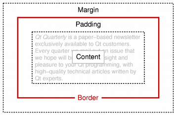

# QTextFrameFormat Class Reference

## [[QtGui](index.htm) module]

该QTextFrameFormat类提供的格式信息帧[QTextDocument](qtextdocument.html)。[More...](#details)

继承[QTextFormat](qtextformat.html)。

通过继承[QTextTableFormat](qtexttableformat.html)。

### Types

*   `enum BorderStyle { BorderStyle_None, BorderStyle_Dotted, BorderStyle_Dashed, BorderStyle_Solid, ..., BorderStyle_Outset }`
*   `enum Position { InFlow, FloatLeft, FloatRight }`

### Methods

*   `__init__ (self)`
*   `__init__ (self, QTextFrameFormat)`
*   `float border (self)`
*   `QBrush borderBrush (self)`
*   `BorderStyle borderStyle (self)`
*   `float bottomMargin (self)`
*   `QTextLength height (self)`
*   `bool isValid (self)`
*   `float leftMargin (self)`
*   `float margin (self)`
*   `float padding (self)`
*   `QTextFormat.PageBreakFlags pageBreakPolicy (self)`
*   `Position position (self)`
*   `float rightMargin (self)`
*   `setBorder (self, float aborder)`
*   `setBorderBrush (self, QBrush brush)`
*   `setBorderStyle (self, BorderStyle style)`
*   `setBottomMargin (self, float amargin)`
*   `setHeight (self, float aheight)`
*   `setHeight (self, QTextLength aheight)`
*   `setLeftMargin (self, float amargin)`
*   `setMargin (self, float amargin)`
*   `setPadding (self, float apadding)`
*   `setPageBreakPolicy (self, QTextFormat.PageBreakFlags flags)`
*   `setPosition (self, Position f)`
*   `setRightMargin (self, float amargin)`
*   `setTopMargin (self, float amargin)`
*   `setWidth (self, QTextLength length)`
*   `setWidth (self, float awidth)`
*   `float topMargin (self)`
*   `QTextLength width (self)`

* * *

## Detailed Description

该QTextFrameFormat类提供的格式信息帧[QTextDocument](qtextdocument.html)。

一个文本框组合在一起的一个或多个文本块，提供了一个层结构比段落更大。一帧的格式指定它如何呈现和定位在所述屏幕上。它不直接在指定的文本格式的行为，但提供了有关其子女的布局约束。

帧格式定义[width](qtextframeformat.html#width)（）和[height](qtextframeformat.html#height)屏幕上的帧的（） 。每帧可以有一个[border](qtextframeformat.html#border)（） ，围绕它的内容用矩形框。边框是由包围[margin](qtextframeformat.html#margin)（）周围的框架，并在框架的内容被分开的边界由所述框架的[padding](qtextframeformat.html#padding)（ ） 。此方案类似于使用层叠样式表对HTML页面的盒模型。



该[position](qtextframeformat.html#position)一帧（ ）设置使用[setPosition](qtextframeformat.html#setPosition)（ ），并确定它是如何定位相对于周围的文本。

一个QTextFrameFormat对象的有效性可以用来确定[isValid](qtextframeformat.html#isValid)（）函数。

* * *

## Type Documentation

```
QTextFrameFormat.BorderStyle
```

这个枚举变量描述文本框不同的边框样式。

| Constant | Value |
| --- | --- |
| `QTextFrameFormat.BorderStyle_None` | `0` |
| `QTextFrameFormat.BorderStyle_Dotted` | `1` |
| `QTextFrameFormat.BorderStyle_Dashed` | `2` |
| `QTextFrameFormat.BorderStyle_Solid` | `3` |
| `QTextFrameFormat.BorderStyle_Double` | `4` |
| `QTextFrameFormat.BorderStyle_DotDash` | `5` |
| `QTextFrameFormat.BorderStyle_DotDotDash` | `6` |
| `QTextFrameFormat.BorderStyle_Groove` | `7` |
| `QTextFrameFormat.BorderStyle_Ridge` | `8` |
| `QTextFrameFormat.BorderStyle_Inset` | `9` |
| `QTextFrameFormat.BorderStyle_Outset` | `10` |

这个枚举被引入或修改的Qt 4.3 。

**See also** [borderStyle](qtextframeformat.html#borderStyle)（）和[FrameBorderStyle](qtextformat.html#Property-enum)。

```
QTextFrameFormat.Position
```

这个枚举说明如何一帧位于相对于周围的文本。

| Constant | Value |
| --- | --- |
| `QTextFrameFormat.InFlow` | `0` |
| `QTextFrameFormat.FloatLeft` | `1` |
| `QTextFrameFormat.FloatRight` | `2` |

**See also** [position](qtextframeformat.html#position)（）和[CssFloat](qtextformat.html#Property-enum)。

* * *

## Method Documentation

```
QTextFrameFormat.__init__ (self)
```

构造一个文本框格式对象的默认属性。

```
QTextFrameFormat.__init__ (self, QTextFrameFormat)
```

```
float QTextFrameFormat.border (self)
```

返回像素的边框的宽度。

**See also** [setBorder](qtextframeformat.html#setBorder)（ ） 。

```
QBrush QTextFrameFormat.borderBrush (self)
```

[

返回用于框架的边框刷。

此功能被引入Qt的4.3 。

](qbrush.html)

[**See also**](qbrush.html) [setBorderBrush](qtextframeformat.html#setBorderBrush)（ ） 。

```
BorderStyle QTextFrameFormat.borderStyle (self)
```

[

返回框架的边框的样式。

此功能被引入Qt的4.3 。

](qtextframeformat.html#BorderStyle-enum)

[**See also**](qtextframeformat.html#BorderStyle-enum) [setBorderStyle](qtextframeformat.html#setBorderStyle)（ ） 。

```
float QTextFrameFormat.bottomMargin (self)
```

返回的帧的下边距以像素为单位的宽度。

此功能被引入Qt的4.3 。

**See also** [setBottomMargin](qtextframeformat.html#setBottomMargin)（ ） 。

```
QTextLength QTextFrameFormat.height (self)
```

[

返回框架的边框矩形的高度。

](qtextlength.html)

[**See also**](qtextlength.html) [setHeight](qtextframeformat.html#setHeight)（ ） 。

```
bool QTextFrameFormat.isValid (self)
```

返回True如果格式说明是有效的，否则返回False 。

```
float QTextFrameFormat.leftMargin (self)
```

返回的帧的左边距以像素为单位的宽度。

此功能被引入Qt的4.3 。

**See also** [setLeftMargin](qtextframeformat.html#setLeftMargin)（ ） 。

```
float QTextFrameFormat.margin (self)
```

返回的帧的外部边距以像素为单位的宽度。

**See also** [setMargin](qtextframeformat.html#setMargin)（ ） 。

```
float QTextFrameFormat.padding (self)
```

返回以像素为框架的内部填充的宽度。

**See also** [setPadding](qtextframeformat.html#setPadding)（ ） 。

```
QTextFormat.PageBreakFlags QTextFrameFormat.pageBreakPolicy (self)
```

[](index.htm)

[返回帧/表中的当前设置的分页符政策。默认值是](index.htm)[QTextFormat.PageBreak_Auto](qtextformat.html#PageBreakFlag-enum)。

这个函数中引入了Qt 4.2中。

**See also** [setPageBreakPolicy](qtextframeformat.html#setPageBreakPolicy)（ ） 。

```
Position QTextFrameFormat.position (self)
```

[

返回的定位策略框架与此帧格式。

](qtextframeformat.html#Position-enum)

[**See also**](qtextframeformat.html#Position-enum) [setPosition](qtextframeformat.html#setPosition)（ ） 。

```
float QTextFrameFormat.rightMargin (self)
```

返回的帧的右边距，以像素为单位的宽度。

此功能被引入Qt的4.3 。

**See also** [setRightMargin](qtextframeformat.html#setRightMargin)（ ） 。

```
QTextFrameFormat.setBorder (self, float aborder)
```

设置_width_（以像素为单位）帧的边界。

**See also** [border](qtextframeformat.html#border)（ ） 。

```
QTextFrameFormat.setBorderBrush (self, QBrush brush)
```

设置_brush_用于框架的边框。

此功能被引入Qt的4.3 。

**See also** [borderBrush](qtextframeformat.html#borderBrush)（ ） 。

```
QTextFrameFormat.setBorderStyle (self, BorderStyle style)
```

设置_style_的帧的边界。

此功能被引入Qt的4.3 。

**See also** [borderStyle](qtextframeformat.html#borderStyle)（ ） 。

```
QTextFrameFormat.setBottomMargin (self, float amargin)
```

设置框架的底部_margin_以像素为单位。

此功能被引入Qt的4.3 。

**See also** [bottomMargin](qtextframeformat.html#bottomMargin)（ ） 。

```
QTextFrameFormat.setHeight (self, float aheight)
```

设置帧的_height_。

**See also** [height](qtextframeformat.html#height)（ ） 。

```
QTextFrameFormat.setHeight (self, QTextLength aheight)
```

这是一个重载函数。

设置帧的_height_。

```
QTextFrameFormat.setLeftMargin (self, float amargin)
```

设置框架的左_margin_以像素为单位。

此功能被引入Qt的4.3 。

**See also** [leftMargin](qtextframeformat.html#leftMargin)（ ） 。

```
QTextFrameFormat.setMargin (self, float amargin)
```

设置帧的_margin_以像素为单位。这种方法同样设置了左，右，上和框架为相同的值的上下边界。个别利润率复盖一般利润率。

**See also** [margin](qtextframeformat.html#margin)（ ） 。

```
QTextFrameFormat.setPadding (self, float apadding)
```

设置_width_以像素为框架的内部填充。

**See also** [padding](qtextframeformat.html#padding)（ ） 。

```
QTextFrameFormat.setPageBreakPolicy (self, QTextFormat.PageBreakFlags flags)
```

设置为帧/表分页政策_policy_。

这个函数中引入了Qt 4.2中。

**See also** [pageBreakPolicy](qtextframeformat.html#pageBreakPolicy)（ ） 。

```
QTextFrameFormat.setPosition (self, Position f)
```

设置_policy_用于定位的帧与该帧的格式。

**See also** [position](qtextframeformat.html#position)（ ） 。

```
QTextFrameFormat.setRightMargin (self, float amargin)
```

设置帧的权利_margin_以像素为单位。

此功能被引入Qt的4.3 。

**See also** [rightMargin](qtextframeformat.html#rightMargin)（ ） 。

```
QTextFrameFormat.setTopMargin (self, float amargin)
```

设置帧的顶部_margin_以像素为单位。

此功能被引入Qt的4.3 。

**See also** [topMargin](qtextframeformat.html#topMargin)（ ） 。

```
QTextFrameFormat.setWidth (self, QTextLength length)
```

设置帧的边界矩形的_width_。

**See also** [width](qtextframeformat.html#width)（）和[QTextLength](qtextlength.html)。

```
QTextFrameFormat.setWidth (self, float awidth)
```

这是一个重载函数。

该设置框的边框矩形的宽度的宽度到指定的简便方法固定_width_。

```
float QTextFrameFormat.topMargin (self)
```

返回的帧的上边距，以像素为单位的宽度。

此功能被引入Qt的4.3 。

**See also** [setTopMargin](qtextframeformat.html#setTopMargin)（ ） 。

```
QTextLength QTextFrameFormat.width (self)
```

[

返回框架的边框矩形的宽度。

](qtextlength.html)

[**See also**](qtextlength.html) [setWidth](qtextframeformat.html#setWidth)（）和[QTextLength](qtextlength.html)。