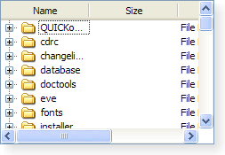
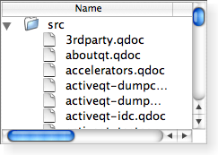
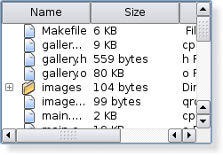

# QTreeWidget Class Reference

## [[QtGui](index.htm) module]

该QTreeWidget类提供了使用预定义树模型的树视图。[More...](#details)

继承[QTreeView](qtreeview.html)。

### Methods

*   `__init__ (self, QWidget parent = None)`
*   `addTopLevelItem (self, QTreeWidgetItem item)`
*   `addTopLevelItems (self, list-of-QTreeWidgetItem items)`
*   `clear (self)`
*   `closePersistentEditor (self, QTreeWidgetItem item, int column = 0)`
*   `collapseItem (self, QTreeWidgetItem item)`
*   `int columnCount (self)`
*   `int currentColumn (self)`
*   `QTreeWidgetItem currentItem (self)`
*   `dropEvent (self, QDropEvent event)`
*   `bool dropMimeData (self, QTreeWidgetItem parent, int index, QMimeData data, Qt.DropAction action)`
*   `editItem (self, QTreeWidgetItem item, int column = 0)`
*   `bool event (self, QEvent e)`
*   `expandItem (self, QTreeWidgetItem item)`
*   `list-of-QTreeWidgetItem findItems (self, QString text, Qt.MatchFlags flags, int column = 0)`
*   `QTreeWidgetItem headerItem (self)`
*   `QModelIndex indexFromItem (self, QTreeWidgetItem item, int column = 0)`
*   `int indexOfTopLevelItem (self, QTreeWidgetItem item)`
*   `insertTopLevelItem (self, int index, QTreeWidgetItem item)`
*   `insertTopLevelItems (self, int index, list-of-QTreeWidgetItem items)`
*   `QTreeWidgetItem invisibleRootItem (self)`
*   `bool isFirstItemColumnSpanned (self, QTreeWidgetItem item)`
*   `bool isItemExpanded (self, QTreeWidgetItem item)`
*   `bool isItemHidden (self, QTreeWidgetItem item)`
*   `bool isItemSelected (self, QTreeWidgetItem item)`
*   `bool isSortingEnabled (self)`
*   `QTreeWidgetItem itemAbove (self, QTreeWidgetItem item)`
*   `QTreeWidgetItem itemAt (self, QPoint p)`
*   `QTreeWidgetItem itemAt (self, int ax, int ay)`
*   `QTreeWidgetItem itemBelow (self, QTreeWidgetItem item)`
*   `QTreeWidgetItem itemFromIndex (self, QModelIndex index)`
*   `list-of-QTreeWidgetItem items (self, QMimeData data)`
*   `QWidget itemWidget (self, QTreeWidgetItem item, int column)`
*   `QMimeData mimeData (self, list-of-QTreeWidgetItem items)`
*   `QStringList mimeTypes (self)`
*   `openPersistentEditor (self, QTreeWidgetItem item, int column = 0)`
*   `removeItemWidget (self, QTreeWidgetItem item, int column)`
*   `scrollToItem (self, QTreeWidgetItem item, QAbstractItemView.ScrollHint hint = QAbstractItemView.EnsureVisible)`
*   `list-of-QTreeWidgetItem selectedItems (self)`
*   `setColumnCount (self, int columns)`
*   `setCurrentItem (self, QTreeWidgetItem item)`
*   `setCurrentItem (self, QTreeWidgetItem item, int column)`
*   `setCurrentItem (self, QTreeWidgetItem item, int column, QItemSelectionModel.SelectionFlags command)`
*   `setFirstItemColumnSpanned (self, QTreeWidgetItem item, bool span)`
*   `setHeaderItem (self, QTreeWidgetItem item)`
*   `setHeaderLabel (self, QString alabel)`
*   `setHeaderLabels (self, QStringList labels)`
*   `setItemExpanded (self, QTreeWidgetItem item, bool expand)`
*   `setItemHidden (self, QTreeWidgetItem item, bool hide)`
*   `setItemSelected (self, QTreeWidgetItem item, bool select)`
*   `setItemWidget (self, QTreeWidgetItem item, int column, QWidget widget)`
*   `setSelectionModel (self, QItemSelectionModel selectionModel)`
*   `setSortingEnabled (self, bool enable)`
*   `int sortColumn (self)`
*   `sortItems (self, int column, Qt.SortOrder order)`
*   `Qt.DropActions supportedDropActions (self)`
*   `QTreeWidgetItem takeTopLevelItem (self, int index)`
*   `QTreeWidgetItem topLevelItem (self, int index)`
*   `int topLevelItemCount (self)`
*   `QRect visualItemRect (self, QTreeWidgetItem item)`

### Qt Signals

*   `void currentItemChanged (QTreeWidgetItem *,QTreeWidgetItem *)`
*   `void itemActivated (QTreeWidgetItem *,int)`
*   `void itemChanged (QTreeWidgetItem *,int)`
*   `void itemClicked (QTreeWidgetItem *,int)`
*   `void itemCollapsed (QTreeWidgetItem *)`
*   `void itemDoubleClicked (QTreeWidgetItem *,int)`
*   `void itemEntered (QTreeWidgetItem *,int)`
*   `void itemExpanded (QTreeWidgetItem *)`
*   `void itemPressed (QTreeWidgetItem *,int)`
*   `void itemSelectionChanged ()`

* * *

## Detailed Description

该QTreeWidget类提供了使用预定义树模型的树视图。

该QTreeWidget类是一个方便的类，它提供了一个标准的树部件采用了经典的基于项目的界面相似，所使用的[QListView](qlistview.html)类的Qt 3 。每一个这个类是基于Qt的模型/视图结构，并使用默认的模型来保存项目，是一个[QTreeWidgetItem](qtreewidgetitem.html)。

开发商谁也不需要的模型/视图框架的灵活性，可以使用这个类来很容易地创建简单的层次结构列表。更灵活的方法涉及一个组合[QTreeView](qtreeview.html)与标准的项目模型。这使得数据的存储也可以从它的表示分离。

在其最简单的形式，树控件可以通过以下方式构造：

```
 QTreeWidget *treeWidget = new QTreeWidget();
 treeWidget->setColumnCount(1);
 [QList](index.htm)<[QTreeWidgetItem](qtreewidgetitem.html) *> items;
 for (int i = 0; i < 10; ++i)
     items.append(new [QTreeWidgetItem](qtreewidgetitem.html)((QTreeWidget*)0, [QStringList](qstringlist.html)([QString](qstring.html)("item: %1").arg(i))));
 treeWidget->insertTopLevelItems(0, items);

```

前项可被添加到树部件，列的数目必须与设置[setColumnCount](qtreewidget.html#columnCount-prop)（ ） 。这允许每个产品有一个或多个标籤或其它装饰。在使用列数可以与被发现[columnCount](qtreewidget.html#columnCount-prop)（）函数。

树可以有一个包含部分在widget每列的标题。这是最简单的通过提供一个字符串列表来设置每个部分的标籤[setHeaderLabels](qtreewidget.html#setHeaderLabels)（ ） ，但自定义标题可以与构造[QTreeWidgetItem](qtreewidgetitem.html)和插入到与树[setHeaderItem](qtreewidget.html#setHeaderItem)（）函数。

在树中的项目可以按列根据预定义的排序顺序进行排序。如果排序时启用，用户可以通过单击列标题中的项目进行排序。排序可以启用或禁用通过调用[setSortingEnabled()](qtreeview.html#sortingEnabled-prop)。该[isSortingEnabled()](qtreeview.html#sortingEnabled-prop)功能指示排序是否已启用。

|  |  |  |
| A [Windows XP style](index.htm) tree widget. | A [Macintosh style](index.htm) tree widget. | A [Plastique style](index.htm) tree widget. |

* * *

## Method Documentation

```
QTreeWidget.__init__ (self, QWidget parent = None)
```

该_parent_的说法，如果不是没有，原因_self_通过Qt的，而不是PyQt的拥有。

构造一个树形控件与给定_parent_。

```
QTreeWidget.addTopLevelItem (self, QTreeWidgetItem item)
```

该_item_说法有它的所有权转移给Qt的。

追加_item_如在小部件的顶级项目。

这个函数是Qt 4.1中引入。

**See also** [insertTopLevelItem](qtreewidget.html#insertTopLevelItem)（ ） 。

```
QTreeWidget.addTopLevelItems (self, list-of-QTreeWidgetItem items)
```

该_items_说法有它的所有权转移给Qt的。

附加列表_items_如在小部件的顶级项目。

**See also** [insertTopLevelItems](qtreewidget.html#insertTopLevelItems)（ ） 。

```
QTreeWidget.clear (self)
```

这种方法也是一个Qt槽与C + +的签名`void clear()`。

通过删除所有的项目，并选择清除树部件。

**Note:**由于每个项目被删除之前从树控件中删除，返回值[QTreeWidgetItem.treeWidget](qtreewidgetitem.html#treeWidget)（ ）将是无效的从一个项目的析构函数被调用时。

**See also** [takeTopLevelItem](qtreewidget.html#takeTopLevelItem)（ ）[topLevelItemCount](qtreewidget.html#topLevelItemCount-prop)（）和[columnCount](qtreewidget.html#columnCount-prop)（ ） 。

```
QTreeWidget.closePersistentEditor (self, QTreeWidgetItem item, int column = 0)
```

关闭持久编辑的_item_在给定的_column_。

这个功能有没有影响，如果没有持续的编辑器打开的项目和柱的结合。

**See also** [openPersistentEditor](qtreewidget.html#openPersistentEditor)（ ） 。

```
QTreeWidget.collapseItem (self, QTreeWidgetItem item)
```

这种方法也是一个Qt槽与C + +的签名`void collapseItem(const QTreeWidgetItem *)`。

关闭_item_。这会导致崩溃了包含该项目的子项的树。

**See also** [expandItem](qtreewidget.html#expandItem)（ ）[currentItem](qtreewidget.html#currentItem)（ ）[itemAt](qtreewidget.html#itemAt)（）和[topLevelItem](qtreewidget.html#topLevelItem)（ ） 。

```
int QTreeWidget.columnCount (self)
```

```
int QTreeWidget.currentColumn (self)
```

返回在树插件的当前列。

这个函数是Qt 4.1中引入。

**See also** [setCurrentItem](qtreewidget.html#setCurrentItem)（）和[columnCount](qtreewidget.html#columnCount-prop)（ ） 。

```
QTreeWidgetItem QTreeWidget.currentItem (self)
```

[

返回在树插件的当前项。

](qtreewidgetitem.html)

[**See also**](qtreewidgetitem.html) [setCurrentItem](qtreewidget.html#setCurrentItem)（）和[currentItemChanged](qtreewidget.html#currentItemChanged)（ ） 。

```
QTreeWidget.dropEvent (self, QDropEvent event)
```

从重新实现[QWidget.dropEvent](qwidget.html#dropEvent)（ ） 。

```
bool QTreeWidget.dropMimeData (self, QTreeWidgetItem parent, int index, QMimeData data, Qt.DropAction action)
```

处理_data_通过拖放操作，与给定的供给结束_action_在_index_在给定的_parent_项目。

默认实现返回True，如果下跌是由解码MIME数据并将其插入到模型成功地处理，否则返回False 。

**See also** [supportedDropActions](qtreewidget.html#supportedDropActions)（ ） 。

```
QTreeWidget.editItem (self, QTreeWidgetItem item, int column = 0)
```

开始编辑_item_在给定的_column_如果是可编辑的。

```
bool QTreeWidget.event (self, QEvent e)
```

从重新实现[QObject.event](qobject.html#event)（ ） 。

```
QTreeWidget.expandItem (self, QTreeWidgetItem item)
```

这种方法也是一个Qt槽与C + +的签名`void expandItem(const QTreeWidgetItem *)`。

扩展_item_。这会导致扩大了包含该项目的子项的树。

**See also** [collapseItem](qtreewidget.html#collapseItem)（ ）[currentItem](qtreewidget.html#currentItem)（ ）[itemAt](qtreewidget.html#itemAt)（ ）[topLevelItem](qtreewidget.html#topLevelItem)（）和[itemExpanded](qtreewidget.html#itemExpanded)（ ） 。

```
list-of-QTreeWidgetItem QTreeWidget.findItems (self, QString text, Qt.MatchFlags flags, int column = 0)
```

返回匹配给定的项目清单_text_，使用给定的_flags_在给定的_column_。

```
QTreeWidgetItem QTreeWidget.headerItem (self)
```

[

返回用于树部件的头的项目。

](qtreewidgetitem.html)

[**See also**](qtreewidgetitem.html) [setHeaderItem](qtreewidget.html#setHeaderItem)（ ） 。

```
QModelIndex QTreeWidget.indexFromItem (self, QTreeWidgetItem item, int column = 0)
```

[](qmodelindex.html)

[返回](qmodelindex.html)[QModelIndex](qmodelindex.html)assocated用给定的_item_在给定的_column_。

**See also** [itemFromIndex](qtreewidget.html#itemFromIndex)（）和[topLevelItem](qtreewidget.html#topLevelItem)（ ） 。

```
int QTreeWidget.indexOfTopLevelItem (self, QTreeWidgetItem item)
```

返回给定的顶层的索引_item_，或-1，如果项目无法找到。

**See also** [sortItems](qtreewidget.html#sortItems)（）和[topLevelItemCount](qtreewidget.html#topLevelItemCount-prop)（ ） 。

```
QTreeWidget.insertTopLevelItem (self, int index, QTreeWidgetItem item)
```

该_item_说法有它的所有权转移给Qt的。

插入_item_在_index_在视图中的顶级水准。

如果该项目已被插入别的地方它不会被插入。

**See also** [addTopLevelItem](qtreewidget.html#addTopLevelItem)（）和[columnCount](qtreewidget.html#columnCount-prop)（ ） 。

```
QTreeWidget.insertTopLevelItems (self, int index, list-of-QTreeWidgetItem items)
```

该_items_说法有它的所有权转移给Qt的。

插入列表_items_在_index_在视图中的顶级水准。

那些已经被插入其他地方的项目不会被插入。

这个函数是Qt 4.1中引入。

**See also** [addTopLevelItems](qtreewidget.html#addTopLevelItems)（ ） 。

```
QTreeWidgetItem QTreeWidget.invisibleRootItem (self)
```

[

返回树部件的无形之根项目。

](qtreewidgetitem.html)

[看不见的根项目，通过提供对树控件的顶级项目](qtreewidgetitem.html)[QTreeWidgetItem](qtreewidgetitem.html)的API ，从而可以写，可以治疗顶级项目和他们的孩子在一个统一的方式的功能，例如，递归函数。

这个函数中引入了Qt 4.2中。

```
bool QTreeWidget.isFirstItemColumnSpanned (self, QTreeWidgetItem item)
```

返回True如果给定的_item_被设置为只显示一个对所有列部分，否则返回False 。

此功能被引入Qt的4.3 。

**See also** [setFirstItemColumnSpanned](qtreewidget.html#setFirstItemColumnSpanned)（ ） 。

```
bool QTreeWidget.isItemExpanded (self, QTreeWidgetItem item)
```

```
bool QTreeWidget.isItemHidden (self, QTreeWidgetItem item)
```

```
bool QTreeWidget.isItemSelected (self, QTreeWidgetItem item)
```

```
bool QTreeWidget.isSortingEnabled (self)
```

```
QTreeWidgetItem QTreeWidget.itemAbove (self, QTreeWidgetItem item)
```

[

返回上面给定的项目_item_。

此功能被引入Qt的4.3 。

](qtreewidgetitem.html)

```
QTreeWidgetItem QTreeWidget.itemAt (self, QPoint p)
```

[](qtreewidgetitem.html)

[返回一个指针，指向了该项目的坐标_p_。该坐标是相对于树部件的](qtreewidgetitem.html)[viewport()](qabstractscrollarea.html#viewport)。

**See also** [visualItemRect](qtreewidget.html#visualItemRect)（ ） 。

```
QTreeWidgetItem QTreeWidget.itemAt (self, int ax, int ay)
```

[

这是一个重载函数。

](qtreewidgetitem.html)

[返回一个指向该项目在坐标（_x_，_y_） 。该坐标是相对于树部件的](qtreewidgetitem.html)[viewport()](qabstractscrollarea.html#viewport)。

```
QTreeWidgetItem QTreeWidget.itemBelow (self, QTreeWidgetItem item)
```

[

返回目视低于给定的产品_item_。

此功能被引入Qt的4.3 。

](qtreewidgetitem.html)

```
QTreeWidgetItem QTreeWidget.itemFromIndex (self, QModelIndex index)
```

[](qtreewidgetitem.html)

[返回一个指针](qtreewidgetitem.html)[QTreeWidgetItem](qtreewidgetitem.html)assocated用给定的_index_。

**See also** [indexFromItem](qtreewidget.html#indexFromItem)（ ） 。

```
list-of-QTreeWidgetItem QTreeWidget.items (self, QMimeData data)
```

```
QWidget QTreeWidget.itemWidget (self, QTreeWidgetItem item, int column)
```

[

返回由指定的单元格中显示的小工具_item_和给定的_column_。

**Note:**树取小部件的所有权。

这个函数是Qt 4.1中引入。

](qwidget.html)

[**See also**](qwidget.html) [setItemWidget](qtreewidget.html#setItemWidget)（ ） 。

```
QMimeData QTreeWidget.mimeData (self, list-of-QTreeWidgetItem items)
```

[

该_QMimeData_结果

](qmimedata.html)

[返回一个对象，该对象包含指定的序列化描述_items_。用于描述的项目的格式是从所获得的](qmimedata.html)[mimeTypes](qtreewidget.html#mimeTypes)（）函数。

如果项目列表为空，则返回0 ，而不是一个序列化的空单。

```
QStringList QTreeWidget.mimeTypes (self)
```

返回可用于描述treewidget项目清单的MIME类型的列表。

**See also** [mimeData](qtreewidget.html#mimeData)（ ） 。

```
QTreeWidget.openPersistentEditor (self, QTreeWidgetItem item, int column = 0)
```

打开一个持久的编辑为_item_在给定的_column_。

**See also** [closePersistentEditor](qtreewidget.html#closePersistentEditor)（ ） 。

```
QTreeWidget.removeItemWidget (self, QTreeWidgetItem item, int column)
```

删除给定的窗口部件集_item_在给定的_column_。

此功能被引入Qt的4.3 。

```
QTreeWidget.scrollToItem (self, QTreeWidgetItem item, QAbstractItemView.ScrollHint hint = QAbstractItemView.EnsureVisible)
```

这种方法也是一个Qt槽与C + +的签名`void scrollToItem(const QTreeWidgetItem *,QAbstractItemView::ScrollHint = QAbstractItemView.EnsureVisible)`。

确保了_item_是可见的，滚动的视图，如果必要使用指定的_hint_。

**See also** [currentItem](qtreewidget.html#currentItem)（ ）[itemAt](qtreewidget.html#itemAt)（）和[topLevelItem](qtreewidget.html#topLevelItem)（ ） 。

```
list-of-QTreeWidgetItem QTreeWidget.selectedItems (self)
```

返回所有选定的非隐藏物品的清单。

**See also** [itemSelectionChanged](qtreewidget.html#itemSelectionChanged)（ ） 。

```
QTreeWidget.setColumnCount (self, int columns)
```

```
QTreeWidget.setCurrentItem (self, QTreeWidgetItem item)
```

设置当前_item_树部件。

除非选择模式为[NoSelection](qabstractitemview.html#SelectionMode-enum)时，该项目也被选中。

**See also** [currentItem](qtreewidget.html#currentItem)（）和[currentItemChanged](qtreewidget.html#currentItemChanged)（ ） 。

```
QTreeWidget.setCurrentItem (self, QTreeWidgetItem item, int column)
```

设置当前_item_在树控件和当前列_column_。

这个函数是Qt 4.1中引入。

**See also** [currentItem](qtreewidget.html#currentItem)（ ） 。

```
QTreeWidget.setCurrentItem (self, QTreeWidgetItem item, int column, QItemSelectionModel.SelectionFlags command)
```

设置当前_item_在树控件和当前列_column_，使用给定的_command_。

此功能被引入Qt的4.4 。

**See also** [currentItem](qtreewidget.html#currentItem)（ ） 。

```
QTreeWidget.setFirstItemColumnSpanned (self, QTreeWidgetItem item, bool span)
```

设置给定_item_只显示一个区段的所有列，如果_span_是真的，否则项目会显示每列一个部分。

此功能被引入Qt的4.3 。

**See also** [isFirstItemColumnSpanned](qtreewidget.html#isFirstItemColumnSpanned)（ ） 。

```
QTreeWidget.setHeaderItem (self, QTreeWidgetItem item)
```

该_item_说法有它的所有权转移给Qt的。

设置页眉_item_为树部件。的标籤在报头的每个列是由对应的标籤的产品供给。

树部件采用该项目的所有权。

**See also** [headerItem](qtreewidget.html#headerItem)（）和[setHeaderLabels](qtreewidget.html#setHeaderLabels)（ ） 。

```
QTreeWidget.setHeaderLabel (self, QString alabel)
```

同setHeaderLabels （[QStringList](qstringlist.html)（_label_））。

这个函数中引入了Qt 4.2中。

```
QTreeWidget.setHeaderLabels (self, QStringList labels)
```

添加一列在每个项目的头_labels_列出，并设置标籤为每一列。

需要注意的是setHeaderLabels （ ）不会删除现有列。

**See also** [setHeaderItem](qtreewidget.html#setHeaderItem)（）和[setHeaderLabel](qtreewidget.html#setHeaderLabel)（ ） 。

```
QTreeWidget.setItemExpanded (self, QTreeWidgetItem item, bool expand)
```

```
QTreeWidget.setItemHidden (self, QTreeWidgetItem item, bool hide)
```

```
QTreeWidget.setItemSelected (self, QTreeWidgetItem item, bool select)
```

```
QTreeWidget.setItemWidget (self, QTreeWidgetItem item, int column, QWidget widget)
```

该_widget_说法有它的所有权转移给Qt的。

设置给定_widget_要显示在由给定的指定的单元_item_和_column_。

给定_widget_的[autoFillBackground](qwidget.html#autoFillBackground-prop)属性必须设置为True，否则widget的背景是透明的，同时显示模型数据和树部件项目。

此功能只能用于显示在一个树控件选项的位置静态内容。如果你想显示自定义的动态内容或实现自定义编辑器部件，使用[QTreeView](qtreeview.html)和子类[QItemDelegate](qitemdelegate.html)代替。

这个函数不能被调用之前，该项目的层次结构已经成立，即[QTreeWidgetItem](qtreewidgetitem.html)将举行_widget_必须被添加到视图之前_widget_被设置。

**Note:**树取小部件的所有权。

这个函数是Qt 4.1中引入。

**See also** [itemWidget](qtreewidget.html#itemWidget)（）和[Delegate Classes](index.htm#delegate-classes)。

```
QTreeWidget.setSelectionModel (self, QItemSelectionModel selectionModel)
```

从重新实现[QAbstractItemView.setSelectionModel](qabstractitemview.html#setSelectionModel)（ ） 。

```
QTreeWidget.setSortingEnabled (self, bool enable)
```

```
int QTreeWidget.sortColumn (self)
```

返回用于widget的内容进行排序的列。

这个函数是Qt 4.1中引入。

**See also** [sortItems](qtreewidget.html#sortItems)（ ） 。

```
QTreeWidget.sortItems (self, int column, Qt.SortOrder order)
```

排序在指定的插件的项目_order_通过在给定的值_column_。

**See also** [sortColumn](qtreewidget.html#sortColumn)（ ） 。

```
Qt.DropActions QTreeWidget.supportedDropActions (self)
```

[

返回此视图支持的放置动作。

](index.htm)

[**See also**](index.htm) [Qt.DropActions](qt.html#DropAction-enum)。

```
QTreeWidgetItem QTreeWidget.takeTopLevelItem (self, int index)
```

[

该_QTreeWidgetItem_结果

删除给定的顶级项目_index_在树中，并返回它，否则返回0 ;

](qtreewidgetitem.html)

[**See also**](qtreewidgetitem.html) [insertTopLevelItem](qtreewidget.html#insertTopLevelItem)（ ）[topLevelItem](qtreewidget.html#topLevelItem)（）和[topLevelItemCount](qtreewidget.html#topLevelItemCount-prop)（ ） 。

```
QTreeWidgetItem QTreeWidget.topLevelItem (self, int index)
```

[

返回在给定的顶级项目_index_，或者0 ，如果该项目不存在。

](qtreewidgetitem.html)

[**See also**](qtreewidgetitem.html) [topLevelItemCount](qtreewidget.html#topLevelItemCount-prop)（）和[insertTopLevelItem](qtreewidget.html#insertTopLevelItem)（ ） 。

```
int QTreeWidget.topLevelItemCount (self)
```

```
QRect QTreeWidget.visualItemRect (self, QTreeWidgetItem item)
```

[

返回矩形上通过了该项目所佔用的视_item_。

](qrect.html)

[**See also**](qrect.html) [itemAt](qtreewidget.html#itemAt)（ ） 。

* * *

## Qt Signal Documentation

```
void currentItemChanged (QTreeWidgetItem *,QTreeWidgetItem *)
```

这是该信号的默认超载。

在当前项目改变这个信号被发射。目前的项目是由指定的_current_，这取代了_previous_目前的项目。

**See also** [setCurrentItem](qtreewidget.html#setCurrentItem)（ ） 。

```
void itemActivated (QTreeWidgetItem *,int)
```

这是该信号的默认超载。

当用户通过单或双击（取决于平台上，即在启动一个项目，这个信号被发射[QStyle.SH_ItemView_ActivateItemOnSingleClick](qstyle.html#StyleHint-enum)风格提示）或按下一个特殊键（例如，**Enter**） 。

指定_item_是被点击，或者0，如果没有项目被点击的项目。该_column_是被点击，或者-1，如果没有项目被点击项目的列。

```
void itemChanged (QTreeWidgetItem *,int)
```

这是该信号的默认超载。

这个信号被发射时的内容_column_在指定的_item_变化。

```
void itemClicked (QTreeWidgetItem *,int)
```

这是该信号的默认超载。

当用户点击窗口小部件里面这个信号被发射。

指定_item_是被单击的项目。该_column_是被单击的项目的列。如果没有项目被点击，无信号将被发射。

```
void itemCollapsed (QTreeWidgetItem *)
```

这是该信号的默认超载。

指定时，这个信号被发射_item_处于折叠状态，使没有它的孩子被显示。

**Note:**如果一个项目改变它的状态，该信号将不发射时[collapseAll](qtreeview.html#collapseAll)（）被调用。

**See also** [QTreeWidgetItem.isExpanded](qtreewidgetitem.html#isExpanded)（ ）[itemExpanded](qtreewidget.html#itemExpanded)（）和[collapseItem](qtreewidget.html#collapseItem)（ ） 。

```
void itemDoubleClicked (QTreeWidgetItem *,int)
```

这是该信号的默认超载。

这个信号被发射时的小部件内的用户双击。

指定_item_是被点击，或者0，如果没有项目被点击的项目。该_column_是被单击的项目的列。如果没有项目被双击时，无信号将被发射。

```
void itemEntered (QTreeWidgetItem *,int)
```

这是该信号的默认超载。

当鼠标光标进入了这个信号被发射_item_超过规定的_column_。[QTreeWidget](qtreewidget.html)鼠标跟踪需要启用此功能工作。

```
void itemExpanded (QTreeWidgetItem *)
```

这是该信号的默认超载。

指定时，这个信号被发射_item_是扩大，使所有的孩子都显示出来。

**Note:**如果一个项目改变它的状态，该信号将不发射时[expandAll](qtreeview.html#expandAll)（）被调用。

**See also** [setItemExpanded](index.htm#setItemExpanded)（ ）[QTreeWidgetItem.isExpanded](qtreewidgetitem.html#isExpanded)（ ）[itemCollapsed](qtreewidget.html#itemCollapsed)（）和[expandItem](qtreewidget.html#expandItem)（ ） 。

```
void itemPressed (QTreeWidgetItem *,int)
```

这是该信号的默认超载。

当用户按下该插件内的鼠标按钮，这个信号被发射。

指定_item_是被点击，或者0，如果没有项目被点击的项目。该_column_是被点击，或者-1，如果没有项目被点击项目的列。

```
void itemSelectionChanged ()
```

这是该信号的默认超载。

当选择树部件改变这个信号被发射。当前的选择可以与发现[selectedItems](qtreewidget.html#selectedItems)（ ） 。