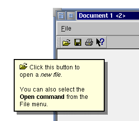

# QWhatsThis Class Reference

## [[QtGui](index.htm) module]

该QWhatsThis类提供的任何部件的简单描述，即回答“这是什么？ ” 。[More...](#details)

### Methods

*   `__init__ (self, QWhatsThis)`

### Static Methods

*   `QAction createAction (QObject parent = None)`
*   `enterWhatsThisMode ()`
*   `hideText ()`
*   `bool inWhatsThisMode ()`
*   `leaveWhatsThisMode ()`
*   `showText (QPoint pos, QString text, QWidget widget = None)`

* * *

## Detailed Description

该QWhatsThis类提供的任何部件的简单描述，即回答“这是什么？ ” 。

“这是什么？ ”帮助是一个应用程序的联机帮助系统的一部分，并为用户提供有关特定组件的功能和使用信息。 “这是什么？ ”帮助文本通常是更长，更详细的比[tooltips](qtooltip.html)，但通常提供比由单独的帮助窗口提供的信息较少。

QWhatsThis提供单一窗口弹出当用户要求的说明文字“这是什么？ ” 。默认方式为用户问的问题是将焦点移动到相关窗口小部件，然后按Shift + F1键。帮助文本立即出现，它就会消失，一旦用户做别的东西。 （请注意，如果有一个Shift + F1键的快捷方式，这种机制将不起作用。 ）某些对话框提供了一个“ ？ ”按钮，用户可以点击进入“这是什么？ ”模式，它们然后单击相关的小工具，弹出“这是什么？ ”窗口。它也可以提供AA选项菜单或工具栏按钮，切换到“这是什么？ ”模式。

要添加“这是什么？ ”文本窗口小部件或一个动作，你只需要调用[QWidget.setWhatsThis](qwidget.html#whatsThis-prop)（）或[QAction.setWhatsThis](qaction.html#whatsThis-prop)（ ） 。

文本可以是富文本或纯文本。如果指定了丰富的文本格式的字符串，它会使用默认的样式表来呈现，从而有可能在显示的文本插入图片。要尽可能快，默认的样式表使用一个简单的方法来确定文本是否可以呈现为纯文本。看[Qt.mightBeRichText](qt.html#mightBeRichText)（ ）了解详情。

```
     newAct = new [QAction](qaction.html)(tr("&New"), this);
     newAct->setShortcut(tr("Ctrl+N"));
     newAct->setStatusTip(tr("Create a new file"));
     newAct->setWhatsThis(tr("Click this option to create a new file."));

```

进入另一种方式“这是什么？ ”模式是调用[createAction](qwhatsthis.html#createAction)（ ） ，并添加返回[QAction](qaction.html)要么菜单或工具栏。通过调用这方面的帮助作用（在下面的图片，用箭头和问号图标的按钮） ，用户切换到“这是什么？ ”模式。如果他们现在点击窗口小部件会显示相应的说明文字。当帮助时或者当用户按下Esc键的方式离开了。



您可以输入“这是什么？ ”模式与编程[enterWhatsThisMode](qwhatsthis.html#enterWhatsThisMode)（ ） ，检查模式[inWhatsThisMode](qwhatsthis.html#inWhatsThisMode)（ ） ，并返回到正常模式[leaveWhatsThisMode](qwhatsthis.html#leaveWhatsThisMode)（ ） 。

如果你想控制的“这是什么？ ”一个小部件的行为手动见[Qt.WA_CustomWhatsThis](qt.html#WidgetAttribute-enum)。

另外，也可以显示不同的帮助文本窗口小部件的不同区域，通过使用[QHelpEvent](qhelpevent.html)类型[QEvent.WhatsThis](qevent.html#Type-enum)。拦截在你的widget的帮助事件[QWidget.event](qwidget.html#event)（ ）函数和调用[QWhatsThis.showText](qwhatsthis.html#showText)（ ）与文本要显示在指定的位置[QHelpEvent.pos](qhelpevent.html#pos)（ ） 。如果文本是丰富的文本和用户点击一个链接时，窗口小部件也接收[QWhatsThisClickedEvent](qwhatsthisclickedevent.html)与该链接的引用作为[QWhatsThisClickedEvent.href](qwhatsthisclickedevent.html#href)（ ） 。如果[QWhatsThisClickedEvent](qwhatsthisclickedevent.html)处理（即[QWidget.event](qwidget.html#event)（ ）返回True ） ，帮助窗口仍然可见。通话[QWhatsThis.hideText](qwhatsthis.html#hideText)（ ）显式地将其隐藏。

* * *

## Method Documentation

```
QWhatsThis.__init__ (self, QWhatsThis)
```

```
QAction QWhatsThis.createAction (QObject parent = None)
```

[

该_parent_的说法，如果不是没有，原因_self_通过Qt的，而不是PyQt的拥有。

](qaction.html)

[返回一个现成的](qaction.html)[QAction](qaction.html)，用于调用“这是什么？ ”上下文帮助，用给定的_parent_。

返回[QAction](qaction.html)提供了一个便捷的方式，让用户输入“这是什么？ ”模式。

```
QWhatsThis.enterWhatsThisMode ()
```

该功能切换用户界面进入“这是什么？ ”模式。用户界面可以切换回正常模式由用户（例如，通过他们点击或按下Esc键） ，或以编程方式通过调用[leaveWhatsThisMode](qwhatsthis.html#leaveWhatsThisMode)（ ） 。

当进入“这是什么？ ”模式中，一个[QEvent](qevent.html)类型Qt.EnterWhatsThisMode被发送到所有顶层窗口小部件。

**See also** [inWhatsThisMode](qwhatsthis.html#inWhatsThisMode)（）和[leaveWhatsThisMode](qwhatsthis.html#leaveWhatsThisMode)（ ） 。

```
QWhatsThis.hideText ()
```

如果“这是什么？ ”窗口显示，这会破坏它。

**See also** [showText](qwhatsthis.html#showText)（ ） 。

```
bool QWhatsThis.inWhatsThisMode ()
```

返回True如果用户界面是“这是什么？ ”模式，否则返回False 。

**See also** [enterWhatsThisMode](qwhatsthis.html#enterWhatsThisMode)（ ） 。

```
QWhatsThis.leaveWhatsThisMode ()
```

如果用户界面是“这是什么？ ”模式下，该功能切换回正常模式，否则它什么也不做。

当离开“这是什么？ ”模式中，一个[QEvent](qevent.html)类型Qt.LeaveWhatsThisMode被发送到所有顶层窗口小部件。

**See also** [enterWhatsThisMode](qwhatsthis.html#enterWhatsThisMode)（）和[inWhatsThisMode](qwhatsthis.html#inWhatsThisMode)（ ） 。

```
QWhatsThis.showText (QPoint pos, QString text, QWidget widget = None)
```

Shows _text_作为一个“这是什么？ ”窗口，在全球地位_pos_。可选的窗口小部件的参数，_w_，用于确定在多磁头系统相应的屏幕。

**See also** [hideText](qwhatsthis.html#hideText)（ ） 。